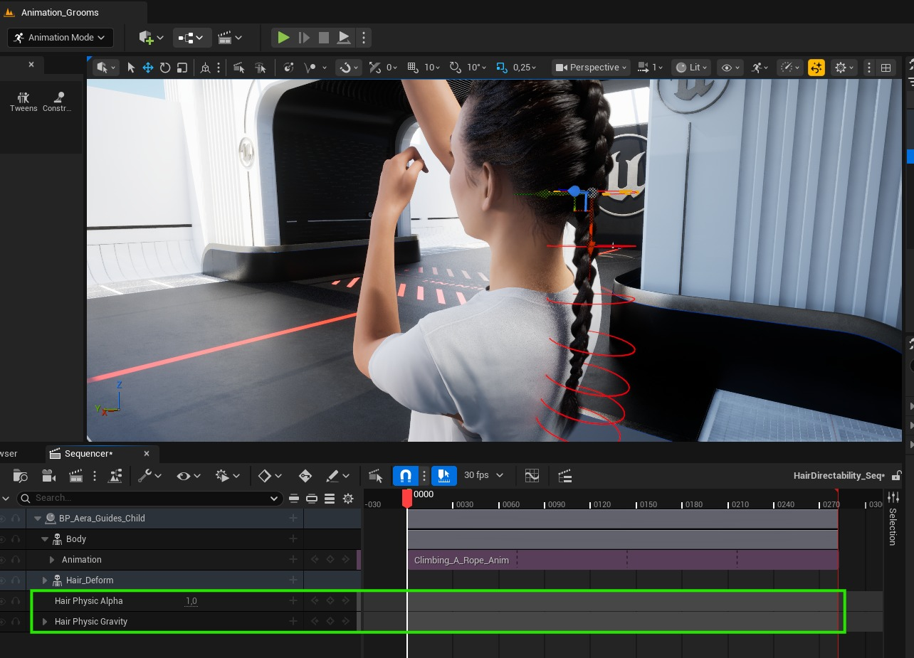
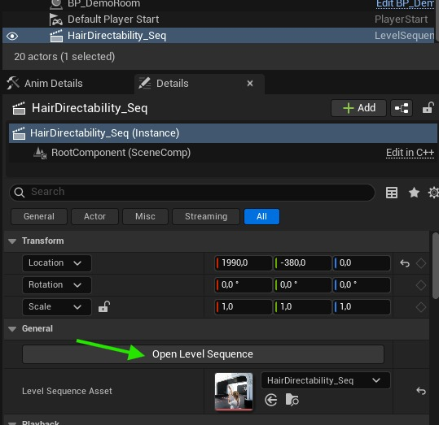
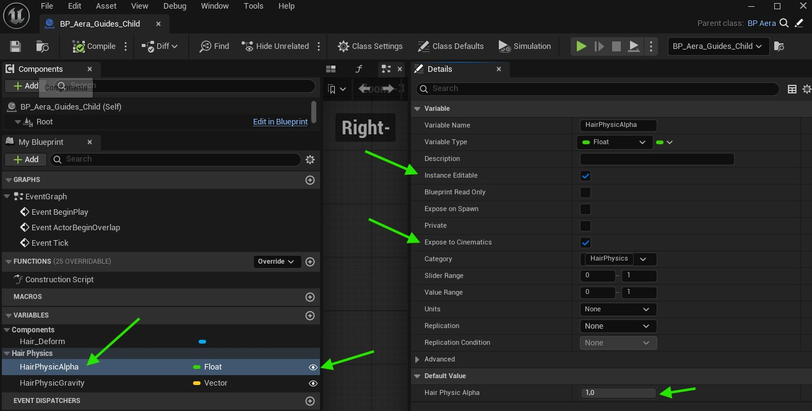
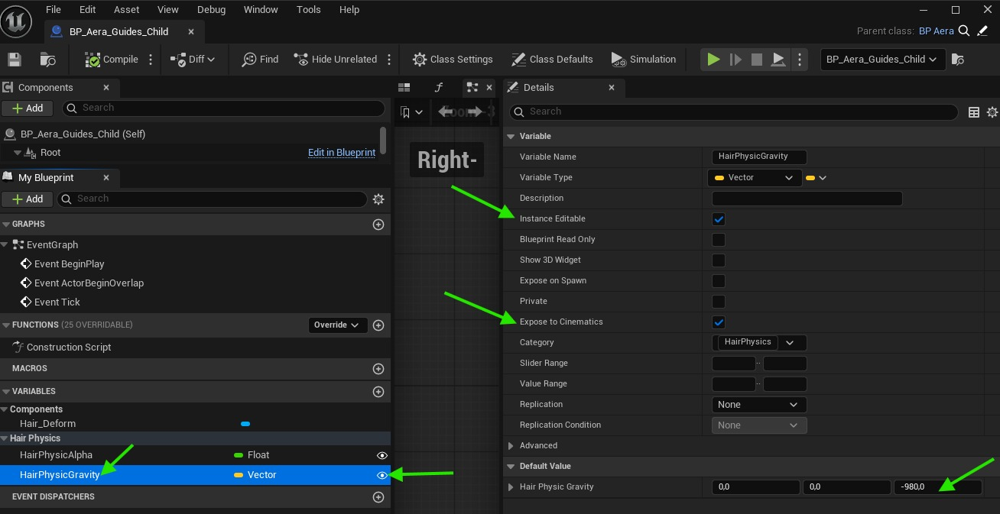
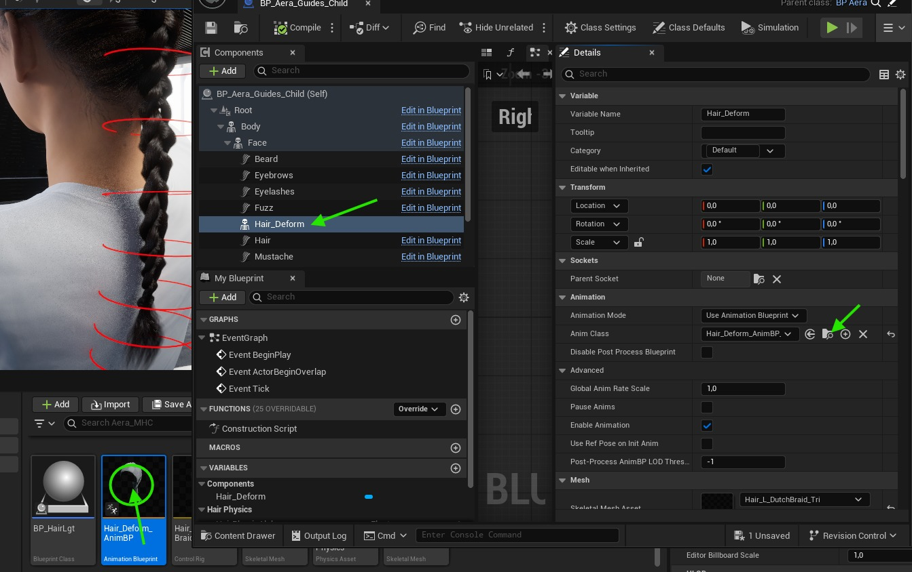
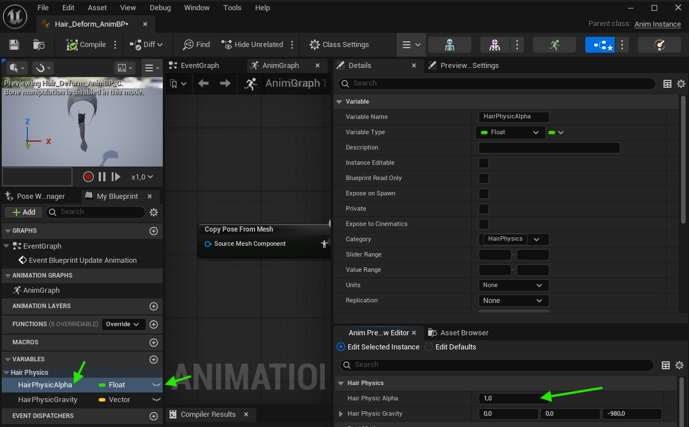
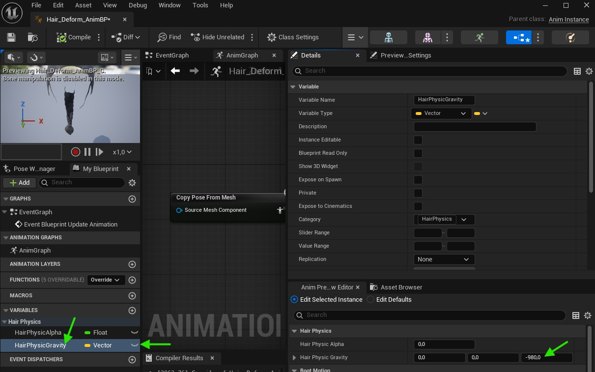
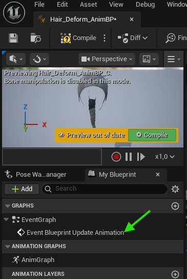
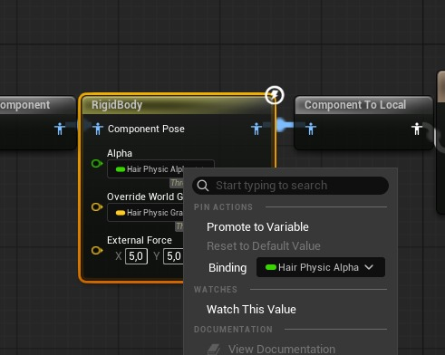
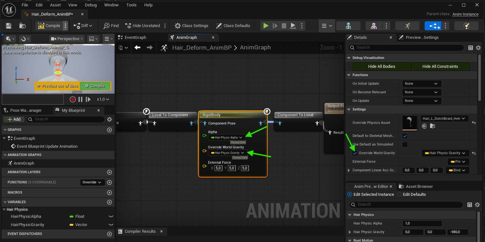

# 如何在虚幻引擎中通过音序器控制动画蓝图参数

## 来源与状态

- 原始 URL：https://dev.epicgames.com/community/learning/tutorials/opyr/how-to-control-animation-blueprint-parameters-from-sequencer-in-unreal-engine

## 运行时分类

- 类型：图文教程
- 判断：API 未识别到核心视频信号，可整理正文约 2521 字符。

## 摘要

如何在虚幻引擎中从 Sequencer 控制动画蓝图 (ABP) 参数示例：使用 Sequencer 中的 HairPhysicAlpha 和 HairPhysicGravity 控制头发物理

## 中文整理

### 示例：使用 Sequencer 中的 HairPhysicAlpha 和 HairPhysicGravity 控制头发物理

在本节中，我们将在动画蓝图中设置两个变量，以便它们可以像动画曲线一样在 Sequencer 中设置关键帧。这些变量将使我们能够控制应用于角色头发的物理强度和重力影响。



### 1 - 在我们开始之前，您需要在虚幻项目中提供可用的内容示例。以下是如何逐步安装它们：

[Epic Games 文档](https://dev.epicgames.com/documentation/en-us/unreal-engine/content-examples-sample-project-for-unreal-engine) 从 Fab 访问[内容示例示例](https://fab.com/s/d435deb8d960)

### 2 - 开放关卡和关卡序列

在虚幻引擎 5.7 中打开 **Content Examples 项目** 后，您将需要加载关卡：如下： /Game/Maps/Animation/Animation_Grooms.Animation_Grooms 在 Outliner 中，找到放置在场景中的 **Level Sequence Actor** 并双击它以打开 Sequencer：**HairDiectability_Seq**



### 3 - 在 Actor 蓝图中添加并公开变量

在我的示例中，我们将使用 **BP_Aera_Guides_Child **，在 Outliner 中选择并单击 **EDIT_BP_Aera_Guides_Child ** 添加两个变量，并确保它们可以是 **Visible**、**Instance Editable** 和 **Expose to Cinematics**。我们的两个变量是：





编译并保存 **BP_Aera_Guides_Child **

### 3 - 编辑动画蓝图

在 **BP_Aera_Guides_Child** 中，选择名为 Hair_Deform** 的 **SkeletalMesh 组件。然后，在“详细信息”面板中查找“**动画**”部分。在**动画蓝图**下，单击指定的蓝图将其打开：**Hair_Deform_AnimBP**



添加两个相同的变量。我们的两个变量是：





双击 EventGraph **事件蓝图更新动画**



复制/粘贴下面的蓝图并使用它：

**事件蓝图更新动画**

```
Begin Object Class=/Script/BlueprintGraph.K2Node_Event Name="K2Node_Event_0" ExportPath="/Script/BlueprintGraph.K2Node_Event'/Game/MetaHumans/Aera_MHC/Hair_Deform_AnimBP.Hair_Deform_AnimBP:EventGraph.K2Node_Event_0'"
   EventReference=(MemberParent="/Script/CoreUObject.Class'/Script/Engine.AnimInstance'",MemberName="BlueprintUpdateAnimation")
   bOverrideFunction=True
   bCommentBubblePinned=True
   NodeGuid=B4B88B494B1D7128E9DEC88BD7606DE7
   CustomProperties Pin (PinId=7CA5C61740476E887B08BFA99A3AB2FD,PinName="OutputDelegate",Direction="EGPD_Output",PinType.PinCategory="delegate",PinType.PinSubCategory="",PinType.PinSubCategoryObject=None,PinType.PinSubCategoryMemberReference=(MemberParent="/Script/CoreUObject.Class'/Script/Engine.AnimInstance'",MemberName="BlueprintUpdateAnimation"),PinType.PinValueType=(),PinType.ContainerType=None,PinType.bIsReference=False,PinType.bIsConst=False,PinType.bIsWeakPointer=False,PinType.bIsUObjectWrapper=False,PinType.bSerializeAsSinglePrecisionFloat=False,PersistentGuid=00000000000000000000000000000000,bHidden=False,bNotConnectable=False,bDefaultValueIsReadOnly=False,bDefaultValueIsIgnored=False,bAdvancedView=False,bOrphanedPin=False,)
   CustomProperties Pin (PinId=56B7AAFF44E7CE844AF5C18B01D62D0E,PinName="then",Direction="EGPD_Output",PinType.PinCategory="exec",PinType.PinSubCategory="",PinType.PinSubCategoryObject=None,PinType.PinSubCategoryMemberReference=(),PinType.PinValueType=(),PinType.ContainerType=None,PinType.bIsReference=False,PinType.bIsConst=False,PinType.bIsWeakPointer=False,PinType.bIsUObjectWrapper=False,PinType.bSerializeAsSinglePrecisionFloat=False,LinkedTo=(K2Node_MacroInstance_0 EC4D12184FFE63F78FE58CA1275883E0,),PersistentGuid=00000000000000000000000000000000,bHidden=False,bNotConnectable=False,bDefaultValueIsReadOnly=False,bDefaultValueIsIgnored=False,bAdvancedView=False,bOrphanedPin=False,)
   CustomProperties Pin (PinId=8F88A19E45EA75291B542DA7BF71B529,PinName="DeltaTimeX",PinToolTip="Delta Time X\nFloat (single-precision)",Direction="EGPD_Output",PinType.PinCategory="real",PinType.PinSubCategory="float",PinType.PinSubCategoryObject=None,PinType.PinSubCategoryMemberReference=(),PinType.PinValueType=(),PinType.ContainerType=None,PinType.bIsReference=False,PinType.bIsConst=False,PinType.bIsWeakPointer=False,PinType.bIsUObjectWrapper=False,PinType.bSerializeAsSinglePrecisionFloat=False,DefaultValue="0.0",AutogeneratedDefaultValue="0.0",PersistentGuid=00000000000000000000000000000000,bHidden=False,bNotConnectable=False,bDefaultValueIsReadOnly=False,bDefaultValueIsIgnored=False,bAdvancedView=False,bOrphanedPin=False,)
End Object
Begin Object Class=/Script/BlueprintGraph.K2Node_VariableSet Name="K2Node_VariableSet_2" ExportPath="/Script/BlueprintGraph.K2Node_VariableSet'/Game/MetaHumans/Aera_MHC/Hair_Deform_AnimBP.Hair_Deform_AnimBP:EventGraph.K2Node_VariableSet_2'"
```

通过启用 **Alpha** 引脚来编辑 **Rigid Body** 节点，然后将其绑定到变量 **Hair Physic Alpha**。接下来，在“详细信息”面板中，启用**覆盖世界重力**以公开相应的引脚。最后，将此新引脚绑定到变量 **Hair Physic Gravity**。





编译并保存Hair_Deform_AnimBP

### 4 - 在 Sequencer 中添加轨道并对其进行动画处理

在您的 Sequencer 中，对于 **BP_Aera_Guides_Child**，您现在可以添加 **Hair Physic Alpha** 和 **Hair Physic Gravity** 轨道并为其设置动画。

### 享受！
