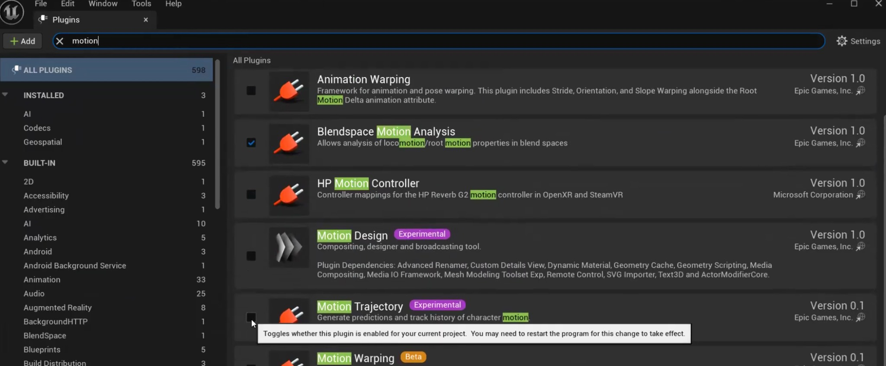
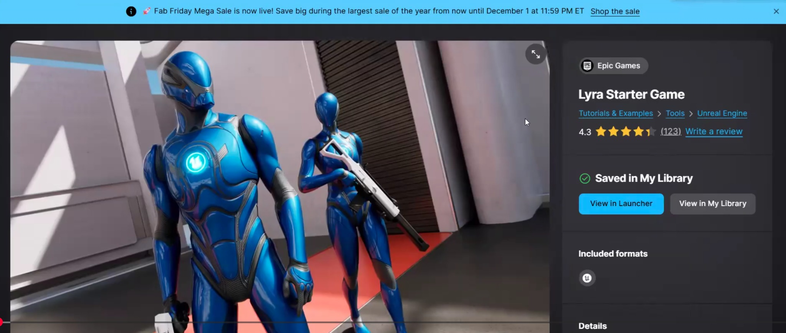
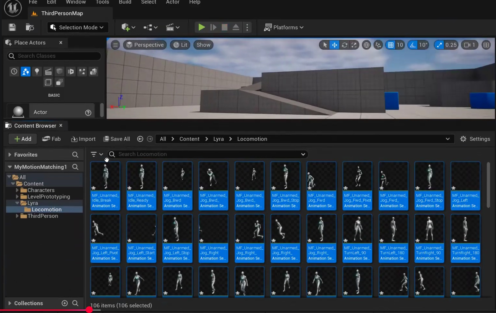
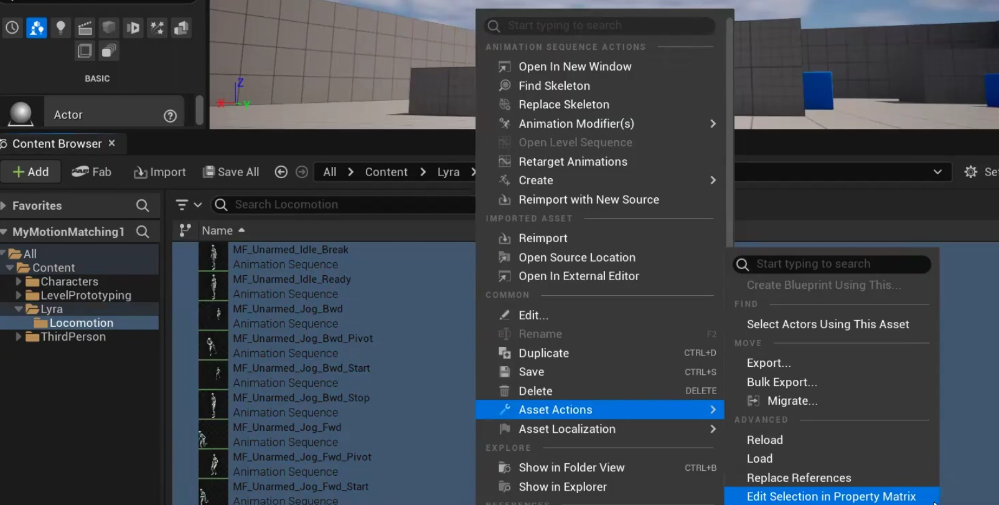
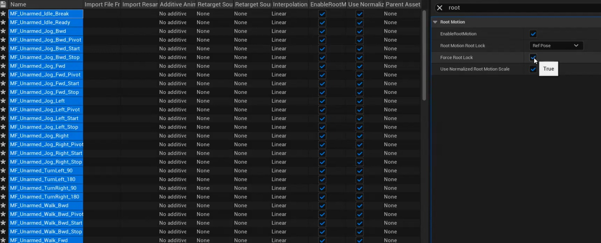
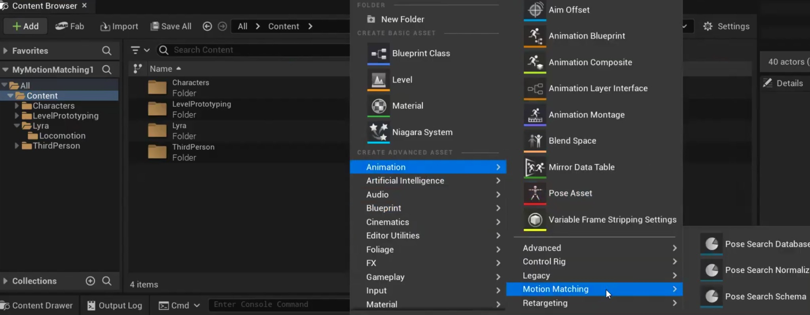
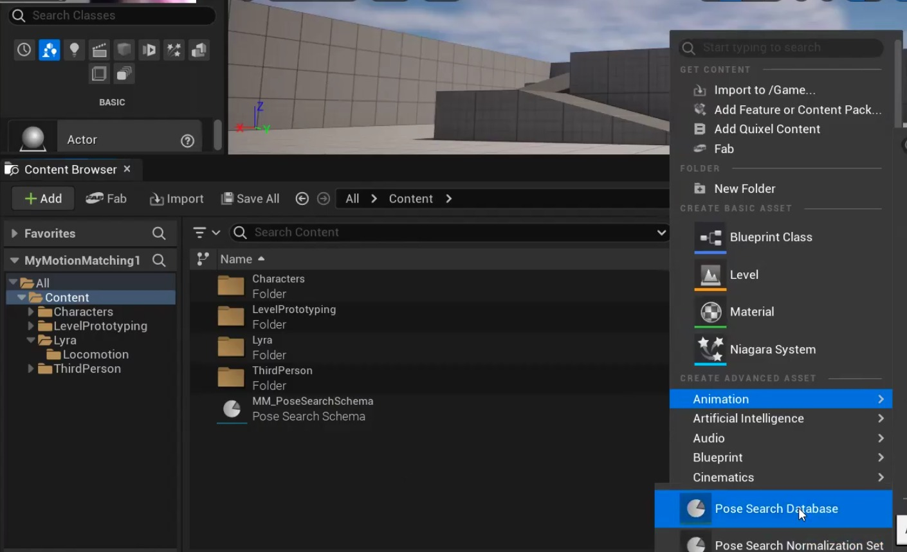
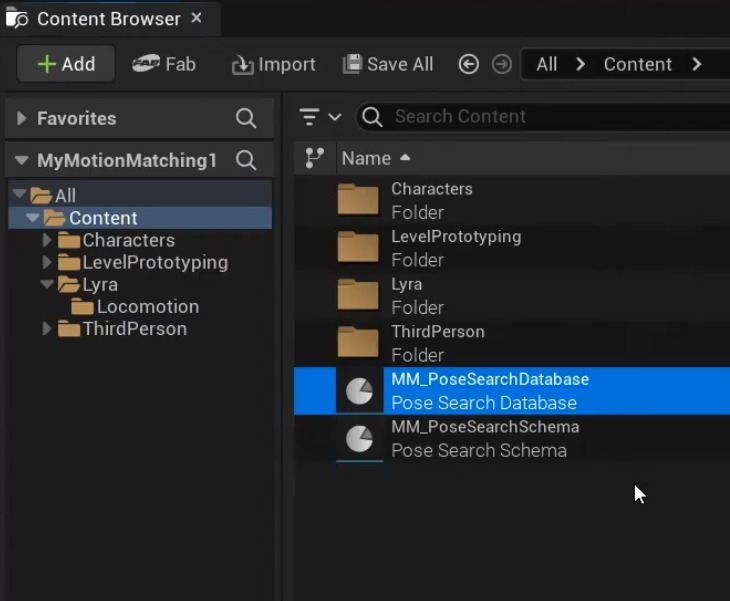
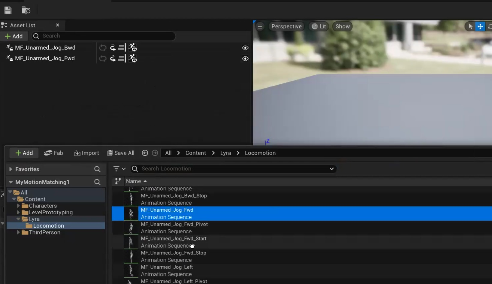
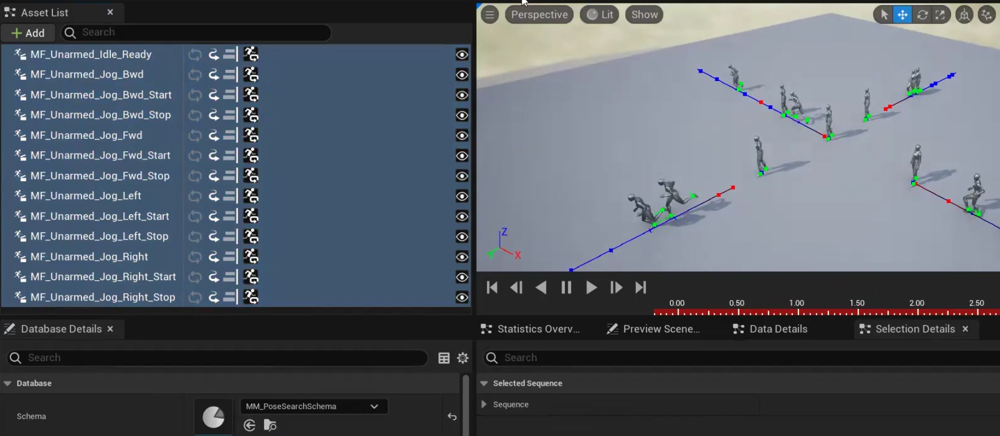

# 虚幻引擎中的运动匹配运动系统

## 来源与状态

- 原始 URL：https://dev.epicgames.com/community/learning/tutorials/DWjL/motion-matching-locomotion-system-in-unreal-engine

## 运行时分类

- 类型：图文教程
- 判断：API 未识别到核心视频信号，可整理正文约 21764 字符。

## 摘要

学习在虚幻引擎 5.7 中实现运动匹配，以实现流畅、响应灵敏的角色运动，而无需传统的状态机或混合空间。本高级教程演示了数据库驱动的动画选择，可根据实时轨迹预测自动选择最佳姿势，从而产生无缝适应玩家输入的自然运动。该工作流程涵盖批量编辑动画属性以实现一致的根运动、创建姿势搜索架构和数据库资产、实现角色轨迹组件以及使用运动匹配节点构建动画蓝图。每项活动都包括分步实施、调试可视化技术、预期结果验证以及基于实际工作流程的生产见解。

## 中文整理

### 虚幻引擎中的运动匹配运动系统

简介 虚幻引擎中的传统动画系统依靠状态机和混合空间来管理角色运动。虽然功能正常，但这些系统需要大量手动设置转换规则、混合参数和状态条件。每个新的运动变化都需要额外的节点和逻辑，从而创建脆弱的动画图，随着复杂性的增加，这些动画图变得难以维护。运动匹配通过根据角色的当前运动和预测轨迹从数据库中选择最合适的动画帧来消除这种复杂性。运动匹配不是手动定义步行如何过渡到跑步或角色如何从冲刺中停止，而是分析角色的速度、方向和预期路径，以自动实时找到最佳匹配姿势。这会产生更加流畅和灵敏的角色移动，自然地适应玩家的输入。本教程演示如何使用 Lyra Starter Game 中的高质量动画来实现运动匹配运动系统。您将配置姿势搜索框架，构建动画数据库，集成轨迹预测，并用数据驱动的运动选择系统替换传统的动画逻辑。先决条件 在开始本教程之前，您应该具备：第三人称模板项目、已完成的动画重定向教程（或同等的蓝图和动画蓝图知识）、访问 Lyra Starter Game 项目以进行动画迁移 软件要求： - 安装了 Unreal Engine 5.4 或更高版本 - 可用的 Lyra Starter Game 项目（来自 Epic Games Launcher 的免费示例项目） - 启用了运动轨迹插件（实验性） - 启用了姿势搜索插件 项目设置： - 在虚幻引擎中创建的第三人称模板项目5.4+ 知识要求： - 角色蓝图修改和组件添加 - 动画蓝图创建和图形构建 - 对动画系统（动画蓝图、骨架网格物体）的基本了解 - 项目之间的资产迁移工作流程 可选： - 状态机或混合空间的经验有助于理解运动匹配提供的改进 学习目标 通过完成本教程，您将能够： 1. 启用和配置运动匹配功能所需的运动轨迹和姿势搜索插件 2. 从将 Lyra Starter Game 移植到第三人称模板项目中，同时保留依赖关系 3. 创建和配置定义运动分析参数的姿势搜索架构和数据库资产 4. 使用批量编辑技术标准化多个动画序列的根运动设置 5. 使用分类运动动画（包括开始、停止、循环和空闲）填充运动匹配数据库 6. 实现角色轨迹组件集成以进行实时运动预测 7. 使用姿势搜索运动匹配节点构建动画蓝图以取代传统的状态机逻辑8. 使用游戏内轨迹和姿势选择显示来调试和可视化运动匹配行为

### 活动 1：启用运动匹配插件并迁移 Lyra 动画

第 1 部分：插件配置 1. 启用所需插件 在虚幻引擎中打开您的第三人称模板项目。导航到编辑菜单并选择插件。在插件窗口搜索栏中，输入“运动轨迹”。找到运动轨迹插件，该插件应标记为实验性的。启用插件名称旁边的复选框。接下来，在同一插件窗口中搜索“姿势搜索”。启用姿势搜索插件。当提示重新启动虚幻引擎编辑器并激活新插件时，单击“立即重新启动”按钮。预期结果：重新启动后，运动轨迹和姿势搜索插件将在引擎中启用并可用。您可以通过返回“编辑”>“插件”并确认两者均显示为已启用来验证这一点。

第 2 部分：迁移 Lyra 动画 2. 打开 Lyra Starter Game 项目 打开 Epic Games Launcher 并导航至“Library”选项卡。在您的 Vault 或可用示例中找到 Lyra Starter Game。如果尚未安装，请下载并安装 Lyra Starter Game 项目。安装后，在虚幻引擎中启动 Lyra Starter Game 项目。

3. 找到 Locomotion 动画 在 Lyra 项目内容浏览器中，导航到动画文件夹。典型的路径是“内容”>“角色”>“英雄”>“人体模型”>“动画”或类似的特定于运动的文件夹，其中包含步行、跑步、闲置、开始和停止动画序列。您应该会看到大约 100 多个按运动类型组织的动画资源。 4. 选择迁移动画 在动画文件夹中，选择所有相关的移动动画。这包括步行循环、跑步循环、空闲变化、步行开始、步行停止、跑步开始、跑步停止、转弯和任何方向运动动画（向前、向后、向左、向右）。您可以使用 Ctrl+A 选择文件夹中的所有动画，或使用 Ctrl+单击选择特定动画类别。 5. 将资产迁移到第三人称项目 右键单击​​所选动画，然后从上下文菜单中选择“资产操作”>“迁移”。将出现“资产报告”对话框，显示所有选定的动画及其依赖项，包括骨架资源、骨架网格物体和任何引用的材质。查看列表以确保 UE5 人体模型骨架包含在迁移中。单击“确定”继续。将打开文件浏览器窗口。导航到您的第三人称模板项目目录并选择内容文件夹。完整路径应类似于：YourProjectName/Content/。单击选择文件夹以确认目的地。虚幻引擎会将所有选定的动画、骨架资源和依赖项复制到您的第三人称模板项目中，同时保持原始文件夹结构。 6. 在第三人称项目中验证迁移 切换到您的第三人称模板项目（或者重新启动项目，如果两者都打开）。导航到复制 Lyra 动画的内容浏览器位置（通常是内容 > 角色 > 英雄 > 人体模型 > 动画或类似位置）。验证文件夹中是否显示所有动画，并具有显示 UE5 人体模型执行动作的正确预览缩略图。预期结果：您的第三人称模板项目现在包含 100 多个 Lyra 运动动画、UE5 人体模型骨架以及运动匹配实现所需的所有依赖项。

专业提示：迁移与手动导入迁​​移工具会自动处理所有资源依赖性，包括骨架、物理资源和材质引用。尝试手动复制动画文件或导入 FBX 导出将需要重新创建这些依赖项，从而消耗更多时间并引入潜在的引用错误。在虚幻引擎项目之间转移资源时始终使用 Migrate。

### 活动 2：准备动画并创建运动匹配数据库

第 1 部分：批量编辑动画属性 1. 选择所有运动动画 在内容浏览器中，导航到包含迁移的 Lyra 动画的文件夹。选择将在运动匹配数据库中使用的所有步行、跑步、慢跑、空闲、启动和停止动画。使用 Ctrl+单击选择多个资源，或选择一个类别文件夹以包含其中的所有动画。 2. 打开属性矩阵进行批量编辑 选择所有动画后，右键单击并选择资产操作 > 通过属性矩阵进行批量编辑。 “属性矩阵”窗口打开，同时显示所有选定动画序列的可编辑属性。

3. 配置根运动设置 在属性矩阵中，找到根运动部分。对于所有选定的动画，配置以下属性： 启用根运动：为所有动画选中此选项。根运动允许动画数据驱动角色移动，而不是仅仅依赖于控制器输入。根运动根锁定：为所有动画设置为参考姿势。这会将根骨骼锁定到参考姿势位置。强制根锁定：为所有动画启用此复选框。这可确保所有运动类型的根骨骼行为保持一致。

4. 启用动画循环 在属性矩阵中找到动画循环属性。为所有循环动画启用循环，例如步行循环、跑步循环和空闲循环。不要启用开始和停止动画的循环，因为它们是过渡性的并且应该播放一次。注意：您可能需要执行两次单独的批量编辑 - 一次用于循环动画，另一次用于非循环动画 - 才能正确配置此属性。 5. 保存所有修改的动画 配置所有属性后，单击“属性矩阵”工具栏中的“保存全部”或关闭“属性矩阵”窗口，并在出现提示时保存所有修改的资源。这会将标准化根运动和循环设置同时应用于所有选定的动画。预期结果：所有运动动画现在都具有一致的根运动设置和适当的循环配置，这对于运动匹配正确分析和选择姿势至关重要。第 2 部分：创建运动匹配数据资产 6. 创建姿势搜索架构 在内容浏览器中，导航到要存储运动匹配资产的文件夹（如果需要，创建一个名为 MotionMatching 的新文件夹）。在内容浏览器中右键单击并选择动画 > 运动匹配 > 姿势搜索架构。出现创建对话框。在“骨架”下拉列表中，选择 UE5 人体模型骨架（使用 Lyra 动画迁移的骨架）。将资产命名为 MM_Schema 并单击创建。姿势搜索架构定义了用于分析动画姿势的参数，包括要采样的骨骼、轨迹时间范围和匹配权重。

7. 创建姿势搜索数据库 再次在内容浏览器中右键单击，然后选择动画 > 运动匹配 > 姿势搜索数据库。在创建对话框中，将出现架构下拉列表。选择您刚刚创建的 MM_Schema 资产。将数据库命名为 MM_Database 并单击“创建”。

姿势搜索数据库将存储所有动画及其分析的姿势数据，运动匹配系统在运行时查询这些数据以找到最佳匹配帧。

第 3 部分：填充运动匹配数据库 8. 打开并配置数据库 双击 MM_Database 打开姿势搜索数据库编辑器。编辑器显示用于可视化动画轨迹的视口和用于添加动画序列的详细信息面板。 9. 添加运动动画集 在数据库编辑器中，找到用于添加动画序列的部分（通常标记为“动画”或“动画序列”）。将运动动画从内容浏览器拖放到数据库中。按运动类型组织动画： 向前运动：添加向前行走循环、向前奔跑循环、向前慢跑循环、向前行走开始、向前行走停止、向前奔跑开始、向前奔跑停止。向后运动：添加向后行走循环、向后行走循环、向后行走开始、向后行走停止。左平移运动：添加左行走循环、左循环运行、左行走起始、左行走停止。右平移运动：添加右行走循环、右循环运行、右行走起始、右行走停止。空闲动画：添加空闲循环、空闲中断变化。确保包含每个主要方向的开始、停止和循环（循环）变化，以便为系统提供足够的姿势选项以实现平滑过渡。

10. 验证姿势可视化 当您将动画添加到数据库时，视口将显示绿色轨迹线和姿势样本点。这些可视化表示姿势搜索系统对每个动画执行的运动分析。验证每种动画类型的轨迹是否符合逻辑 - 向前运动应显示向前投影的线，停止应显示会聚轨迹，开始应显示从静止位置发散的轨迹。

预期结果：MM_Database 现在包含一整套按方向和类型分类的运动动画，并具有可见的姿势分析数据，确认系统已成功处理每个动画。专业提示：数据库组织和性能虽然您可以将 100 多个动画添加到单个数据库，但请考虑按上下文将动画组织到多个数据库中（例如，战斗运动、探索运动、蹲伏运动）。更小、更集中的数据库可以提高运行时性能，并允许在运动模式之间进行上下文切换。对于本教程，单个综合数据库足以进行一般运动。

### 活动 3：实现角色轨迹组件

1. 打开角色蓝图 在内容浏览器中导航至内容 > 第三人称 > 蓝图。双击资产打开 BP_ThirdPersonCharacter。 2. 添加角色轨迹组件 在蓝图编辑器左侧的“组件”面板中，单击“添加”按钮。在组件搜索字段中搜索“角色轨迹”。从结果中选择“角色轨迹组件”并将其添加到蓝图中。角色轨迹组件不需要在视口中定位或配置。它根据当前速度和输入自动计算角色的预测移动路径，运动匹配系统使用该路径来选择适当的动画。 **3.编译并保存** 单击蓝图工具栏中的“编译”以应用更改，然后单击“保存”。角色轨迹组件现已集成，并将向动画蓝图提供运动预测数据。预期结果：角色蓝图现在包含一个角色轨迹组件，它将跟踪和预测角色移动以进行运动匹配评估。

### 活动 4：创建运动匹配动画蓝图

**第 1 部分：动画蓝图设置** 1. 创建新动画蓝图 在内容浏览器中，导航到 MotionMatching 文件夹（或所需位置）。右键单击并选择动画 > 动画蓝图。在创建对话框中，选择 UE5 Mannequin 骨架作为目标骨架。将资源命名为 MM_AnimBP 并单击“创建”。 **2.配置事件图 - 初始化动画** 打开 MM_AnimBP 并导航到“事件图”选项卡。找到事件蓝图初始化动画节点（默认情况下它应该已经存在）。来自甚至...

### 活动 5：将动作匹配与角色相结合
