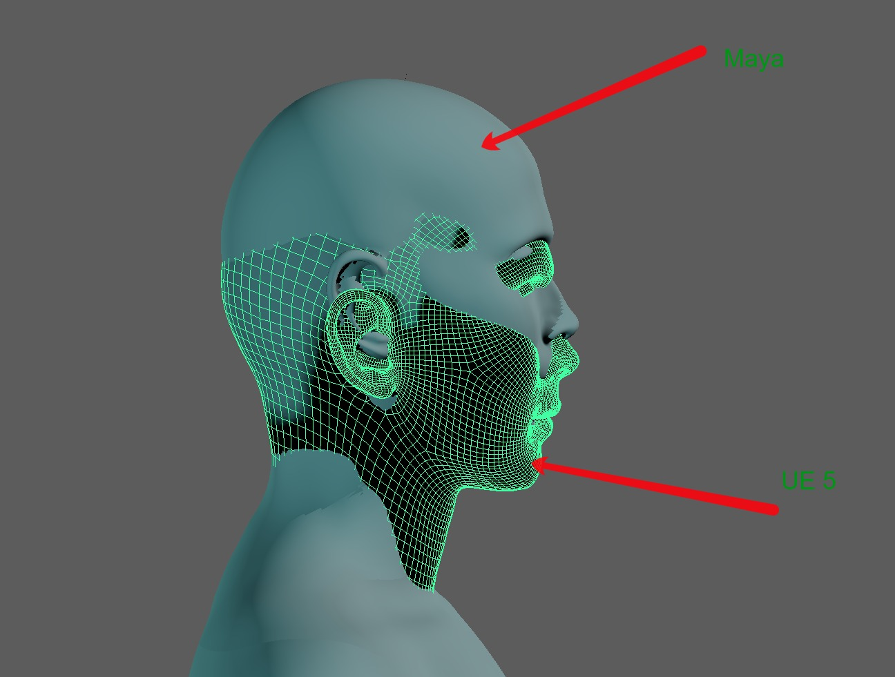
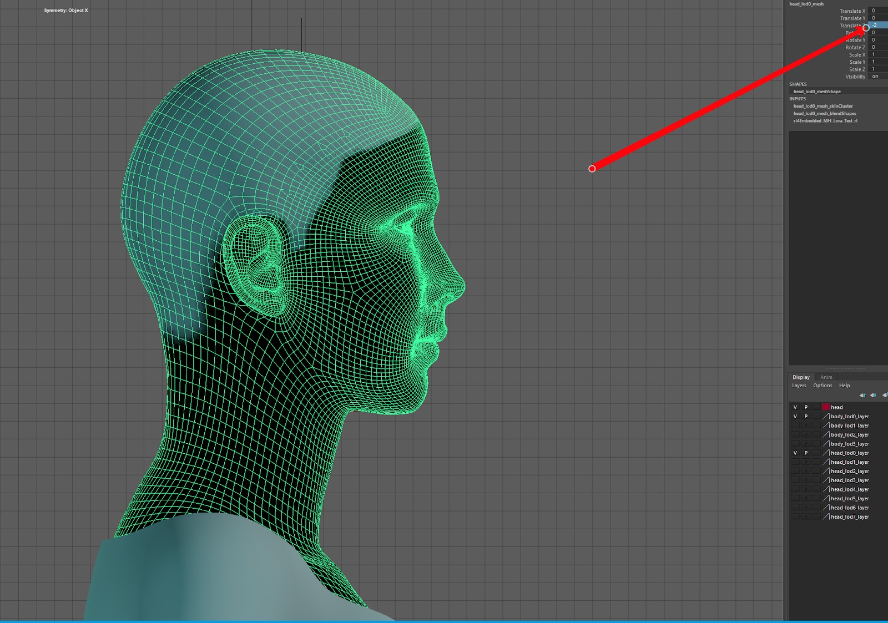
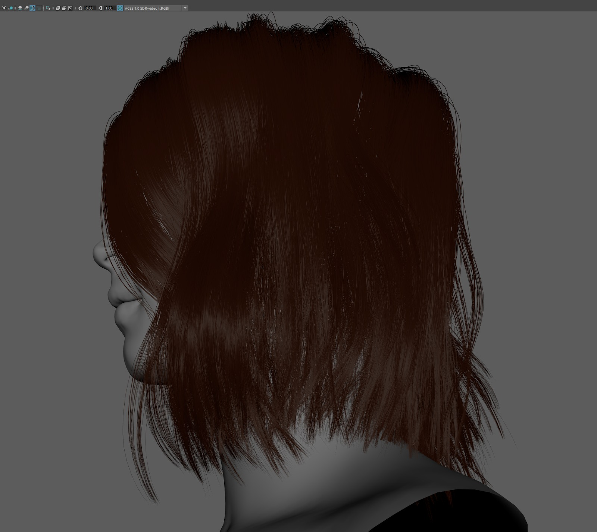
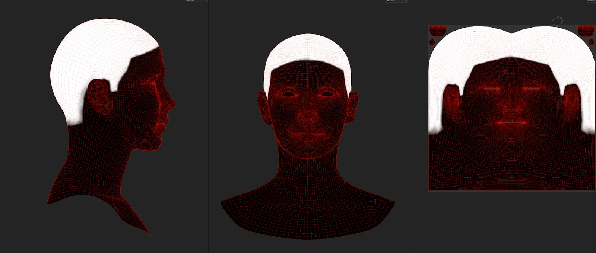
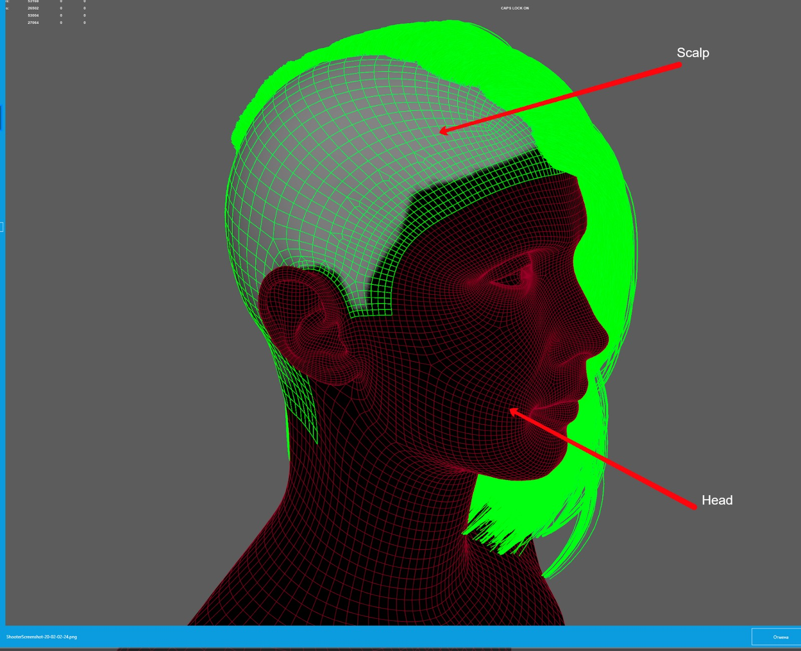
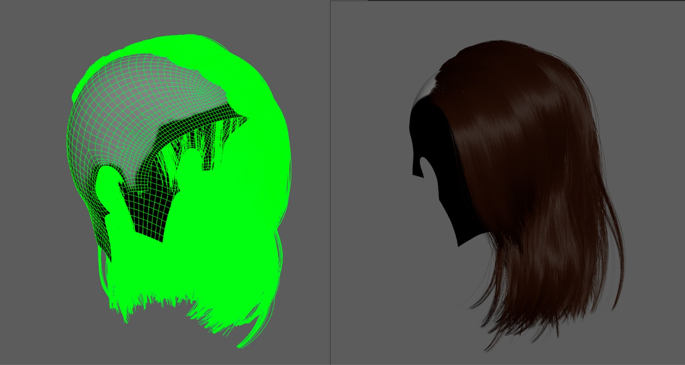
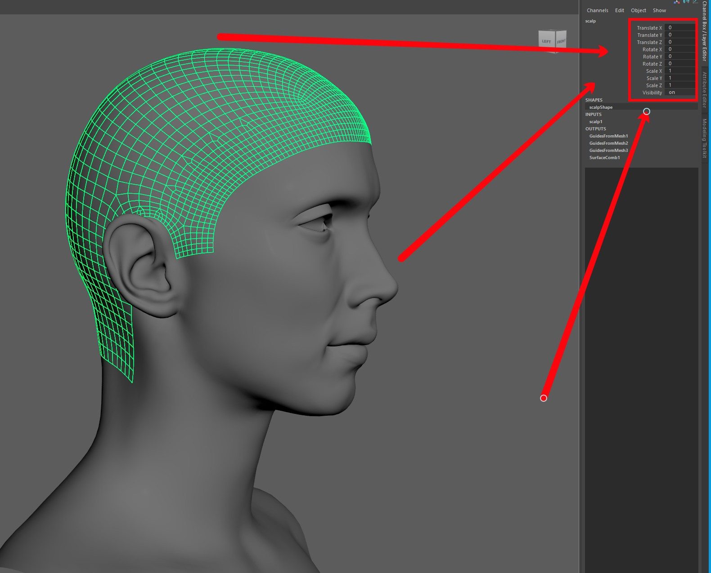
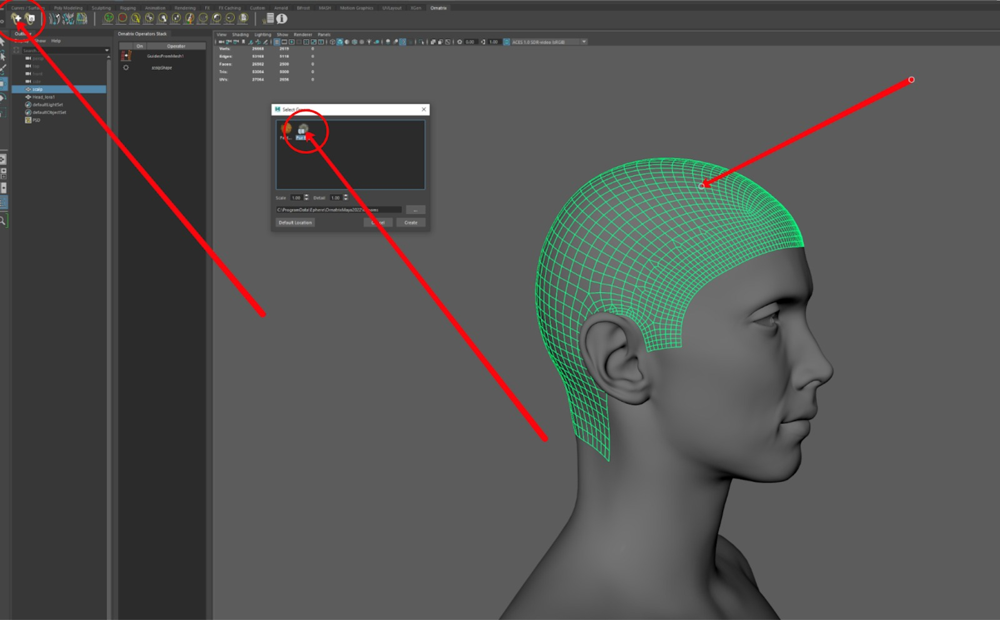
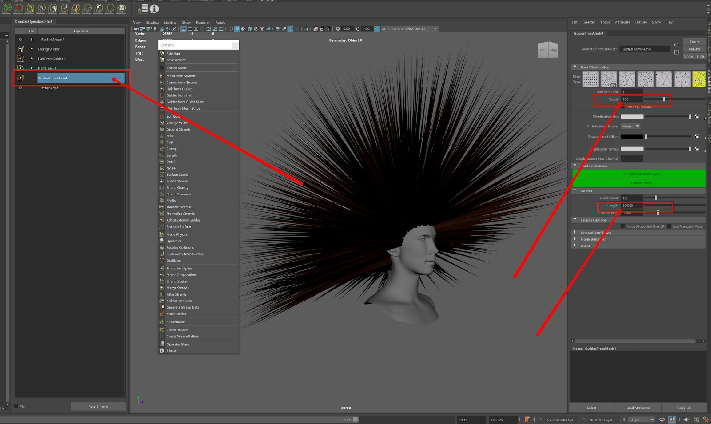
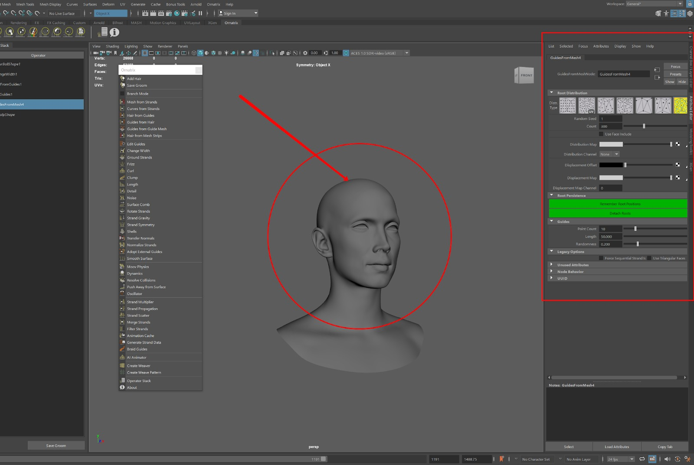

# Ornatrix 和 MetaHuman 头发模拟：从 Maya 到 Unreal Engine I ICVR

## 来源与状态

- 原始 URL：https://dev.epicgames.com/community/learning/tutorials/43lW/ornatrix-metahuman-hair-simulation-from-maya-to-unreal-engine-i-icvr

## 运行时分类

- 类型：图文教程
- 判断：API 未识别到核心视频信号，可整理正文约 6454 字符。

## 摘要

本教程介绍了跨 3ds Max、Maya 和虚幻引擎使用 Ornatrix 插件进行头发模拟，从导入超人类到详细的修饰和导出。它还将 Ornatrix 与 XGen 在高效、高质量的头发和毛皮工作流程方面进行了比较。

## 中文整理

### Ornatrix 和 MetaHuman 头发模拟：从 Maya 到 Unreal Engine I ICVR

本文探讨了在 3ds Max、Maya 和 Unreal Engine 中使用 Ornatrix 插件进行头发模拟。它涵盖了从导入超人类角色到在 Maya 中创建头发、设置详细修饰以及将头发导出到虚幻引擎进行最终调整的完整工作流程。 Ornatrix 和 XGen 之间的实际比较突出了每种工具的优势，提供了对高质量头发和毛皮效果的高效管道的见解。

### 导入超人类角色

将超人类角色从 Bridge 引入 Maya 时，它的位置通常会高于来自虚幻引擎的超人类角色。请务必在开始头发模拟之前考虑到这一点 - 首先从虚幻引擎导出，然后进行比较。

我们通过在 Z 轴上降低 -2 来调整超人类的头部位置，以实现完美对齐。之后，请务必将变换重置为零。

### 在 Ornatrix 工作

我们将展示 Maya + Ornatrix + UE 工作流程（3ds Max 和 C4D 的流程类似）。许多人选择 Maya 是因为它在视口中具有出色的头发着色器显示功能。创建头发后，我们发现Maya的头发着色器确实非常好地展示了我们的头发。

首先，您需要制作一个发膜。为此，我们使用 Substance 3D Painter。需要使用遮罩来确保头发在所需区域生长，并且如果需要的话可以在将来进行编辑。

接下来，将在 Substance 中创建的蒙版纹理应用到头像的头部。复制头部并按照蒙版修剪以创建头皮。建议留出一些额外的区域，以便将来在面罩需要扩展时进行调整。

我们将介绍主要工具，但处理头发需要大量练习，因为如果没有经验，正确定位头发可能会具有挑战性。确保将头皮变换设置为零；否则，头发将无法在 UE 中正确对齐。此外，在头发模拟后重置变换很困难，因此必须提前执行此操作。

选择头皮并单击选择中的“**添加头发**”。

在 Maya 中，打开属性编辑器，转到左侧的 GuidesFromMesh 菜单，缩短头发并将计数设置为零，因为我们将放置自己的头发引导。

之后，所有指南都将被删除。

头发根据导向器生长，需要将其放置在头上并进行相应的梳理。 Ornatrix 分层工作，每一层执行特定功能。

### Ornatrix 中的关键功能和设置

以下是对主要功能的总结，以便您有一个大致的了解： 如果头发没有紧密跟随参考线，调整这些设置可以帮助改善其对齐情况。

### Ornatrix 美容工具

Ornatrix 提供各种修饰头发的工具。例如，选择“编辑参考线”图层，然后使用梳状画笔修饰参考线。您还可以使用剪切工具修剪它们或使用增大/收缩画笔调整参考线的长度。

### 以 Alembic 格式将头发导出到 UE

选择主头发图层，选择“导出选定内容”，将格式设置为 Ornatrix Alembic，然后调整设置，如屏幕截图所示。

### 将头发以 Alembic 格式导入 UE

在UE中，首先启用Groom Alembic插件，勾选两个复选框，然后按照提示重新启动引擎。接下来，将 ABC 文件拖到场景中，并将缩放和变换参数调整为指定值。之后，右键单击我们的头发并选择“**创建绑定**”。在窗口中，选择超人类头像头部的骨骼网格，并确保 Root UV 设置为 True。单击出现的窗口中的“**保存**”按钮。接下来，将其拖入发槽中。

### 自定义头发设置

要编辑头发，请打开“修饰”部分，您可以在其中找到头发厚度、尖端厚度和根部厚度的设置。在 Ornatrix 中，您还可以创建发束组来组织头发的各个部分，并对每个组应用独特的设置。

### 设置超人类头发材质

导航到**头发部分**，您可以在其中找到专为超人类头发设计的材料。该材质提供了多种设置和自定义选项来增强头发的外观，允许调整颜色、粗糙度和其他属性，以获得更真实或风格化的外观。在那里，您可以修改粗糙度、镜面反射、头发颜色，甚至基于蒙版的颜色变化等设置。例如，要更改头发颜色，请转到“染发剂”选项并选择您喜欢的颜色。颜色不会立即应用 - 您需要将 HairMelanin 值降低到 0.1 才能使更改生效。

### 设置镜面反射和粗糙度

在“高光”部分中，您可以创建一个蒙版来增加头发颜色的变化。有一个默认遮罩，但您可以根据需要创建任何自定义遮罩。每个遮罩包含 4 个部分，可以更精确地控制高光中的头发变化。同时，请确保在调整颜色的任何区域将黑色素设置为 0.1，因为它可以有效控制颜色的不透明度。

### 用于虚幻引擎的 Ornatrix

像平常一样安装插件，选择超人类头像的头发，然后切换到 Ornatrix 模式。该插件的功能与 Maya 几乎相同，相似度约为 90% - 工具具有相同的名称，单击加号图标会显示相同的图层结构。例如，当您选择“剪切”笔刷时，您可以实时修剪头发。

### 流程和结论

### X-gen vs Ornatrix

Ornatrix 提供了比 XGen 更方便、更快速的头发模拟方法，尽管它确实偶尔会出现错误和崩溃：虽然 XGen 较旧并且可能出现故障，但它的优点是可以启用可编程层来实现特定效果，这对于电影工作来说是理想的选择 - 尽管这需要编程技能，而虚幻引擎不需要这些技能。就我们而言，我们尚未在 XGen 中使用编程。 XGen 允许您直接在 Maya 中的每个图层上绘制蒙版，这在 Ornatrix 中是不可能的。本质上，XGen 和 Ornatrix 都是为了方便起见的工具（XGen 是内置的）。头发的质量并不是天生就比另一种更好。它们都是达到同一目的的手段。然而，Ornatrix 更快、更现代。
