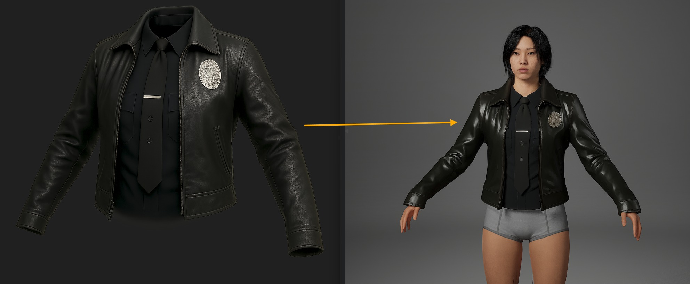
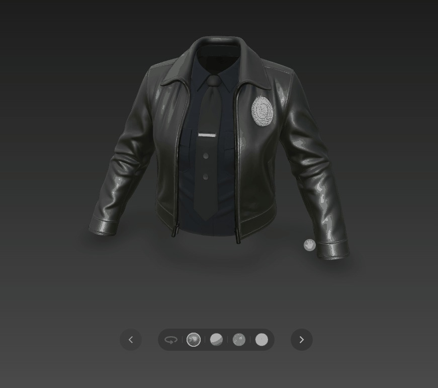
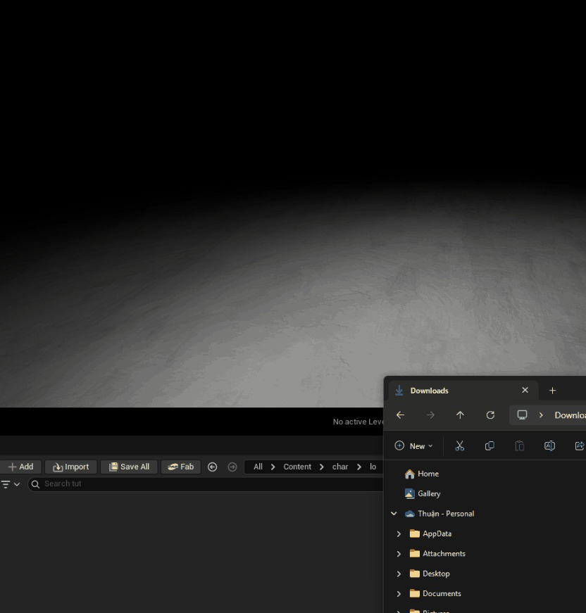
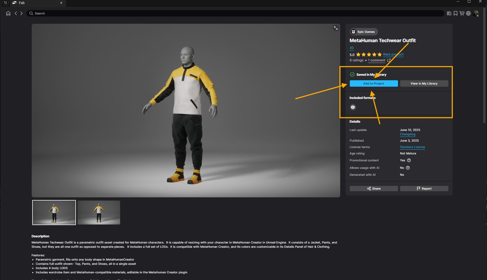
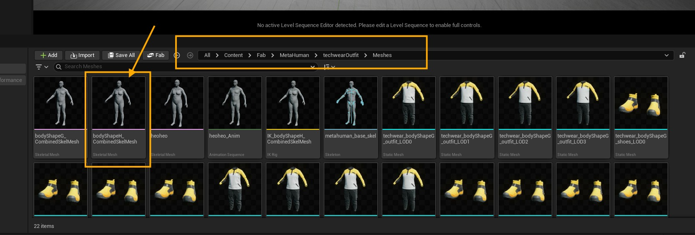
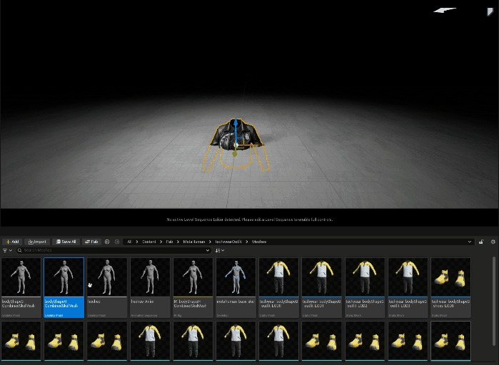
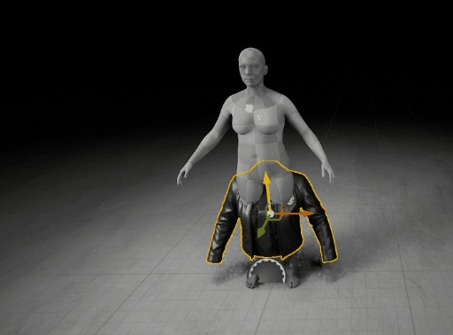
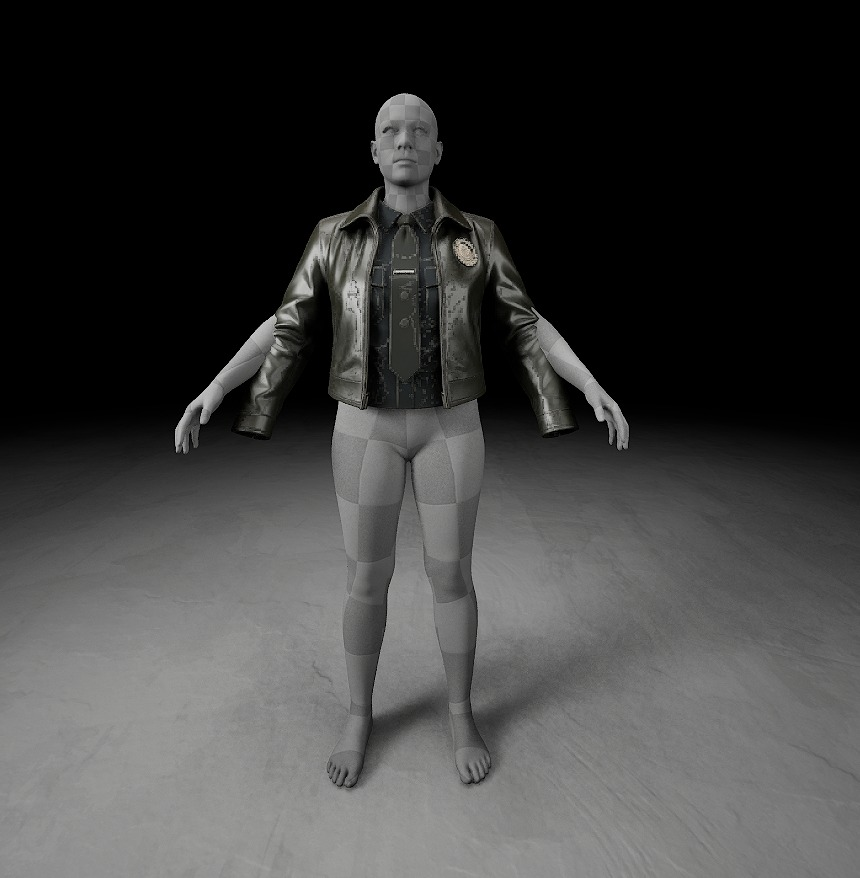
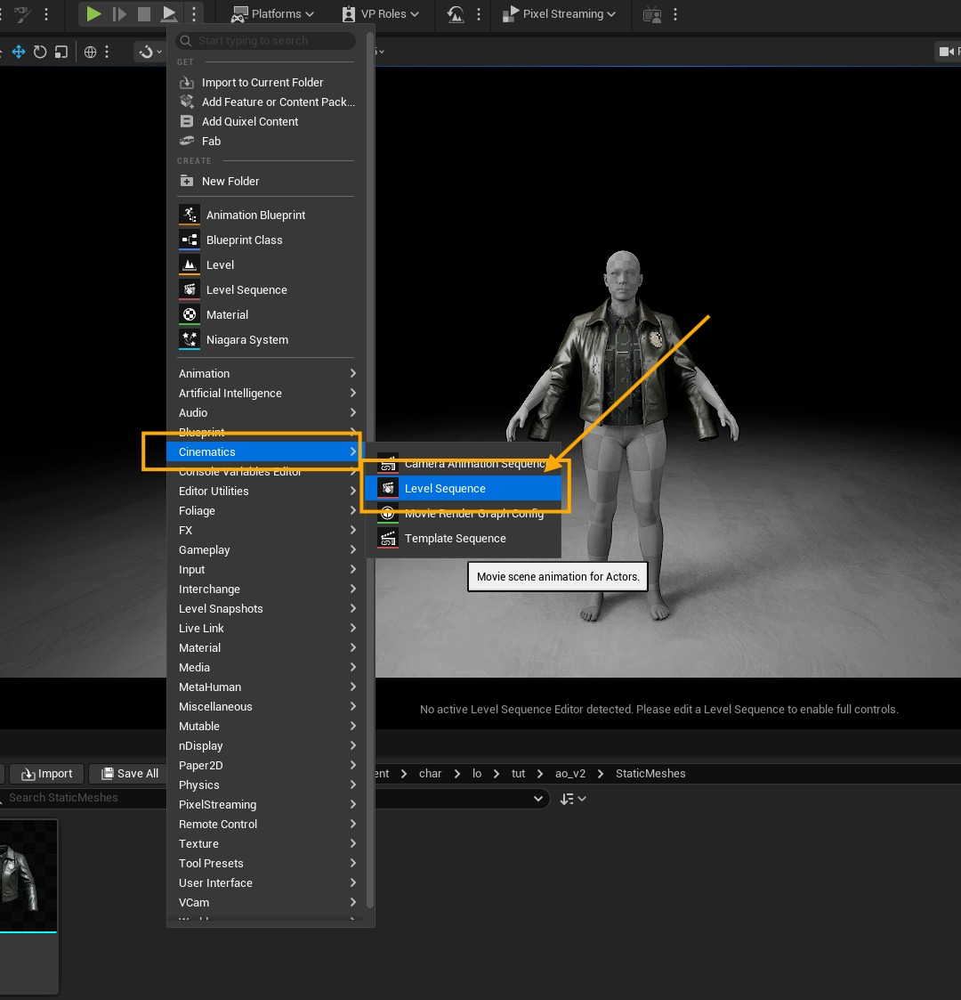

# UAI - 定制超人服装：在虚幻引擎中从 2D 概念到 3D（无需中间软件）

## 来源与状态

- 原始 URL：https://dev.epicgames.com/community/learning/tutorials/JZRq/uai-customizing-metahuman-clothing-from-2d-concept-to-3d-in-unreal-engine-no-intermediate-software-required

## 运行时分类

- 类型：图文教程
- 判断：API 未识别到核心视频信号，可整理正文约 6748 字符。

## 摘要

探索创新的工作流程，直接在虚幻引擎中将定制 3D 服装集成到 MetaHuman 角色上，无需使用 MetaTailor 等外部软件。本文详细介绍了一个全面的分步过程，从将 2D 概念转换为 3D 网格，到实现任何 MetaHuman 姿势的完美服装贴合和真实皮肤权重。了解如何利用虚幻引擎的强大工具，包括通过“使用 T0 作为引用”进行战略性重新导入和高效的 IK 重定向，以释放虚拟时尚和角色定制方面无与伦比的灵活性。对于希望简化 MetaHuman 服装流程的 3D 艺术家、游戏开发人员和虚拟制作爱好者来说，这是一本必读之书。

## 中文整理

### 介绍

我很高兴能分享我开发的一个成功的工作流程，用于直接在虚幻引擎中为超人类创建和装配定制服装，完全绕过了对 MetaTailor 等中间软件的需求。这个过程虽然详细，但提供了令人难以置信的灵活性，并利用最新的人工智能工具从 2D 概念转变为功能齐全的衣柜单品。

**挑战：** 从人工智能生成的 2D 图像开始，为定制服装创建一个简化的流程，与 Metahuman 系统正确集成。这是我的旅程的分解和最终成功的方法。

### 第 1 步：从 2D 概念到 3D 网格

该过程首先使用 Sora 等人工智能图像生成器生成所需服装的 2D 概念图像（在本例中为洛杉矶警察局风格的夹克）。从那里，我使用令人印象深刻的[Huyan AI工具](https://3d.hunyuan.tencent.com/)将此2D图像转换为高质量的3D网格。

### 第 2 步：在虚幻引擎中进行初始集成和摆姿

3D 服装网格准备就绪后，下一步是将其引入虚幻引擎并开始集成过程。这涉及几个关键的子步骤： 导入 3D 网格：将生成的 3D 服装网格导入到虚幻引擎中。确保正确的导入设置以保持比例和方向非常重要。

创建序列并添加超人类骨骼网格体：在虚幻引擎中，将创建一个新序列。然后将超人类的骨骼网格形状添加到该序列中。这提供了服装所适合的基本角色。

**烘焙控制装备和初始姿势**：为 MetaHuman 骨骼网格物体烘焙控制装备。这允许直观地操纵超人类的姿势。然后仔细调整 MetaHuman 的手臂，使其与导入的 3D 服装网格对齐。这种手动姿势对于实现准确的初始拟合至关重要

### 步骤 3：T0 参考姿势的关键重新导入

这一步可以说是此工作流程成功的最关键的一步。当超人类摆出与服装相匹配的姿势后，需要将其导出，然后立即重新导入回虚幻引擎中。在此重新导入过程中，必须选择特定选项：“使用 T0 作为引用”。此操作根据当前的自定义姿势重新定义 MetaHuman 的参考姿势（T 姿势）。这对于确保下一步创建的服装骨架网格物体与 MetaHuman 的新参考姿势正确对齐至关重要。我怀念虚幻 4.25 允许直接修复骨架网格物体姿势到引擎中而无需导出和重新导入的部分

### 第 4 步：创建服装骨架网格物体并传输蒙皮权重

随着超人类参考姿势的更新，焦点又回到了衣服上。为 3D 服装资源创建了一个新的骨架网格物体。至关重要的是，这个创建过程必须参考新导入的 MetaHuman 姿势。接下来，超人类身体的皮肤重量将转移到服装的骨骼网格物体上。这确保了当超人类移动时，衣服会根据角色的基本解剖结构自然而真实地变形。但首先，我们需要更改 SM 与基础骨架网格物体匹配的枢轴，为此：切换到建模模式或快速（SHIFT + 5）在**编辑工具**，**皮肤选项卡**中，选择**编辑权重**在**源骨架网格物体**中选择我们的重新导入**骨架网格物体基础**单击**传输权重**我们的布料现在有骨骼和皮肤重量：**失败：**当我尝试将最终服装添加到超人类的衣柜时，它失败了壮观的是，导致了混乱的扭曲多边形。原因是什么？通过从复制和修改的装备创建新的参考姿势，与原始超人类骨骼的连接丢失了。衣柜系统无法识别。

### 第 5 步：突破 – IK 重定向和路径重定向

解决方案不是手动摆姿势，而是使用虚幻引擎的原生动画工具来创建姿势，同时保留原始骨架的完整性。 **IK Retargeter for Posing：** 我使用 **IK Retargeter** 快速高效地创建与服装相匹配的 A 姿势动画。首先，为骨骼网格体创建**IK RIG **在新的IK RIG窗口中，单击**自动创建重定位链**现在创建**IK重定位器**基于新的IK装备在**目标选项卡**上替换我们的布料骨架网格体**在**运行重定位**选项卡中，单击它更改为编辑重定位姿势**，然后选择自动对齐，在IK Retageter中选择**对齐所有骨骼**，以保持姿势和导出时，我们需要根据该姿势录制一个新动画，然后将其导出到动画中：导出新动画，然后重新导入它以获得“**使用 T0 作为参考姿势**”从现在开始，我们可以开始创建布料资源、服装和超人衣柜，将布料添加到超人角色中：

### 结论

该工作流程虽然涉及导出、重新导入和仔细配置等多个步骤，但提供了一个全面的解决方案，用于将自定义 3D 服装与虚幻引擎中的 MetaHuman 角色集成，而无需依赖 MetaTailor。关键要点是在重新导入期间战略性地使用“使用 T0 作为参考姿势”选项，以及有效应用 IK 重新定位来建立干净的参考姿势。这种方法虽然可能比传统方法更复杂，但提供了无与伦比的灵活性，并确保定制服装资产可以无缝适应任何超人类姿势或动画，为虚拟制作、游戏开发和数字时尚开辟了新的可能性。虽然这个过程可能看起来很漫长，但它的稳健性和对各种姿势和立场的兼容性使其成为高级超人类定制的宝贵技术。最后，特别感谢 **Franco Vilanova**，他的超人类定制教程为我提供了宝贵的想法，帮助我完成了这个工作流程。您对这个工作流程有何看法？您是否找到了其他方法来简化超人类的自定义资产？
