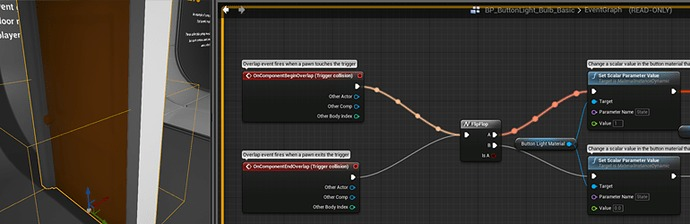
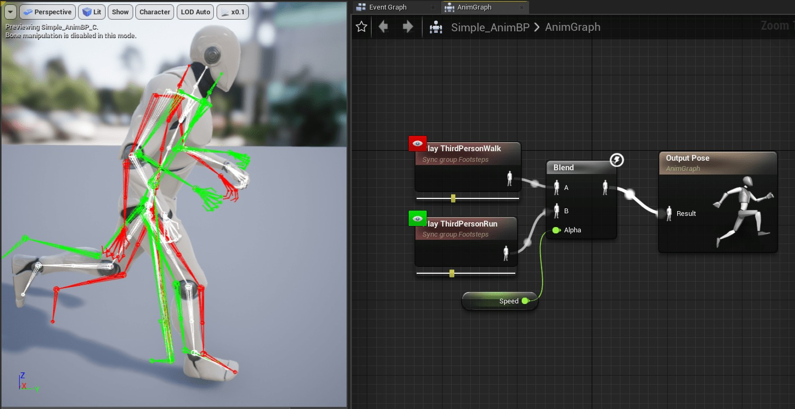
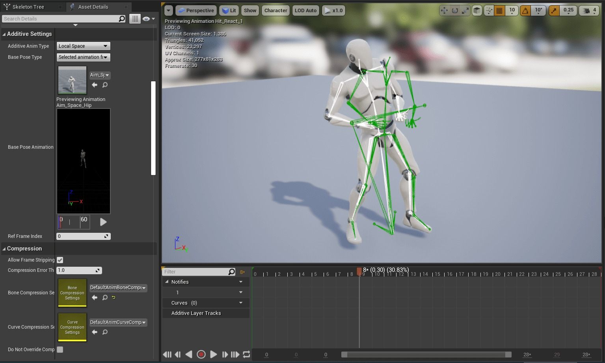
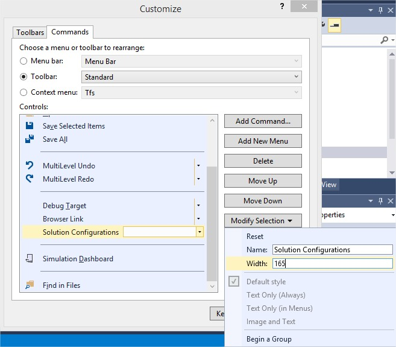
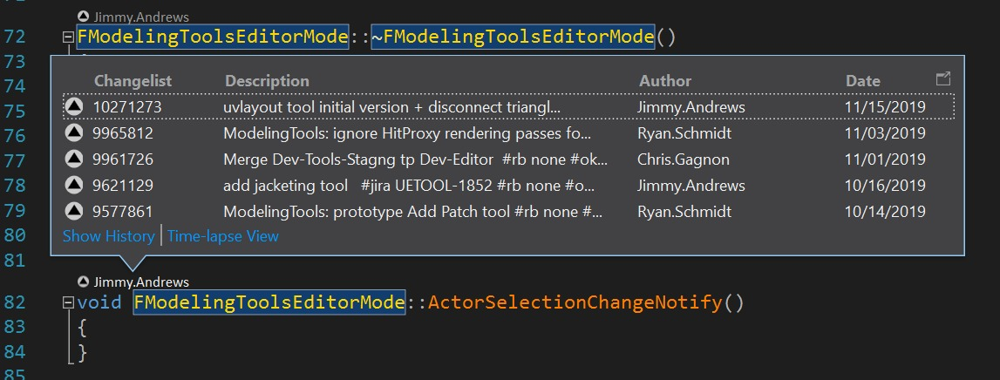

# 动画生产力提示与技巧

## 来源与状态

- 原始 URL：https://dev.epicgames.com/community/learning/knowledge-base/vzd7/unreal-engine-animation-productivity-tips-tricks

## 运行时分类

- 类型：图文教程
- 判断：API 未识别到核心视频信号，可整理正文约 7360 字符。

## 摘要

文章由 Euan C 撰写。 动画生产力提示和技巧 为动画师和动画程序员提供的一系列工作流程提示和技巧。编辑器工作流程 导航资源 在单独的选项卡中打开 在 UE4 中，按住...

## 中文整理

### 概览

*文章作者：[Euan C.](https://dev.epicgames.com/community/profile/lxJJ/euancarmichael)*

### 动画生产力提示与技巧

*针对动画师和动画程序员的一系列工作流程提示和技巧。*

### 编辑器工作流程

### 资产导航

**在单独的选项卡中打开** 在 UE4 中，在打开动画资源时按住 SHIFT 可在新选项卡中将其打开。在 UE5 中，您可以通过在编辑器首选项中启用“始终在新选项卡中打开动画资源”来将此设置为默认行为。 **动画资源过滤** 打开动画资源后，您可以在“资源浏览器”选项卡中过滤内容。特别有用的过滤器包括“动画过滤器→使用曲线...”和“动画过滤器→使用骨架通知...”。 **内容浏览器过滤** 内容浏览器有各种动画内容过滤器，但请务必查看“其他过滤器”类别。它有有用的选项，例如“签出”文件。 **参考查看器** [参考查看器](https://docs.unrealengine.com/en-US/Basics/ContentBrowser/ReferenceViewer/index.html) 对于跟踪哪些资源引用动画资源非常有帮助。 -热键：Alt+Shift+R

### 内容浏览器高级搜索语法

docs.unrealengine.com

### 高级搜索语法

有关可在内容浏览器中使用的高级搜索运算符的参考。

### 蓝图编辑器提示和技巧

虚幻引擎

### 蓝图编辑器提示和技巧

当您使用蓝图编辑器时，请务必记住上下文才是王道。值得一提的是上下文相关的操作过滤。如果右键单击蓝图，您将获得操作列表...

### 动画蓝图

**姿势观察** 右键单击​​动画图表中的任何动画节点，然后选择“切换姿势观察”以查看图表中该点的姿势调试图。

### 动画序列/蒙太奇编辑器

**可视化添加剂** 查看添加剂动画时，单击预览视口顶部的“角色”按钮，然后选择“动画→添加剂基础”来绘制基本姿势。

### 编辑器首选项

**自动保存** 您可以通过编辑器首选项中的“启用自动保存”设置禁用自动保存。 **关卡加载** 将编辑器首选项中的“启动时加载关卡”设置设置为“上次打开的”，以便在重新启动编辑器时始终加载您上次打开的关卡。

### 一般提示

**恢复未保存的更改** 如果您对文件进行了未保存的更改并且想要清除它们，请在内容浏览器中右键单击该文件，然后选择“资产操作 → 重新加载”。

### 在编辑器中播放 (PIE)

### 动画调试文本

**命令** **信息** NextDebugTarget (PGUP) 更改调试目标 PreviousDebugTarget (PGDOWN) 更改调试目标 ShowDebug 清除显示 ShowDebug ANIMATION 切换动画调试数据的显示状态 ShowDebugToggleSubCategory 切换特定类别的显示（请参阅自动完成结果）

### 杂项命令

**命令** **信息** a.animnode.* 各种动画节点的调试选项 Log 更改日志详细程度 Log LogAnimMontage Verbose 更改日志详细程度的示例 p.VisualizeMovement 0 隐藏运动组件调试 p.VisualizeMovement 1 显示运动组件调试 show Bones 显示/隐藏骨骼 显示 Collision 显示/隐藏碰撞 Slomo 0.5 慢动作 Stat FPS 显示帧速率 t.MaxFPS 0 删除帧速率限制t.MaxFPS 20 将帧速率限制为 20（警告：影响编辑器）

### 调试 LOD

**命令** **信息** a.VisualizeLODs 0 隐藏 LOD 信息 a.VisualizeLODs 1 显示 LOD 信息 FORCESKELLOD LOD=2 强制所有骨架网格物体为 LOD 2 FORCESKELLOD LOD=-1 禁用强制 LOD

### 调试属性

**命令** **信息** DisplayAll 在特定类的所有对象上显示属性值 DisplayAll CharacterMovementComponent Velocity 将 DisplayAll 用于组件值的示例 DisplayAll MyAnimBP_C AimYaw 将 DisplayAll 用于 AnimBP 值的示例 DisplayClear 清除 DisplayAll 的结果 GetAll 与 DisplayAll 相同，但打印到输出日志 显示单个实例的 Display 属性值 **有关使用“Display”的注意事项** GetAll 命令可用于查找要使用的内容。例如：

### 记忆追踪

**命令** **信息** obj list class=“AnimSequence” 列出所有已加载的动画序列（建议在烘焙版本中进行测试） obj refs name=ASSET_NAME 打印特定资产的引用链 obj refs name= /Game/Characters/Animations/ThirdPersonJump_End.ThirdPersonJump_End 使用“obj refs”的示例

### 作弊脚本

您可以通过将“Cheat Scripts”添加到游戏的 DefaultGame.ini 来将控制台命令合并为单个命令。示例： [CheatScript.ShowAnimVars] +Cmd=“displayclear” +Cmd=“DisplayAll CharacterMovementComponent Velocity” +Cmd=“DisplayAll MyAnimBP_C AimYaw” 从控制台运行：“CheatScript ShowAnimVars”。

### 编辑器实用工具小部件

[编辑器实用程序小部件](https://docs.unrealengine.com/en-US/InteractiveExperiences/UMG/UserGuide/EditorUtilityWidgets/index.html) 允许完全在蓝图中创建自定义编辑器小部件。一个常见的用例是创建一组触发常见控制台命令的按钮。

### 视觉工作室

### 即时窗口

**命令 (UE4)** **信息** {,UE4Editor-Core}::PrintScriptCallstack() 蓝图调用堆栈 {,UE4Editor-Core}::GFrameNumber 当前帧编号（也可用作断点条件） {,UE4Editor-Core}::GPlayInEditorID PIE ID（适用于多人游戏，也可用作断点条件） UE4Editor-Engine!GPlayInEditorContextString PIE 窗口名称（适用于多人游戏）

### 快速参考

**禁用优化** PRAGMA_DISABLE_OPTIMIZATION PRAGMA_ENABLE_OPTIMIZATION **调试行** [#include](/tag/include) “DrawDebugHelpers.h” DrawDebugLine(GetWorld(), START, END, FColor::Green); **调试文本** [#include](/tag/include) “Engine/Engine.h” FString MyDebugString = FString::Printf(TEXT(“MyVelocity(%s)”), *MyVelocity.ToCompactString()); GEngine->AddOnScreenDebugMessage(INDEX_NONE, 0.f, FColor::Yellow, MyDebugString, false, FVector2D::UnitVector * 1.2f); **枚举到字符串** EMyEnum::Type MyVariable;静态常量 UEnum* Enum = StaticEnumEMyEnum::Type();枚举->GetNameStringByValue(MyVariable);

### 修复配置组合框宽度

默认解决方案配置组合框太小，无法看到当前所选选项的全名。要解决此问题，请右键单击工具栏，选择“自定义”，选择“命令”选项卡，选择单选工具栏 > 标准，向下滚动到“解决方案配置”，单击“修改选择”并输入您想要的宽度（200 即可）。

### 加速 Visual Studio 2019

处理 Unreal 项目时，VS 2019 可能会很慢。以下是一些可能会提高性能的策略： **调试速度很慢** 尝试在选项 > 调试 > 常规中禁用以下设置 取消选中调试时启用诊断工具 取消选中调试时显示已用时间 PerfTip **P4VS 历史记录高于每种方法**

取消选中工具 > 选项 > 文本编辑器\所有语言\CodeLens > 启用 CodeLens **打开解决方案或调试时 Visual Studio 速度很慢** 如果您使用其他插件进行符号搜索（例如 Visual Assist），您可以禁用 Intellisense 数据库以防止它解析解决方案。这可以通过以下方式完成：工具 > 选项 > 文本编辑器 > C/C++ > 高级 > 设置“禁用数据库 = true”
