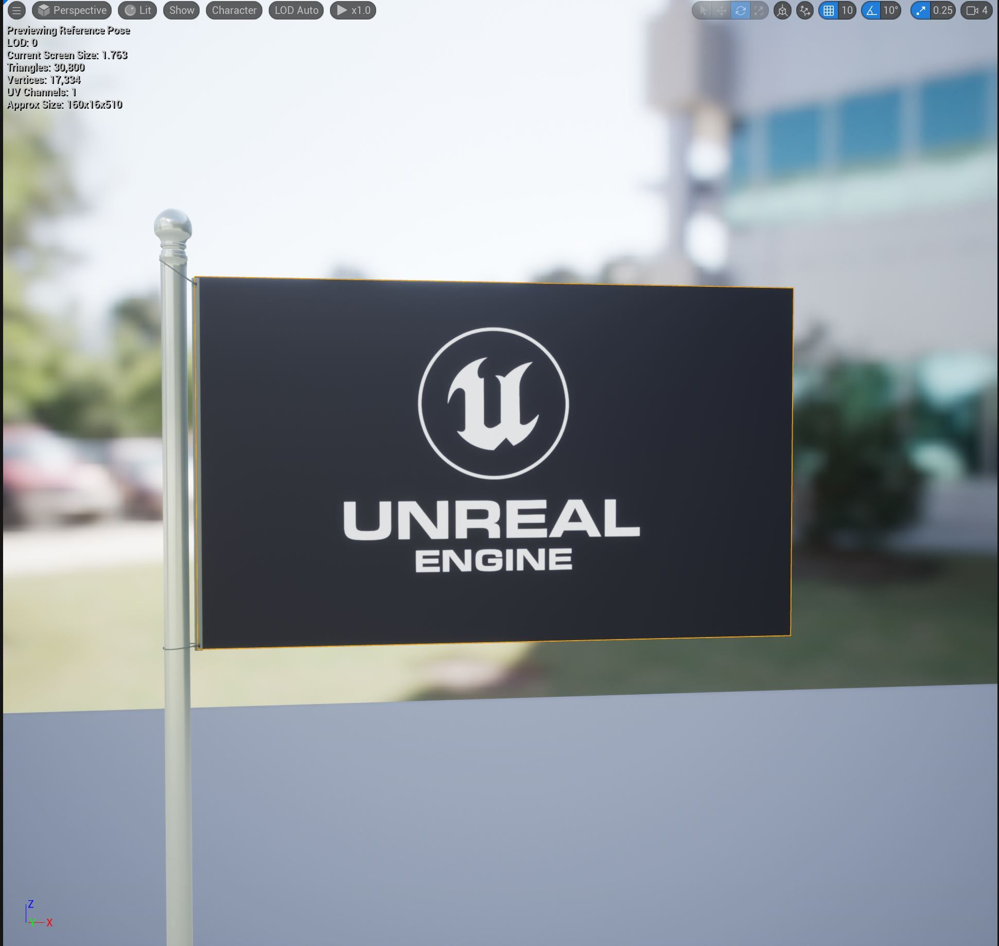
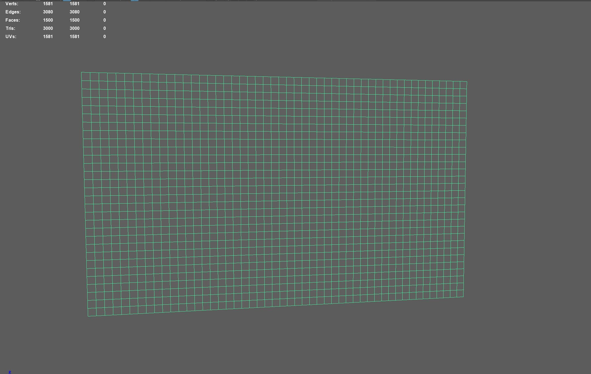
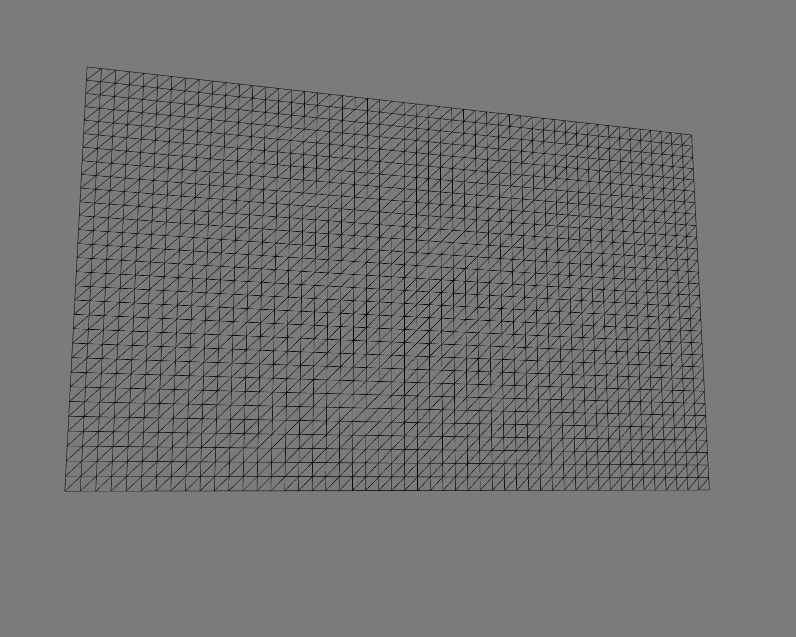
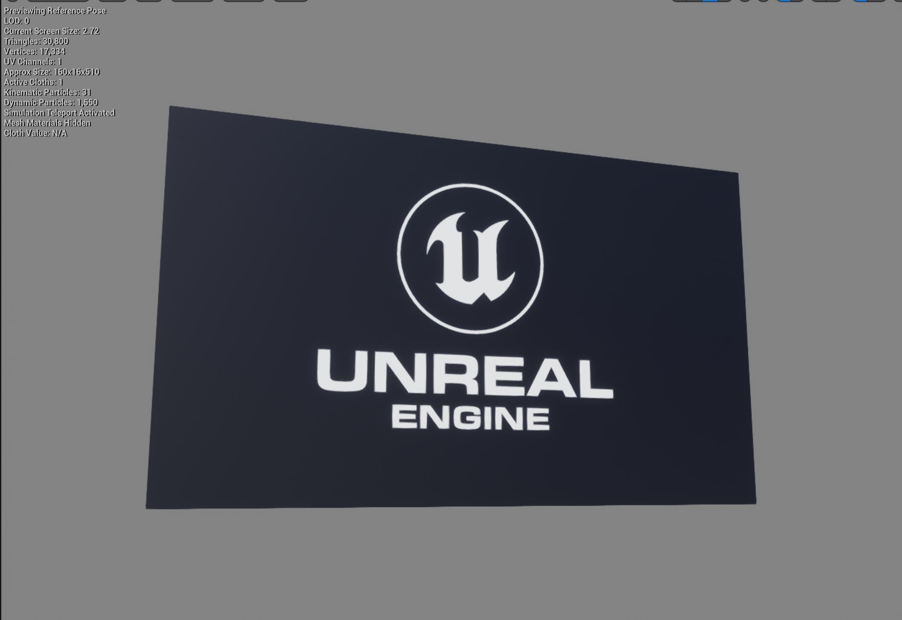
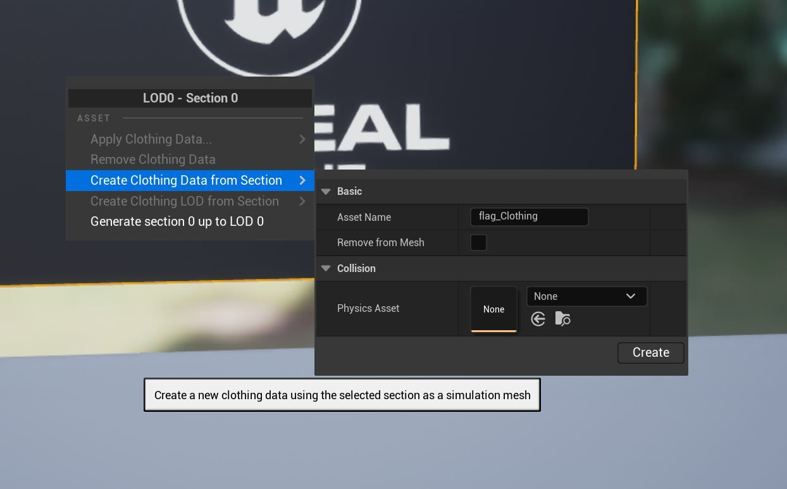
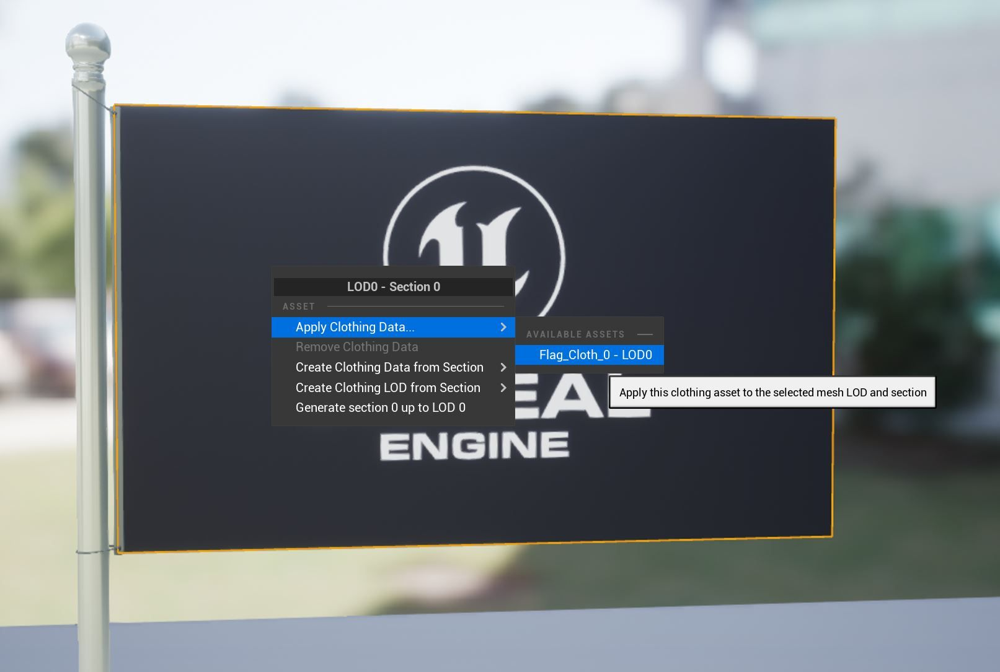
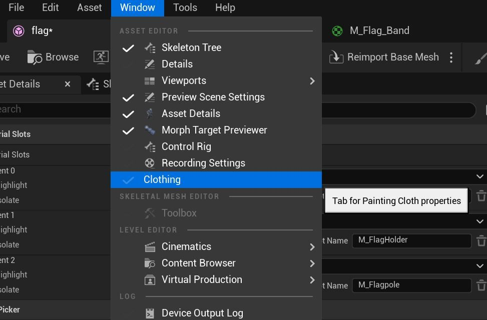
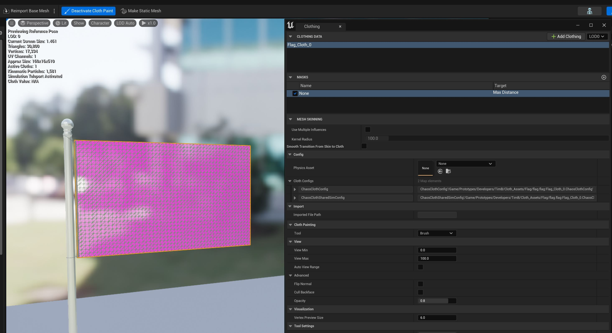
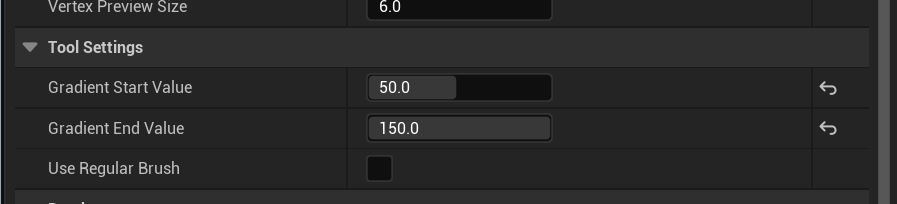
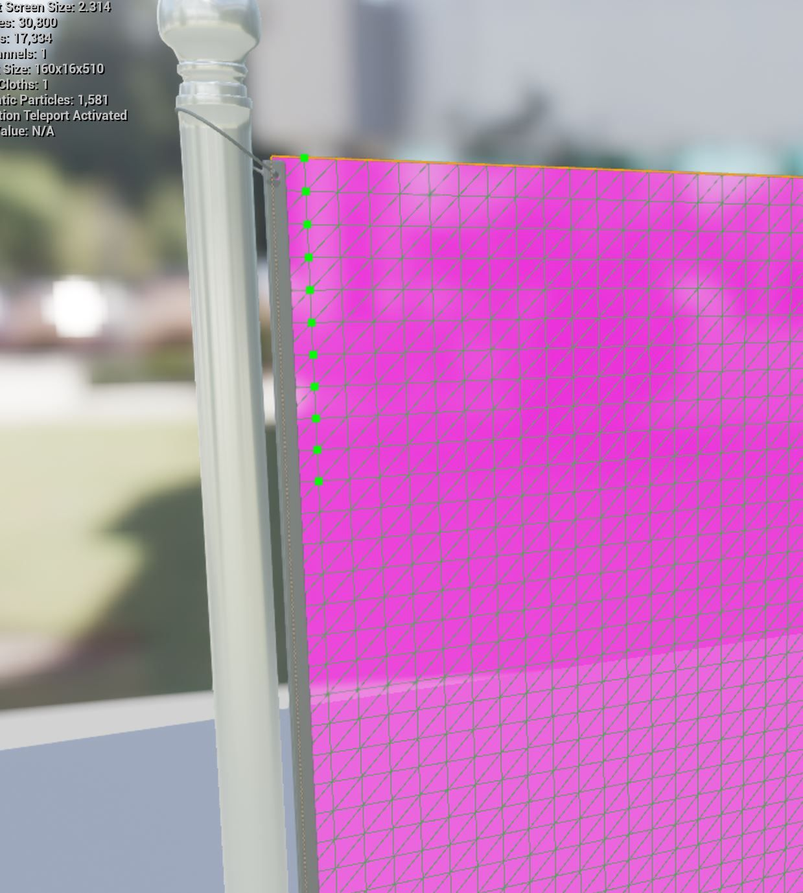

# 混沌布旗教程

## 来源与状态

- 原始 URL：https://dev.epicgames.com/community/learning/tutorials/bLdV/unreal-engine-chaos-cloth-flag-tutorial

## 运行时分类

- 类型：图文教程
- 判断：API 未识别到核心视频信号，可整理正文约 8108 字符。

## 摘要

在这个简单的设置中，我们将探索如何为可渲染网格设置布料模拟。然后，我们将添加全局风，并讨论通过改变混沌布料参数和风设置来创建不同模拟外观的几种方法。

## 中文整理

### 概览

### 创建并导入布料网格

首先，在 Maya 或 Blender 等 DCC 中，生成旗帜几何体。这可以是一个由在没有深度的平面上构建的四边形组成的简单矩形。确保它具有 UV，以便更轻松地添加纹理贴图。 Maya 中的此示例是 40 x 25 网格 = 1066 个顶点； 2000 三人组

添加关节和蒙皮权重/将旗帜几何体绑定到它。有关更多信息，请参阅文档：FBX 骨架网格体管道。 [https://docs.unrealengine.com/5.0/fbx-skeletal-mesh-pipeline-in-unreal-engine](https://docs.unrealengine.com/5.0/en-US/fbx-skeletal-mesh-pipeline-in-unreal-engine) 使用标准 .fbx/SkeletalMesh 导入方法将您的标志导入到引擎中。虚幻引擎在创建骨架网格物体时将在 .fbx 导入时对网格物体进行三角测量。

指定一个着色器。在本例中，我们使用了虚幻引擎徽标的地图来帮助更好地可视化风模拟。

***注意：***** ** ***在一个单独的 Echo Cape 示例中，我们将演示代理网格体工作流程，其中较低分辨率的模拟网格体可以驱动较高分辨率的渲染网格体。*** 此时，您应该导入一个分配了着色器的骨架网格体。

### 创建服装数据描述

要创建布料，我们首先创建服装数据 描述：打开（双击）您创建的骨架网格物体。它将打开骨架网格体编辑器。右键单击 skeletalMesh Editor 下拉菜单中的标志几何体以“从剖面创建服装数据”。在“资产名称”中输入布料的名称，我们将其命名为“Flag_Cloth”。 （UE 将为您生成的第一个布料数据附加一个“_0”。）我们已经创建了考虑三角网格的布料数据描述，但它当前尚未分配给标志几何体。

再次右键单击 SkeletalMesh Editor 中的标记几何体。选择应用服装数据。选择您在上一步中创建的布料数据的名称。对于我们的示例，它是：Flag_Cloth_0_LOD0。

目前，该标志已指定布料模拟，但如果您点击“模拟”，则不会发生任何事情。这是因为我们的“最大距离”蒙版设置为零，防止布料模拟网格移动。 ***注意：请参阅服装工具概述中的蒙版描述*** 按“激活布料绘制”按钮，这将打开服装编辑器窗口。还可以通过“窗口 - 服装”下拉菜单访问服装编辑器。

### 油漆布

在布料编辑器顶部选择 Flag_Cloth_0 布料数据。然后选择最大距离（参见目标标题）。标志网格将显示为粉红色，这意味着所有顶点的值都为零。

标记绘制渐变 - 我们将为最大距离从左到右绘制渐变，并在网格右侧具有更高的衰减值。在布料编辑器中向下滚动以访问绘画工具。将绘画模式切换为“渐变”，并为“起始值”键入值 50，为“结束值”键入值 150。

一直向下选择标志网格左侧的顶点。这是设置起始值。

完成后，按住键盘上的 Ctrl 按钮并选择旗帜网格右侧的所有顶点。顶点变成红色，这是设置最终值。按键盘上的 Enter 键可生成 50-150 之间的渐变值。渐变工具将影响整个网格，因此现在我们将返回并将最接近旗杆连接的顶点绘制回零值，以将这些顶点“固定”到位。将绘画工具设置回画笔，根据需要调整半径并将绘画值设置为 0。以下是我们在 ChaosClothConfig 窗口中使用的一些常规设置。这些设置在“服装工具属性参考”中进行了解释。

### 模拟

按骨架网格体编辑器中的“模拟”按钮。您会注意到，此阶段的标志可能看起来像被绳子握住一样。我们使用系绳设置（以及一些其他参数）来保持从零绘制的岛（运动学）粒子到每个动态模拟粒子。如果您熟悉离线布料模拟，系绳可能是一个新概念。它是一种实时构造，用于帮助控制模拟并防止拉伸，特别是在较低的迭代中。对于我们试图创建的飘逸的、有风的旗帜，我们不一定想让它完全下垂，然后不得不花费更多的迭代来在风的作用下重新恢复原状。我们希望明智地使用模拟工具来保持廉价的性能。我们还欺骗了重力并添加了一些动画驱动来帮助控制我们的模拟。

### 落旗模拟

但是，如果您想获得落旗模拟效果，请减少系绳值，将最大距离衰减增加到 500，并将重力调整为正常默认值 (-980)。增加弯曲刚度等。您可能还必须增加迭代，这反过来又会影响性能。您还可以添加/删除动画驱动值。重点是要了解控制模拟网格的各种方法，并充分利用您想要的特定模拟外观的性能成本，然后进行相应的计划。 **提示：创建一个重复的最大距离遮罩（但请记住一次只能选中一个）并尝试不同的设置。**

### 将骨骼网格体添加到编辑器

调整布料参数后，将您的标志 skeletalMesh 从内容浏览器拖到主编辑器窗口中。

### 添加风

接下来我们将在场景中添加 Global Wind。使用“放置 Actor”窗口，可以通过“窗口 - 放置 Actor”下拉菜单访问该窗口。在放置 Actor 搜索栏中，输入 Wind，然后选择 Wind Directional Source 并将其拖动到编辑器中。旋转“风”小控件以使风向与旗帜平行。设置强度和速度的值。 **注意：Chaos 目前不支持阵风和半径设置，这些输入保留用于旧风设置。在以后的教程中，我们将使用 UE5 中的场系统展示另一种风方法。** 在编辑器中按“播放”（或“模拟”）以查看风对旗帜的影响。尝试各种混沌布料参数来改变布料的模拟外观。

### 尖端

在 ChaosClothConfig 中：密度设置为 0.175。风对密度质量有影响。边缘刚度 - 我们正在运行半低迭代 (4)，因此该值最好保留在 1.0 区域刚度设置得相当高。系绳刚度 - 较低的值将允许更多的拉伸。当使用较低的迭代时，拉伸会更大。阻尼，一点点就能发挥很大作用！ **升力**和**阻力**对于风来说*非常重要*。请小心，过多的升力会使布料在风向力强度和速度较小的情况下变得疯狂。试验阻力和升力值以获得最佳效果。质量确实会影响风！重力 - 通过减少重力来允许更多的运动，随意欺骗重力。如果你的布料太“跳跃”或太活跃，请使用动画驱动刚度来添加一些控制。

### 更多提示

要获得不同的风效果，请在编辑器中调整全局风的强度和速度。例如，对于具有此特定设置和迭代的此标志，强度为 5 且速度为 3 将为您提供与强度为 4.61 和速度为 4.06 完全不同的外观。 **注意：最小化 SkeletalMesh 编辑器或使用“停用布料”按钮将布料模拟计算与编辑器隔离。当 SkeletalMesh 编辑器最大化（可能在另一个桌面上）时，Chaos Cloth 仍然会评估您的 skelMesh 布料以及编辑器中的布料，并且根据您的计算机处理速度、网格分辨率、迭代等，您可能会得到不同的结果。** 如果不确定您是否可能在无意中评估多个布料，请参阅 Chaos 布料教程的 **故障排除和调试提示**，其中我们提到了“Stat ChaosCloth”CVAR 变量可用于评价布料的性能。
