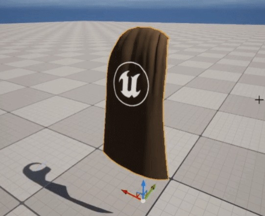
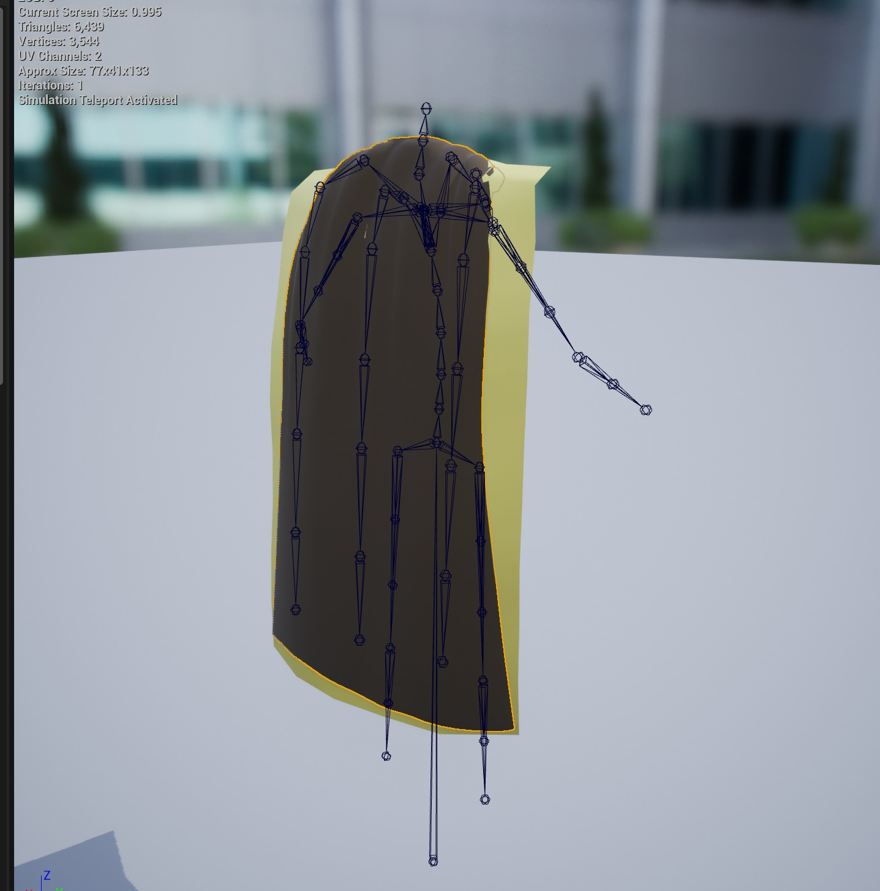
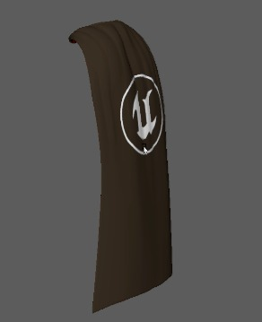
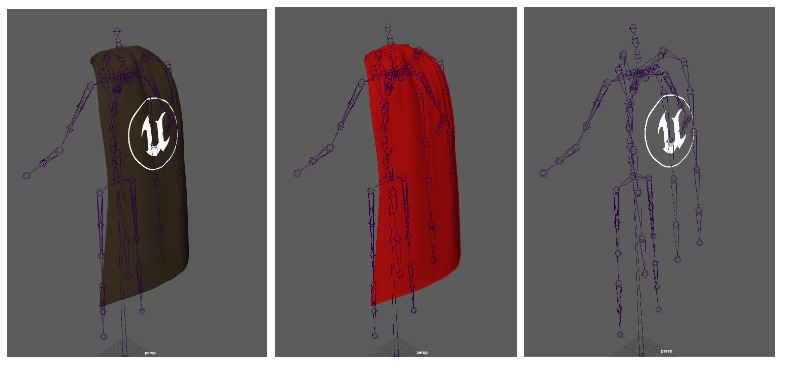
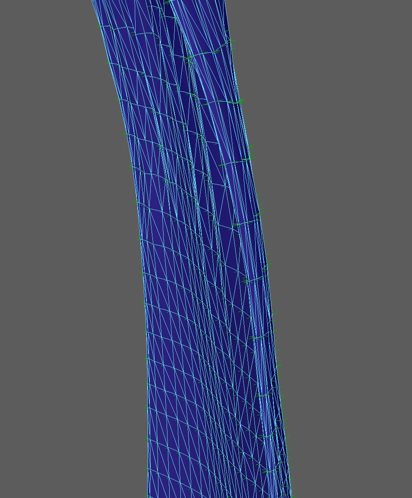
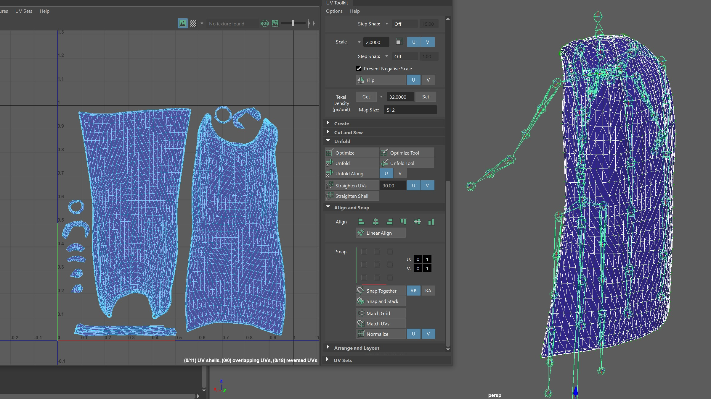
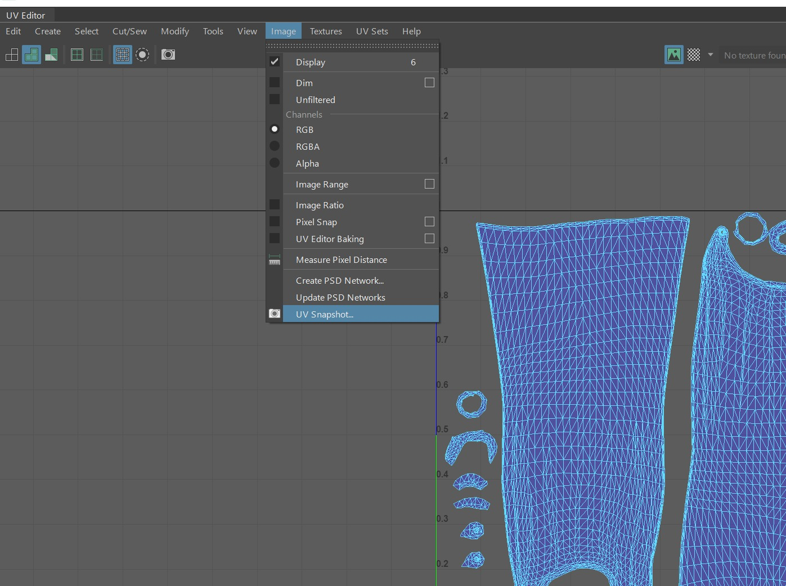
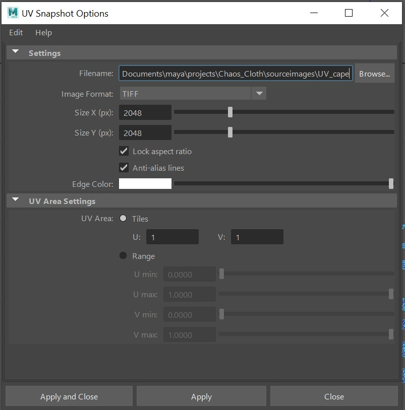
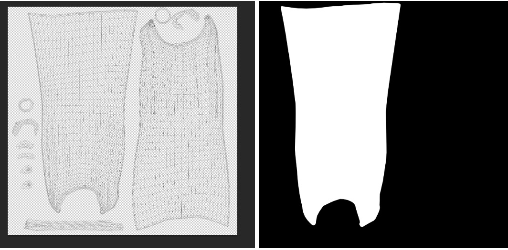
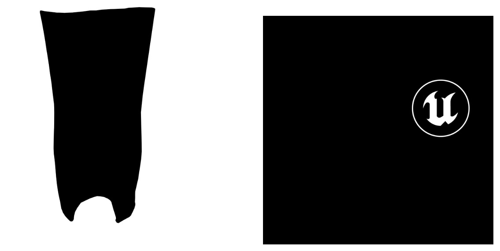

# 混沌布多种材质/贴花工作流程

## 来源与状态

- 原始 URL：https://dev.epicgames.com/community/learning/tutorials/zXJP/unreal-engine-chaos-cloth-multiple-material-decal-workflow

## 运行时分类

- 类型：图文教程
- 判断：API 未识别到核心视频信号，可整理正文约 7045 字符。

## 摘要

以下是一个工作流程解决方案，可以帮助尝试在特定混沌布料实例上使用多种材质的用户。我们将演示如何使用 Echo 斗篷的现有模拟设置来设置内部和外部材料以及贴花。

## 中文整理

### 概览

### 问题

虚幻引擎中的布料代理变形器无法使多个网格变形，这是一个已知的限制。为了让一个模拟网格驱动多种材质和贴花，我们已将本教程添加为当前工作流程。这是一种使用不透明纹理和蓝图节点“*将布料绑定到领导者姿势组件*”的解决方法，以克服一种布料、一种材质的限制。

### 要点和注意事项

虚幻引擎中的纹理使用虚幻引擎材质中的透明度

### 关于几何体、法线、UV 的注释

我们使用 Echo 斗篷来演示如何向现有布料模拟添加多种材质和贴花。该资源使用代理变形器工作流程，使用简化的布料模拟网格来驱动更复杂的渲染网格。这是该教程的链接...

Echo Cape 渲染几何体已进行双面建模。创建 UV 岛来代表这些内层和外层。下面我们在 Maya 中展示了三个不同的网格（内部、外部和贴花）示例，以代表我们在本教程中试图完成的任务。由于我们无法使用引擎中当前的一个代理网格体来变形三个独立的网格体，因此我们将依赖 UV、不透明纹理以及“将布料绑定到领导者姿势”蓝图组件。

在对几何体进行建模时，如果您使用像本例这样的贴花，请仔细检查法线。这是双层斗篷的侧视图，显示法线指向正确的方向。

### 导出透明材质/贴图

根据我们希望为网格添加的内部和外部材料，斗篷有一个简单的 UV 展开。

您可以通过多种方式创建不透明贴图。在本例中，我们使用 Maya UV 快照将布局导出到 Photoshop。

在 Photoshop 或图像编辑器中，使用 UV 布局生成不透明贴图。对于这个海角，左侧的岛是内部几何体，右侧的岛是外部几何体。

从 Photoshop（或您使用的任何方法）中保存三个贴图（内部、外部和贴花），以便我们可以导入到虚幻引擎中

### 虚幻引擎

从 Echo Cape 资源开始，我们复制了该教程中的 SkeletalMesh 并将其重命名为“echo-cape_Multi”。 （*ed。我们没有理由不能使用原始的骨架网格物体，这只是出于组织原因）*

### 设置蓝图

创建一个新的蓝图 Actor。在内容编辑器中右键单击并选择 Blueprint Class，然后选择 Actor。我们将我们的蓝图命名为“Blueprint BP_Cape_Tutorial”，但显然您可以随意以您喜欢的任何方式命名您的蓝图。打开新蓝图后，蓝图组件部分如下所示。现在我们需要添加 3 个骨架网格物体组件来代表我们的外部、内部和贴花材质。将两个 SkeletalMesh 组件作为其中一个组件的父级。重命名组件。没有必要重命名，但是，这可能是一个很好的做法，并且可以帮助我们在需要重新分配材料时保持事情的顺利进行。将 Cape SkeletalMesh 资源（“echo-cape_Multi”）分配给蓝图编辑器右侧“Detail”面板上的三个 Skeletal Mesh Asset 插槽（位于“Mesh”部分下）中的每一个。 ***我们必须在每个蓝图组件中使用相同的骨架网格物体，以便将布料绑定到领导者姿势节点才能工作！*** 重命名后，所有三个组件都使用完全相同的骨架网格物体（例如 echo_cape_Multi） 编译并保存您的蓝图。

### 设置着色器

导入由不透明度贴图创建的纹理。为每个部分创建材质：外部、内部和贴花。有关材质设置，请参阅 [https://docs.unrealengine.com/5.1/en-US/unreal-engine-materials/](https://docs.unrealengine.com/5.1/en-US/unreal-engine-materials/)。对于不透明度，您需要调整着色器的“混合模式”。对于外海角层，我们使用了“蒙版”混合模式。 Masked 在性能方面成本较低，并且在这种情况下效果最好。对于内层，我们希望材质有所不同，因此我们将着色器中的照明模式调整为“表面半透明体积”，打开金属和粗糙度进行编辑。混合模式设置为半透明。编辑材质时，您需要确定您的性能需求并进行相应调整。贴花还设置为半透明混合模式并使用 TexCooperative 节点。下面，我们将展示为什么要为此案例添加此内容。回到蓝图中，我们现在需要添加自定义着色器并替换每个组件的斗篷资源的原始材质槽（元素 0）。 （请记住，元素 1，“S_Cape_Sim”在我们的代理海角设置期间已被禁用，因此可以忽略它）在分配贴花后，我们注意到它也出现在我们不希望的内表面上。为了解决这个问题，我们关闭了材质中的“双面”。 TexCoordinate 节点还用于调整坐标索引以及稍微调整 UTiling，我们认为这为我们仓促创建的贴花不透明贴图提供了大小和位置！

### 构建蓝图

这部分设置将包含一个名为“将布料绑定到领导者姿势组件”的蓝图节点。首先，切换到事件图。从“Event Begin Play”中拖出一个名为“Set Leader Pose Component”的节点。我们需要指定哪个组件优先，以及其他组件将“限制”到哪个组件。您可以选择两个子组件中的一个，将另一个子组件拖到图表中。将第二个子组件连接到目标。最后，拖入“Cape Outer”（两个组件的“驱动程序”父级）并连接到“New Leader Bone Component”。从“Event Tick”中拖出一个写入，与上面的步骤类似，选择一个子组件。将第二个子组件拖到图表中并连接到目标。蓝图完成。我们在开始比赛时设置领导者姿势组件，并且在每个刻度上我们将子组件限制为领导者姿势组件。编译并保存您的蓝图

### 蓝图设置/测试后

创建新（基本）关卡 将 BP_Cape_Tutorial 或您保存的蓝图拖到新关卡中。添加风。 （放置 Actor – 风向源）在编辑器中的 PIE 中进行模拟或播放。使用 CVAR ‘Stat ChaosCloth’ -（有关更多信息，请参阅教程：布料故障排除和调试提示）我们可以确认只有一种混沌布料正在模拟。现在我们将看看编辑器中不透明度的效果。通过将不透明度贴图和材质与将布料绑定到领导者姿势结合使用，我们可以使用一种布料模拟来模拟多种材质。然而，您会看到它变成了一个非常复杂的效果。

### 最后的注释

- [在虚幻引擎材质中使用透明度](https://docs.unrealengine.com/5.1/en-US/using-transparency-in-unreal-engine-materials) - [虚幻引擎中的纹理](https://docs.unrealengine.com/5.0/en-US/textures-in-unreal-engine)

## 相关链接

- [Using Transparency in Unreal Engine Materials](https://docs.unrealengine.com/5.1/en-US/using-transparency-in-unreal-engine-materials)
- [Textures in Unreal Engine](https://docs.unrealengine.com/5.0/en-US/textures-in-unreal-engine)
