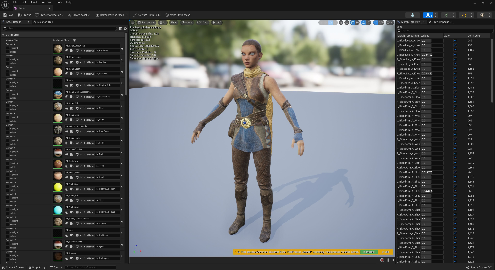
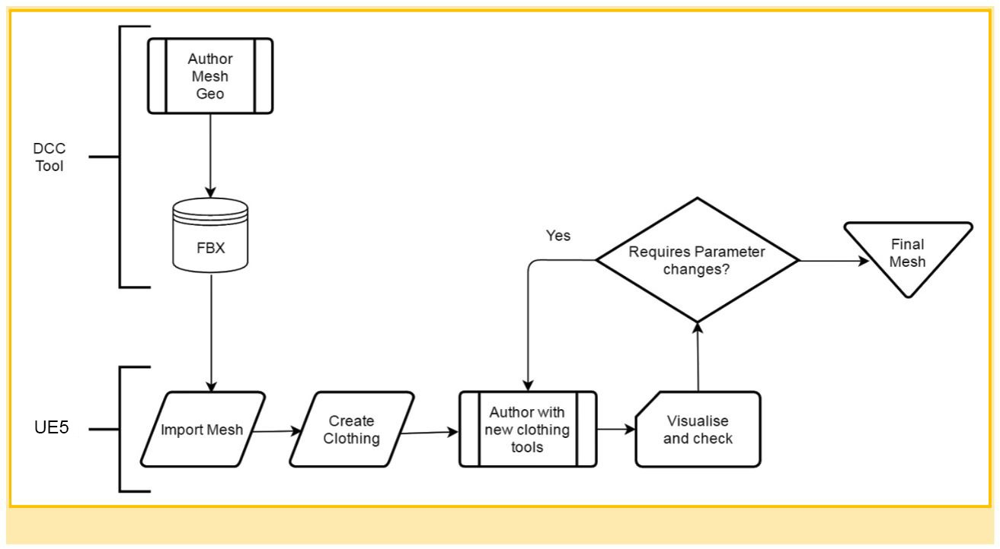
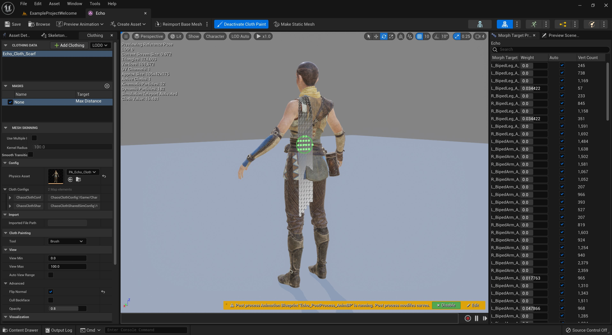
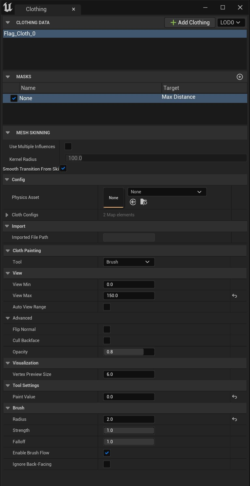
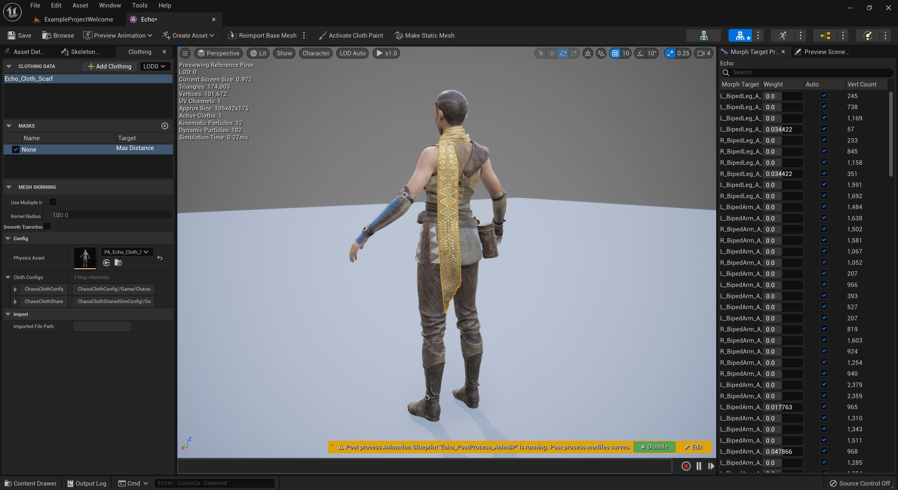
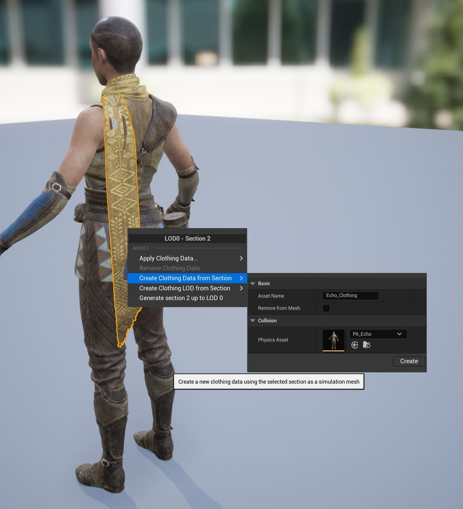
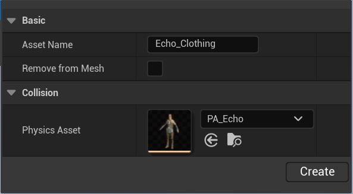
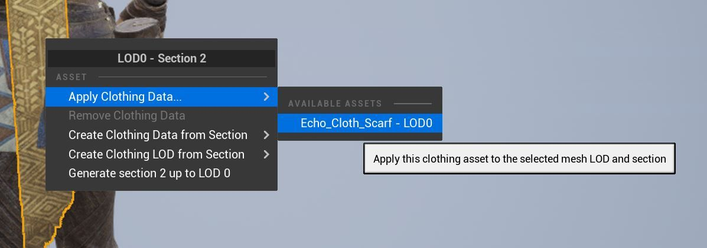
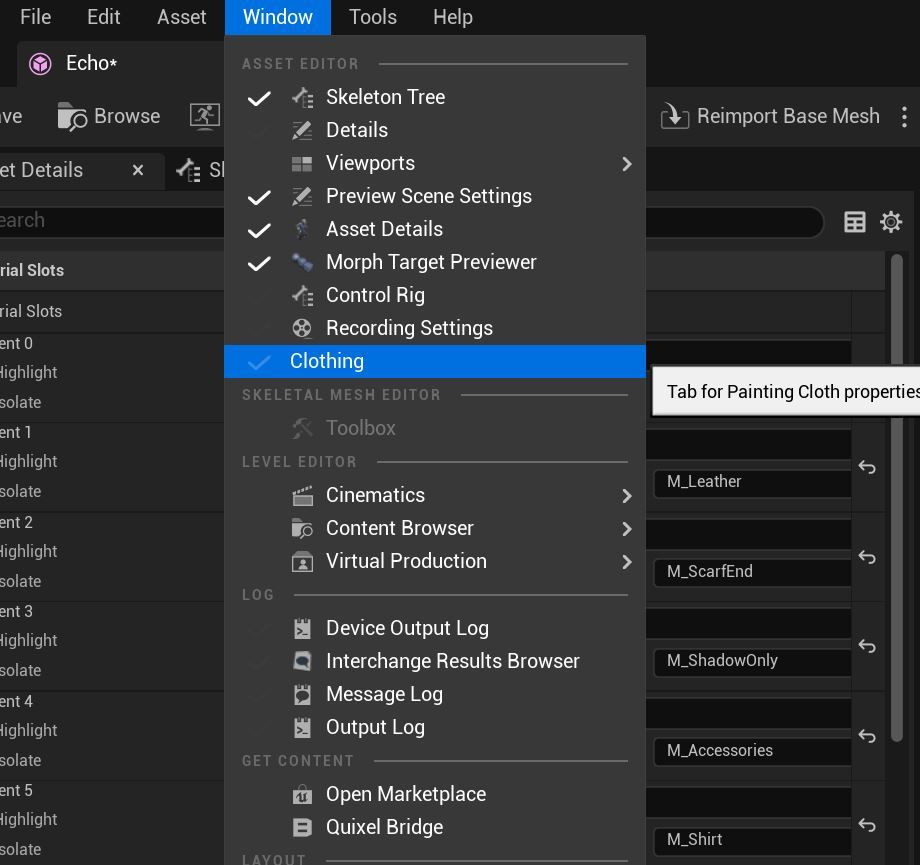

# 混沌布工具概述

## 来源与状态

- 原始 URL：https://dev.epicgames.com/community/learning/tutorials/OPM3/unreal-engine-chaos-cloth-tool-overview

## 运行时分类

- 类型：图文教程
- 判断：API 未识别到核心视频信号，可整理正文约 6727 字符。

## 摘要

虚幻引擎使用混沌解算器，它是一个低级服装解算器，负责运行服装的粒子模拟。本文档概述了用于帮助定制混沌布料模拟的布料绘制工作流程。

## 中文整理

### 概览

借助编辑器中提供的服装工具，工作流程使开发人员能够直接使用虚幻引擎来创作内容，而无需外部依赖项。

此工作流程使您能够一次性创建内容，然后直接在虚幻引擎内进行所有服装的创建编辑。它使测试内容的创建和迭代变得更快，并且您还可以实时查看对服装模拟的所有编辑以及它们将出现在您的游戏中，从而避免内容创建位置与使用位置之间的任何脱节。

### 布料绘画工作流程

通过使用在编辑器中创建布料的工作流程，布料绘制工具使您能够使用骨架网格物体的任何现有材质元素快速为角色创建服装。

**服装和油漆面板 **- 此部分包括您在绘制服装时可以使用的所有必要工具和属性。

按照以下步骤学习创建服装资源、将它们分配给您的角色的过程，以及在渲染或自定义模拟网格上绘画的基础知识。

1. 使用左键单击选择网格中要用作布料的部分。然后右键单击打开上下文菜单以创建布料资源。

2. 从上下文菜单中，选择从选择创建布料资源，然后填写菜单的以下区域：

对设置感到满意后，单击 **创建** 按钮。

再次右键单击该部分以显示上下文菜单，并将鼠标悬停在 **应用服装数据** 上，然后从可用的服装资源中进行选择以应用。它将把创建的任何服装资产与您选择的部分相关联。

### 在布上绘画

准备好在布料上绘画后，您可以使用以下控件在选定的布料资源上绘画：

在骨架网格体编辑器中，转到文件菜单并选择 **Window**，然后从列表中选择 **Clothing**。

这将打开 **服装** 面板。

单击工具栏中的 **激活布料绘制** 按钮以启用可用于为所选布料资源绘制的属性。

在 **Clothing** 面板中，从 **Clothing Data** 列表中选择分配的 **Cloth Asset**。

在**布料绘画**部分中，您可以选择要使用的绘画工具类型，然后设置**绘画值**（默认情况下，将使用画笔绘画工具）。然后左键单击并在网格表面上拖动以开始绘画。

**提示** - 按住 **H** 键盘快捷键来预览绘制的布料。

### 油漆工具

**工具**选项使您能够从可用于布画的画笔中进行选择。

### 刷子

**画笔**工具使您能够在拖动布料资源时在布料上绘制半径和强度值。

在绘制布料时，使用 **Paint Value** 控制画笔的强度。该值控制绘制区域基于该值的反应程度，就像布料一样。值为 0 意味着蒙皮顶点无法移动，值为 100 则意味着蒙皮顶点可以从其原始位置移动一米。

笔记

有关此工具及其属性的其他信息，请参阅此处的画笔属性参考。

### 坡度

**渐变**工具使您能够在选定的一组布料值之间绘制渐变混合。

要绘制渐变，请执行以下步骤：

有关此工具及其属性的其他信息，请参阅此处的渐变属性参考。

### 光滑的

**平滑**工具使您能够模糊或柔化绘制的布料值之间的对比度。

使用 **强度** 值来调整模糊效果的强度或柔和程度，以在绘制区域之间创建柔和的渐变。

有关此工具及其属性的其他信息，请参阅此处的平滑属性参考。

### 充满

**填充**工具使您能够将具有相似值的区域替换为另一个值。

使用 **填充值** 设置一个值来填充区域中的顶点。使用 **Threshold** 设置填充操作在采样要替换的顶点时应使用的值。

有关此工具及其属性的其他信息，请参阅此处的填充属性参考。

### 布料特性

**布料配置** 属性使您能够调整布料以模拟不同类型的材料，例如粗麻布、橡胶和其他类型的布料材料。它还具有 SkelMesh 资源中所有布料的共享 sim 设置。

有关服装配置属性的更多信息，请参阅此处的 **布料配置属性** 参考。

### 面具

**蒙版** 是可以替换为您的服装资产的参数集。

此参数集代表以下 **目标**（或参数集）：

您可以拥有其中每个 **目标** 的多个，但每次只能分配其中一个。这使得以非破坏性方式非常快速地测试不同的配置成为可能。

要创建掩码并将其分配给目标，请执行以下步骤：

您还可以通过上下文菜单将骨架网格物体顶点颜色复制到选定的服装参数蒙版：

有关遮罩的更多信息，请参阅此处的遮罩属性参考。

### 从骨架网格物体复制衣服

如果您有多个相似类型的骨架网格物体（例如，角色身上的斗篷），您可以使用“从骨架网格物体复制服装”选项将您为布料设置定义的设置复制并导入到另一个骨架网格物体中，这样无需从一开始就设置所有参数，从而节省您的时间。

在 **Clothing Data** 下，单击 **Copy Clothing from SkeletalMesh** 并选择要从中复制服装数据的骨骼网格体。

### 网格蒙皮

此功能公开了着色器变形器半径衰减，以修复使用布料代理模拟网格工作流程时的包裹变形网格问题，而通常较低分辨率的模拟网格“驱动”较高分辨率的渲染网格。

**使用多种影响**

目前限制为最多 5 个周围顶点，这是代理网格变形器的衰减控制。

**内核半径**

根据网格中的顶点距离进行调整以添加/混合最多 5 个权重顶点。您需要根据顶点的空间关系调整该值。

**从皮肤到布料的平滑过渡**

根据“最大距离”属性，从控制网格物体的骨架网格物体蒙皮到控制网格物体的布料模拟逐渐过渡，而不是关闭时的急剧过渡。
