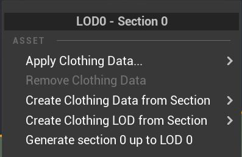
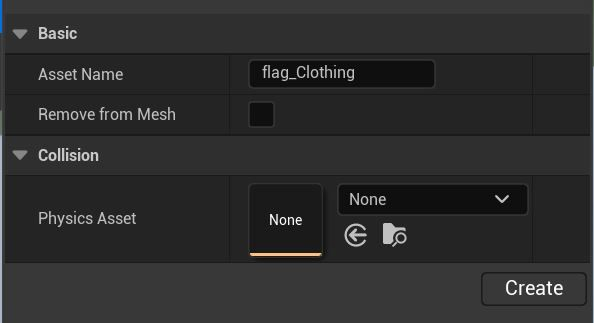
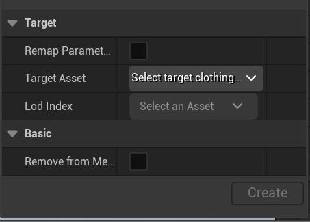
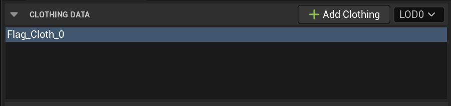
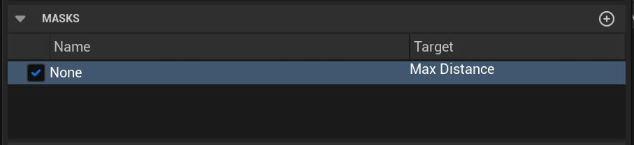
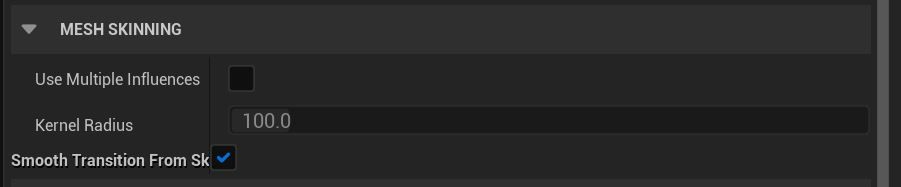
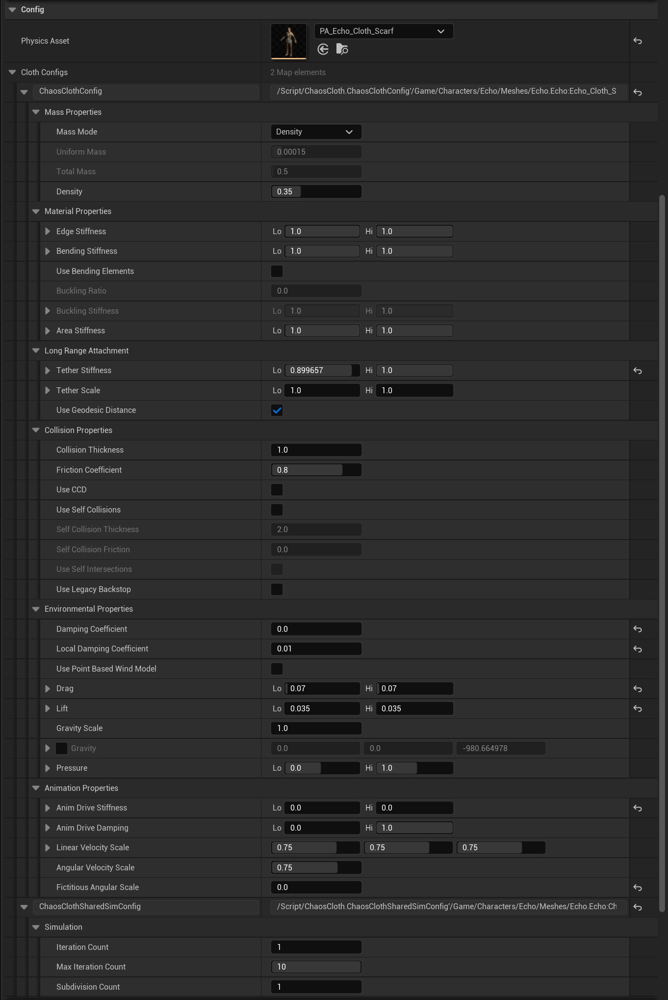
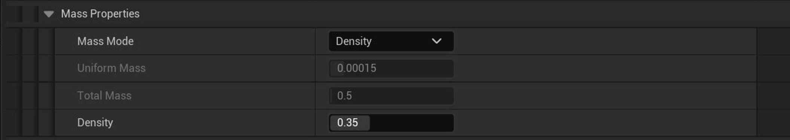
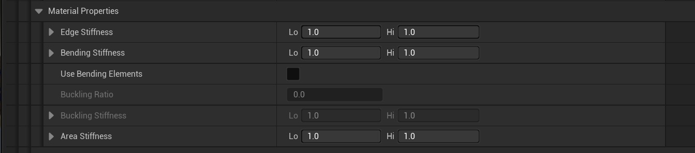

# 混沌布料工具属性参考

## 来源与状态

- 原始 URL：https://dev.epicgames.com/community/learning/tutorials/jOrv/unreal-engine-chaos-cloth-tool-properties-reference

## 运行时分类

- 类型：图文教程
- 判断：API 未识别到核心视频信号，可整理正文约 19024 字符。

## 摘要

下面您将找到有关创建服装资源时“服装工具”菜单选项的详细信息，包括新的混沌布料参数以及在选择不同的绘制工具为布料模拟网格绘制布料值时将使用的信息。添加了 5.1 参数。

## 中文整理

### 混沌布关键概念

在本节中，您将找到有关在创建布料资源并将其应用到渲染网格时可以使用的属性和设置的详细信息。请注意，在 UE5 中，混沌布料使用传统的布料设置和绘制工作流程，但是，所有新的模拟参数、蒙版和新功能现在都可用。

需要记住的混沌布的一些关键概念。

### 服装资产创建菜单

### 部分选择

通过右键单击骨架网格体编辑器中的选定部分，可以使用“部分选择”菜单。它使您能够选择渲染网格的不同材质元素来创建和应用服装资源。在此菜单中，您可以识别所选网格体的 LOD 和材质部分，为渲染网格体及其 LOD 创建布料资源，将服装资源应用到所选部分，并在需要时将其删除。

***属性* ** ***描述***

**LOD 部分选择** 使用的 LOD 级别的名称以及为其创建布料资源的部分。

**应用服装资源 ** 选择要应用于所选部分的服装资源。

**删除服装资产 ** 删除当前分配的服装资产。

**根据选择创建服装资源** 使用选定部分作为模拟网格创建新的服装资源

***基本的***

**资产名称** 为布料部分资产输入的名称

**从网格中删除** 是否将此部分留在后面（自行驱动网格）。启用此功能可以用低多边形网格驱动高多边形网格。

***碰撞***

**物理资源** 用于从中提取碰撞的物理资源。

**从 LOD 部分创建服装资源**

从所选部分创建服装模拟网格并将其 LOD 添加到现有服装资源

***目标***

**目标资源** 这是导入LOD时的目标资源

**LOD Index** Replace LOD 使用此部分替换所选服装资产的 LOD0 中的模拟网格

添加 LOD 使用所选部分添加为新 LOD

**重新映射参数** 如果重新导入，请将旧的 LOD 参数映射到新的 LOD 网格。如果添加新的 LOD，这将映射先前 LOD 中的参数

**从网格中删除** 是否将此部分留在后面（如果用其自身驱动网格）。如果用低多边形驱动高多边形网格，请启用此选项。

**生成第 # 节至 LOD #** 生成的 LOD 将使用第 # 节至 LOD #，并忽略它以获取较低质量的 LOD

### 服装面板

服装面板包含所有服装数据、遮罩、布料反应的配置参数以及绘制布料值时将使用的工具。

### 服装数据

“服装数据”类别显示当前创建的分配给渲染网格体的服装资源，使您能够从现有骨架网格体复制服装数据，并允许您从为网格体创建的可用 LOD 中进行选择以调整参数值。

***属性*** *** 描述***

**名称** 为物理网格的 LOD 部分创建的布料资源的名称

**+添加服装** 允许从另一个类似的 SkeletalMesh 布料资源复制布料设置

**细节层次 (LOD) 选择** 启用细节层次 (LOD) 网格的当前选择

### 面具

**蒙版**类别显示为绘制的布料值创建的任何参数集。可以为它们分配一个目标值以与您的服装资产一起使用。

***属性*** ***描述***

**名称** 给蒙版的名称，以及该参数集的目标设置

***上下文菜单设置***

**设定目标**

**无** 尚未为此参数集设置目标。

目前可用的口罩包括：

**行动**

上移 将列表中的蒙版向上移动一位。

下移 将列表中的蒙版向下移动一位。

删除 从列表中删除蒙版。

应用 将遮罩应用到物理网格。

+Mask 将新的 Mask 添加到可用的 Mask 参数列表中

### 油漆掩模和高/低参数值

当您在蒙版上绘制 0-1 值时：

如果未分配掩码，则仅 Lo 值相关

请参阅下面的 ClothConfigs

### 网格蒙皮

这是一项新功能，它公开着色器变形器半径衰减以修复包裹变形器网格问题。它目前相对有限，但确实提供了一个有用的工具来修复使用代理变形方法时变形不正确的网格。

**使用多种影响**

**内核半径**

**从皮肤到布料的平滑过渡**

### 配置

属性说明

物理资源 构建模拟时用于提取碰撞的物理资源。

### 布料配置

布料配置属性包括 ChaosClothConfig，它使您能够调整单个布料模拟网格的反应方式以模拟不同类型的材料，例如粗麻布、橡胶、皮革等。

ChaosClothSharedSimConfig 包括模拟迭代计数和细分计数，它们是特定骨架网格体资源中的所有布料网格体共享的属性。

### 混沌布料配置

### 质量特性

质量模式

均匀 每个粒子的质量将设置为 UniformMass 设置中指定的值。

总质量 总质量均匀分布在所有粒子上。

密度 使用恒定的质量密度。 （受到推崇的）

### 材料特性

**边缘刚度**

对于弹性很大的材料，边缘约束的刚度仅使用低于 1 的值。增加较硬材料的迭代次数。

**弯曲刚度**

The stiffness of the bending constraints.增加较硬材料的迭代次数

**使用弯曲元件**

启用更精确的弯曲单元约束，而不是用于控制弯曲刚度的更快的交叉边缘弹簧约束。启用将允许访问屈曲比/刚度参数。

***屈曲***

这是弯曲元素约束的一个功能（并且需要在配置中勾选 UseBendingElements 才能启用）。它允许弯曲元素约束减弱或增强，以便更好地控制布料的折痕，具体取决于其两个参数：屈曲比和屈曲刚度。

**屈曲比**

一旦单元弯曲，从其静止角度折叠超过此比例（“屈曲”），它就会切换到使用屈曲刚度而不是弯曲刚度。当屈曲比 = 0 时，永远不会使用屈曲刚度。当 BucklingRatio = 1 时，一旦弯曲超过其静止配置，就会使用屈曲刚度。

**屈曲刚度**

一旦布料弯曲（即弯曲超过一定角度），弯曲将使用此刚度而不是弯曲刚度。通常，屈曲刚度设置为小于弯曲刚度。屈曲比决定使用弯曲刚度和屈曲刚度之间的切换点。

**面积刚度**

区域保留约束的刚度。增加较硬材料的迭代次数。

### 远程附件

**系绳刚度**

远程附件约束的系绳刚度。远程附件通过弹簧约束将每个布料颗粒连接到其最近的固定点。当迭代计数因性能原因保持较低时，这可用于补偿拉伸阻力的缺乏。可能导致不自然的、拉线木偶般的行为。使用 0 禁用。

**系绳秤**

远程附件约束的限制范围（也称为系绳限制）。

**使用测地距离**

对于长距离附件约束，使用测地线而不是欧几里德距离计算，其设置速度较慢，但​​在确定系绳的正确位置和长度时更准确，因此在模拟过程中不易出现伪影。

### 碰撞属性

**碰撞厚度**

考虑与对撞机形状的碰撞时布料点的半径。

**摩擦系数**

布料与碰撞体相互作用的摩擦系数。

**使用CCD**

使用连续碰撞检测 (CCD) 来防止快速移动的粒子和对撞机之间发生任何错过的碰撞。与不使用 CCD 解决碰撞相比，这会对性能产生负面影响。

**使用自碰撞**

切换以激活自碰撞厚度、摩擦力和自相交（如下）

**自碰撞厚度**

自碰撞中使用的球体的半径。

**自碰撞摩擦力**

布与布相互作用的摩擦系数。

**使用自交点**

启用自相交分辨率。这将尝试修复任何未通过碰撞斥力处理的布料交叉点。

**使用旧版逆止器**（不推荐）

保留以防先前的设置使用它 - 主要区别是逆止器距离是计算到逆止器半径中心的。新的逆止器计算为逆止器球体的边缘。

### 环境特性

**阻尼系数**

应用于布料速度的阻尼量。该阻尼系数的工作方式不同，因为它是全局的而不是弹簧级别的。它根据群体运动降低粒子的速度。这在某种程度上类似于拖动均匀的非移动流体：系数越高，流体越粘稠。

**局部阻尼系数**

粒子速度与全局运动的个体偏差的阻尼量。它比阻尼系数更昂贵，但也提供更好的结果。之所以称为“局部”，是因为它与布料的质心相关，允许潮湿的不稳定，而不会导致布料像在水下一样减速。将其设置为 0 以禁用它。

**使用基于点的风模型**

启用旧版 NvCloth 设置。

**拖**

适用于每个三角形的阻力系数。

**举起 **

应用于垂直于空速的每个三角形。质量对风有影响。

**重力秤**

比例因子应用于世界重力以及服装模拟。相互作用者的重力。如果使用下面的覆盖设置，则不会影响重力。

**重力**

重力加速度矢量 [cm/s^2]。

**压力**

向模拟布料的每个三角形添加恒定的压力。可以通过压力可绘制蒙版在网格上调节效果。压力始终沿法线方向施加（使用负值沿相反方向推动）。

### 动画属性

**动画驱动刚度**

驱动布料朝向动画目标网格的约束强度。

**动画驱动阻尼**

驱动布料朝向动画目标网格的约束的阻尼强度。

**线速度标度**

从参考骨骼发送到局部布料空间的线速度量。

**角速度标度**

从参考骨骼发送到局部布料空间的角速度量。

**虚拟角度比例**

用于计算所有虚拟力（例如离心力）强度的角速度部分。该参数仅对已通过“角速度比例”参数从模拟中删除的参考骨骼角速度部分产生影响。值范围从 0 到 2，其中 0 表示无离心效应，1 表示完全离心效应，2 表示过度驱动离心效应。

笔记：

关于 ChaosClothConfig 参数的低值和高值

如果将针对该属性的已启用权重贴图（也称为遮罩）添加到布料中，则低值和高值都将与存储在权重贴图中的每个粒子权重结合使用，以从中插值最终值。否则，低值是有意义的并且足以启用此约束。

### ChaosClothSharedSimConfig

**迭代次数**

求解器迭代的次数。由于更好的收敛性，这将增加所有约束和材料的感知刚度，但会增加 CPU 成本。

**最大迭代次数**

帧率低于 60fps 时求解器迭代的最大次数。使用此参数，IterationCount 成为 60fps 时的目标迭代次数。因此，如果您的游戏当前以最大 30 fps 运行，您将必须将当前使用的值加倍。

随着帧速率下降，它也会在内部动态增加，例如：内部设置为 60fps 的 2 次迭代在 30fps 时变为 4 次，在 20fps 时变为 6 次，...等。或 1（120fps）！ MaxIterationCount 用于限制低帧速率的增加，这样您就不会以 2fps 进行 60 次迭代。它在更高（高于 60fps）帧速率下没有效果。

**细分计数**

求解器子步骤的数量。 This will increase the precision of the collision inputs and help with constraint resolutions but will increase the CPU cost.请记住，这比增加迭代次数的成本高出 50%，而且也不一定像迭代次数那样增加收敛性。 But increasing this might bring some relief to assets that don't do well during fast motion.

注意：复制/粘贴设置

请注意，可以复制单个参数，但当前无法复制整个配置。这是一个已知问题。

### 进口

导入选项显示任何旧版导入的 APEX 文件的文件路径。

***属性*** ***描述***

导入的文件路径 如果该资源是从文件导入的，则这将是原始路径

### 布画

**布料绘画**部分使您能够在不同的工具之间进行选择，例如画笔、渐变、平滑和填充。

在填充这些属性之前，您必须首先从“服装数据”窗口中选择服装资源，然后单击工具栏中的“**激活布料绘制**”按钮。

绘制布料值时使用的工具类型。

### 刷子

**画笔**工具使您能够在拖动布料资源时在布料上绘制半径和强度值。

**看法**

视图最小值 绘制浮点/一维值时，这被视为绘制值的零点或黑点。

视图最大值 绘制浮点/一维值时，这被视为绘制值的一个点或白点。

自动查看范围 设置后，将根据当前可编辑蒙版中存在的值计算视图最小值和最大值。

**高级推出**

翻转法线 是否翻转网格预览上的法线。

剔除背面 渲染网格预览时是否剔除背面三角形。

不透明度 网格预览的不透明度值，使您能够看穿网格。

**可视化**

顶点预览大小 网格绘制处于活动状态时绘制的顶点的大小。

**工具设置**

绘制值 在此参数的网格上绘制的值。

**刷子**

半径为...

强度 画笔的强度（0.0 - 1.0...

### 坡度

### 光滑的

### 充满
