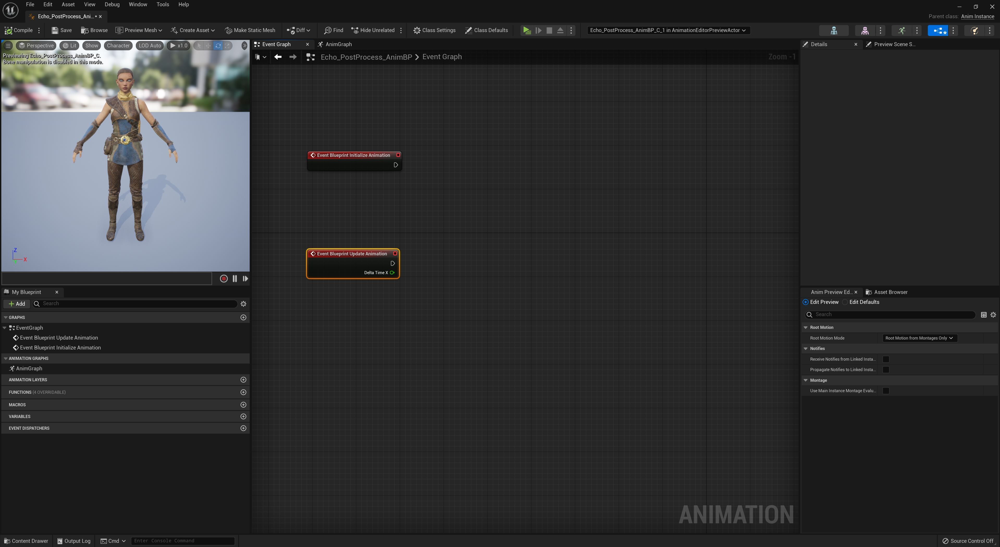
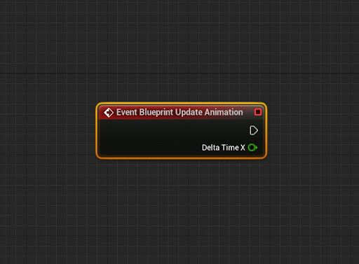
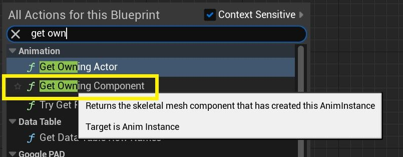
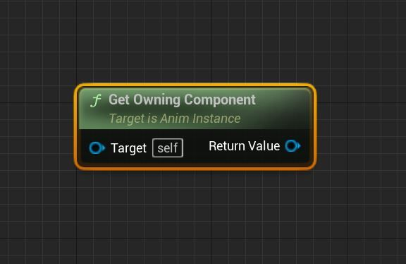
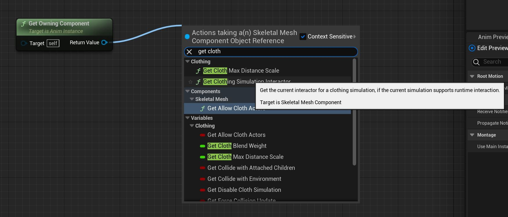
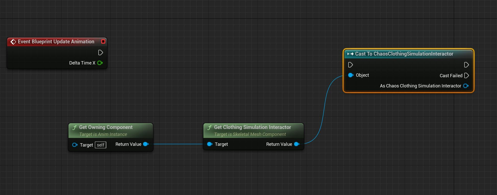
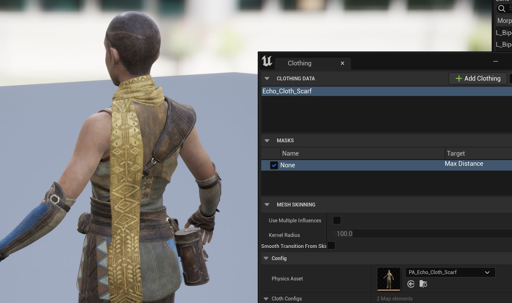
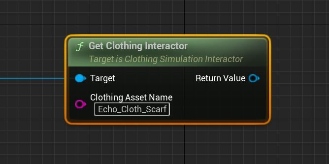
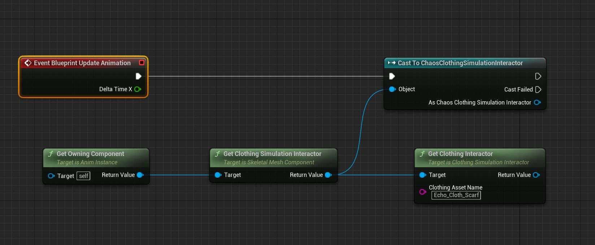
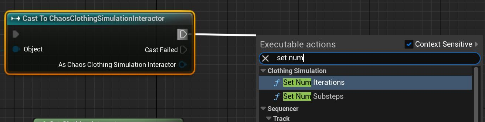

# 布料蓝图交互器教程

## 来源与状态

- 原始 URL：https://dev.epicgames.com/community/learning/tutorials/PWR7/unreal-engine-cloth-blueprint-interactor-tutorial

## 运行时分类

- 类型：图文教程
- 判断：API 未识别到核心视频信号，可整理正文约 3147 字符。

## 摘要

本教程将向您展示如何在 UE5 中为 Chaos Cloth 设置新的蓝图交互器节点。

## 中文整理

### 概览

Chaos Cloth 现在能够添加复制 SkeletalMesh Cloth 编辑器参数的布料蓝图节点。这些被添加到角色动画蓝图的事件图表中，以便添加实时的布料模拟设置以及使用事件的音序器导演蓝图。以下是建立此 BP 网络的方法示例。

### 事件图

为 Echo 创建动画蓝图或使用现有动画蓝图。在本例中，我们将使用内容示例中已存在的“Echo_PostProcess_AnimBP”。使用“**事件蓝图更新动画**”节点。

进入事件图表后，右键单击蓝图编辑器并输入“get own...”，然后选择 **Get Owning Component。**

在选择了上下文敏感的返回值中，选择“**获取服装模拟交互器”。**

然后，我们需要从**服装模拟交互器**的返回值中拉出一条线来投射到**ChaosClothingSimulationInteractor。**

我们需要仔细检查 Echo 围巾服装数据资产名称的拼写。打开布料编辑器并确保复制名称以在下一步中使用。

从 **获取服装模拟交互器** 选项卡中拉出另一根电线，然后输入 **获取服装交互器**。在“服装资产名称”输入中，粘贴或输入上一步中的服装数据 (Echo_Cloth_Scarf) 的名称。

你的图表应该是这样的。

我们添加了 **ChaosClothingSimulationInteractor** 来用作资产中所有 Chaos Clothing 的 **Set Num Iterations** 和 **Set Num Substeps** 的控件。现在添加这些。

将获取服装模拟交互器的返回值连接到每个 **Set Num Iteration** 和 **Set Num Substeps**。请随意使用重新路由注释来清理和连接 ChaosClothing SimulationInteractor 与 Iteration 和 Substep 节点之间的执行节点。

### Cast to Chaos 服装互动器

要访问围巾网格的混沌布料参数，我们仍然需要添加另一个节点。从 Get Clothing Interactor 的返回值中拉出一条线，输入“cast to ch”，然后选择 **Cast To ChaosClothingInteractor** 实用程序小部件。连接混沌子步骤的执行线。此时，您可以访问 skeletalMesh 围巾布料上的各个布料参数。右键单击并输入“**布料**”以访问各种混沌布料功能。将设置链接在一起，确保“As Chaos Clothing Interactor”连接到每个目标函数，并且执行线连接在各个节点之间。最终的图表可能看起来像这样。编译并保存。注意：BP_Interactor 节点比 SkelMesh 布料编辑器参数具有**优先级** 也可以与游戏逻辑一起使用来驱动不同类型的布料设置

### Sequencer Director 蓝图用法

Chaos Cloth 蓝图交互器节点也可以与 Sequencer Director 蓝图一起使用。例如。使用 Sequencer Event 系统为源自相同骨架网格体的电影角色提供不同的布料设置。
