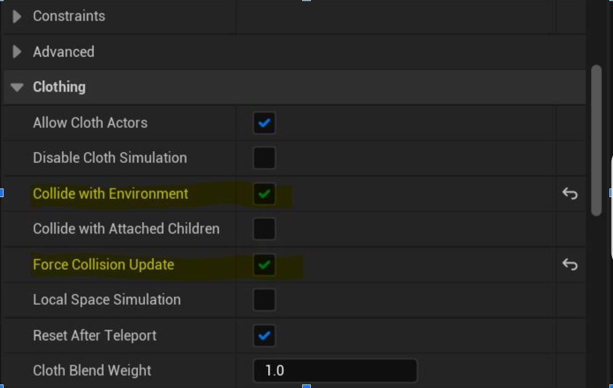
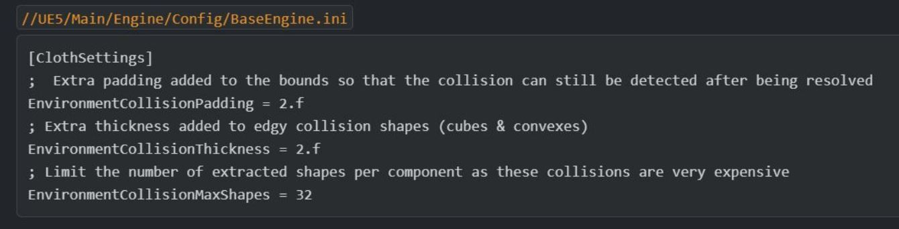
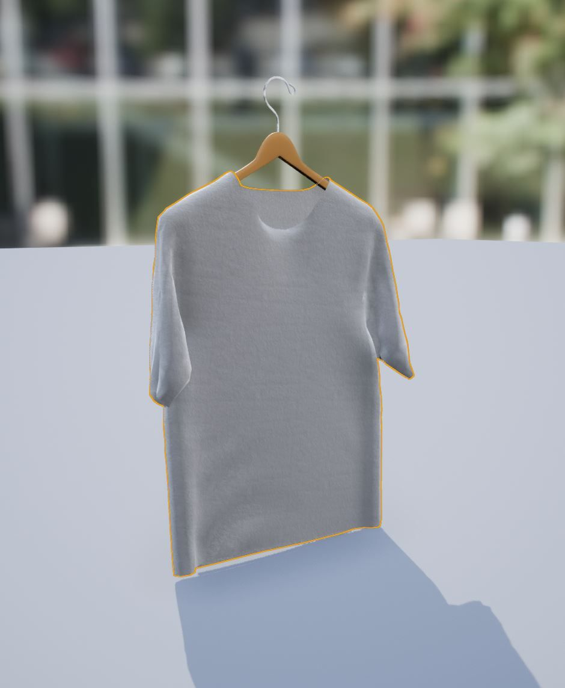
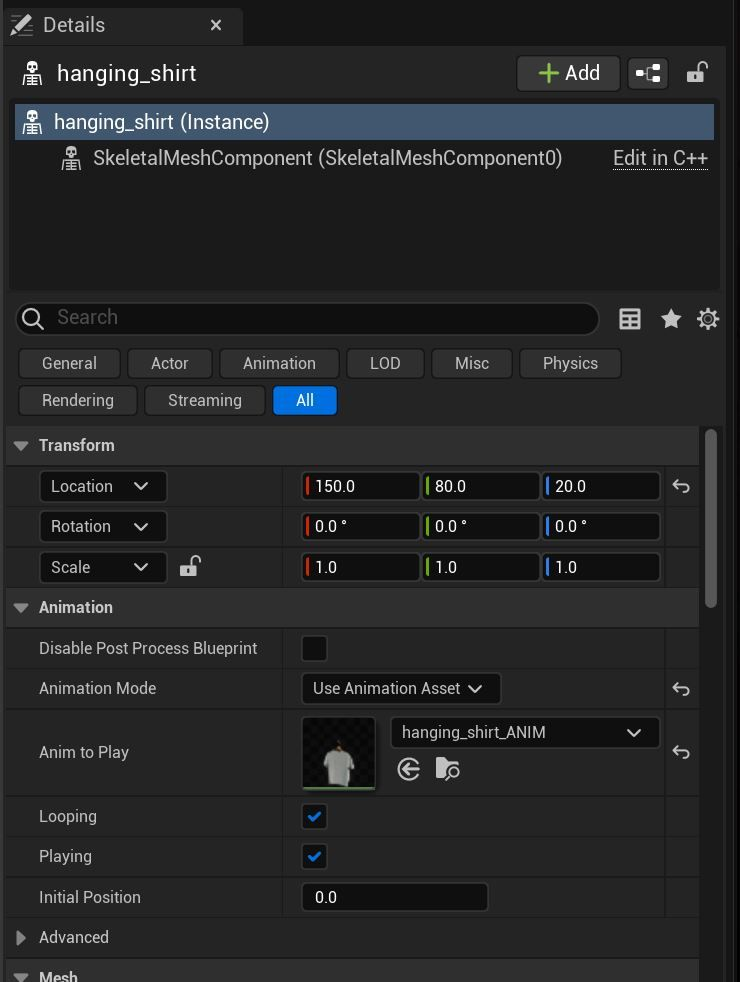
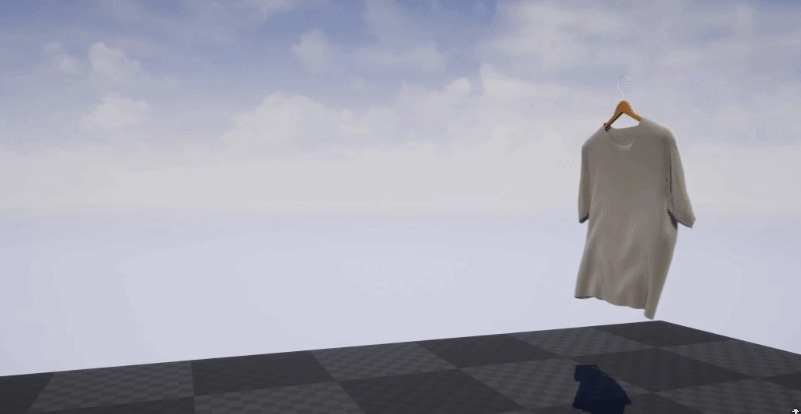
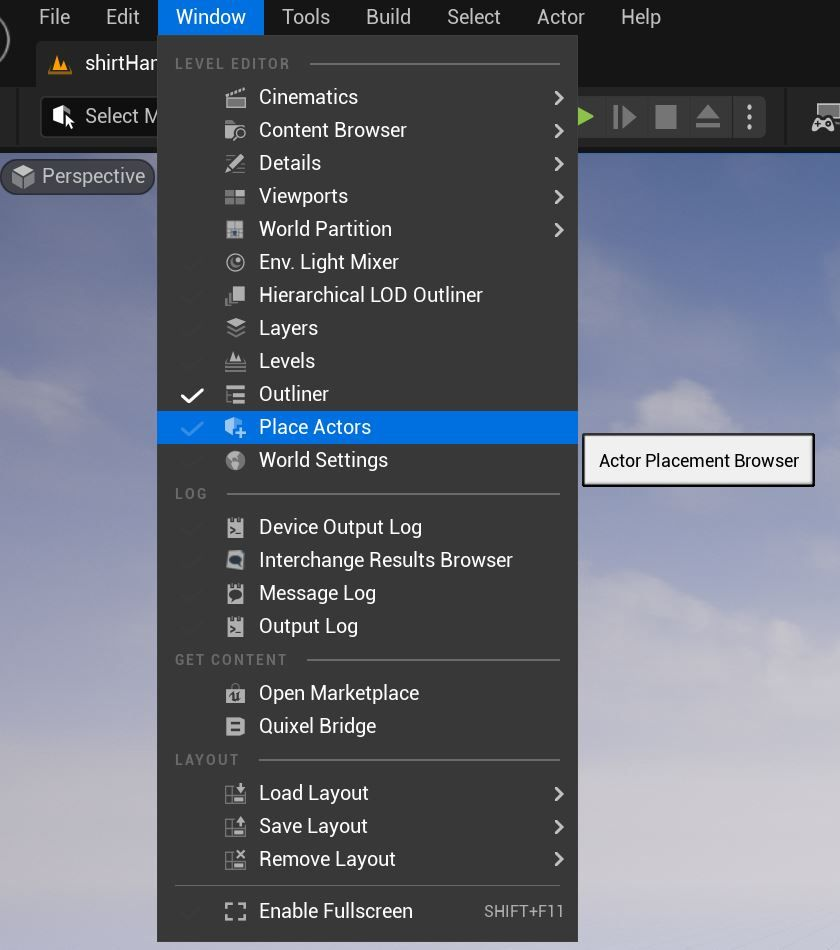
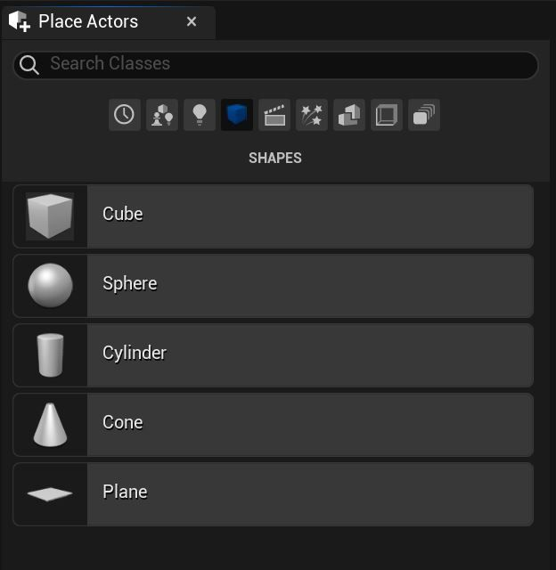
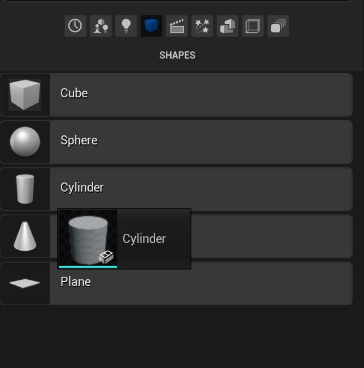
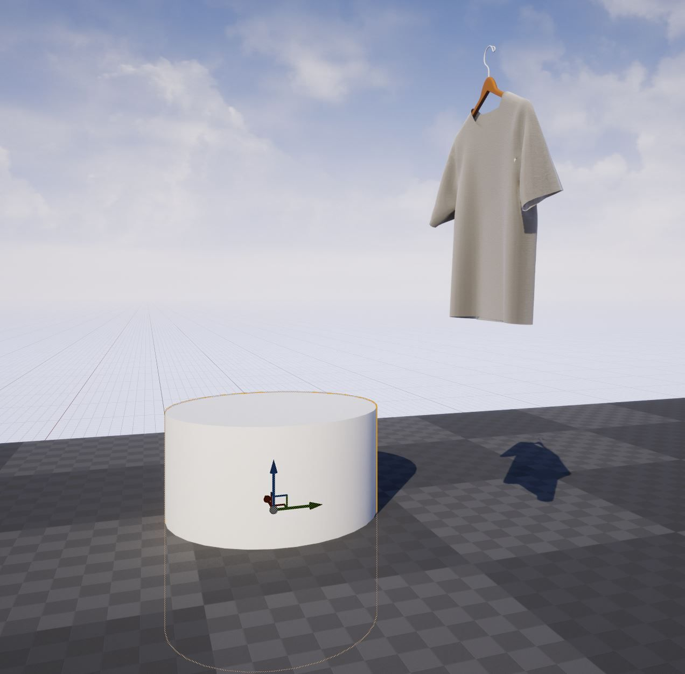
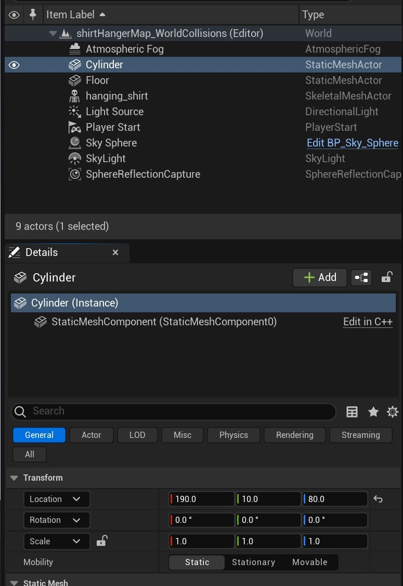

# 布料与世界的碰撞

## 来源与状态

- 原始 URL：https://dev.epicgames.com/community/learning/tutorials/p4a1/unreal-engine-cloth-collision-with-world

## 运行时分类

- 类型：图文教程
- 判断：API 未识别到核心视频信号，可整理正文约 1714 字符。

## 摘要

过去，布料模拟与世界物体的碰撞很难实现。我们尝试通过使布料模拟和世界网格碰撞更容易创建来解决 UE 5.0 的混沌布料中的这个问题。

## 中文整理

### 关键部件

首先，我们将向您展示布料和世界碰撞的关键组件，然后向您展示一个简短的示例。要让布料模拟网格物体与世界对象发生碰撞，请为编辑器中选中的 skeletalMesh 资源设置 **与环境碰撞** 和 **强制碰撞更新**。

仅供参考，默认情况下，盒子碰撞的额外边距设置为 2 厘米，最大碰撞次数设置为 32。这可以在 BaseEngine.ini 中进行编辑，但增加碰撞形状值可能会使计算成本非常昂贵。

### 衬衫示例

这是关于如何设置布料和世界碰撞的简短教程。使用混沌布料为您的骨骼网格体创建一个新关卡。在本例中，我们使用挂在衣架上的带有动画的衬衫。

将骨架网格物体从内容浏览器拖到关卡中，然后分配动画。

接下来，我们将使用 Place Actors 下拉菜单向关卡添加一个静态网格圆柱体。

选择“形状”图标以访问静态图元，然后选择“圆柱体”。

将圆柱体放置在关卡中，以便动画骨架网格物体更容易发生碰撞。

就位后，选择衬衫资源的骨骼组件并访问详细信息面板的物理服装部分。如本课开头所述，设置 **与环境碰撞** 和 **强制碰撞更新**。下图包含工具提示，其中包含有关需要注意的两个设置的详细信息。在编辑器中按“播放”，布料将与静态圆柱体网格物体发生碰撞。
