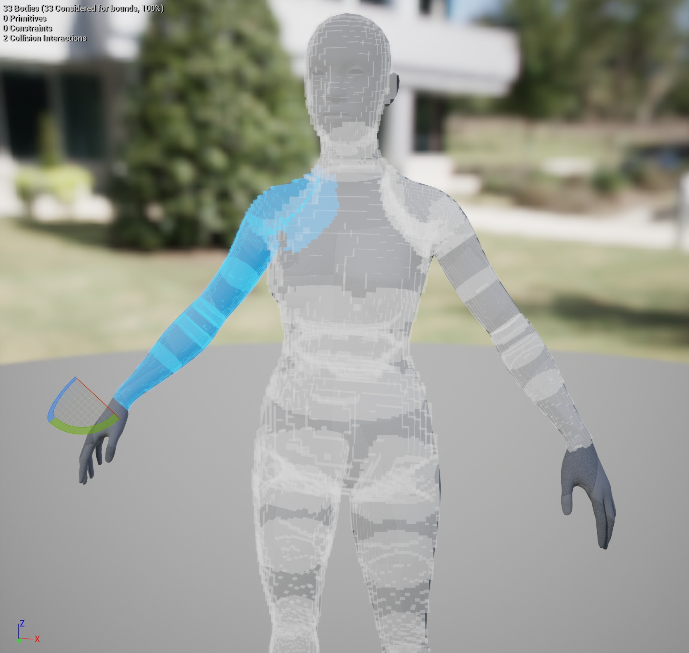
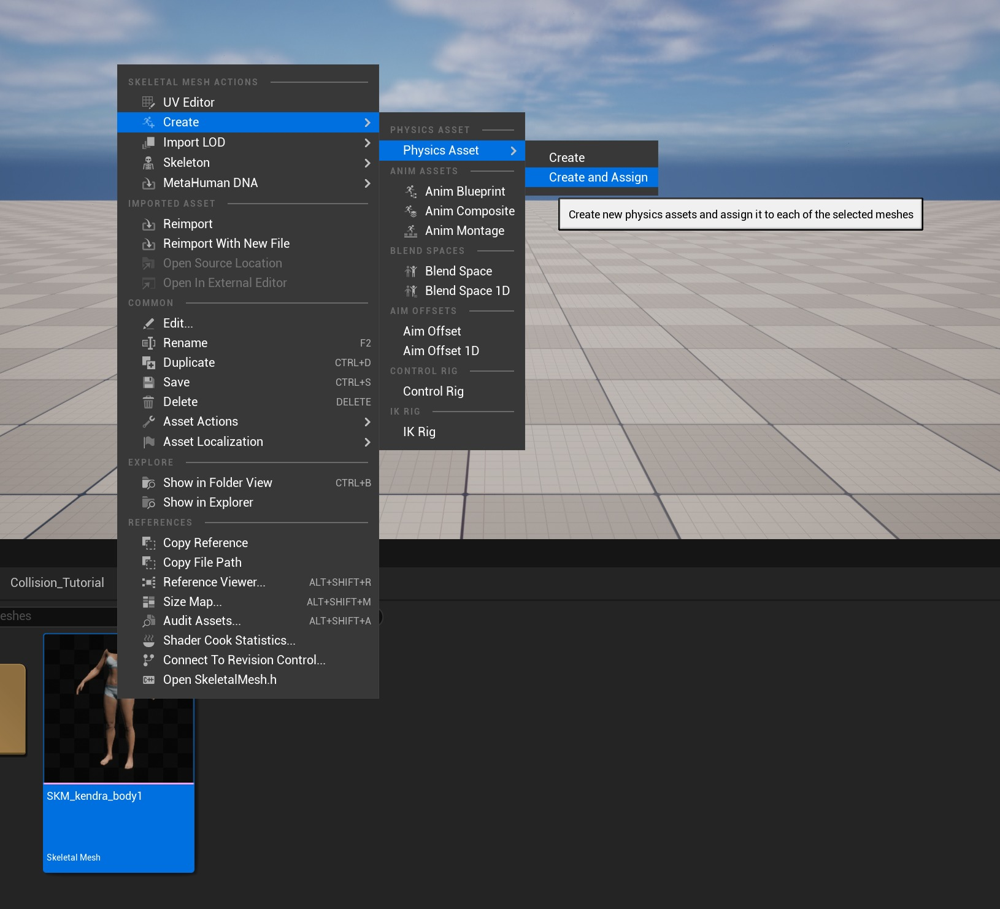
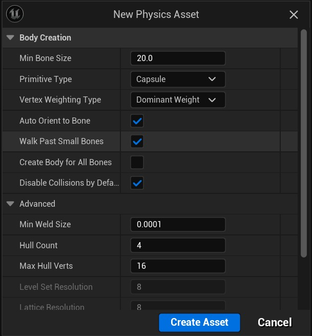
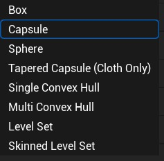
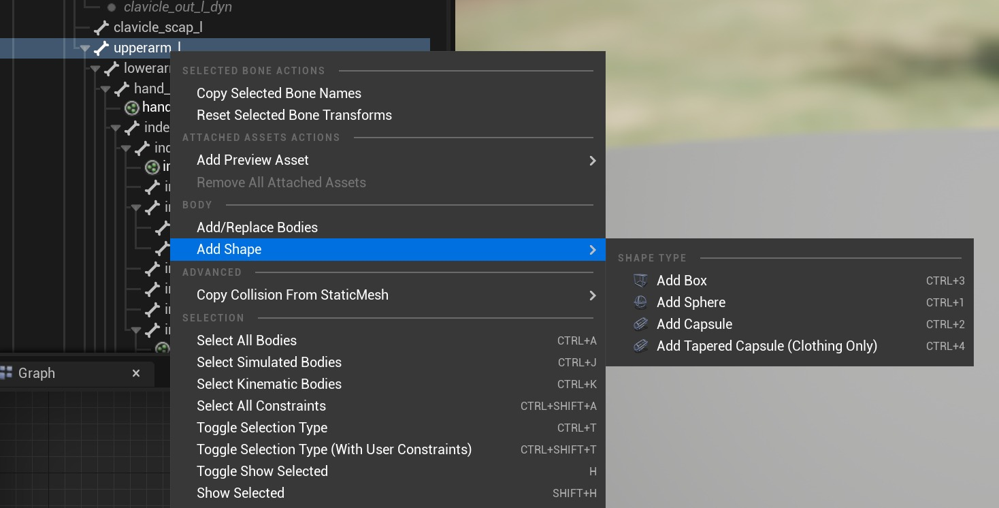
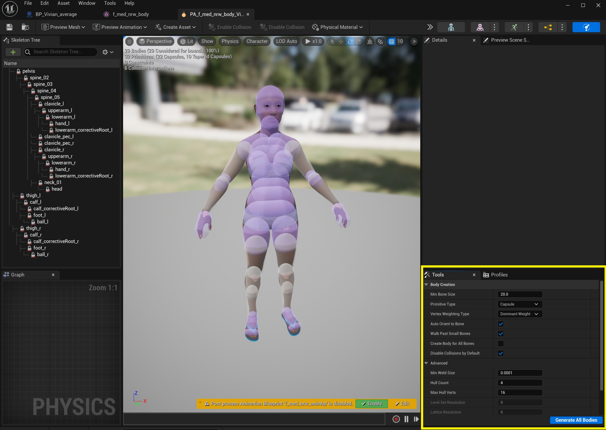
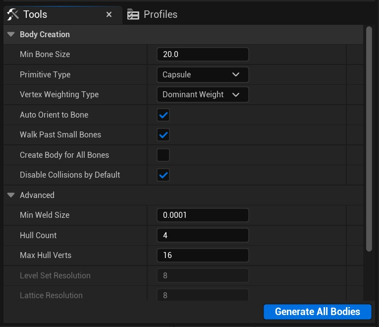
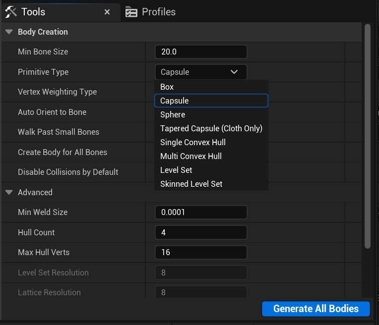
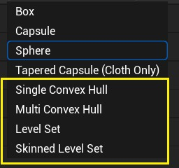
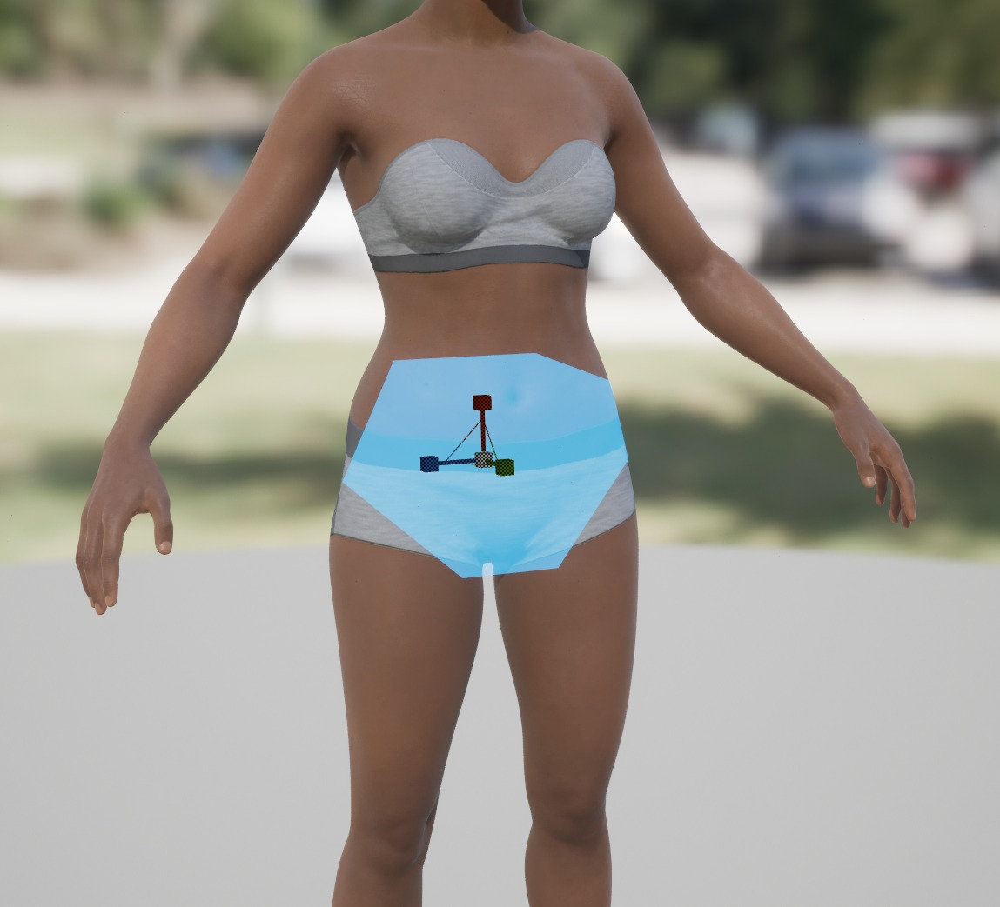

# 布料额外碰撞选项

## 来源与状态

- 原始 URL：https://dev.epicgames.com/community/learning/tutorials/pvax/unreal-engine-cloth-extra-collision-options

## 运行时分类

- 类型：图文教程
- 判断：API 未识别到核心视频信号，可整理正文约 7645 字符。

## 摘要

除了用于布料碰撞且已在虚幻引擎中存在相当长一段时间的标准胶囊、球体和锥形胶囊之外，还有一些您可能不知道的其他可用选项，它们可能会为您提供更具代表性的形状来碰撞布料。以下内容将帮助详细介绍一些新的且记录较少的碰撞选项。

## 中文整理

### 概览

### 布料额外碰撞选项

在混沌布料 5.0 发布之前，虚幻引擎中的默认碰撞对于可用于与布料碰撞的图元总数有严格的限制。现在混沌已经消除了限制，我们能够更容易地使用凸包（它已经在引擎中存在了一段时间）和水平集体积（LSV），也称为水平集，这是新的。

### 关于变形碰撞的注意事项

注意：目前只有一个变形碰撞选项可用 - ***蒙皮水平集*** - 它仍然是一个*实验性*系统。 （见下文）其他选项相当于**静态体**，可用于获得更接近的碰撞表示，但它们不会变形。 *一般来说，实时布料碰撞对性能的要求非常高，因此在将凸包和水平集添加到布料设置时请考虑到这一点。 * 有关如何在角色上使用和设置基本布料碰撞的更多信息，请参阅“**回声碰撞教程**”。 ***https://dev.epicgames.com/community/learning/tutorials/zw5q/unreal-engine-echo-collision-tutorial***

### 创建物理对象

正如“回声碰撞教程”中所演示的，有几种方法可以为骨架网格体生成原始碰撞几何体。

### 右键单击骨架网格体

用户可以通过右键单击SkeletalMesh来自动生成碰撞几何体...创建-物理资源-创建并分配

将打开“新物理资源”对话框。

通过选择“原始类型”，用户可以将选择更改为可用选项之一。

按“创建资源”可生成物理资源，并根据您的设置生成碰撞。您也可以使用此方法生成凸面和 LSV 碰撞，但您可能希望首先生成简单碰撞，然后在物理编辑器中编辑/重新生成，或者绕过此步骤并直接在物理编辑器中生成凸面和水平集碰撞。这取决于用户。

### 手动添加碰撞体

更费力，但更容易指定要为其创建碰撞的确切骨骼，方法是通过右键单击大纲视图中的骨骼来手动添加碰撞体

您会注意到，没有使用此菜单创建凸集或水平集的选项。但是您可以在以下步骤中将原始形状类型重新生成为凸集和水平集。

### 物理编辑

在物理编辑器中，注意编辑器右下角的“工具”窗口。这是用于生成和重新生成凸面和水平集 (LSV) 碰撞几何​​体的主界面。

当在大纲视图中选择骨骼或碰撞时，您可以选择“重新生成实体”。如果您没有选择任何内容，该选项将更改为“生成所有实体”。如果仅选择骨骼，您将可以选择“添加实体”。

### 原始类型

通过选择“Primitive Type”下拉菜单（类似于SkeletalMesh物理资源自动生成方法），您可以选择各种类型的碰撞基元

我们不会专注于前四个选项（盒子、胶囊、球体和锥形胶囊），因为本文档的重点是凸包和水平集。

### 单凸包

单个凸包是根据*高级 – 最大外壳顶点*设置生成的，下图是骨盆的单个凸包，分配了“**主导权重**”顶点权重类型。请参阅下文了解顶点权重类型。

### 多凸包

多个凸包是根据“高级 - 外壳计数”生成的，分辨率基于“高级 - 最大外壳顶点”设置。在此示例图像中，骨盆骨骼碰撞是使用以下设置生成的： 请注意，有 4 个形状（外壳计数）组成骨盆多凸包。

### 水平集

LevelSet - 使用刚性碰撞体生成水平集时，请确保“水平集分辨率”中有足够高的值。尝试使用 64 这样的值并从那里进行实验。这是重新生成为水平集的骨盆囊图像，水平集分辨率为 64。

### 蒙皮水平集 - 实验

蒙皮水平集 - 使用所有选定体积的组合 + 添加蒙皮加权的变形晶格。与基本水平集一样，水平集分辨率应设置为较高的值，例如 64。晶格分辨率的值也应增加，例如 24。如果选择了多个基本体碰撞，蒙皮水平集会将所有碰撞合并为一个形状。蒙皮级别设置限制：

### 水平集限制

***两种类型的水平集碰撞都对性能要求很高 - 尚未优化！***

### 撤消和删除

撤消或删除现有水平集的最简单方法是将其重新生成为胶囊或其他基元 - 创建水平集期间没有历史记录，因此需要将其分解回原始或更简化的组件。然后您可以重新生成新的关卡集。这也适用于删除其他碰撞对象。如果您发现无法删除更复杂的主体，请重新生成为更简化的“原始类型”。然后删除。使用“级别集”，在大纲视图中选择相应 LSV 的父骨骼，然后单击“添加主体”并使用简化的基元类型来替换它。然后您可以更轻松地删除基元。

### 顶点权重类型

任何权重 == 线性混合蒙皮主导权重 == 刚性绑定蒙皮 对于*蒙皮水平集*，它将始终使用主导权重来确定在构建水平集时要包括网格上的哪些顶点。相反，“顶点权重类型”选项用于确定如何将权重转移到晶格。顶点权重的一个示例是当我们将胶囊转换为单个凸包时：***主导权重***在生成凸面碰撞时仅考虑最主要的蒙皮权重。 ***任何重量*** 考虑所有周围皮肤的影响。

### 调试可视化

在视口中下拉“角色 - 身体 - 身体绘图（编辑）”菜单以可视化水平集几何体（如果使用蒙皮水平集，则为晶格）。 **实体** == 可视化 LevelSet 几何形状 **线框** == 可视化晶格。请注意，这会减慢您的显示速度。这个特定的晶格分辨率值为 8。您需要更高的值以获得更好的皮肤分辨率。

### 额外的身体创建选项

**Min Bone Size** - 短于该值的骨骼将在创建主体时被忽略 **Auto Orient to Bone** - 是否将主体自动定向到骨骼轴 **Create Body for All Bones** - 强制为每个骨骼创建主体 **Disable Collisions by Default** - 是否默认禁用与其他主体的碰撞

### 高级设置

**最小焊接尺寸** - 小于此值的骨骼将合并在一起以创建主体 **外壳计数** - 对于多个凸外壳，这是创建的凸项目的最大数量 **最大外壳顶点** - 对于凸外壳，这是要创建的最大顶点数量 **水平集分辨率** - 创建水平集时，这是要使用的网格分辨率 **晶格分辨率** - 创建蒙皮水平集时，这是嵌入网格使用的分辨率 - [回声碰撞教程](https://dev.epicgames.com/community/learning/tutorials/zw5q/unreal-engine-echo-collision-tutorial)

## 相关链接

- [Echo Collision Tutorial](https://dev.epicgames.com/community/learning/tutorials/zw5q/unreal-engine-echo-collision-tutorial)
