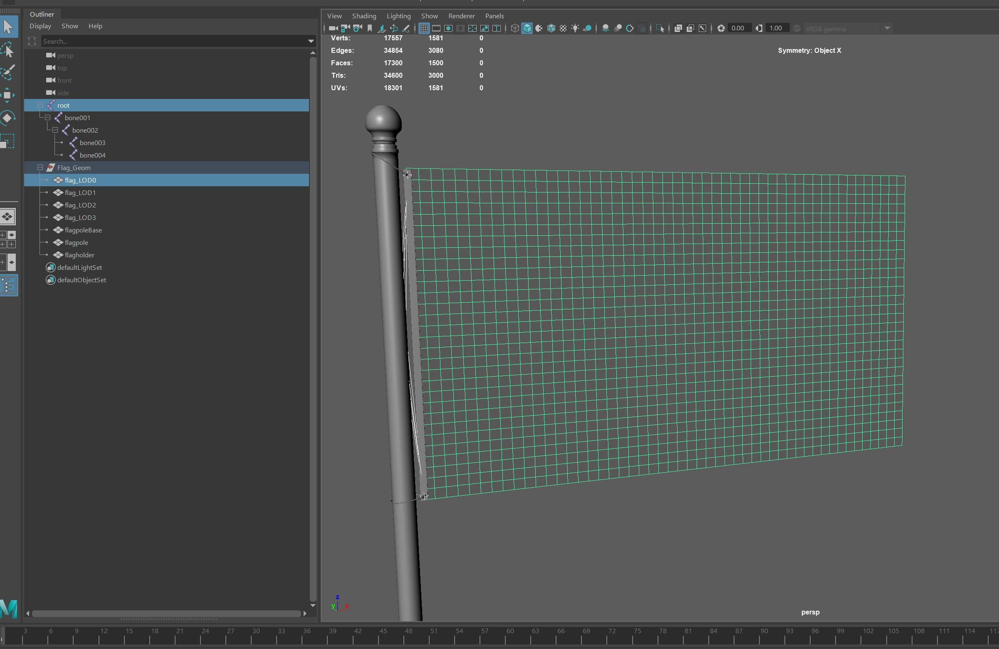
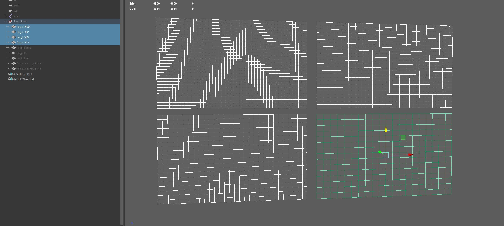
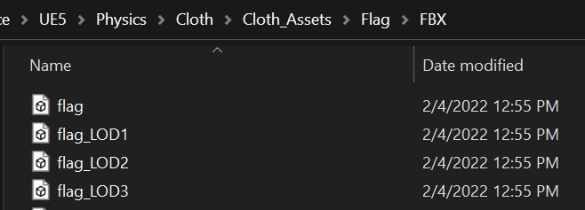
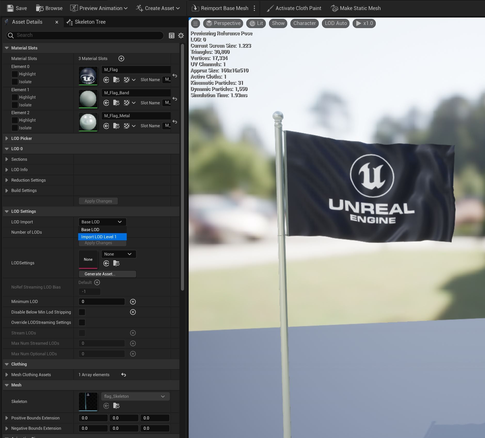
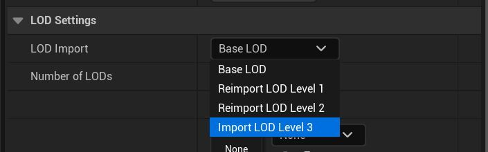
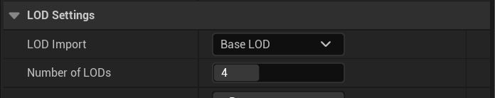
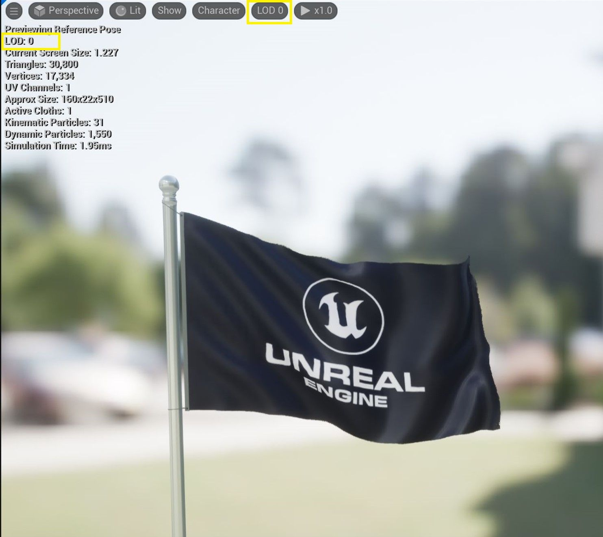
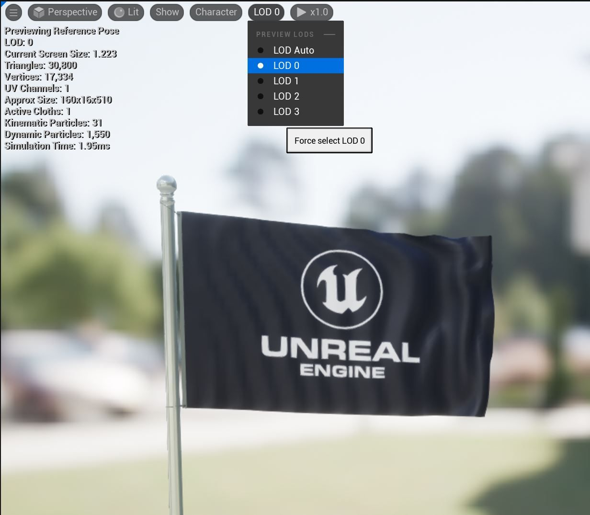
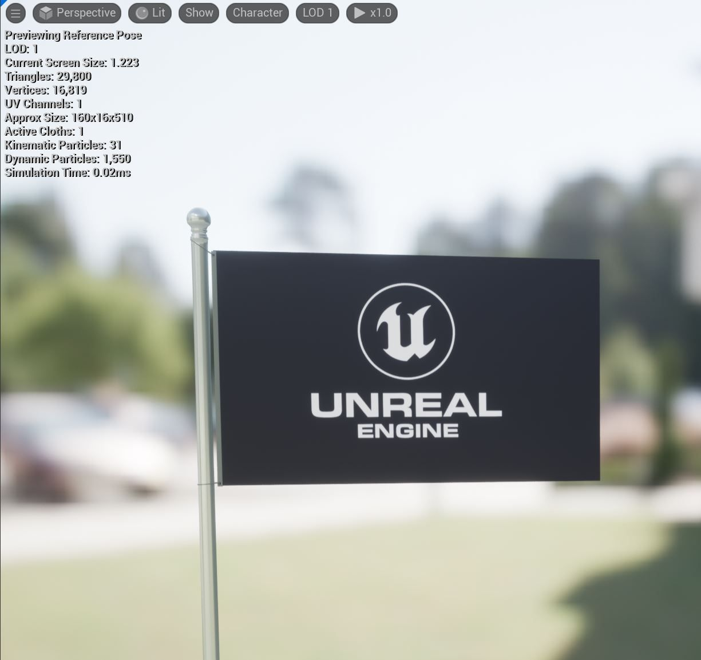

# 布料 LOD 教程

## 来源与状态

- 原始 URL：https://dev.epicgames.com/community/learning/tutorials/VLb5/unreal-engine-cloth-lod-tutorial

## 运行时分类

- 类型：图文教程
- 判断：API 未识别到核心视频信号，可整理正文约 5426 字符。

## 摘要

在此示例中，我们将演示一种使用我们在上一教程中创建的 Flag 资源 SkeletalMesh 创建简单 LOD 的方法。

## 中文整理

### 概览

我们混沌布旗教程的原始网格大约有 1581 个顶点。这是我们的 LOD0 版本。在此示例中，我们将创建另外三个 LOD (LOD1-3)，以演示如何在创建布料模拟 LOD 时分配它们。

我们的第一步是生成用于相应 LOD 的较低分辨率网格。本教程不是关于可以用来生成这些变化的各种重新网格化技术，我们只是假设您可以访问现有的 LOD 或了解该过程。我们的旗帜在 Maya 中被分为 4 个 LOD，如下所示： LOD0 = 1581 垂直 LOD1 = 1066 垂直 LOD2 = 651 垂直 LOD3 = 336 垂直

网格的排列是为了可见性，但实际上将全部与在 LOD 之间传输的蒙皮权重对齐。我们将把每个关节层次结构和 LOD 网格保存为单独的 .fbx 文件。 （本例中的原始标志 .fbx 假定为 LOD0）

### 关于代理工作流程的注意事项

在这种情况下，可渲染网格和模拟网格是相同的网格。但是，您也可以通过代理工作流程应用此 LOD 流程。在这种情况下，请创建 LOD0-3 .fbx 文件，其中包含一个可渲染标志和每个相应 LOD 的代理模拟网格。在这种情况下，为模拟网格分配一个不同的着色器。

### 假设

由于标志文件 skeletalMesh (LOD0) 已创建（请参阅标志教程），因此我们假设它已经存在，并且我们将向现有 SkeletalMesh 资源添加 LOD 1-3。

### 导入细节层次1

在 UE5 中，在标志的骨架网格体编辑器中，向下滚动到资产详细信息面板中的 LOD 设置。在“资源详细信息”窗口的“**LOD 0 设置**”部分中，单击“**LOD 数量**”旁边的“**基本 LOD**”，打开下拉菜单，然后单击“**导入 LOD 级别 1”。**您应该打开一个文件导入对话框。将其指向 LOD1 .fbx 并按 Enter 键。

几秒钟后，您应该会在编辑器的右下角看到一个对话框，说明 **LOD 1 的网格已成功导入！** 对 LOD 1 重复上一步，并对 LOD 2-3 执行相同的操作，LOD 2-3 将在之前的每个 LOD 导入中可用。这是导入 LOD3 之前的对话框。

导入 LODs1-3 后，您应该看到 LOD 的数量等于值 4。

您可以使用 SkeletalMesh 编辑器中的 LOD 下拉菜单来可视化所选的 LOD。

您可以使用 LOD 下拉菜单手动切换以查看不同的 LOD。

您会注意到，即使 LOD 1-3 已加载，它们也没有任何模拟，因为我们只导入了它们。我们现在需要分配布料，我们将在接下来的步骤中执行此操作。

### 指定布料 LOD

首先，确保使用下拉菜单或资产详细信息面板 LOD 设置为 LOD 1 选择了正确的 LOD，然后右键单击标志网格并从剖面创建服装 LOD。根据旗帜教程，我们创建了名为 Flag_Cloth_0 的原始布料数据。这是我们要传输到 LOD 1-3 的模拟 LOD0 网格。选择目标资源，它是我们在标志教程中创建的原始 LOD0 标志模拟网格。添加LOD1。对于 LOD 索引，选择下拉菜单并选择添加 LOD1。请注意“从网格中删除”选项。仅在使用模拟代理工作流程时才需要打开它。 （请参阅 Echo Chaos Cloth Cape 教程）通过使用 SkeletalMesh Viewport 窗口中的下拉菜单选择 LOD2 重复此操作。继续使用 Flag_Cloth_0 布料数据作为目标资源，然后为 LOD 索引选择 **添加 LOD 2**。对 LOD3 执行相同操作。我们还没有完全完成，我们现在已经创建了服装 LOD1-3 定义并从 LOD0 转移了设置，但我们仍然需要将布料数据应用到 LOD 1-3 作为最后一步。

### 将服装应用到 LOD

选择每个 LOD，通过视口菜单再次切换），然后再次右键单击每个 LOD，然后将服装数据应用到每个相应的 LOD。您现在会注意到，每个 LOD 都通过从 LOD0 传输原始设置来创建模拟。

### 屏幕尺寸

使用 LOD 下拉菜单切换到各种 LOD，将其设置回 **自动**。通过自动设置，您可以调整 LOD 信息菜单，更改屏幕尺寸以满足您的特定项目需求。使用鼠标放大和缩小骨架网格体编辑器视口。当视口设置为“自动”时，您将看到 LOD HUD 值根据当前屏幕尺寸进行更新。根据绘制蒙版的复杂性（在本例中为“最大距离”，因为这是为此示例绘制的唯一蒙版）以及模拟网格物体的分辨率，您可能需要调整各个 LOD 的单个“最大距离”（或您可能创建的任何其他蒙版），在“服装编辑器”中选择单个 LOD 布料设置。菜单最右侧有一个下拉菜单，您可以访问各种 LOD 及其各自的蒙版和布料配置。要可视化最终的 LOD，请将视口菜单从“光照”设置为“线框”。您还可以使用“角色 - 服装”下拉菜单更轻松地可视化线框。作为最后检查，请确保布料模拟设置按照您喜欢的方式设置。还要在 LOD 之间仔细检查您的蒙版。它们被复制，颜料被稀疏地转移。如果您的网格分辨率非常低，您可能需要进去清理您的蒙版。
