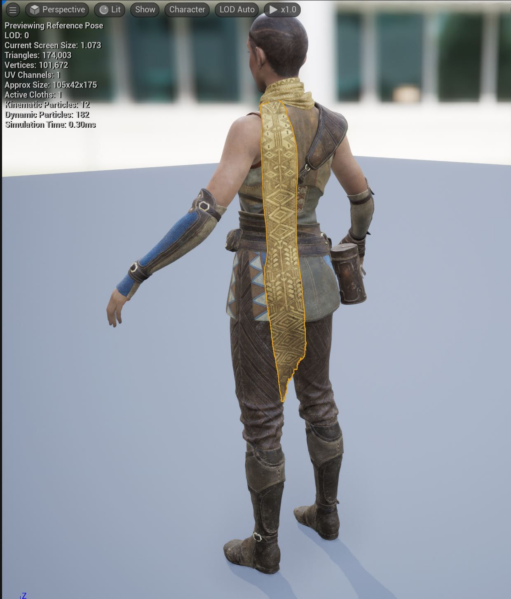
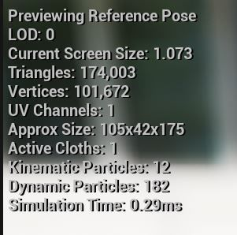
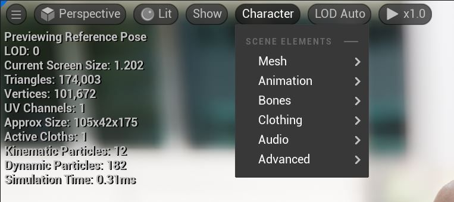
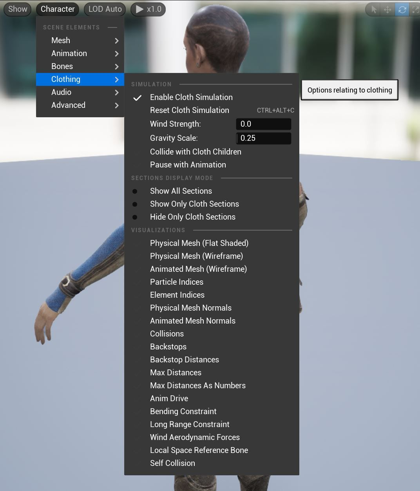
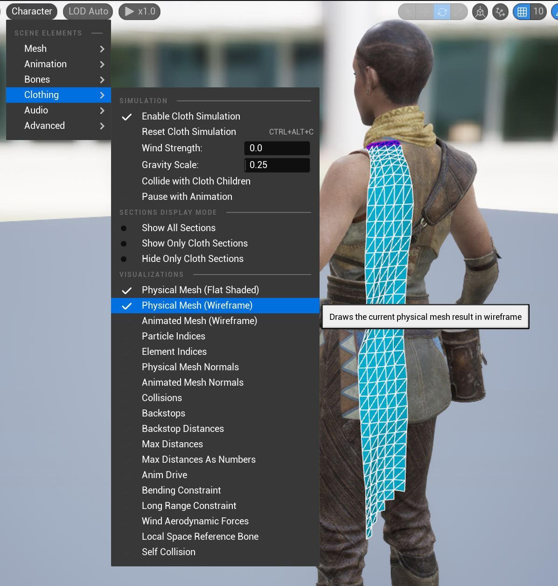
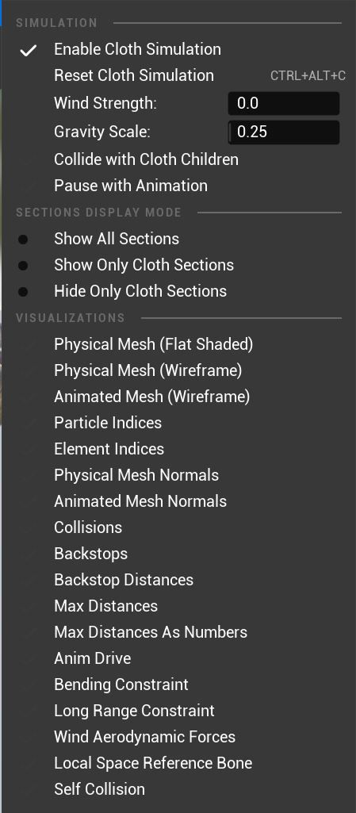
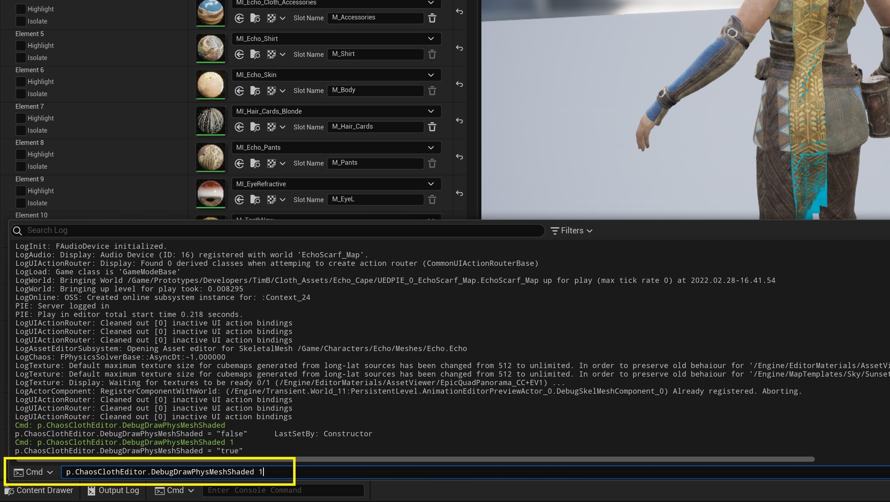
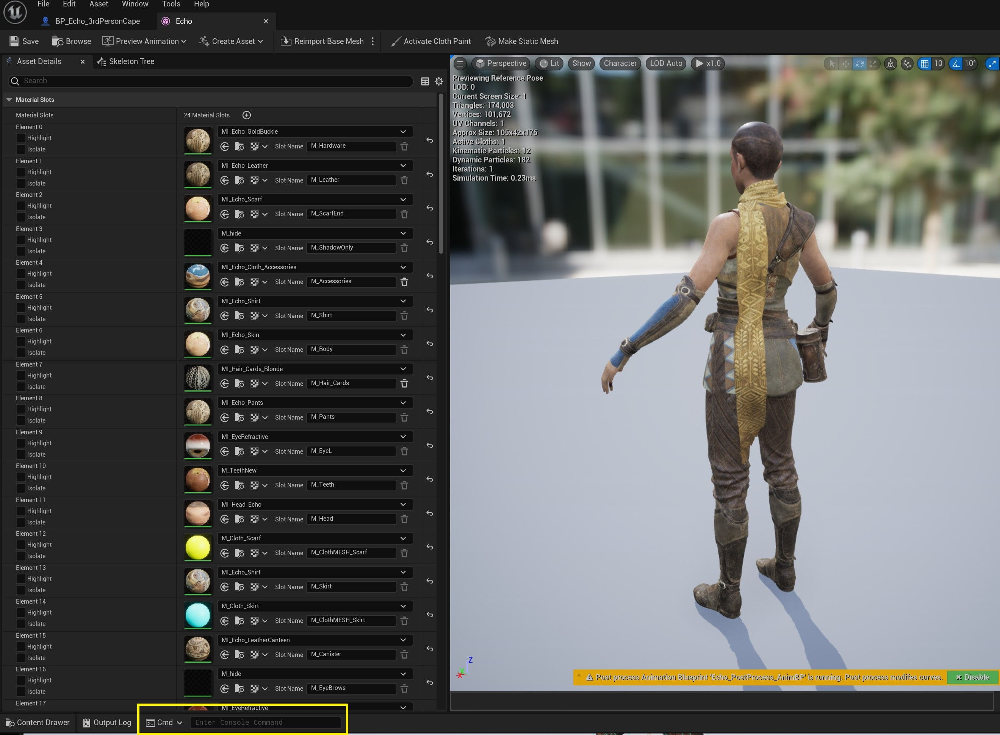
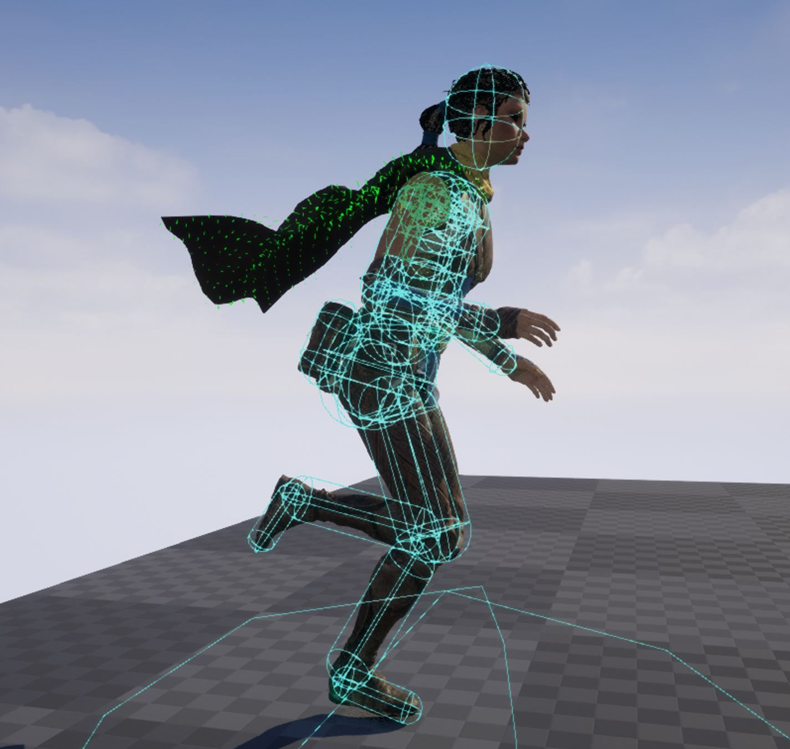
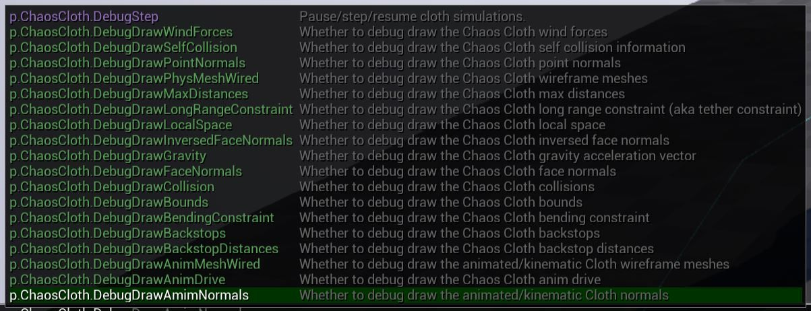

# 布料故障排除和调试技巧

## 来源与状态

- 原始 URL：https://dev.epicgames.com/community/learning/tutorials/eDwk/unreal-engine-cloth-troubleshooting-and-debugging-tips

## 运行时分类

- 类型：图文教程
- 判断：API 未识别到核心视频信号，可整理正文约 4848 字符。

## 摘要

本节将详细介绍 SkeletalMesh 编辑器中平视显示器的一些改进、一些性能命令，以及为 SkelMesh 编辑器和 Chaos Cloth 的游戏编辑器创建的控制台变量。

## 中文整理

### 平视显示器信息

使用内容示例中的 Echo 角色，在 skeletalMesh 视口中选择围巾布料资源。

平视显示器 (HUD) 中添加了新功能，为用户提供有关布料模拟的更多信息。

### MaxDeltaTimeTeleportMultiplier 警告

有时，您可能会在 HUD 中看到此警告弹出。视口中的布料可能看起来像是在“整体”移动（在裙子的情况下，整个布料会像骨盆一样移动）。其原因是布料处于恒定的传送模式，消除了所有脉冲，使其看起来像是所有发生在本地空间中，**它是由低帧率触发的**。要修复此问题，请在控制台中尝试： p.Cloth.MaxDeltaTimeTeleportMultiplier 较高的值非常昂贵，请确保布料在允许的帧中运行，除非在 Sequencer 中进行渲染。

### 角色下拉菜单

混沌布料用户应该熟悉的主菜单之一是视口中的角色下拉菜单。选择服装以查看各种可用的可视化信息。

用户需要确保检查物理网格和动画网格可视化，因为它们可以更好地洞察其布料可能发生的任何问题。

添加了许多新的可视化效果。

### SkelMesh 编辑器 CVAR 命令

还添加了新的 SkelMeshEditor DebugDraw 命令。要激活，请在命令后添加 1。要停用，请改为输入零。例如： 要激活调试绘制碰撞： **p.ChaosClothEditor.DebugDrawCollision 1** 要停用调试绘制碰撞： **p.ChaosClothEditor.DebugDrawCollision 0** **p.ChaosClothEditor.DebugDrawPhysMeshShaded ** **p.ChaosClothEditor.DebugDrawPhysMeshWired ** **p.ChaosClothEditor.DebugDrawAnimMeshWired ** **p.ChaosClothEditor.DebugDrawParticleIndices ** **p.ChaosClothEditor.DebugDrawElementIndices ** **p.ChaosClothEditor.DebugDrawPointNormals ** **p.ChaosClothEditor.DebugDrawInversedPointNormals** **p.ChaosClothEditor.DebugDrawCollision ** **p.ChaosClothEditor.DebugDrawBackstops ** **p.ChaosClothEditor.DebugDrawBackstopDistances ** **p.ChaosClothEditor.DebugDrawMaxDistances ** **p.ChaosClothEditor.DebugDrawMaxDistanceValues ** **p.ChaosClothEditor.DebugDrawAnimDrive ** **p.ChaosClothEditor.DebugDrawBendingConstraint ** **p.ChaosClothEditor.DebugDrawLongRangeConstraint ** **p.ChaosClothEditor.DebugDrawWindForces ** **p.ChaosClothEditor.DebugDrawLocalSpace ** **p.ChaosClothEditor.DebugDrawSelfCollision** 在 SkelMesh 编辑器中时，使用键盘上的 ~（波形符）键激活命令终端...

或者，编辑器的最底部是一个“输入控制台命令”窗口。确保您处于“Cmd”模式。

然后开始输入 p.ChaosClothEditor.DebugDraw… 命令并输入值 1 或 0 来激活/停用。

### 编辑器 CVAR 命令

### 调试绘图命令

**p.ClothPhysics.WaitForParallelClothTask** **1** 需要使用布料的混沌调试绘制命令来清理线条显示，这是由于优化使得在调试绘制渲染时发生服装模拟。例如，要绘制布料网格的线框，您至少需要以下 3 个命令： **p.ClothPhysics.WaitForParallelClothTask 1** **p.ChaosCloth.DebugDrawPhysMeshWired 1** **p.Chaos.DebugDraw.Enabled 1** 最后一个命令是实际启用绘图的命令。您还可以添加这些可选命令，以便更好地查看线条，尤其是在可视化网格和碰撞体积时。 **ShowFlag.TemporalAA 0** **ShowFlag.MotionBlur 0** 可以通过键入 **p.ChaosCloth.DebugDraw** 查看各种调试绘制命令

### 统计混沌布

“**Stat ChaosClot**h”命令显示有关 Chaos Cloth sim 性能的重要信息。您还可以使用**统计物理**来显示布料总数（并且应该发现它与统计混沌布料下显示的混沌布料模拟相同）。在编辑器中播放或模拟时，请使用键盘上的 ~（波形符）键激活命令终端。然后开始打字。或者您可以在底部输入类似于 skeletalMesh Editor 的命令输入。

### 布料_启用_禁用

在编辑器中停用所有布料物理。 ** p.ClothPhysics 0** 这是一种停用布料的强力方法，并将布料保留在**最后的模拟状态**。

### 定制布料活动

也可以使用蓝图中的自定义事件。在下图中，使用布料混合权重节点启用和禁用布料，以使布料在暂停之前和恢复之后恢复到其动画/皮肤加权位置。要通过命令行使用该事件，请在命令行中键入：ke * <自定义事件名称>
