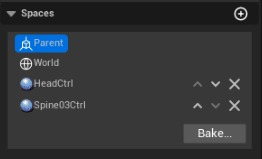
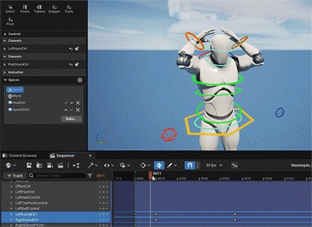

# 控制装置动态层次结构

## 来源与状态

- 原始 URL：https://dev.epicgames.com/community/learning/knowledge-base/JmXa/unreal-engine-control-rig-dynamic-hierarchy

## 运行时分类

- 类型：图文教程
- 判断：API 未识别到核心视频信号，可整理正文约 5745 字符。

## 摘要

概述 在本文中，我们将讨论虚幻 5.0 中控制装备层次结构的更改。我们正在提出一种新颖的方法来通过消除其他层次结构中出现的某些限制来操纵静态层次结构......

## 中文整理

### 概述

在本文中，我们将讨论虚幻 5.0 中控制装备层次结构的更改。我们提出了一种新颖的方法来操作静态层次结构，消除了其他层次结构实现中的某些限制。我们将讨论动态层次结构之前的限制、我们的实现和用例。角色装备师、动画师和程序员会对本文感兴趣，了解有关虚幻 5.0 中的控制装备和运行时动画。

### 当前系统存在哪些问题？

广泛使用的 DCC（数字内容创建工具）对角色装备做出了一系列假设：这些假设/技术限制推动了角色装备的设计，一直到电影和游戏工作室的动画流程。这导致： 基于依赖图的架构对于角色绑定和动画有一系列缺点：多年来，许多专有解决方案通过展示新颖方法的惯例和演示而浮出水面。例如，Raf Anzovin 提出的临时索具方法提出了一种不同的方法 - 并且可以提供思考的空间。拉夫·安佐文. 2019。通过“短暂”绑定实现快速、无插值的角色动画。在 ACM SIGGRAPH 2019 会谈 (SIGGRAPH '19) 中。计算机协会，美国纽约州纽约市，第 54 条，1-2。 DOI：[https://doi.org/10.1145/3306307.3328165](https://doi.org/10.1145/3306307.3328165)

### 虚幻引擎 5.0 中的装备层次结构

### 假设

在查看需求/要求之前，让我们通过定义一系列假设来深入探讨：

### 要求/动机

### 设计

为了满足上述假设和要求，我们设计了控制装置内部的动态层次结构，以结合灵活性和性能。动态层次结构将是我们之前在顶层的实现所熟悉的，使其成为用户选择加入的功能，并且在撰写本文时向后和向前兼容。以前的实现（截至 4.26 / 4.27）使用简单的平面数据容器，该容器仅关注性能和数据紧凑性，但没有提供所需的灵活性。

### 基础设施分离

在 5.0 中，我们将层次结构基础设施分为两层：URigHierarchy（数据模型）和 URigHierarchyController（变异层）。层次结构以及控制器支持通知方案，将其连接到 UI 或其他服务以传播更改。总之我们引入了软MVVM设计分离。然而，层次结构本身可以执行与动画相关的任何更改，而无需控制器 - 而拓扑更改则需要控制器。拓扑更改描述了导致内存布局更改的编辑。例如，当您设置元素的变换时，您只需要访问 URigHierarchy::SetTransform，但是当向元素添加父元素时，您需要访问 URigHierarchyController::AddParent。

### 表现

我们已经发现，存在仅在本地空间中访问层次结构（例如，与动画蓝图集成时）以及仅在全局空间中访问层次结构的边缘情况。此外，常规情况是访问本地空间和全局空间中的一些变换。为了支持这一点，我们实现了一种惰性评估方案，其中可以从全局计算局部值，反之亦然 - 同时缓存中间结果。为了控制缓存有效性的复杂性，我们还引入了缓存有效性检查机制，可以通过 C++ 定义启用该机制。为了识别拓扑变化，有一个通过委托的通知方案以及拓扑版本 - 您可以使用它来识别元素是否已添加/删除，或者自您上次访问层次结构以来关系是否已更改。

### 可选的多重育儿

层次结构可以存储元素列表，其中每个元素可以与一个或多个附加元素具有关系。从 5.0 开始，唯一存在的关系是父子关系。某些元素只能有一个父元素 (FRigSingleParentElement)，而其他元素则可以有多个 (FRigMultiParentElement)。我们特意选择提供多父子功能作为一个选项 - 以便大多数层次结构都可以从性能稍好的单父元素中受益。

### 空间切换

随着时间的推移，一个元素与更多的父母相关 - 每个关系的权重都可以调整/动画化。通过将所有权重从一个父元素移动到另一个元素，元素可以切换其空间，因为局部变换现在在另一个父元素中表达。将此与惰性求值方案相结合，可以轻松补偿全局变换 - 这样元素就不会在世界空间中移动或“弹出”。您可以将本地转换标记为脏（要重新计算）并相应地更改父关系。经典 DCC 和我们的实现之间的最大区别之一是父关系可以完全是暂时的，这意味着它们可以再次存在并在一段时间后完全消失。这允许在动画创作过程中灵活选择空间和关系，而不必担心循环。在 5.0 Sequencer 中，利用这些功能来提供面向用户的空间切换功能集。

指定给定控件的空间。

当时间线被擦洗时，手控器会改变空间。

### 好处

### 缺点/缺点

### 未来构想
