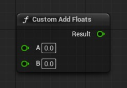
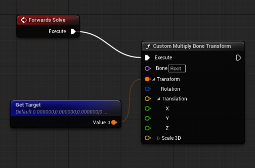
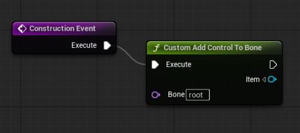
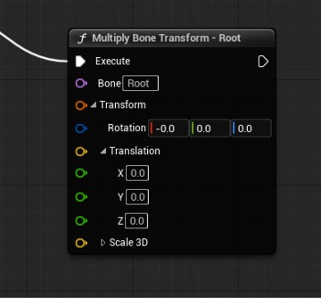
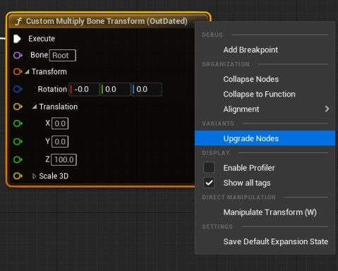

# 为 Control Rig 创建自定义节点

## 来源与状态

- 原始 URL：https://dev.epicgames.com/community/learning/knowledge-base/m3W7/unreal-engine-creating-custom-nodes-for-control-rig

## 运行时分类

- 类型：图文教程
- 判断：API 未识别到核心视频信号，可整理正文约 6719 字符。

## 摘要

曾经想为 Control Rig 编写自己的节点吗？本文介绍了可帮助您入门的基础知识。

## 中文整理

### 为 Control Rig 创建自定义节点

曾经想为 Control Rig 编写自己的节点吗？本文介绍了可帮助您入门的基础知识。本文是针对 UE 5.5 版本编写的。未来版本中使用的 API 可能会有所不同。

### 依赖关系

在编写自定义控制装备节点（也称为装备单元）之前，您必须向项目或插件添加一些依赖项。在您要添加代码的模块中，请确保将 RigVM 和 ControlRig 模块作为公共或私有依赖项添加到您的 build.cs 文件中。它应该看起来像这样：

```cpp
		PublicDependencyModuleNames.AddRange(new string[] 
		{ 
			"Core", 
			"CoreUObject", 
			"Engine", 
			"RigVM",
			"ControlRig"
		});
```

### 钻机单位

控制装备图中的每个节点/装备单元均派生自基础装备单元类：FRigUnit。以下是自定义装备单元的简单示例，它添加两个浮点输入并输出结果。

```cpp
USTRUCT(meta = (DisplayName = "Custom Add Floats", Category = "Custom"))
struct FRigUnit_AddFloats : public FRigUnit
{
    GENERATED_BODY()

    FRigUnit_AddFloats()
     : A(0.0f), B(0.0f), Result(0.0f) {}

    RIGVM_METHOD()
    virtual void Execute() override;
```

请注意 Execute 方法如何使用 RIGVM_METHOD 宏。在 cpp 中，所需要做的就是以 <RigUnitClassName>_Execute() 格式定义 Execute 方法。反射系统将完成剩下的工作。

```cpp
FRigUnit_AddFloats_Execute()
{
	Result = A + B;
}
```

这将生成一个没有执行引脚的自定义装备单元，可以输出瞬态值。



### 可变装备单位

相反，如果您希望自定义装备单元对流经图形执行的数据进行操作 - 例如装备层次结构 - 它应该从 FRigUnitMutable 派生。以下是一个简单装备单元的示例，它将自定义变换应用到装备层次结构中的指定骨骼上。

```cpp
USTRUCT(meta = (DisplayName = "Custom Multiply Bone Transform", Category = "Custom"))
struct ANIMSANDBOX_API FRigUnit_MultiplyBoneTransform : public FRigUnitMutable
{
    GENERATED_BODY()

    FRigUnit_MultiplyBoneTransform()
     : CachedBone() {}

    RIGVM_METHOD()
    virtual void Execute() override;
```

同样，cpp 实现只需要定义 Execute 方法。 Here, you can see that we get the Rig Hierarchy from ExecuteContext (which is only available for mutable rig units) and modify the transforms of one of the bones.

```cpp
FRigUnit_MultiplyBoneTransform_Execute()
{
	URigHierarchy* Hierarchy = ExecuteContext.Hierarchy;
	if (Hierarchy)
	{
		const FRigElementKey Key(Bone, ERigElementType::Bone);
		if (!CachedBone.UpdateCache(Key, Hierarchy))
		{
			UE_CONTROLRIG_RIGUNIT_REPORT_WARNING(TEXT("Bone '%s' is not valid."), *Bone.ToString());
		}
```

这个自定义可变装备单元在您的控制装备图中将如下所示。



### 动态层次钻机单元

动态层次结构单元允许您按程序生成和修改装备层次结构。这些只能在构建事件中运行。这种类型的装备单元源自 FRigUnit_DynamicHierarchyBaseMutable。在下面的示例中，我们实现了一个简单的装备单元，以将新的欧拉变换控件添加到以输入骨骼为父级的层次结构中。

```cpp
USTRUCT(meta= (DisplayName = "Custom Add Control To Bone"))
struct FRigUnit_HierarchyAddControlToBone : public FRigUnit_DynamicHierarchyBaseMutable
{
	GENERATED_BODY()

	FRigUnit_HierarchyAddControlToBone()
	{
		Item = FRigElementKey(NAME_None, ERigElementType::Control);
		Bone = NAME_None;
	}
```

请注意，对 FRigUnit_DynamicHierarchyBase::IsValidToRunInContext 的调用用于验证钻机单元是否仅从构建事件运行。



### 输入和输出属性

对于钻机单元，属性可以通过属性上的元数据标签公开为单元的输入或输出。这如上面第一个简单示例所示：

```cpp
// An input property that can be set via a pin or directly on the node
UPROPERTY(meta = (Input))
float A;

	...

	// An output property that can be used elsewhere in the graph
UPROPERTY(meta = (Output))
float Result;
```

有时，您会希望装备单元将属性作为输入，对其进行操作，然后输出该属性。在这些情况下，可以指定输入和输出元数据标记，就像下面的 Result 属性的情况一样。

```cpp
USTRUCT(meta = (DisplayName = "Custom Add Float", Category = "Custom"))
struct FRigUnit_AddFloat : public FRigUnit
{
    GENERATED_BODY()

    FRigUnit_AddFloat()
      : A(0.0f), Result(0.0f) {}

    RIGVM_METHOD()
    virtual void Execute() override;
```

请注意，这不会修改通过引脚传递到装备单元的变量值。为此，您仍然需要获取控制装备图中的输出值并将其设置回原始变量。

### 自定义您的装备单位名称

可以通过实现 GetUnitLabel 来自定义装备单元的显示名称。在下面的示例中，我们更新了之前实现的“乘法骨骼变换”单元，以显示正在修改的骨骼的名称。请注意，RIGVM_METHOD 宏不适用于 GetUnitLabel。

```cpp
USTRUCT(meta = (DisplayName = "Custom Multiply Bone Transform", Category = "Custom"))
struct FRigUnit_MultiplyBoneTransform : public FRigUnitMutable
{
...

	virtual FString GetUnitLabel() const override;

	...
};
```

我们的单位现在看起来像这样。



### 弃用

有时，您需要弃用已实施的自定义装备单元，转而使用较新的装备单元。装备单元具有允许您将旧单元实例升级为现有控制装备图中的替代品的功能。在下面的示例中，我们实现了一个新单元，它修改控制装备层次结构中的项目，而不是像我们之前实现的单元那样专门修改骨骼。例如，这可以用于修改控制变换以及骨骼变换。

```cpp
USTRUCT(meta = (DisplayName = "Custom Multiply Item Transform", Category = "Custom"))
struct FRigUnit_MultiplyItemTransform : public FRigUnitMutable
{
    GENERATED_BODY()

	FRigUnit_MultiplyItemTransform()
        : CachedItem() {}

	RIGVM_METHOD()
	virtual void Execute() override;
```

要指定装备单元已被弃用，您可以添加“已弃用”元数据标签。要允许用户将现有钻机单元升级到新的钻机单元类型，您可以实现 GetUpgradeInfo。

```cpp
USTRUCT(meta = (DisplayName = "Custom Multiply Bone Transform", Category = "Custom", Deprecated = "5.5"))
struct FRigUnit_MultiplyBoneTransform : public FRigUnitMutable
{
...

	RIGVM_METHOD()
	virtual FRigVMStructUpgradeInfo GetUpgradeInfo() const override;
};

FRigVMStructUpgradeInfo FRigUnit_MultiplyBoneTransform::GetUpgradeInfo() const
```

现在，当用户打开包含旧单位的图表时，他们可以对其进行升级。


