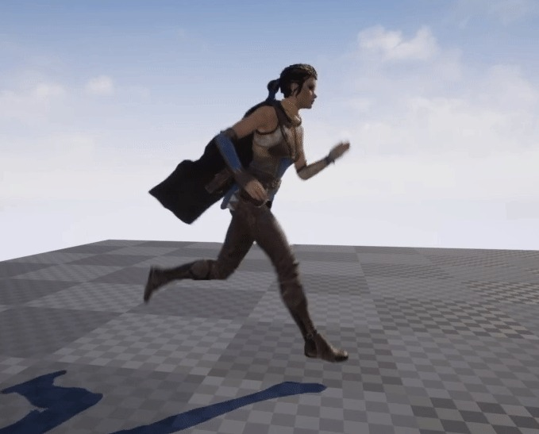
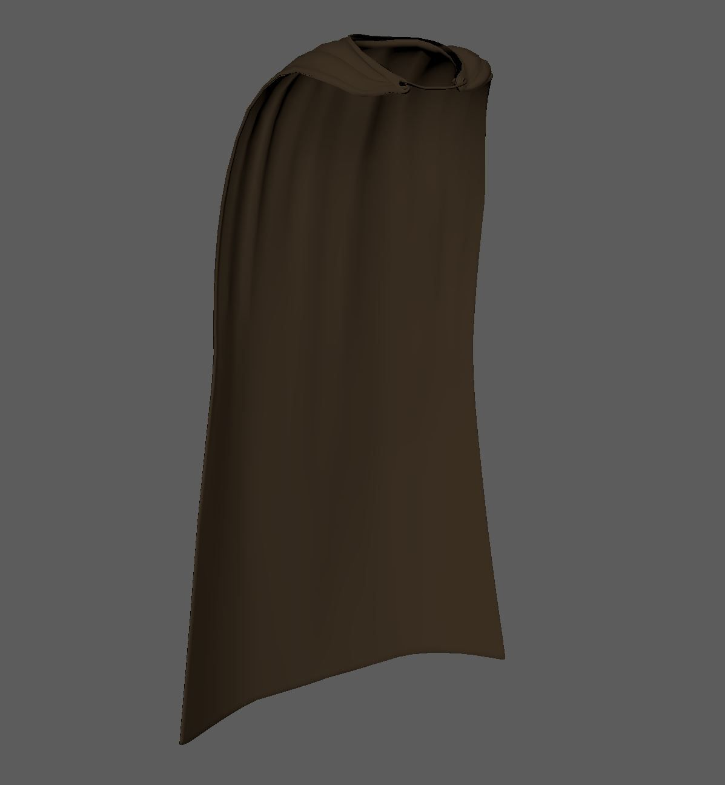
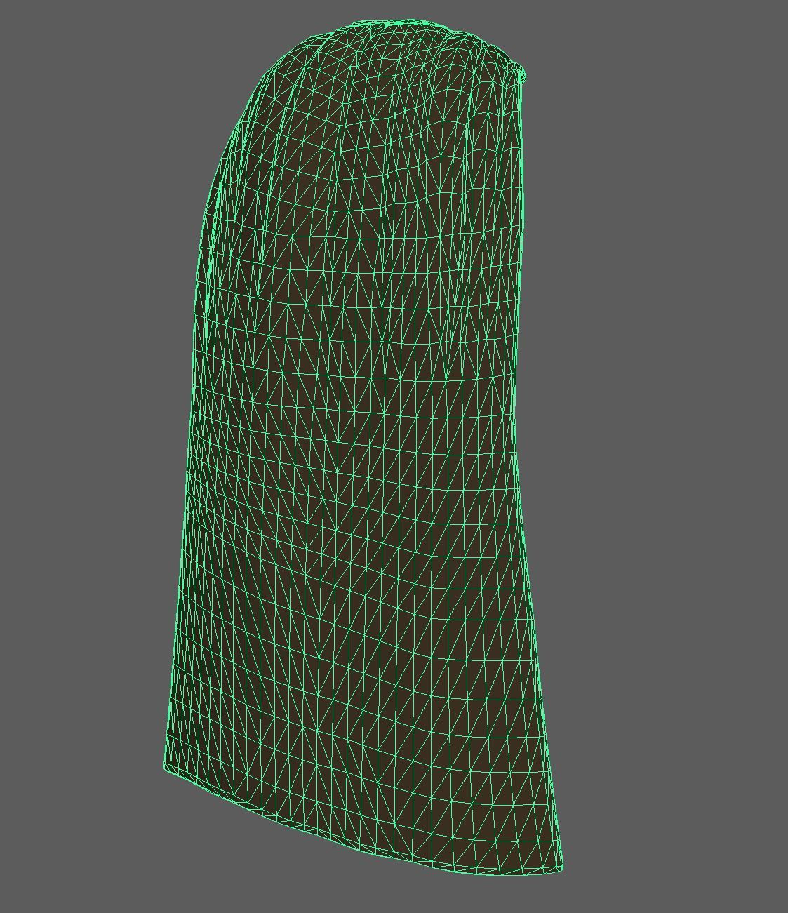
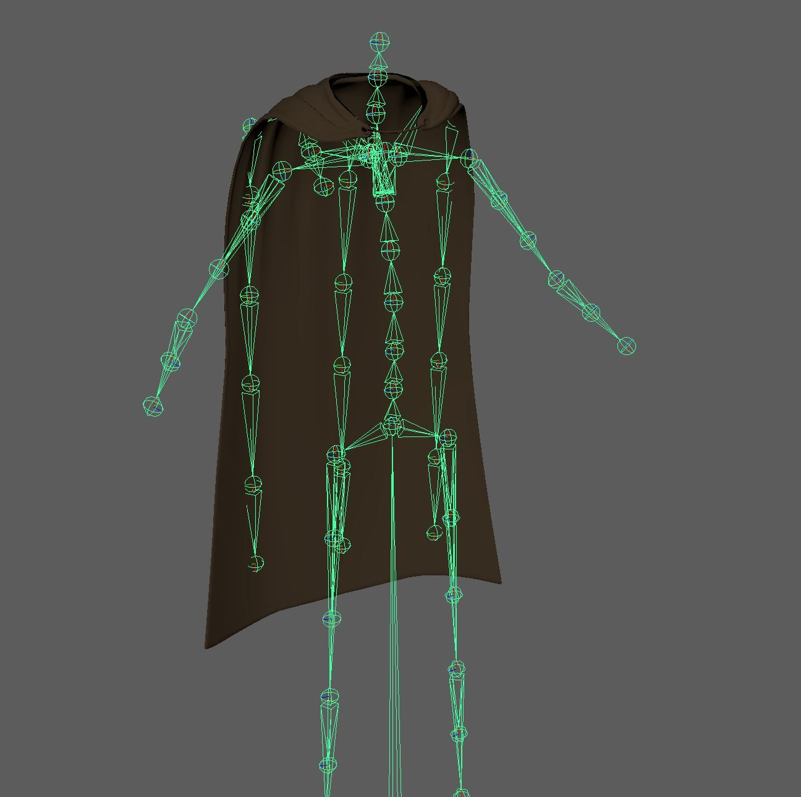
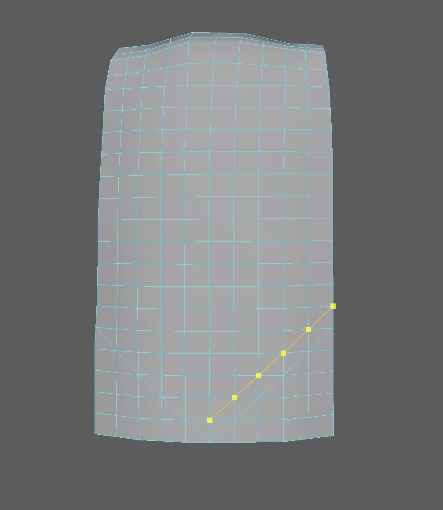
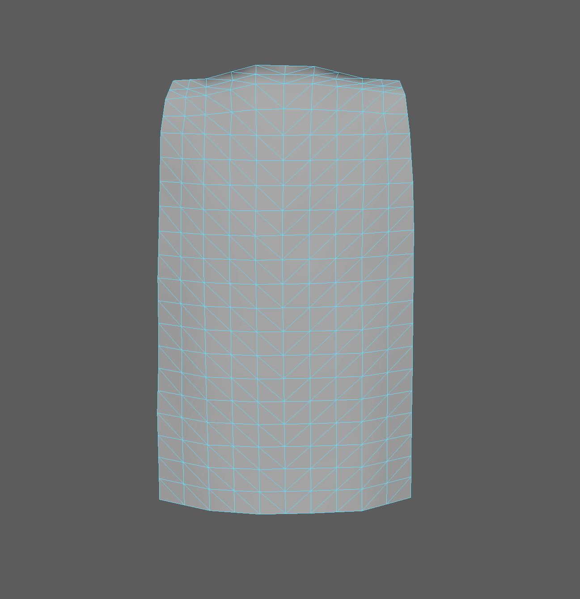
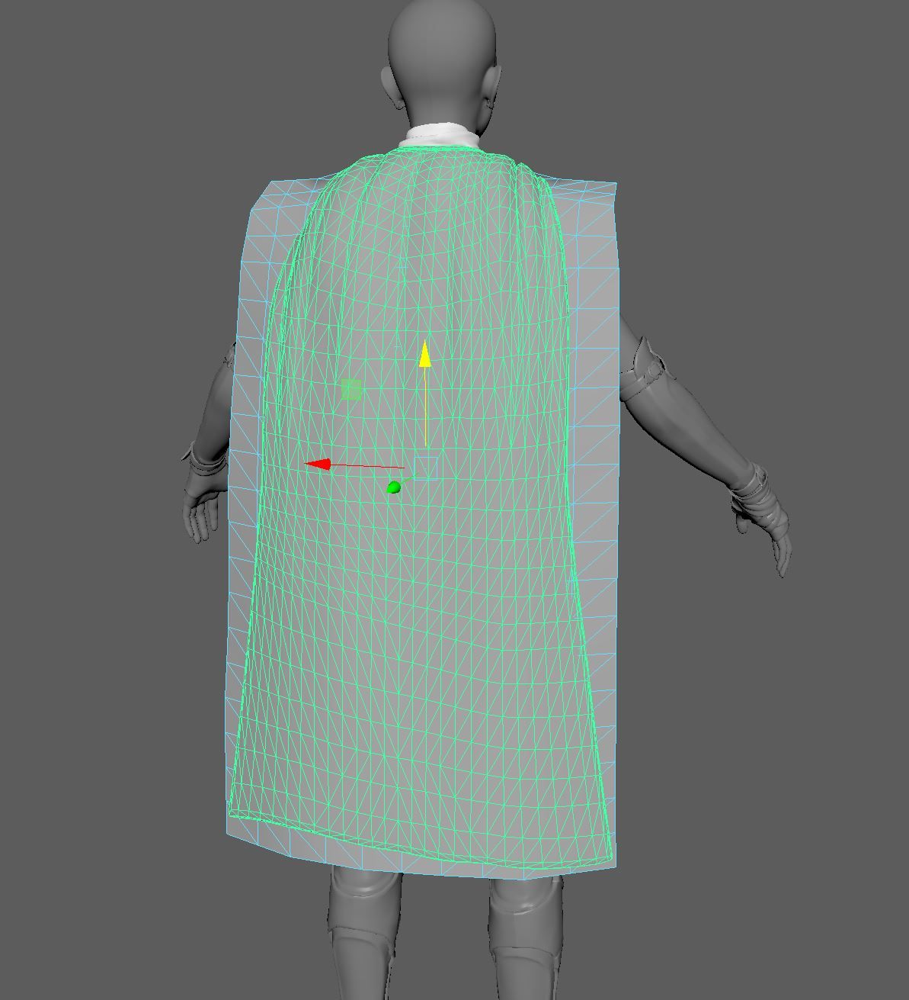
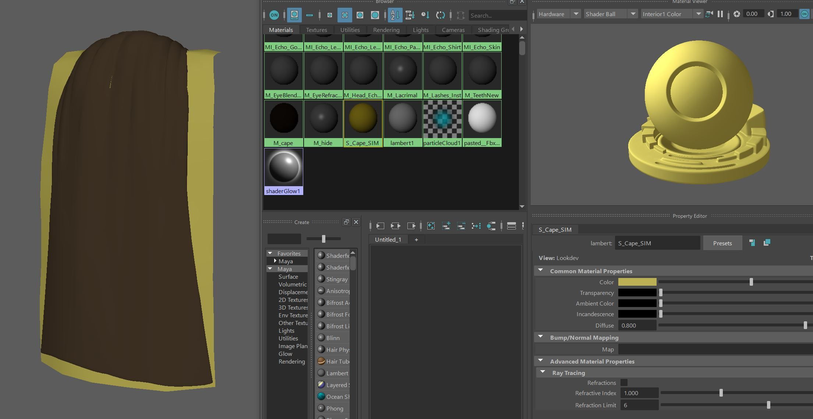
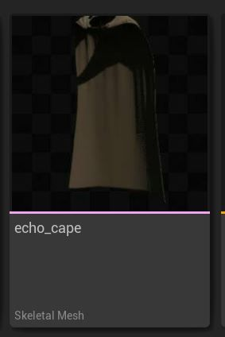
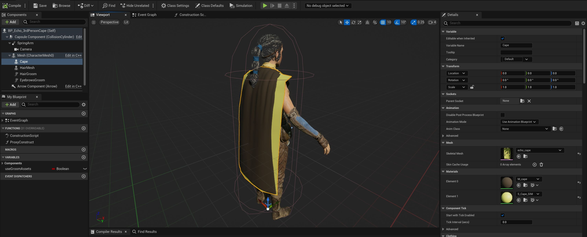

# 回声斗篷教程

## 来源与状态

- 原始 URL：https://dev.epicgames.com/community/learning/tutorials/2YW1/unreal-engine-echo-cape-tutorial

## 运行时分类

- 类型：图文教程
- 判断：API 未识别到核心视频信号，可整理正文约 8168 字符。

## 摘要

此示例将演示 Chaos Cloth 的代理模拟网格工作流程，并展示如何在 UE5 中使用布料挡块。我们将创建一个斗篷设置，并使用主姿势组件将其添加到现有的回声蓝图中。

## 中文整理

### 概览

您可以从内容示例中访问 Echo 角色，该角色已经分配了布料资源（围巾）。在此示例中，我们假设它不存在，然后创建一个新的斗篷布资源并将其添加到 Echo 的现有 SkeletalMesh 中，而无需直接编辑它。我们不会担心现有的刚性马尾辫与斗篷的碰撞。还有另一个关于如何设置长链 RBAN（刚体动画节点）的教程，您可以查看该过程。

### 海角渲染网格

这是我们将添加到 Echo 的默认骨架网格体设置中的海角几何体......

我们从这个网格中立即注意到的一些问题是： 与像简单的单面标志示例中那样模拟渲染网格不同，事实证明，对此资源使用代理模拟网格对我们是有益的。重要提示：我们将使用现有的 Echo Skeleton 关节作为斗篷的基础装备。我们将使用“Master Pose Component”蓝图节点来帮助主 Echo Skeleton“驱动”我们的自定义披风装备。要使用该方法，我们需要确保与原始 Echo Skeleton 存在一一对应。

注意：如果您无法访问原始 DCC 装备文件，只需从 UE5 内容浏览器将 Echo 现有的 skeletalMesh 的骨架导出为 .fbx。

### 代理模拟网格

在您首选的 DCC 中，创建一个新的网格，该网格的大小和形状近似于更复杂的可渲染网格的大小和形状。您可能想要使用此工作流程的原因有几个，但主要是它提供了一种控制模拟网格分辨率和拓扑偏差的方法，同时在引擎中提供更均匀和稳定的模拟网格，特别是当原始渲染网格具有不同的三角形大小和/或双面时。

最简单的方法是从四边形网格开始，然后使用用户定义的切割来自定义偏置拓扑以进行三角测量。请记住，您始终可以让引擎在 .fbx 导入时自动进行三角测量，但是，通过您自己这样做，尤其是在较低分辨率的网格上，您可以更好地定义布料模拟如何弯曲。如果您担心海角边缘的精细边缘碰撞，您可能希望较低分辨率的代理网格比本示例更紧一些，以便更紧密地遵循驱动渲染网格。该演示的一部分是为了表明您可以对代理稍微慷慨一点，以使其网格划分的创建要求不那么高。您必须权衡您的个人需求和用例。这是最终定制的代理模拟网格......

这是代理模拟网格与 Echo 可渲染网格的组合。可渲染几何体被选择为绿色。

### 着色器分配

确保您将要驱动的可渲染网格中的自定义代理模拟网格有一个独特的着色器。 UE5 使用着色器来区分布料部分，因此需要在 DCC 中生成新的着色器/材质并将其分配给代理。

最后检查，确保您的代理网格体分配了蒙皮权重（通常通过传输）并分配了唯一的着色器。使用标准 .fbx 流程导出渲染网格以及自定义布料模拟代理网格、关节和蒙皮权重

### 海角蓝图设置

在 UE5 中，导入您生成的 .fbx 文件，为斗篷创建一个 skeletalMesh 资源。我们将在下一步中与现有的 Echo 资产结合起来。

我们将使用“**BP_Echo_3rdPersonPawn**”。复制该蓝图以便遵循此设置。 （我们已经在此图像中添加了以下步骤）

选择“Mesh (CharacterMesh0)”组件，然后使用“组件”窗口左上角的“+添加”按钮添加骨架网格体组件。将新的 SkeletalMesh 组件重命名为“Cape”。将用户创建的 Cape skeletalMesh 添加到 BP_Echo_3rdPersonPawn 蓝图中的详细信息面板中。回到构造脚本图中，我们将使用“**Master Pose Component**”让原始 Echo Skeleton 驱动我们的自定义 Cape skeletalMesh。在*构造脚本*中，我们将添加一个“**设置主姿势组件**”节点。将其执行线连接到序列节点中的一个开放插槽。将斗篷组件拖到图表中并连接到主姿势组件节点的目标。现在我们将把斗篷附加到原始的 Echo SkeletalMesh 上，而无需编辑该设置。

### 代理工作流程

在用户创建的 Cape SkeletalMesh 中，首先使用材质槽中的 **Isolate** 开关隔离模拟代理网格体。右键单击 sim 网格，然后按照从部分创建服装数据的标准流程进行操作。将资产名称命名为：Echo_Cape。此时，我们可以使用“从网格中删除”切换来“隐藏”黄色模拟网格，但我们稍后也会解决这个问题，所以现在就离开。现在，在材质槽“隔离”元素中隔离海角渲染几何体。再次右键单击渲染斗篷，选择应用服装数据，然后选择我们在上一步中创建的布料数据 Echo-Cape_0_LOD0。 “_0_LOD0”由引擎添加到用户提供的名称中。请注意，一旦我们激活布料绘制工具，我们将要绘制的网格就是代理模拟网格。

### 布漆最大距离

我们将为斗篷的长度绘制渐变最大距离。使用 0-150 之间的值作为开始（绿色）和结束（红色）值。现在，通过单击布料编辑器蒙版窗口右上角的“+”符号来添加新蒙版。我们将添加两个遮罩： 添加一个 Backstop Radius 遮罩。这两个蒙版可以协同工作，因此最好一起创建它们。我们可以对这些蒙版使用另一个渐变，但我们将使用填充来测试两者。如果您愿意，请稍后更改。逆止遮罩与最大距离值遮罩相结合可以用作**便宜**的方式来**设置布料**模拟运动的限制。要填充 Backstop Distance 和 Backstop Radius 蒙版，请将布料绘制工具设置为填充，然后首先选择 Backstop Distance 蒙版。然后将 Backstop Radius 设置为填充 200。

### 可视化面具

您可以通过选择蒙版并将光标移动到网格上来可视化每个蒙版上的值。不要单击网格，只需移动鼠标，您就会在 HUD 左侧看到布料值更新。另一种可视化 Backstop 的方法是使用“角色 - 服装”下拉菜单。逆止器 逆止器距离 **风** 也可用于可视化遮罩效果。要在 SkeletalMesh 编辑器中查看风，只需将角色 - 服装下拉列表中的风强度更改为大于 0 的值。带有操纵器的风小控件将出现在编辑器中。逆转风向，您还会看到硬逆止效果。

### 布料设置

继续进行**布料配置**设置，随意调整模拟参数以适应您想要的外观。以下是我们用于该资产的一些设置。如果您没有看到斗篷产生太多升力，请提高您的**升力**低重量值。正如**混沌布料工具属性参考**中提到的，请注意，通过增加升力，您还需要调整风，因为它会产生更多效果。使用 SkeletalMesh 编辑器中的 Clothing Visualization 选项下拉菜单非常重要。 **物理网格**和*不是*渲染网格应该是您在尝试排除布料故障时主要解决的问题。最后一步。让我们隐藏代理模拟网格体的材质，这样它在播放过程中就不会显示在编辑器中。右键单击资产详细信息面板 LOD0 部分中的第 1 部分材质槽。下拉以禁用在最后一步或布料数据生成步骤中隐藏代理模拟网格后，您应该准备好在编辑器中查看完整的回声蓝图资源。

### 将蓝图添加到编辑器

在编辑器中创建一个新关卡，从内容浏览器中拖入 Echo 蓝图，添加慢跑动画（来自 Echo 的动画内容），放置并调整全局风（**参见 Chaos Cloth Flag 教程**），然后调整风的强度和速度，您应该会得到与此类似的内容。
