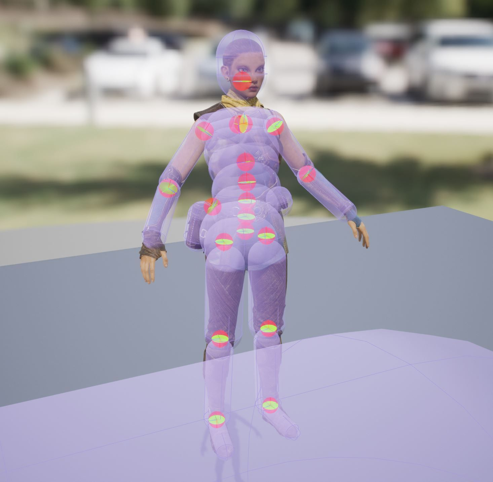
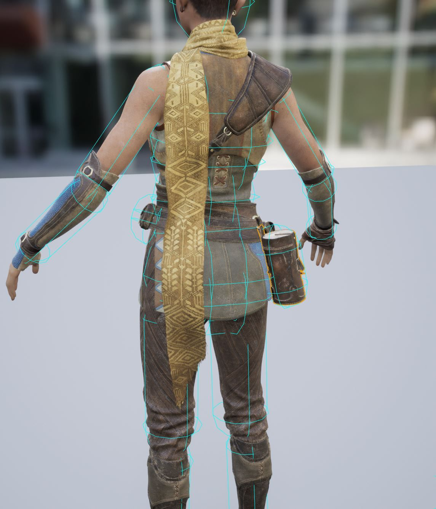
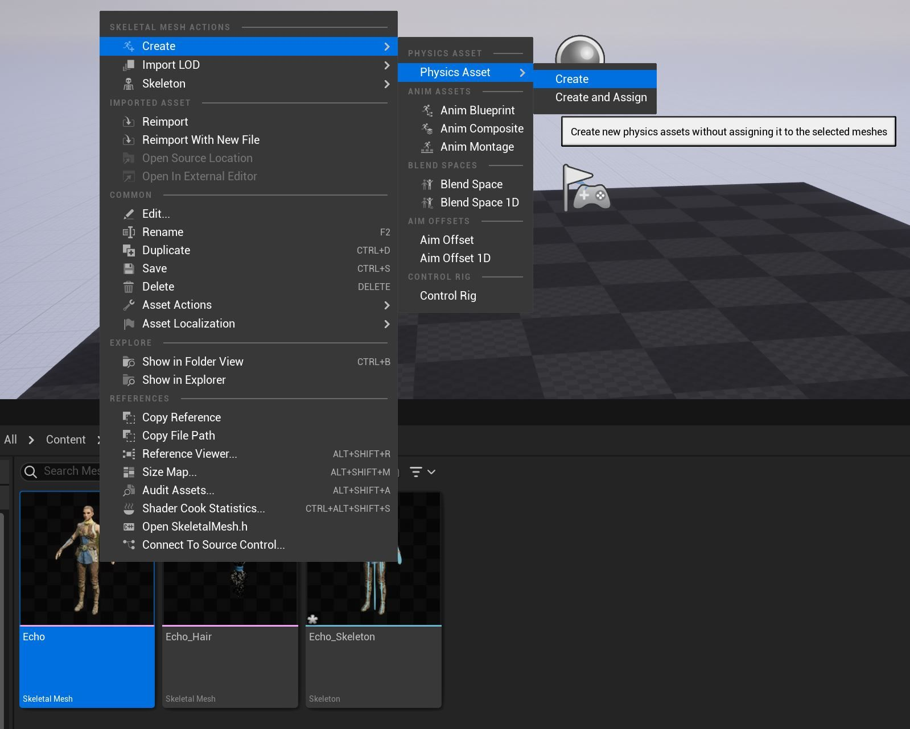
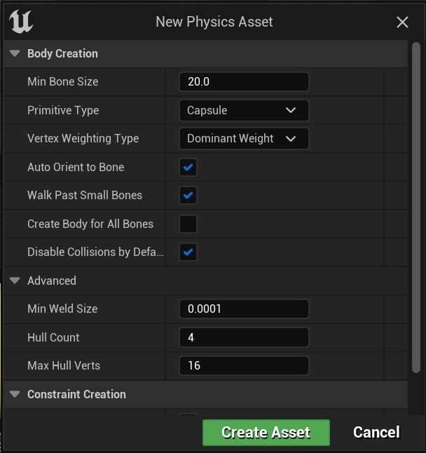
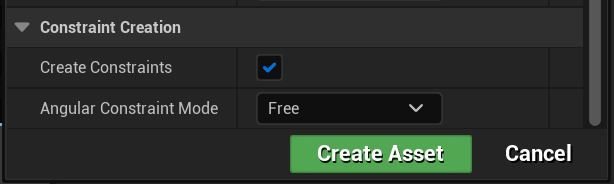
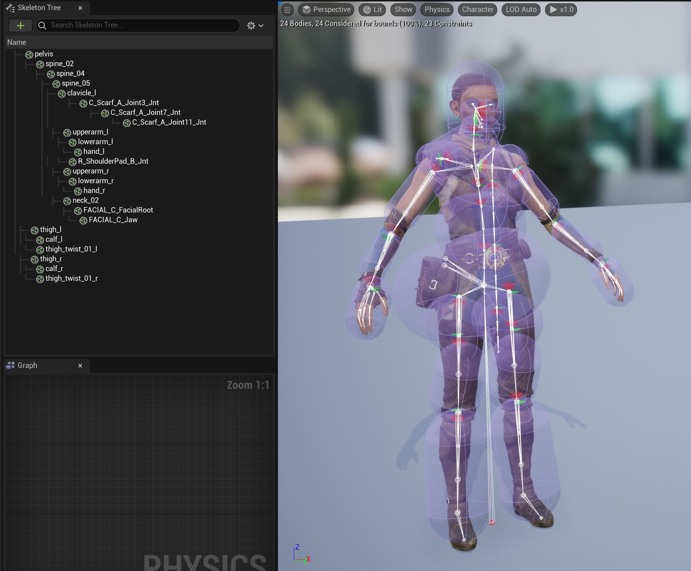
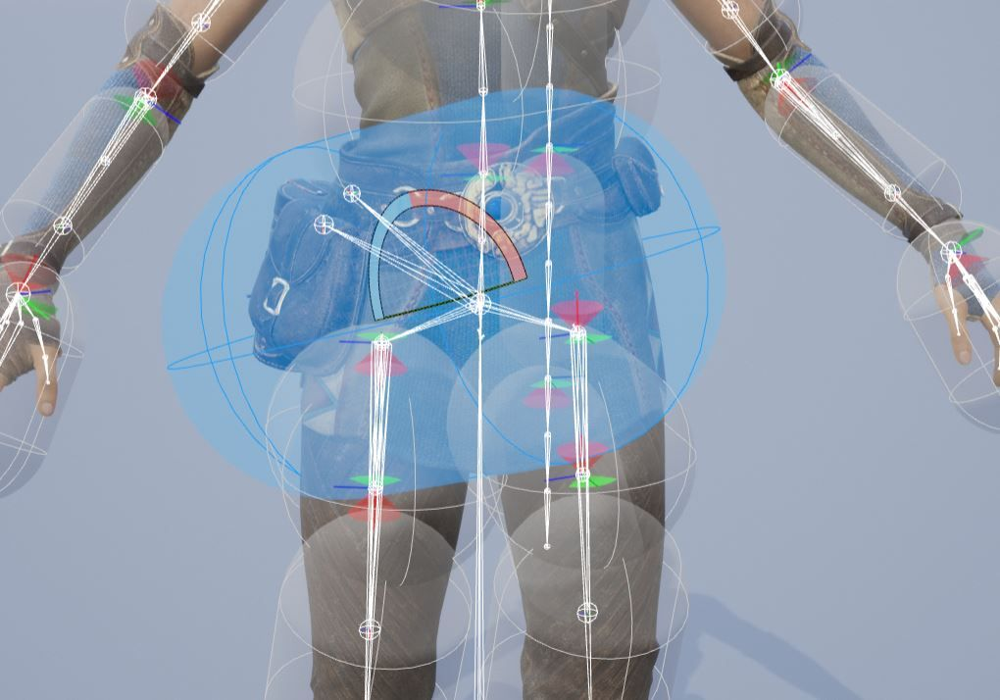
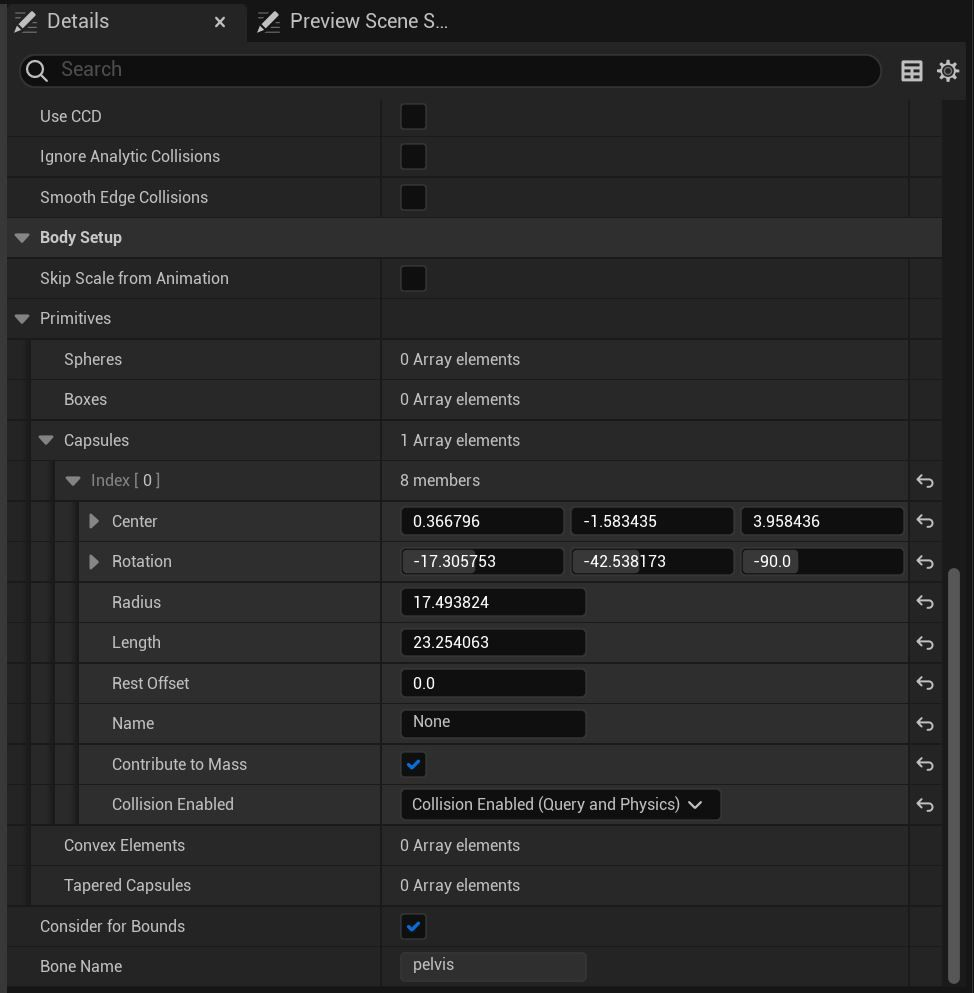
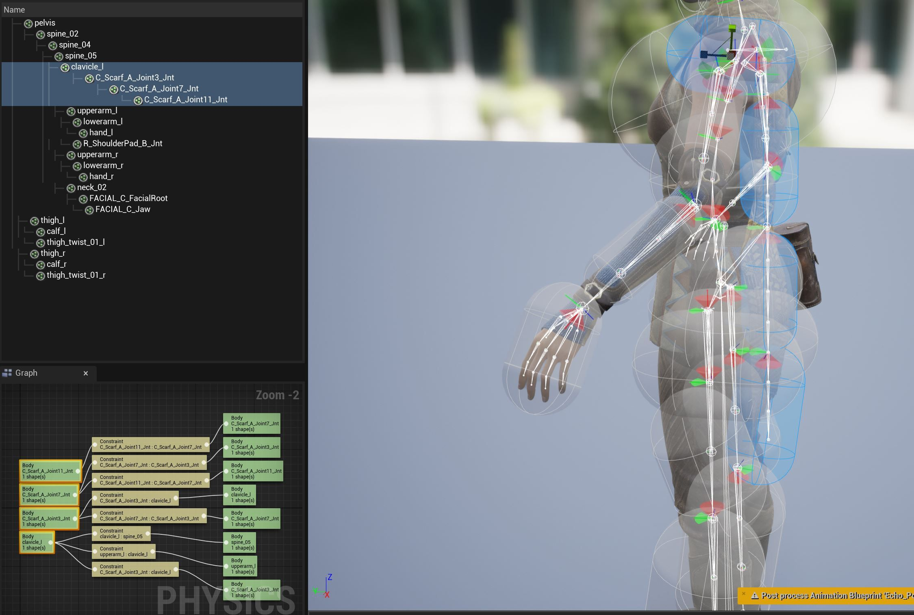
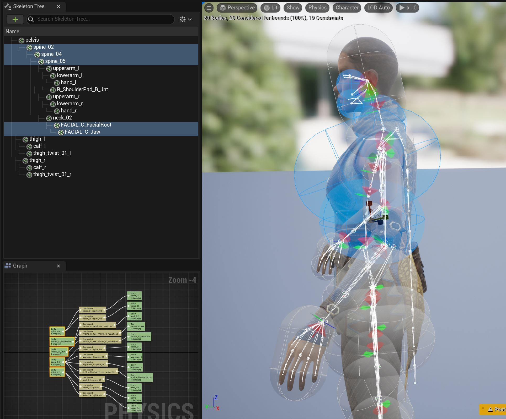

# 回声碰撞教程

## 来源与状态

- 原始 URL：https://dev.epicgames.com/community/learning/tutorials/zw5q/unreal-engine-echo-collision-tutorial

## 运行时分类

- 类型：图文教程
- 判断：API 未识别到核心视频信号，可整理正文约 4930 字符。

## 摘要

在此示例中，我们将演示如何使用物理编辑器添加碰撞体，以便与 Echo 的围巾布资源发生碰撞。

## 中文整理

### 概览

您可以从内容示例中访问 Echo 角色，该角色已经具有带有碰撞的布围巾设置。我们将向您展示如何从头开始生成碰撞设置，作为您将来创建的角色的参考。我们将首先生成一个新的物理资源。

### 物理资产

第一步是为我们的围巾碰撞体创建 **PhysicsAsset**。从现有的 Echo skeletalMesh 中，右键单击，然后**Create–PhysicsAsset–Create** 注意-您还可以使用**Create-PhysicsAsset-Create and Assign**自动将PhysicsAsset分配给Echo的SkeletalMesh。

将出现一个包含PhysicsAsset 选项的对话框。

您可以让虚幻引擎使用这些设置为您创建实体。许多用户会删除并手动重新创建他们需要的特定碰撞。这是个人喜好。我们将自动创建，然后展示如何手动删除和创建新实体。

### 自动生成和清理

使用“新物理资源”对话框为围巾创建碰撞后，我们留下了一系列不需要或位置错误的对象。

您会注意到，使用自动生成工具，某些碰撞形状会出现奇怪的尺寸，例如骨盆。

使用 **W、E、R 键** 在编辑器中塑造形状，或使用每个选定形状的“详细信息”面板（使用中心、半径、长度等参数）并调整值以更好地适合您想要实现的形状。

我们还知道，一些自动创建的对象（为每个关节）是不需要的，因此我们可以手动删除（删除）这些对象。

通过各种碰撞，找到像脊柱这样的身体，并通过在编辑器中编辑它们的大小或使用细节编辑器直接重塑它们，以更好地匹配 Echo 的身体形态。删除不需要的额外面部碰撞体。

确保将所有主体 **Physics Typ****e** 设置为 **Kinematic**（默认）

### 手动碰撞创建

我们删除了一些自动生成的碰撞几何体以演示自定义碰撞创建。通过单击骨架树右上角的齿轮图标并选择底部附近的 **显示所有骨骼**，设置可视化选项以在骨架编辑器中显示骨骼。默认情况下，它们是隐藏的，以减少编辑器中的混乱。在骨架树中，我们将添加大腿碰撞体。首先选择大腿骨。右键单击骨骼。从拉出菜单中选择“**添加形状**”，然后选择“**添加** **锥形胶囊**”。 **胶囊**是最有效的隐式碰撞体。 **也可提供锥形胶囊**（仅适用于布料），由两个胶囊组成，可提供更好的形状控制，但成本是标准胶囊的两倍。 **注意：** 与 UE4.0 相比，您可以拥有的碰撞次数***没有限制***。由用户决定他们对性能和功能的个人需求。对于锥形胶囊，有两个半径值，可以在“详细信息”面板中进行调整。

### 镜像

镜像碰撞也是一个很好的做法。设置角色的一半并镜像到另一侧以加快工作流程。一种简单的镜像方法是在 **物理图****h** 中选择碰撞体并右键单击。然后在下拉菜单中选择镜像选项。最后，我们将为罐子和袋子对象制作一些自定义碰撞对象，为围巾提供空间并防止与这些对象发生碰撞。较小的骨骼可能无法创建自动碰撞几何体，因此我们需要添加这些几何体，以防止窗框被剪切。使用前面提到的相同手动过程，选择骨骼、添加碰撞形状并修改形状。如果您的角色布料会与地板或地面发生相互作用，则可以使用大型胶囊来处理这些碰撞。创建附加到角色根部的主体。完成后，您的物理资产应如下所示。并不总是需要将每个关节都纳入碰撞设置中。您必须根据角色的运动和您试图碰撞的布料模拟来确定您的需求。如果您在物理资源创建过程中未使用**创建和分配**选项，则可以在**服装编辑器**的**配置**部分中手动分配物理资源。如前所述，也可以在自动碰撞生成过程的第一步中通过从下拉列表中选择“创建并分配”来分配它。最后，不要忘记在布料编辑器的 **ChaosClothConfig** 中调整布料的碰撞厚度。隐式胶囊的形状并不总是能够完全匹配您尝试碰撞的几何体的轮廓，因此这可以为您提供一个偏移量，以在与主体几何体剪切的情况下提供帮助。
