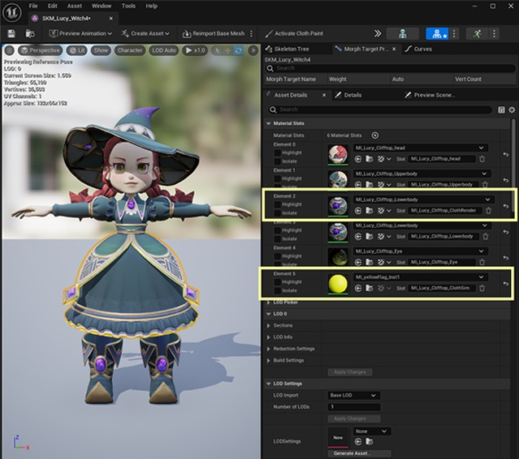

# 蓬松裙子上的混沌布料模拟

## 来源与状态

- 原始 URL：https://dev.epicgames.com/community/learning/tutorials/nz8R/unreal-engine-epic-for-indies-chaos-cloth-simulation-on-puffy-skirt

## 运行时分类

- 类型：图文教程
- 判断：API 未识别到核心视频信号，可整理正文约 8411 字符。

## 摘要

我很高兴能够参加由 Epic Games 于 2024 年初主办的泰坦计划艺术挑战赛。创建这个 NPC 的主要目标不仅仅是创建我自己的角色，而是在不依赖动画的情况下试验露西蓬松裙子上的布料模拟能力有多强。事实证明，通过尝试各种方法，结果非常好（对此我很感激）。希望这个简单而有效的方法可以帮助任何想要实现同样目标的人。

## 中文整理

### 蓬松裙子上的混沌布料模拟。

- 我使用泰坦计划中的一个名为露西女巫的 NPC（您可以在 UE 学习中找到它）作为起点来玩并测试蓬松裙子上布料模拟的有效性。此方法适用于任何级别，无论是初学者还是高级。 - 以下是如何实现光滑的蓬松裙子的简单步骤和细分，无需对其进行动画处理，只需使用混沌布料配置来支撑蓬松的裙子。

### 第 1 步：将具有虚拟网格的角色导出到 UE5

- 为了创建平滑的布料模拟，首先要做的是创建一个虚拟网格（显示为黄色网格）。 **# 如何创建虚拟网格？*** *您可以简单地复制裙子和襟翼，减少多边形数量并使其尽可能简化。无论是四边形还是三边形，脸上都是可以接受的。此时并不重要。* - 您可以通过单击“编辑网格”选项卡中的“变换”将其放在裙子下面。 / 将其向内，以便之后在 Unreal 中创建***ChaosClothConfig.*** 时可以轻松选择虚拟网格。 / 需要提醒的是，虚拟网格必须是单个面。避免两个侧面。将带有裙边和襟翼的虚拟网格分配给单独的材质 - 虚拟网格 |裙子和襟翼网格 - 将材质命名为 *ClothSim。* / **（网格在虚幻视口中**不可见**）|将材质命名为*ClothRender.* / **（在虚幻视口中**看到**的网格）***# 为什么我们需要分配单独的材质？*** *分离材质的想法是将目标网格（裙子和襟翼）作为布料模拟网格（虚拟）的父级。 **虚拟网格将支持模拟工作，而不是依赖于目标网格。 **模拟测试时更容易控制。 *

### 第 2 步：导入为骨架网格物体并进行设置

- 设置完成后，虚拟网格最终将消失。 |分配适当的着色器后。接下来，我们将在裙子上测试布料模拟。 / 1) 选择**虚拟网格**（黄色选择）/ 2) 右键单击​​鼠标，您将看到“***从选择创建服装增量***”。 / 3) 你会看到还有另一个子选项卡。命名***资产名称***，例如“*..._Clothing-Skirt*”。勾选***从网格中删除***。这很重要！如果您不删除它，它将出现在您不希望看到的视口中。 / 4) 确认设置后点击***创建***。

### 第 3 步：在虚拟网格上施加疼痛重量。

- 1) 选择选项卡右上角，您将看到一个类似画笔的图标，“***停用布画***”。 / 2) 检查 **ClothSim** 着色器上的隔离，这样会更容易看到并仅关注虚拟网格。 / 3）此时整个虚拟网格变成洋红色，接下来将开始油漆重量工作。 - 4) 转到***服装***选项卡，向下滚动到***布料绘画***。 / 5) 您将在该部分看到画笔设置，您可以开始在其上绘画。 - 6) 选择***渐变***工具。 / 7) 左键单击顶部顶点，Alt + 左键单击顶点末端。 / 确认后按**Enter**。 / 8) 你会看到顶部渐变是黑色选区，向下逐渐变白。 / 详细说明一下，*绿色顶点*是黑色选择（意味着影响较小），而*红色顶点*将是白色选择（完全受模拟影响）。但我们仍然需要保留其未受影响的区域（洋红色）。 - 9) 返回***工具***并选择***画笔***。 / 设置*绘制值* > 0.0。 / 将 *画笔半径* 设置为 10.0 / 10) 在顶部绘制。 / 11) 您将看到洋红色绘制区域，这意味着它不受布料模拟的影响。

### 第4步：混沌布配置

- 1) 脱活的布漆。 / 2) 取消选中黄色着色器上的隔离检查器。 / 您只会看到没有虚拟网格的完整角色。 - 3) 选择裙子和襟翼网格。 / 4) 右键单击​​鼠标，进入***应用服装数据*** / 5) 选择我们刚才创建的***SKM_...服装-裙子***。 / 6) 您将看到裙子通过应用布料模拟做出反应，这对于下一步来说是很好的。 - 确保**服装数据**的信息正确。它位于我们刚刚创建的*服装裙子*下面。 / 此时，我将使用**最大距离**蒙版作为一个好的开始。您可以选择最适合您要求的任何一个。 / 您可以在设置结束时应用**物理资源**。 / **ChaosClothConfig** 取决于您的资产材质的类型。 *例如，皮革、织物、橡胶等* / **质量属性**取决于重力/重量。就我而言，我想让我的裙子稍微重一些并且不那么晃动。所以我将***密度***设置为0.6，***最大***设置为1.0/选中**使用弯曲元素**，这样我就可以保持它的蓬松度。这可以应用于模型本身有大量弯曲和边缘的电镀裙子，在不破坏形状和轮廓的情况下保持其刚度。 / **碰撞厚度** 设置为 1.0，而 / **摩擦系数** 设置为 0.1。 /选中**使用自碰撞**（因为我已经在物理资源中删除了裙子和襟翼上的碰撞）。厚度和摩擦力的值与上述相同。 / 在 **ChaosClothShareSimConfig 下， ******Simulation iteration*** count 设置为 5（数字越大，移动越慢）。 / ***Max ***保持不变，默认为10。 / ***细分***计数设置为2（使裙子移动时的分辨率稍高）。 - 如果您想更好地了解每个功能，您可以访问此官方页面。 - https://dev.epicgames.com/community/learning/tutorials/jOrv/unreal-engine-chaos-cloth-tool-properties-reference - 相同的原则适用于帽子和头发。 - 这次对帽子和头发应用相同的方法，但没有虚拟网格。将其应用到帽子和头发上的目的是对其进行二次物理运动。 |我只画了少数受风和运动影响的区域。 / ***ChaosClothConfig*** 和***SimConfig*** 的设置与Skirt 和Flaps 相同，保留其刚度。

### 糟糕的场景

在不同的 ClothSim 方法上进行测试时，很少会出现可怕的结果。以下是一些不好的例子。 - **完全依赖 ChaosClothConfig，无需虚拟网格。** | **尝试在裙子上使用新的 Chaos ClothSim 功能，但结果太复杂，导致“爆炸”。** | **这次加入了虚拟网格，但襟翼距离裙子太近，导致与裙子粘在一起。** - *这个方法不起作用，因为裙子网格本身就包含双面网格。* / *ChaosClothConfig 的弱点是在模拟时无法支持或正常工作双面网格。虽然弯曲刚度已打开，但仍然导致移动腿之间出现穿透问题。* / *此时，即使物理资源已将胶囊正确放置在每个身体部位上，但这并不能阻止它被混乱模拟。 * | *很高兴尝试在 5.4.1 版本上更新的新 Chaos 插件，但不幸的是，它在我的裙子上效果不佳。* / *它效果不佳的原因是因为新插件应该将 MD 网格引入 UE 以供 ClothSim 使用。而且里面的节点对于初学者来说可能会让人不知所措。* / *它可以正常工作并且交叉点较少，但仍然无法避免它随时爆炸。这也不太好。 * | *这次我尝试包含虚拟网格，它几乎可以工作！ （呃！）但是还有一个问题是，只要裙子移动，襟翼就会粘在裙子上。因此，唯一的解决方案是解除绑定姿势并将襟翼稍微抬高。* / *重新导出襟翼向上的骨架网格物体，并对动画装备执行相同的操作。这样就可以在不调整Physic Asset的情况下正确解决这个问题。* / *此时，连PA中裙子和襟翼的碰撞都被删除了，完全依靠ClothSim。仍然可以保证工作！ *
