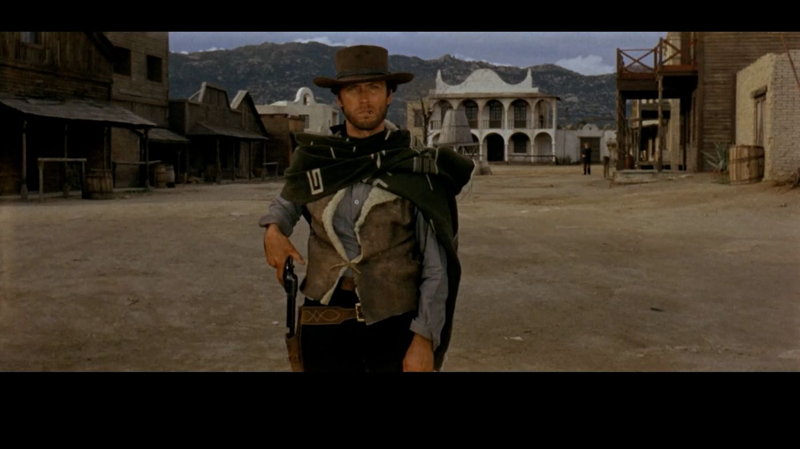
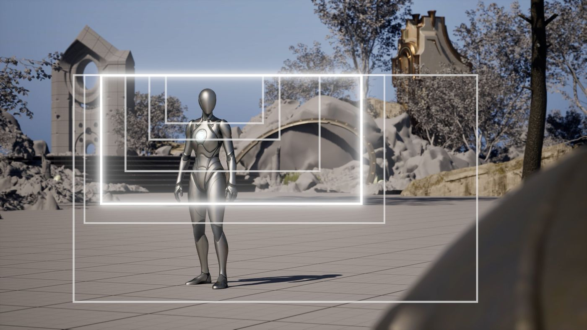
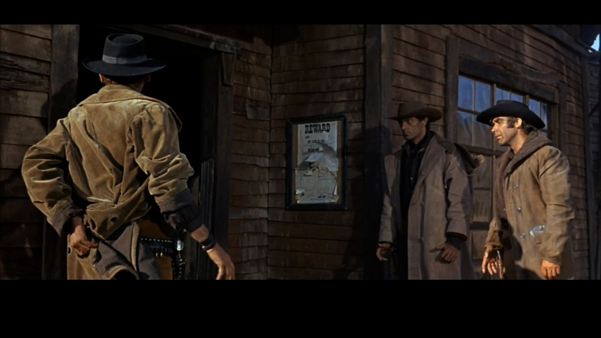
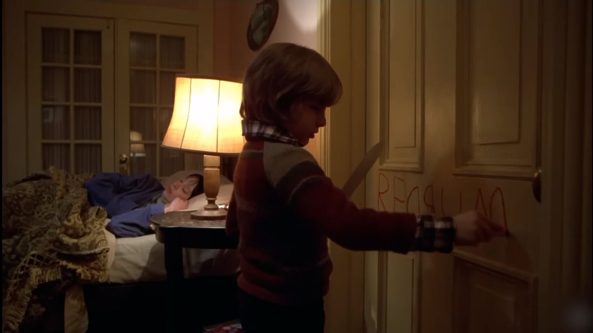
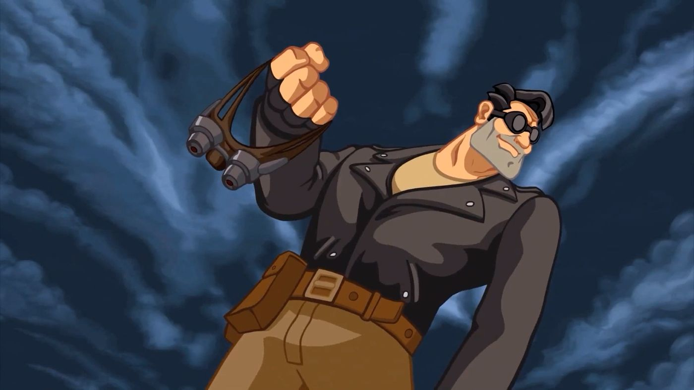
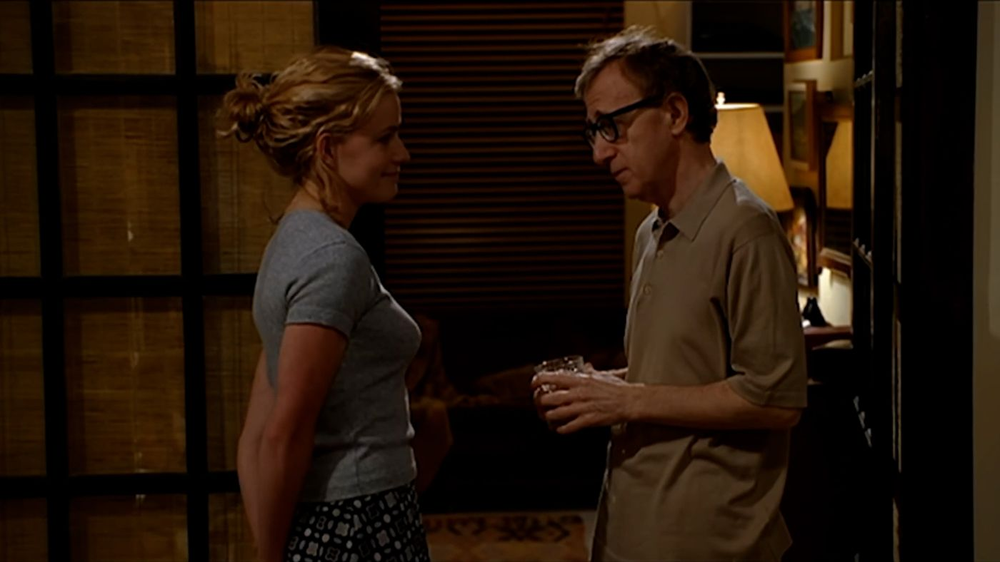
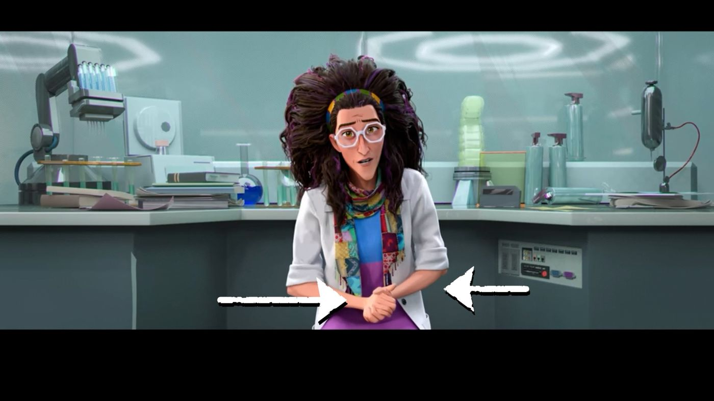
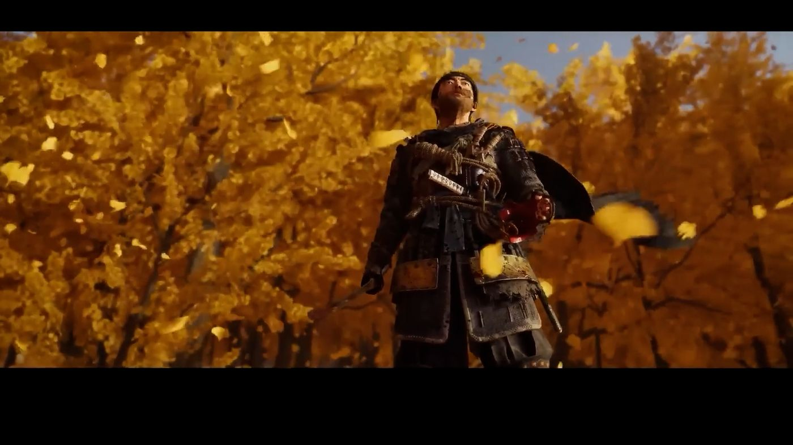
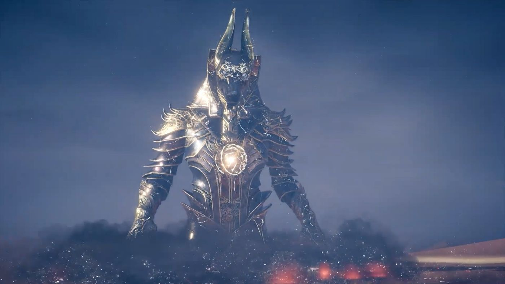
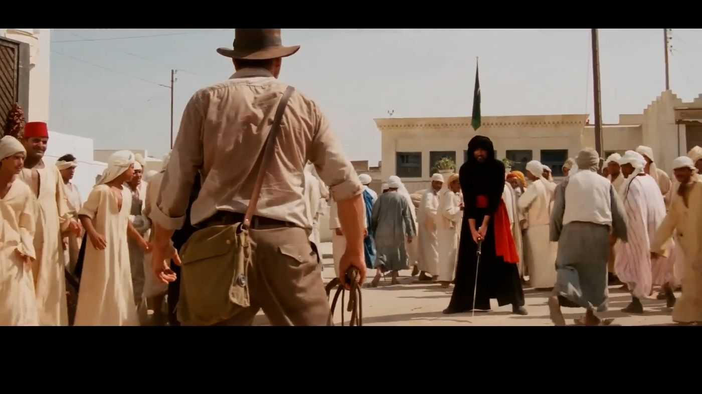

# 牛仔射击：没人谈论的张力框架

## 来源与状态

- 原始 URL：https://dev.epicgames.com/community/learning/tutorials/v7ob/unreal-engine-fortnite-the-cowboy-shot-the-tension-frame-nobody-talks-about

## 运行时分类

- 类型：图文教程
- 判断：运行时未识别到核心视频信号，可整理正文约 4672 字符。

## 摘要

大多数导演都使用过“牛仔镜头”数百次，但并不知道它的名字。这不是西方的事情。这不是一个流派的事情。这不仅是为了...

## 中文整理

### 概览

任何故事中最有趣的时刻从来都不是爆炸。这是手指触及扳机之前的第二秒。屏住了呼吸。手伸向皮套。在这一瞬间，观众知道（或至少感觉到）一切即将改变，但还没有完全改变。一个多世纪以来，电影导演一直痴迷于那个紧张的时刻。为了捕捉它，几乎所有人都采用了相同的框架。

### 什么是牛仔射击？

牛仔镜头从大腿中部到头顶上方拍摄角色。它介于中景（MFS）和中景（MS）之间。手可见。部分背景可见。角色充满了画面，但没有吞没它。这个名字的来源正是你所期望的：西部片。具体来说，就是该类型对皮套的痴迷。如果你要展示一名枪手伸手拿武器的场景，你需要将臀部放在画面中。你需要那只手。你需要手和枪之间有空间。因此：牛仔射击。

### 这不仅仅是枪手的专利

可以用来做什么角色？简单的答案是英雄和恶棍。带有武器的角色。有存在感的人物。这并没有错，因为这个镜头实际上是为他们发明的。除此之外……牛仔射击对任何人都有效！如果故事要求你先感受再理解，那么应该考虑牛仔镜头。一个次要角色向前迈进。正在介绍的武器或重要物品。无需任何对话即可告诉您此人已准备好（并且可能已经准备好）做某事的姿势。枪和剑是显而易见的选择。小玩意、道具，甚至角色空空的双手都是公平的游戏。

### “仅限西方”的神话

这就是大多数人犯错的地方：他们把《牛仔镜头》归入西部片和睾丸激素驱动的对峙之下，然后就放在那里。这是一个陷阱。镜头不是流派工具。这是一种讲故事的装置，恰好有一个流派名称。问题从来不是“这是西部片吗？”问题是“我的故事需要观众现在感到准备好、紧张还是有意图吗？”如果是的话，你就伸手去拿它。特别是如果展示的利害关系不仅仅涉及角色的身体。浪漫、惊悚、奇幻、科幻……即使是一部安静的人物剧，只要时机成熟，也能拍出《牛仔镜头》。流派给了这个名字。故事给予了许可。

### 您的场景已经向您发送的信号

与其将其视为规则，不如将其视为邀请。你的角色带着权威而来吗？牛仔射击。在对抗、决定或揭露之前制造紧张气氛？牛仔射击。表明某人很危险、准备好或完全确定他们将要做什么？牛仔射击！从摄影构图语法来看，它也介于全景镜头和中景镜头之间。这是桥。当您需要的不仅仅是躯干但少于整个身体时，请随意使用它。当手、武器或姿势需要先于角色说话时。

### 每个人都忘记的地方：游戏动画

过去二十年中一些最有效的牛仔镜头并不是在电影中发生的。它们发生在游戏中。想想boss战。想想有多少老板连腿都没有！它们的下半部分隐藏在屏幕外，或者根本不是设计的一部分。如果威胁部分是尖叫，其余部分是可选的。如果 Boss 角色被剪成两半，但我们可以清楚地看到躯干、武器和手，那就是永恒的牛仔射击！为什么？因为它的作用正是牛仔取景的作用：它将你的注意力集中在故事需要你感受的东西上，而不仅仅是看到。过场动画强调武器。人物在战斗前摆出姿势。正在交接的关键物品……这些都是游戏中常见的牛仔镜头——只是很少有人叫到他们的名字。

### 回到悬停在皮套上的屏住呼吸的时刻

《牛仔射击》不是关于动作的。这是关于行动之前的那一刻。这是关于准备情况。屏住了呼吸。当导演把一个角色从大腿中部到头部、双手靠近臀部、背景隐约可见、肢体语言在说话时，他们是在告诉观众：一些糟糕的、美丽的或毁灭性的事情即将发生。射击没有扣动扳机。让你感受到之前枪的重量。对于动画师来说：这是完美的期待舞台。好了：两种动画原理合二为一！这就是为什么它永远不会变老。这就是为什么，下次当你构建一个场景时——无论类型如何，无论媒介如何——都值得问一下你的角色是否值得这个框架。大多数时候，答案是肯定的。 （如果你是一位认为自己从未有意识地使用过它的导演：你确实有过。你只是不知道它的名字。）哪一个《牛仔镜头》在你的脑海中免费存在？将标题放在评论中（仅标题）。很想知道我们的枪套里都装着哪些镜头。 - 过场动画

## 相关链接

- [What is the Cowboy Shot?](https://dev.epicgames.com/community/learning/tutorials/v7ob/unreal-engine-fortnite-the-cowboy-shot-the-tension-frame-nobody-talks-about#whatisthecowboyshot?)
- [It’s not just for gunslingers](https://dev.epicgames.com/community/learning/tutorials/v7ob/unreal-engine-fortnite-the-cowboy-shot-the-tension-frame-nobody-talks-about#it%E2%80%99snotjustforgunslingers)
- [The “Western-only” myth](https://dev.epicgames.com/community/learning/tutorials/v7ob/unreal-engine-fortnite-the-cowboy-shot-the-tension-frame-nobody-talks-about#the%E2%80%9Cwestern-only%E2%80%9Dmyth)
- [The signals your scene is already sending you](https://dev.epicgames.com/community/learning/tutorials/v7ob/unreal-engine-fortnite-the-cowboy-shot-the-tension-frame-nobody-talks-about#thesignalsyoursceneisalreadysendingyou)
- [Where everybody forgets about it: Game Cinematics](https://dev.epicgames.com/community/learning/tutorials/v7ob/unreal-engine-fortnite-the-cowboy-shot-the-tension-frame-nobody-talks-about#whereeverybodyforgetsaboutit:gamecinematics)
- [Back to the holding-breath moment hovering over the holster](https://dev.epicgames.com/community/learning/tutorials/v7ob/unreal-engine-fortnite-the-cowboy-shot-the-tension-frame-nobody-talks-about#backtotheholding-breathmomenthoveringovertheholster)
