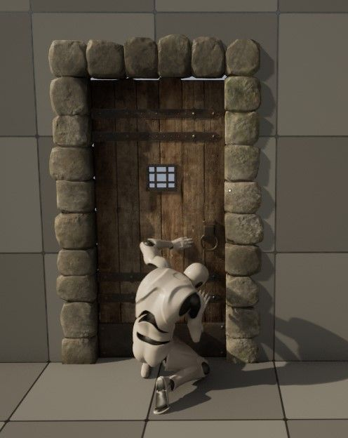
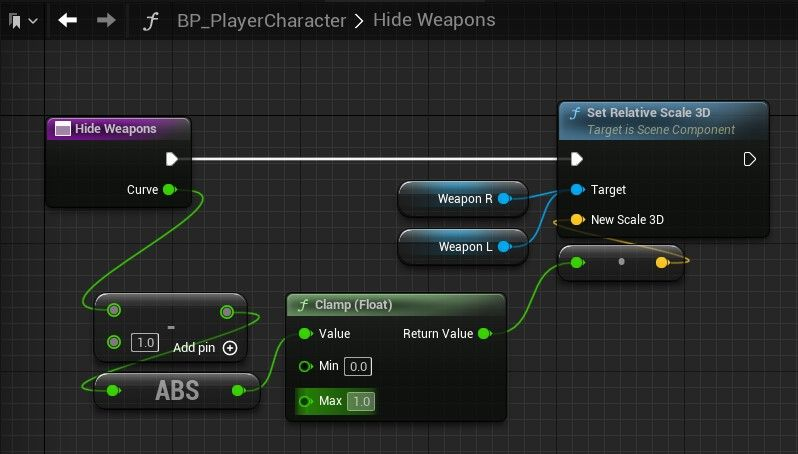
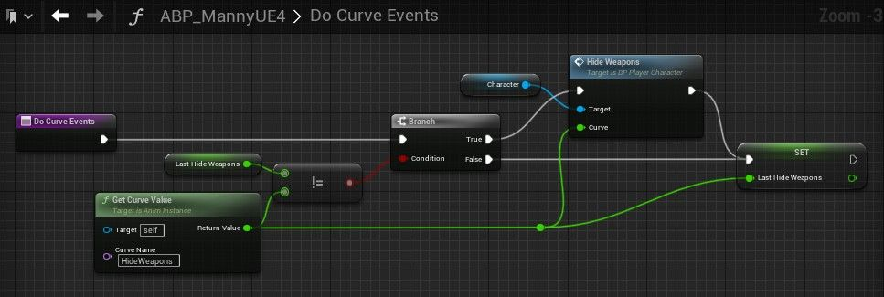
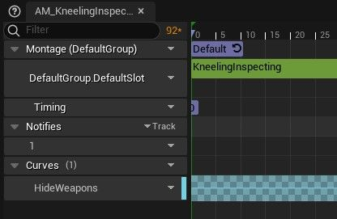

# 在行动中隐藏武器的便捷技巧（MetaCurves）

## 来源与状态

- 原始 URL：https://dev.epicgames.com/community/learning/tutorials/9VLn/unreal-engine-handy-trick-to-hide-weapons-during-actions-metacurves

## 运行时分类

- 类型：图文教程
- 判断：API 未识别到核心视频信号，可整理正文约 2646 字符。

## 摘要

在这里，我将分享一个在播放特定蒙太奇或动画时切换项目的便捷技巧。假设您想玩表情或冲刺，但装备剑时看起来很糟糕！基于 LYRA Starter Game 中提供的功能，适用于一般项目。

## 中文整理

### 概览

### 前言

通过这种方法，我们可以通过在任何蒙太奇或动画中切换元曲线来自动隐藏装备的武器或物品。 Fortnite 和 LYRA 入门项目使用这种方法，我已将其调整为在一般项目中使用。每当玩家执行不适合装备物品可见的动作时使用。此功能的另一个重要用途是禁用 IK。

### 实际例子

我们不希望武器可见... - 打开箱子或门 - 玩表情 - 按下开关 - 冲刺 - 滑动 - 包扎 - 施放咒语 - 抚摸猫 - 跳跃或攀爬障碍物

### 3步

1. 向玩家角色添加函数 2. 向 AnimBP 添加函数 + 在更新时在事件图上运行 + 创建 *LastHideWeapons* 变量（浮动） 3. 在动画或蒙太奇中切换元曲线

### 1.玩家功能：隐藏武器

在您的玩家角色中创建此函数。 **WeaponR** 和 **WeaponL** 是我用于武器的静态网格物体组件。这些将替换为您自己的网格组件。你的武器将缩放至 0，然后返回至 1。

### 2.AnimBP函数：DoCurveEvents

在动画蓝图中创建此函数，然后将其添加到事件图中的动画更新时运行。还创建一个名为 *LastHideWeapons* 的变量。这用于确定自上次更新以来我们的曲线值是否已更改。如果没有，我们什么也不做，否则我们运行 *HideWeapons*。这实际上创建了从 0 到 1 的平滑缩小/放大，并且仅在曲线发生变化时运行。 *角色*是对我的玩家角色的引用。

### 3.蒙太奇元曲线

现在，在任何我们想要隐藏物品的蒙太奇（或动画）中，我们只需打开一条称为 *HideWeapons* 的元曲线。您需要第一次创建它，之后就可供选择。

### 此外

元曲线是从 0 到 1 的简单切换。如果您想要更好地控制值发生的方式或时间，也可以使用常规曲线。也许您希望玩家的拳头以某种与动画相匹配的方式变大。如果您玩过《霍格沃茨的遗产》，请考虑一下许多物体改变大小的方式，例如妖精在攻击时会变大。这可以使用此方法来完成。这也可以适用于将物品装在播放器上，我可能会这样做以更进一步。或者暂时将物品放在地上，以获得另一种程度的真实感。如果您觉得这有用，请随时告诉我。
