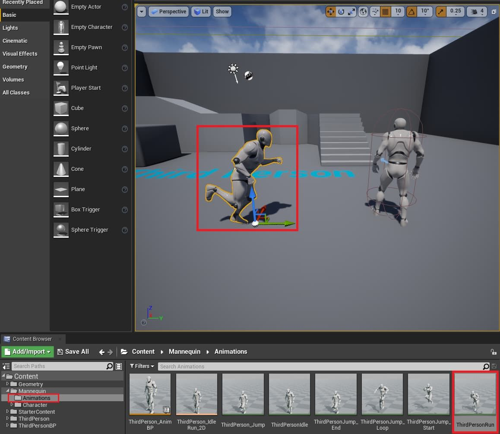
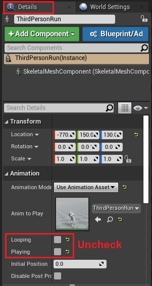
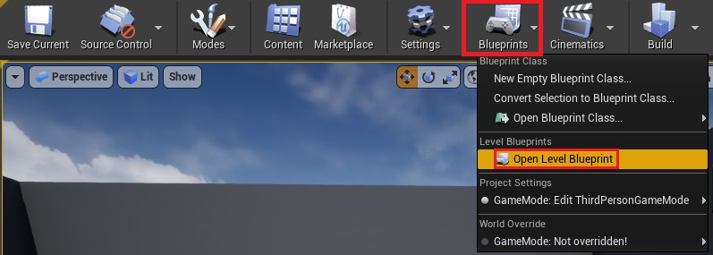
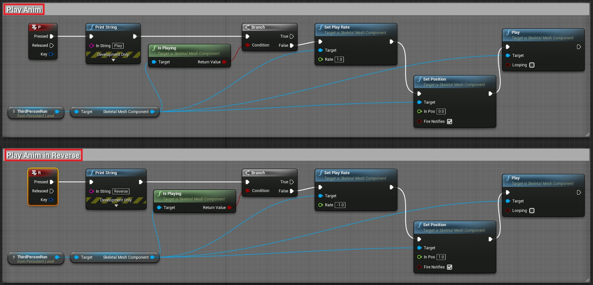

# 如何使用蓝图反向播放动画？

## 来源与状态

- 原始 URL：https://dev.epicgames.com/community/learning/knowledge-base/XdX4/unreal-engine-how-can-i-play-an-animation-in-reverse-with-blueprint

## 运行时分类

- 类型：图文教程
- 判断：API 未识别到核心视频信号，可整理正文约 1410 字符。

## 摘要

如何使用蓝图反向播放动画？文章由 Natalia C 撰写。为了反向播放动画，您需要在关卡蓝图中执行一些蓝图工作。对于这个例子，我将...

## 中文整理

### 概览

文章作者：[Natalia C.](https://dev.epicgames.com/community/profile/AwD9/Natalia.Coghill) 为了反向播放动画，您需要在关卡蓝图中执行一些蓝图工作。对于此示例，我将使用 UE4 第三人称模板项目中的动画。

首先，将目标动画拖到场景中（见上文）。

接下来，在仍选择目标动画的情况下，您需要确保循环和播放框均未选中。这些框可以在详细信息面板中找到（见上文）。

然后，您将需要打开关卡蓝图以开始添加必要的命令（见上文）。

最后，您将设置播放动画部分和反向播放动画部分。为了简单起见，这是在关卡蓝图中完成的，但您应该能够在任何蓝图 Actor 中执行此操作。引用您想要反向播放其动画的演员，并以这种方式获取动画。完成此设置后，您应该能够保存并编译关卡蓝图并点击播放按钮查看结果。您将看到按 P 键，正常播放动画，按 R 键，反向播放动画。
