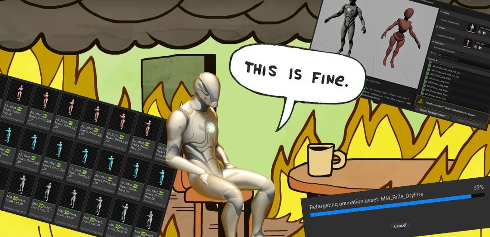
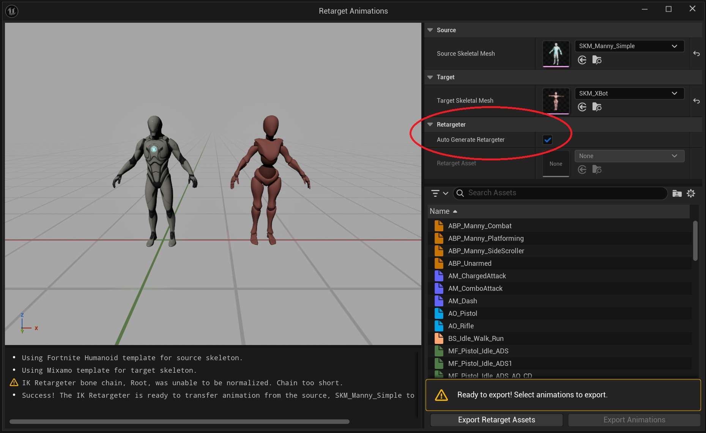
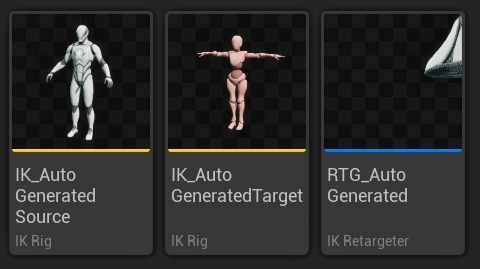
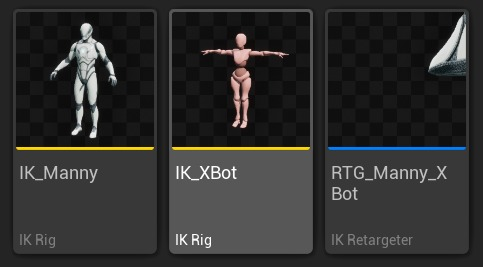
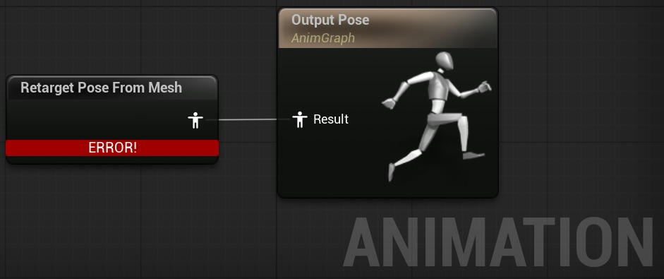
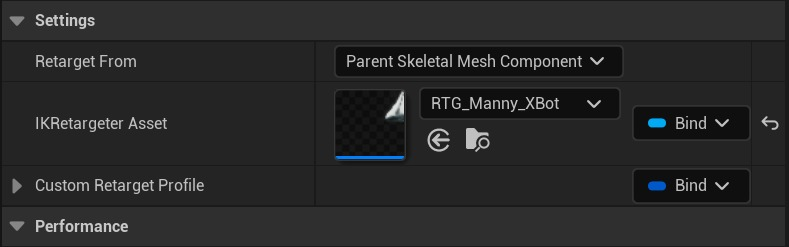
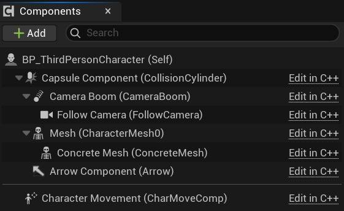
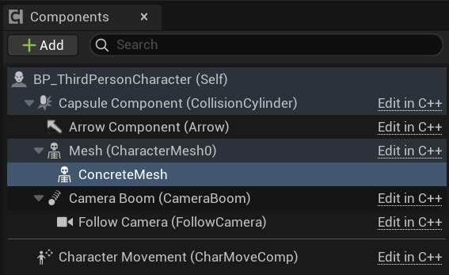
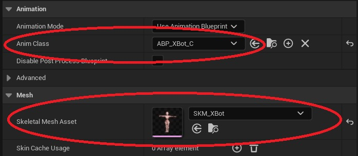

# 如何：设置动态（实时）动画重定向

## 来源与状态

- 原始 URL：https://dev.epicgames.com/community/learning/tutorials/5XrX/unreal-engine-how-to-set-up-dynamic-real-time-animation-retargeting

## 运行时分类

- 类型：图文教程
- 判断：API 未识别到核心视频信号，可整理正文约 10309 字符。

## 摘要

本教程展示如何为您的角色设置动态（实时）动画重定向。

## 中文整理

### 设置动态（实时）动画重定向



厌倦了重新定位所有动画序列或为您正在使用/添加的每个新骨架网格物体创建新的动画蒙太奇？想要通过交换不同的 SkeletalMeshes 甚至根据不同的游戏逻辑交换它们来测试不同的 SkeletalMeshes 的动画吗？在本教程中，我将展示如何设置动态（实时）动画重定向，类似于 Epic Games 在 GASP（游戏动画示例项目）中的设置方式：[虚幻引擎中的游戏动画示例项目](https://dev.epicgames.com/documentation/en-us/unreal-engine/game-animation-sample-project-in-unreal-engine)

### 目录

1. 先决条件和项目设置 2. 实施步骤 3. 结果 4. 附加内容 5. 结束语

### 先决条件和项目设置

在编写本教程时，我一直在使用： - JetBrains Rider 2025.1.4 - Unreal Engine 5.6 在本教程中，我将使用“第三人称”项目模板。由于我也将在这里显示 C++ 代码，因此我使用模板的“C++”版本。为了进行重定向，我添加了来自 Mixamo 的两个 SkeletalMeshes（XBot 和 YBot）： [Mixamo](https://www.mixamo.com/) 虽然您可以随意遵循任何 SkeletalMesh，但我建议使用来自 GASP/Mixamo 的 SkeletalMesh 或仅使用适合 Epic Games 的通用 Mannequin/MetaHuman SkeletalMesh 的通用网格体。具有不同骨骼层次结构的任何其他内容都可能会在我展示的重定向步骤期间导致意外行为，而应通过手动创建 IK Rig 和 IK Retargeter 资源来处理。

### 实施步骤

1. 首先，我们要创建重定位器，它将设置从源骨骼网格物体到目标骨骼网格物体的骨骼重定位，为此我们需要创建两个 IK 装备（一个用于源，一个用于目标）以及连接两个 IK 装备的 IK 重定位器。 1. 在 UE 5.4 之前，创建 IK Rigs 需要为 SkeletalMesh 中的每个 Rig 元素（骨骼）手动设置重定位链。 1. 从 UE 5.4 及更高版本开始，有一个自动且简单得多的过程（对于 Mannequin/MetaHumans SkeletalMeshes，甚至 Mixamo Meshes 应该可以正常工作） 1. 选择任何动画序列资源，右键单击它并选择“重新定位动画”。 1. 应打开“重新定位动画”窗口，选择源和目标 SkeletalMeshes，确保选中“自动生成重新定位器”选项，并且不要从资源面板中选择任何动画。然后单击“Export Retarget Assets”，这将为我们生成我们需要的两个 IK Rigs 和 IK Retargeter。与手动方法相反，如果在两个不兼容的 SkeletalMeshes 上使用此方法，则可能会导致错误的重定向。在这种情况下，请决定手动进行设置。



1. 结果应该是这样的：



1. 你可以像我一样对它们进行相应的重命名：



1. 设置完毕后，我们就可以开始制作动画蓝图了。 2. 使用源骨架网格体创建动画蓝图。 2. 打开它，添加“Retarget Pose From Mesh”节点并将其拖动到“Output Pose”的“Result”。



2. 单击新添加的“Retarget Pose From Mesh”节点，然后在“Settings”下的“Details”面板中设置“IKRetargeter Asset”。



2. 设置它应该可以解决编译错误，并且我们准备好转向角色类/蓝图。 3. 在这里，我们可以使用 C++ 或蓝图来设置所有内容，我将展示这两种方法并继续使用 C++： 1. C++： 1. 打开“ThirdPersonCharacter.h”类。 （位于“ThirdPerson/Games/ThirdPerson/Source/ThirdPerson”中） 1. 将 Concrete SkeletalMeshComponent 添加到头文件中：

**具体骨架网格物体组件**

```cpp
/** The Concrete SkeletalMesh used for the desired Target Character */
UPROPERTY(VisibleAnywhere, BlueprintReadOnly, Category = Character, Meta = (AllowPrivateAccess = "true"))
TObjectPtr<USkeletalMeshComponent> ConcreteMesh;
```

1. 导航到“ThirdPersonCharacter.cpp”文件。 1.首先设置ConcreteMesh如下图：

**混凝土网格设置**

```cpp
ConcreteMesh = CreateDefaultSubobject<USkeletalMeshComponent>(TEXT("ConcreteMesh"));
ConcreteMesh->SetupAttachment(GetMesh());
// No need for additional set up here, the Anim Class and Skeletal Mesh are chosen in the BP file
```

1.然后更新Abstract Mesh，如下图：

**抽象 SkeletalMeshComponent 调整**

```cpp
// Hide the "Abstract" SkeletalMesh
GetMesh()->SetVisibility(false);
GetMesh()->VisibilityBasedAnimTickOption = EVisibilityBasedAnimTickOption::AlwaysTickPoseAndRefreshBones;
```



1. 现在在引擎中打开“BP_ThirdPersonCharacter”蓝图。 （可在“内容/第三方/蓝图”中找到）。 1. 选择我们添加的 ConcreteMesh SkeletalMeshComponent，然后在“Animation”下的“Details”面板中将“Anim Class”更改为步骤 2 中创建的目标动画蓝图。 1. 接下来，在“Mesh”下将“Skeletal Mesh Asset”更改为目标 SkeletalMesh。


2. 蓝图： 2. 打开“BP_ThirdPersonCharacter”蓝图。 （可在“内容/第三方/蓝图”中找到）。 2. 将一个新的 SkeletalMeshComponent 附加到已存在的名为“Mesh (CharacterMesh0)”的 SkeletalMeshComponent。



2. 在“Animation”下的“Details”面板中，将“Anim Class”更改为步骤 2 中创建的目标动画蓝图。 2. 接下来，在“Mesh”下将“Skeletal Mesh Asset”更改为目标 SkeletalMesh。



3. 此时您应该注意到一个问题，即我们的抽象（原始）SkeletalMesh 和具体 SkeletalMesh 均可见。 3. 要更改此设置，请单击 Abstract SkeletalMeshComponent，然后在“渲染”下取消选中“可见”，然后在“优化 -> 高级”下将“基于可见性的动画勾选选项”更改为“始终勾选姿势并刷新骨骼”：这样我们就完成了，应该能够运行 ThirdPerson 项目来查看结果。

### 结果

无需重新定位任何动画序列，我们就成功地更改了所有“Manny”动画，以与 Mixamo 中的“XBot”角色配合使用。现在，如果我们想要更改为不同的角色，例如 YBot，只需创建 IK Rig、IK Retargeter（为我们自动生成）、添加新的动画蓝图并更新 SkeletalMeshes 即可。请注意，我们甚至不需要创建新的动画蓝图，事实上，我们只需更新现有的动画蓝图即可使用新的重定向器，这就是 GASP 正在做的事情，也是我接下来在附加内容中展示的内容。

### 附加功能

虽然与 GASP 所做的相比，这种方法非常简单且规模较小，但它并非没有任何问题，除了展示 GASP 所做的一些差异之外，我现在还要提到这一点： 1. 如果我们想像 GASP 一样在游戏过程中实时更改 SkeletalMesh 该怎么办？我们怎样才能做到这一点？ 1. 实时更改 SkeletalMesh 非常简单，可以像这样完成： 1. 虽然这是一种非常幼稚的方法，但它有一个问题，可以通过将此解决方案与 GASP 方法不同来看出（我对蓝图进行了一些重新排序以适应图像）： 1. GASP 实际上所做的是销毁当前的 Pawn 并从所需的“下一个角色”生成一个新的 Pawn。 1. 这意味着两件事： 1. 1. 每个重定向角色都需要一个蓝图角色类。 1. 2. 您需要保存状态并将其转移到新的 pawn（这对于 GASP 来说不是问题，但随着项目规模的扩大和功能的添加，将需要状态并且必须保存和转移）。 1. 那么为什么 GASP 采用这种方法呢？如果打开 Echo 的蓝图，我们就可以看出原因： 1. 请注意，Echo 的头发也有一个 SkeletalMesh，在我提出的天真的方法中，这是行不通的，只有通过实际更改整个角色才能起作用。 1. 对于我们的简单演示来说，这并不重要，但了解此限制及其解决方案很重要。 2. 与 GASP 的另一个区别是它们使用“自定义重定向配置文件”： 2. 其原因可以在“UpdateRetargetProfile”中找到，其中它们使用在某些动画序列（例如遍历动画）中设置的特定值覆盖设置的“混合到源”和“静态本地偏移”属性，最有可能微调手的重定向，这可以从链名称中理解：3. 最后一个可能值得的区别值得一提的是 GASP 选择 IK Retargeter 的方式。 3. 正如前面提到的，可以使用单个动画蓝图，这就是 GASP 的做法。 3. 在 ABP_GenericRetarget（在 Content/Blueprints/RetargetedCharacters 中找到）中，您将找到 IK Retargeter 选择的这段逻辑： 3. 发生的情况是每个角色蓝图都有一个标签，该标签指定属于该角色的 Retargeter，并使用它从地图中选择要使用的 Retargeter。 3. 这种方法存在多种可维护性风险，他们在该逻辑的评论中提到了其中之一。但最重要的是，它需要更新多个位置才能添加新角色，如其指南中所示：[虚幻引擎中的游戏动画示例项目](https://dev.epicgames.com/documentation/en-us/unreal-engine/game-animation-sample-project-in-unreal-engine#importingyourowncharacter) 3. 别误会我的意思，它可以工作，并且对于示例项目来说完全没问题，但是： 3. 1.需要了解和理解它，以便在实现您自己的解决方案时改进或避免这种模式，以支持更易于维护的模式。 3. 2. 如果您决定扩展 GASP（正如许多开发人员喜欢做的那样），则需要了解和理解它。 3. 我在个人作品集项目中提出的解决方案是这样的： 1. 创建用于通用重定向的动画蓝图模板（就像在 GASP 中一样）。 1.我在这里使用Template，因为我们不需要将它关联到特定的SkeletalMesh。 2. 添加“从网格重新定位姿势”并将 IKRetargeter 绑定到变量。 3. 接下来添加一个从 SkeletalMesh 到 IK Retargeter 的 Map 变量映射，并分配相关的 Meshes 和 Retargeters： 4. 最后进入动画蓝图的 EventGraph，添加类似这样的逻辑： 4. 这里发生的是，我们根据使用的 SkeletalMesh asset 找到了 IK Retargeter，这样我们就不需要依赖字符串了。 4.这可能不是最好的解决方案，并且可能有我不熟悉的缺陷，如果有，请告诉我。

### 结束语

我希望每个人都觉得本教程有用，并且希望它实现以下目标： 1. 提供有关设置动态（实时）动画重定向的教程。 2. 提供一些关于 GASP 及其逻辑的逆向工程。 ❗免责声明❗：本教程的创建是我学习 UE 并获得专业知识的教育旅程的一部分。其主要目的是共享知识并接收建设性反馈以供学习。我还在学习中，还有很长的路要走。虽然它可能并不完美，但我尽力提供可靠的信息和最佳实践，我希望任何人都觉得它有用且具有教育意义！ :)
