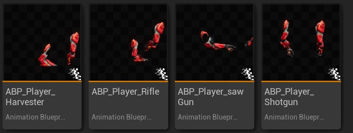
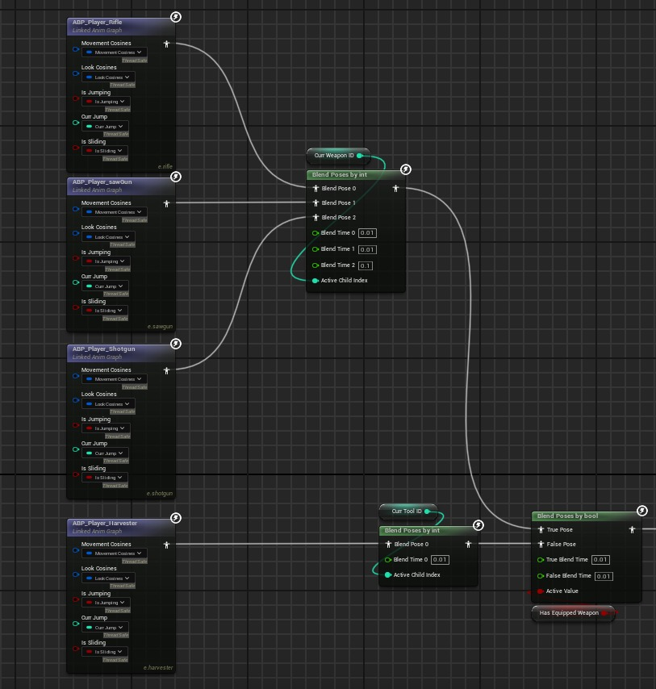
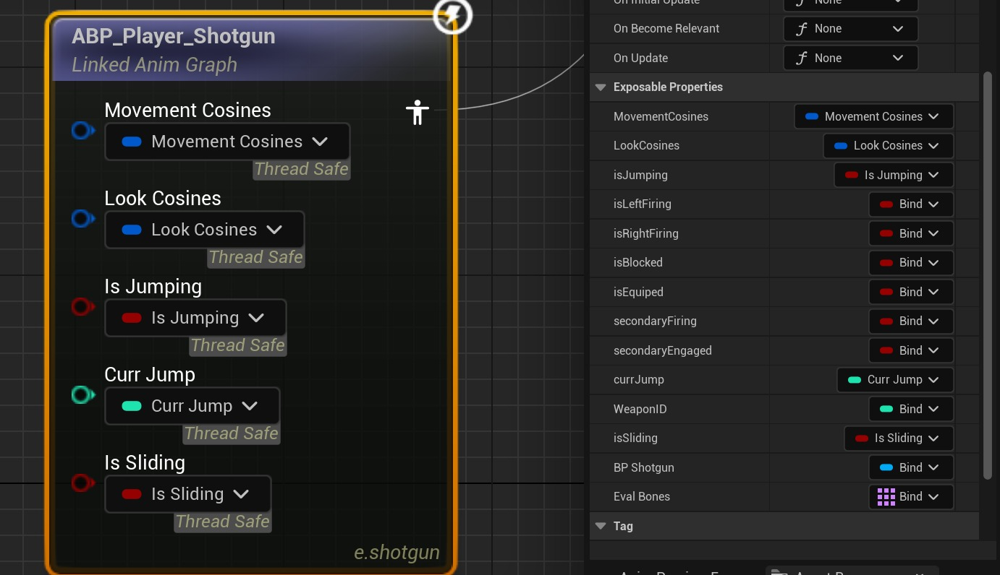
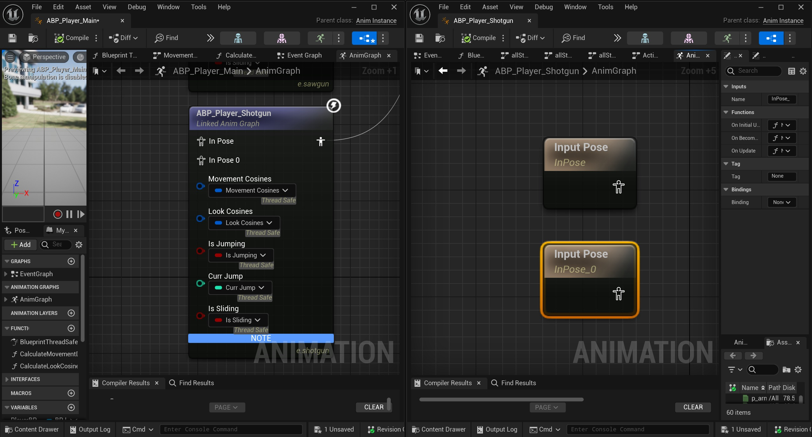

# 链接动画图简介

## 来源与状态

- 原始 URL：https://dev.epicgames.com/community/learning/tutorials/Zblz/unreal-engine-introduction-to-linked-anim-graphs

## 运行时分类

- 类型：图文教程
- 判断：API 未识别到核心视频信号，可整理正文约 944 字符。

## 摘要

本教程介绍了如何开始为他们的项目使用链接动画图

## 中文整理

### 概览

当角色需要独特的动画逻辑时很有用。假设玩家拥有 4 种具有独特状态逻辑的武器，并为每种武器设置了 ABP

我们想根据某些条件在这些图表之间进行切换。因此，在 ABP 中我们可以设置在这些之间切换的逻辑

注意：如何切换之间的逻辑是任意的。可能仍然有一些公共变量需要访问，我们只需要在Main ABP中引用一次并绑定到相应的变量即可

注意：您甚至可以决定接受链接动画图表中的输入姿势以进行混合逻辑

需要注意的一个缺点是，这些链接图即使在不相关的情况下也会打勾；我建议依靠 threadSafeUpdate 来读取变量 TL:DR 链接的动画图是一个易于使用但功能强大的工具，可以模块化您的动画图并防止意大利面条
