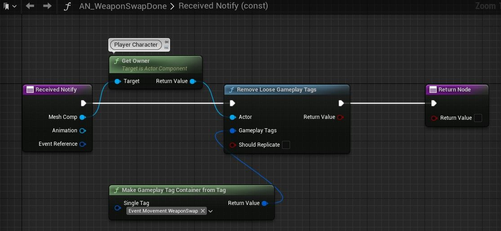
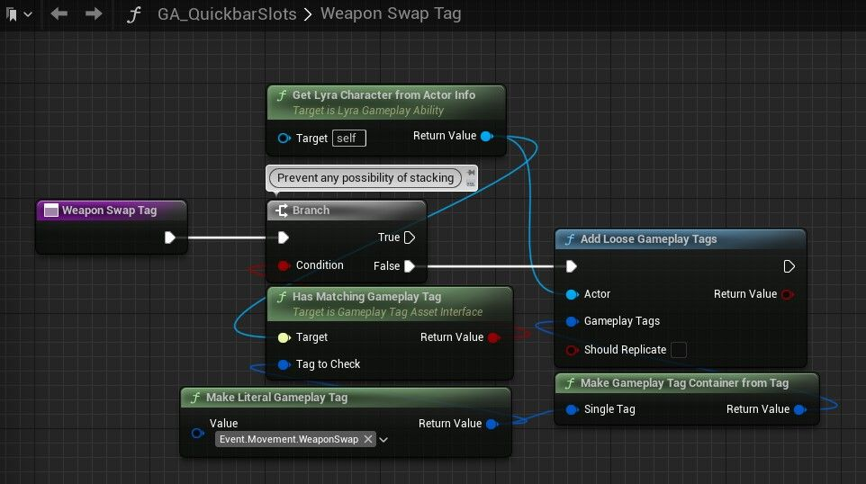
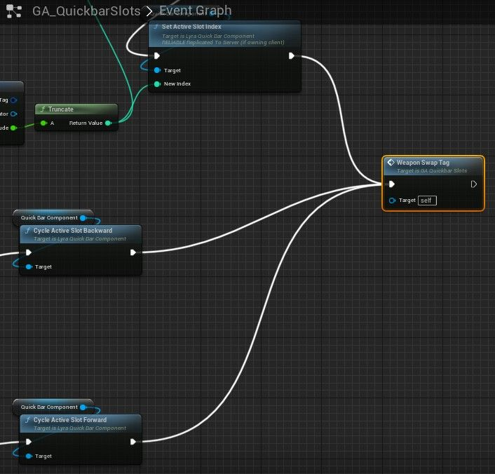
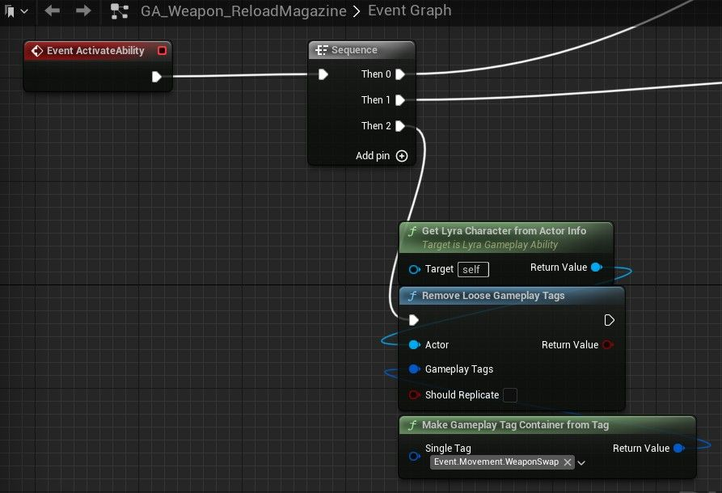
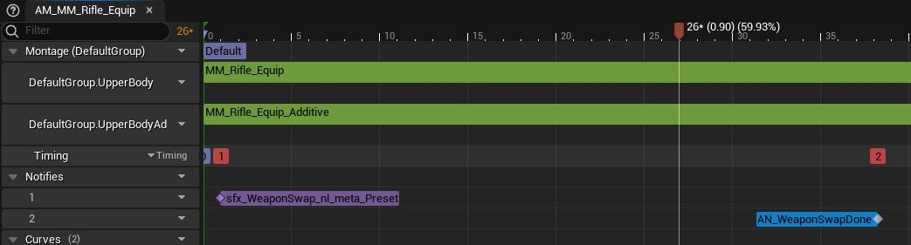
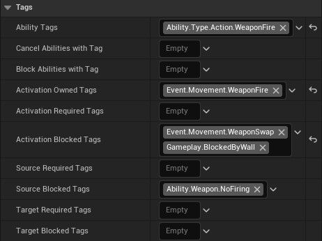
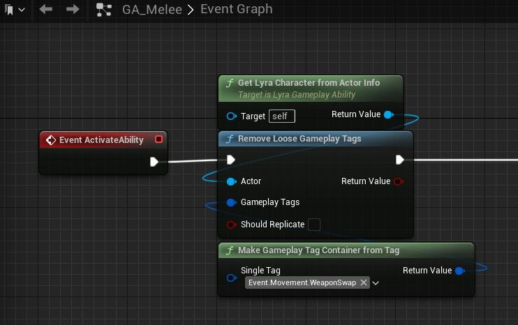
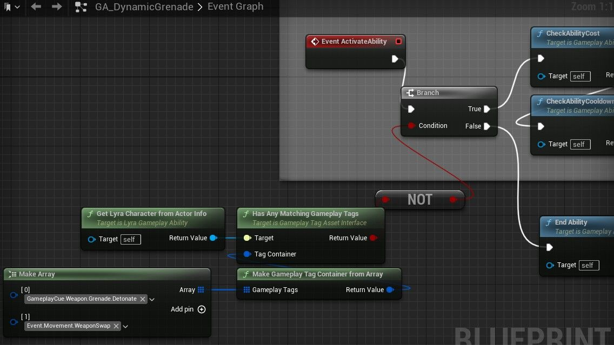

# LYRA：防止武器组合

## 来源与状态

- 原始 URL：https://dev.epicgames.com/community/learning/tutorials/w6Jm/unreal-engine-lyra-prevent-weapon-combos

## 运行时分类

- 类型：图文教程
- 判断：API 未识别到核心视频信号，可整理正文约 1791 字符。

## 摘要

我们将讨论如何防止玩家在交换武器时立即开火。 PVP 必备。

## 中文整理

### 概览

天琴座不会阻止玩家在交换/装备武器时立即射击。寻求优势的玩家总是会寻找像这样的机制+组合来获得几乎不可能反击的即时杀戮。对于任何 PVP 游戏来说，处理好这一点都很重要。 *我们可以这样... *

### 步骤

1. GA_Weapon_Fire -> 将 Event.Movement.WeaponSwap 添加到激活阻止标签。 (图6) 2. GA_QuickbarSlots -> 创建函数来添加标签：Event.Movement.WeaponSwap (图1, 2) 3. 创建AN_WeaponSwapDone 来删除标签。 *（文件夹：内容/角色/英雄/能力）*（图0） 4. AM_MM_Rifle_Equip + AM_MM_Pistol_Equip -> 添加AN_WeaponSwapDone。 （图4、5） 5. 删除GA_Weapon_ReloadMagazine 中松散的游戏标签（图3）。 （因为，如果武器是空的，它会在装备时自动重新加载，覆盖装备动画并且不会删除标签。如果武器是空的并在重新加载之前更改为另一个武器，则可能会发生这种情况，因此当再次装备时，它会立即自动重新加载。） 1.也在GA_Melee上执行此操作（图7）。任何可以取消装备动画（从而防止删除标签）的能力都需要删除标签本身。 （我想找到一种更干净的方法，但不知道。）可以通过在装备时进行近战来观察对此的需要。如果你有冲刺或滑行等能力，他们也会需要它。 2.还有……关于GA_Grenade。我选择在装备时阻挡手榴弹（图8）。如果游戏有皮套/未装备也很好。我们只关心装备。 （回想起来，*WeaponEquip* 可能是比 *WeaponSwap* 更具体的术语。）如果您找到任何使此过程变得更简单的方法，特别是在标签删除方面，请告诉我。

### 图片

- [Lyra 入门游戏](https://dev.epicgames.com/community/learning/paths/Z4/lyra-starter-game)

## 相关链接

- [Lyra Starter Game](https://dev.epicgames.com/community/learning/paths/Z4/lyra-starter-game)
