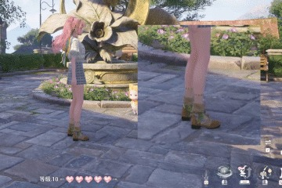
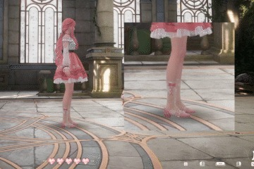
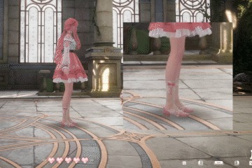
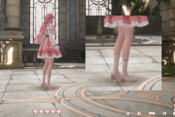
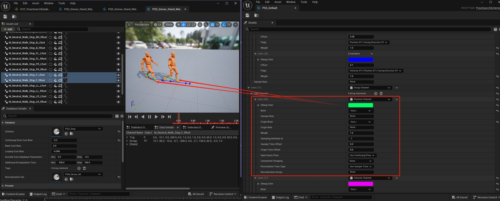
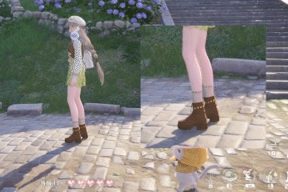
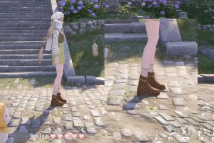
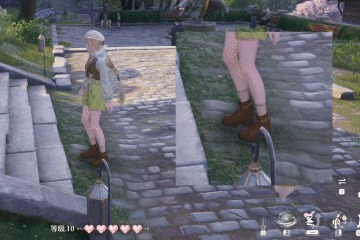
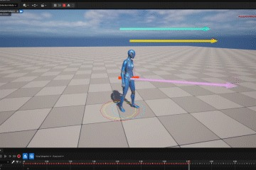
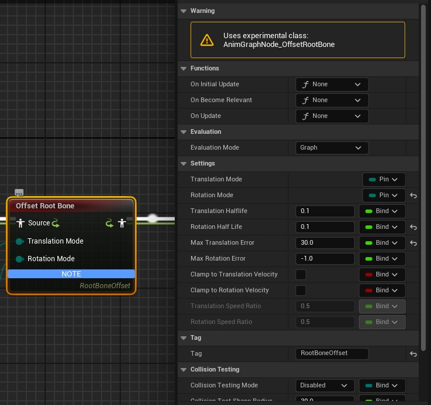

# 解析《无限暖暖》的运动系统，并尝试使用MM系统讲解其效果实现

## 来源与状态

- 原始 URL：https://dev.epicgames.com/community/learning/tutorials/KP1e/unreal-engine-mm

## 运行时分类

- 类型：图文教程
- 判断：API 未识别到核心视频信号，可整理正文约 2117 字符。

## 摘要

游戏好赞，女儿好看！ 本文内容基于个人见解，如有错误敬请见谅。

## 中文整理

### 解析《无限暖暖》的运动系统，并尝试使用MM系统讲解其效果实现

最近有在编写过关于MotionMatching系统（以下简称为MM系统）的文章，也有在研究其接入AI控制的案例，脑子里自然就都是这块东西。《无限暖暖》开服的时候，大喵给我打了两个电话（虽然我都没接），由于白天在忙东西就先把游戏给下了。晚上进游戏时候，被狠狠惊艳到了，特别是运动系统，着实不简单！恰巧跟自己研究的有点关联，便顺便研究一下。 前排提醒：本人既非项目成员也并非叠纸员工，文章将以**假设《无限暖暖》使用MM系统**的前提下进行讲解。所有内容均基于个人见解，如有错误敬请谅解。 首先是待机-起步-行走-止步-待机的循环。使用键鼠控制，按下移动键的时候角色就开始移动/转向了，粘滞感不明显。使用手柄控制，点拨摇杆可以看到角色表现出将动未动的情况（第二张图的键盘交互UI是因为刚进游戏就插着手柄玩，没进到设置界面该操控方式）。在之前的文章中讲述过MM系统可以通过动作输入对Actor进行预测，进而计算出未来时间点的速度，用于设置动画切换的条件。当动作输入不足以驱动角色移动，未能满足从待机状态到起步动画的条件，或者中途中断了动作输入，迫使角色从起步动画返回到待机状态，即形成了所谓的粘滞感。

然后是最为我称赞的。先看下面两张图

虽然都是起步动作，但若左脚在前就先迈左脚，右脚同理。说明在起步时会根据当角色左右脚的位置关系会选择使用不一样的起步动画。在之前文章有有讲述到“‘匹配’，也就是使用数据库里的动画姿势，与某个给定的参考值进行差异对比，得出差异最小的动画姿势就是即将播放的动画”，但只讲述对轨迹进行匹配的例子。当前的情况就需要进行“角色姿势”的匹配。这需要引入Pose Search Schema与Pose Search Channel（也就是之前讲述到的PSS与PSC）资产的讲解。（官方文档见*这里*）。PSS主要作用是配置到PSD中，在进行匹配时，依次对其中设置的各个PSC（通道）与这些通道在当前角色姿势下的属性值进行对比，进而选出最优解。以起步为例，起步的PSD的PSS配置了左右脚相对位置的通道，在进行起步动画的匹配时，对比当前状态下左右脚的位置信息，若左脚在前，则左脚起步的动画更容易被选中，反之亦然。（下图为官方项目中Stop动画的PSD，根据当前左右脚的相对位置来选用不同的止步动画）

若存在左右脚区分的起步动画，那必须配套完整的左右脚区分的待机，止步以及转身动画，动画资产的需求突然暴涨。

MM系统中，角色Actor与角色模型（骨骼体）的旋转是独立进行的，当角色模型（骨骼体）播放转向动画时，角色Actor在接受到输入时就已经完成了转向，因此在制作转向相关的动画资产时需要注意根骨骼的运动情况。

MM系统中可以使用RootBone Offset节点实现骨骼体与角色Actor的位置与旋转偏移。

Setting面板中的Translation Mode跟Rotation Mode适用于设置于骨骼体与Actor的变换关系，可以选择Accumulate（累积）、Hold（保持）、Interpolate（插值）跟Release（释放）。个人项目中如图设置进行设置 Strafe状态下将Rotation Mode设置为Accumulate即可让骨骼体保持原来朝向时设置Acotr的朝向为输入方向，然后按照匹配结果播放相应的转身动画。 以上是在Orient to movement模式下的运动，接下来看Strafe状态下的动画表现。 *这里*Strafe状态下运动时，脚部保持继续运动，下半身身体会转向角色的运动方向。在MM系统中可以使用Orientation Warping节点实现该种效果（官方文档介绍见*这里*）。当启用效果时，下半身将转向运动方向，而上半身依据Spine层接逐层递减以保证朝向维持一致。 在自己个人案例中进行如下设置： 对于角色的运动系统先到这里，然后来看看NPC的运动表现（这里暂时不讨论大喵的运动情况） NPC起步也有左右脚的区分，只是似乎没有根据待机状态下左右脚的相对位置进行选择 转身起步也有对应到左右脚的区分 若无针对角色当前姿势进行匹配，则可以不设置骨骼位置等相关的PSC（或将相关的PSC权重降低），只要当前情况符合转身起步的PSD的筛选条件，即可找到合适的转身起步动画进行衔接。 对需要转弯的情况，项目采用延长转向转弯时间，逐渐插值到目标方向的方案。 个人项目中采用类似的方法在AI角色前进时实时调整方向，但目前只应用在转弯角度较小的情况上，对于转弯角度较大的情况个人更倾向先停止移动，在选取转向起步来设置骨骼体旋转的方案。 且在NPC正常运动过程中，很少会出现滑步的情况。 到此就是个人对《无限暖暖》运动系统的解析。再次声明：本文是基于假设《无限暖暖》使用MM系统的前提下进行讲解，且文章内容全部基于个人理解，若有错误敬请见谅。先不讲技术实现，跟后期调整的工作量，单是区分左右脚的动作资产就可以看出制作组在运动系统下了很多心思，就为了制作这些几乎不被察觉的细节，叠纸真的强，Respect！
