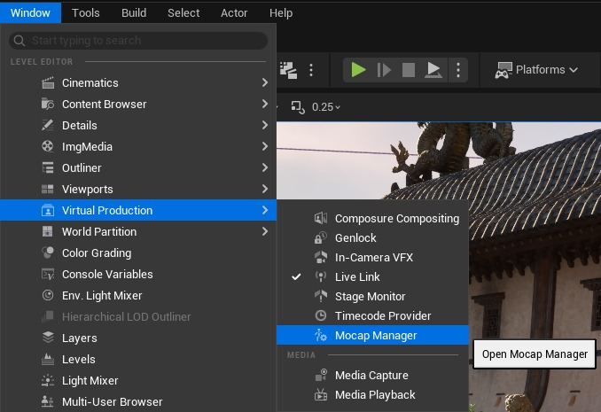
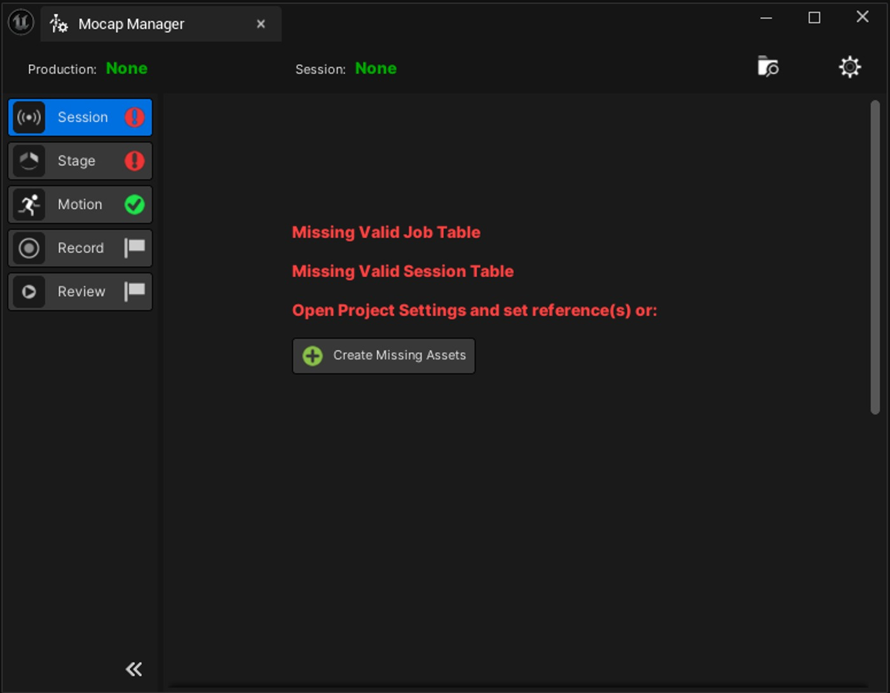
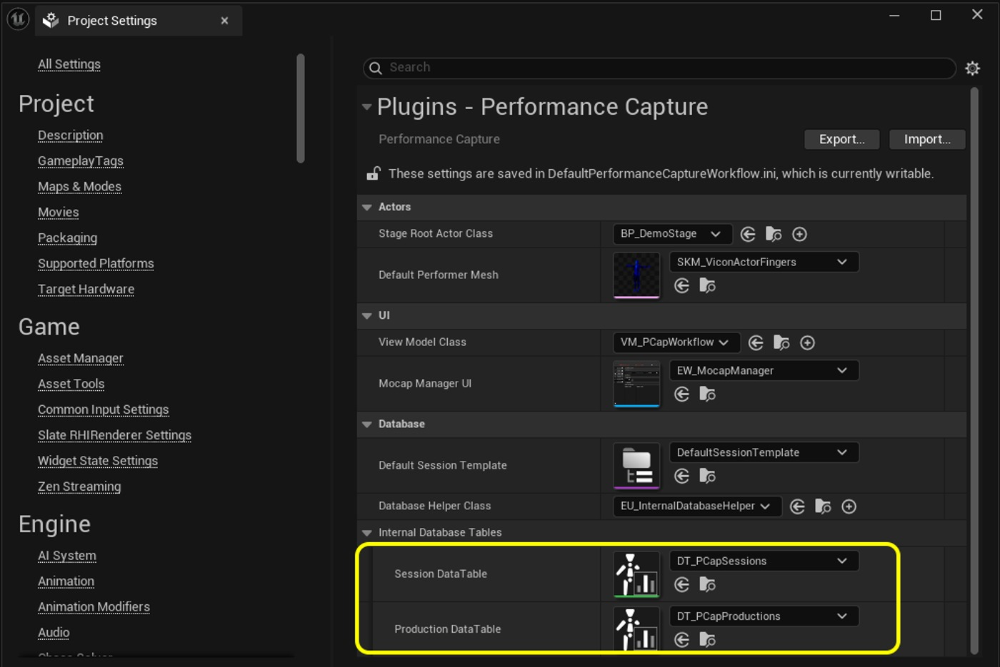
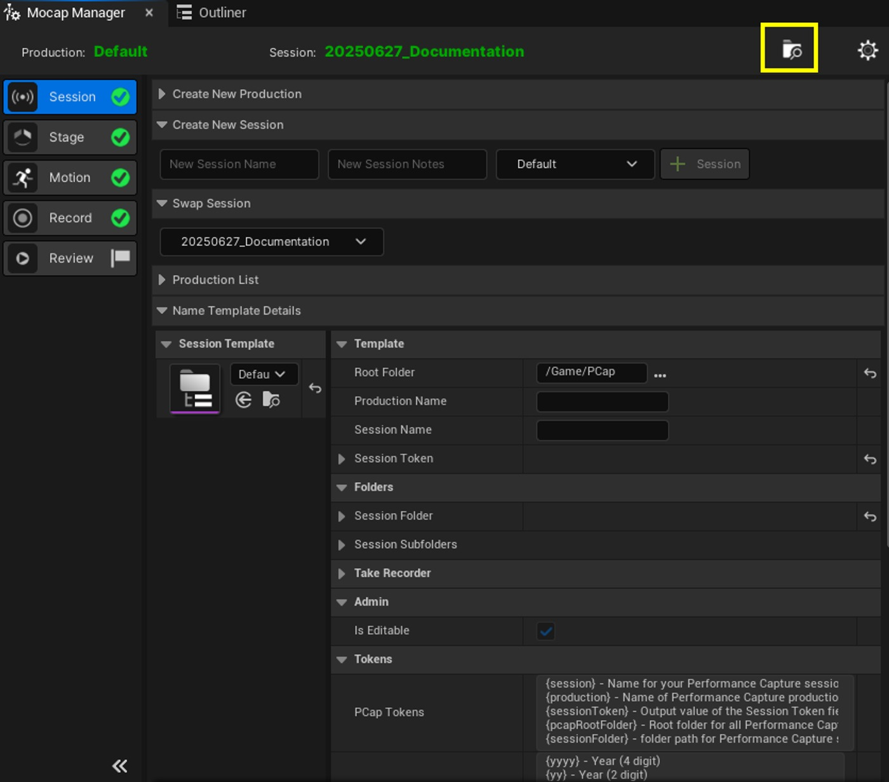
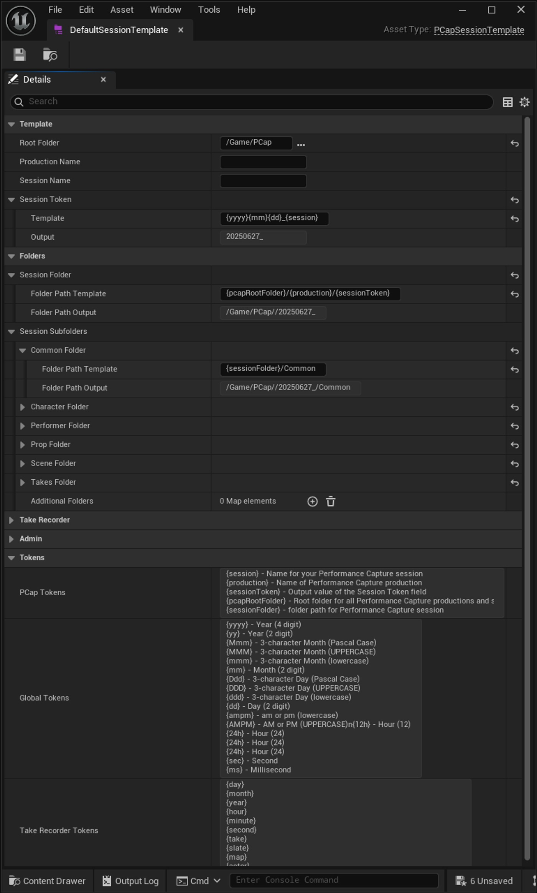
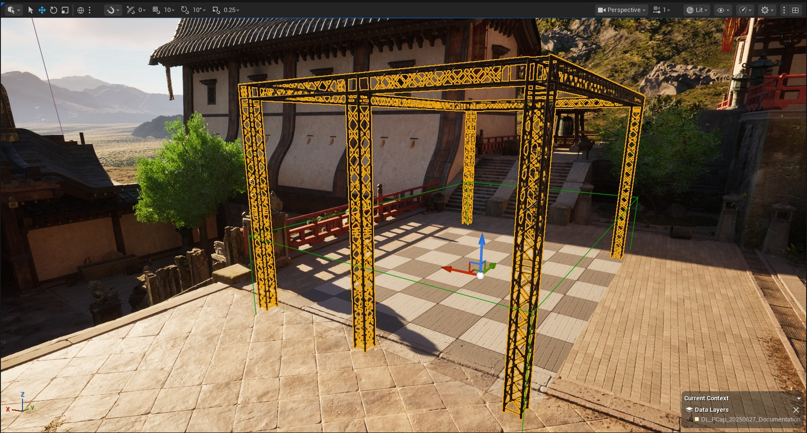
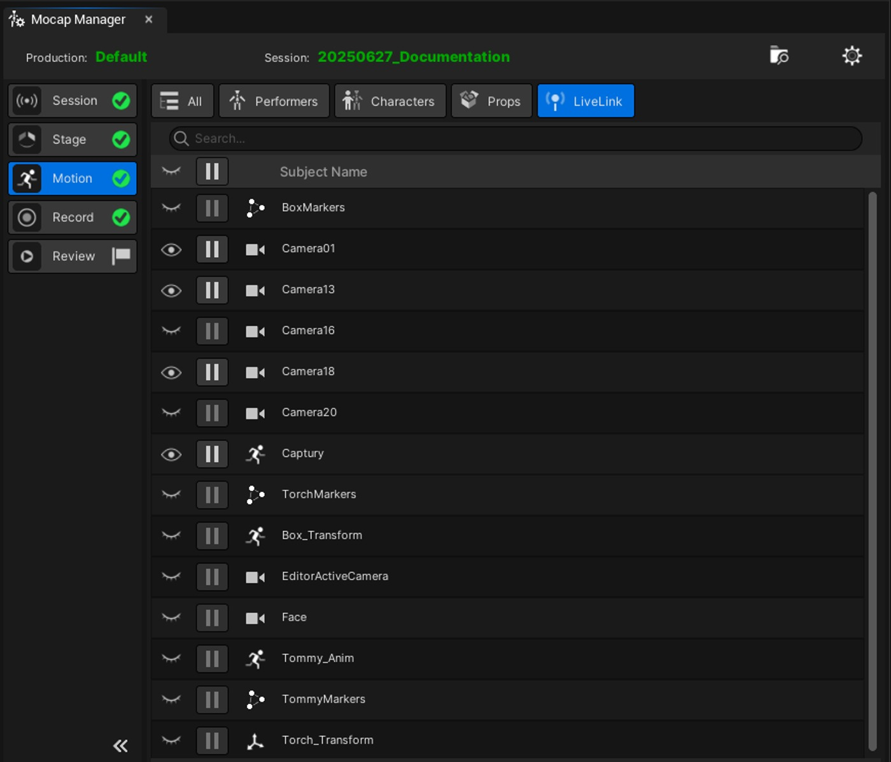
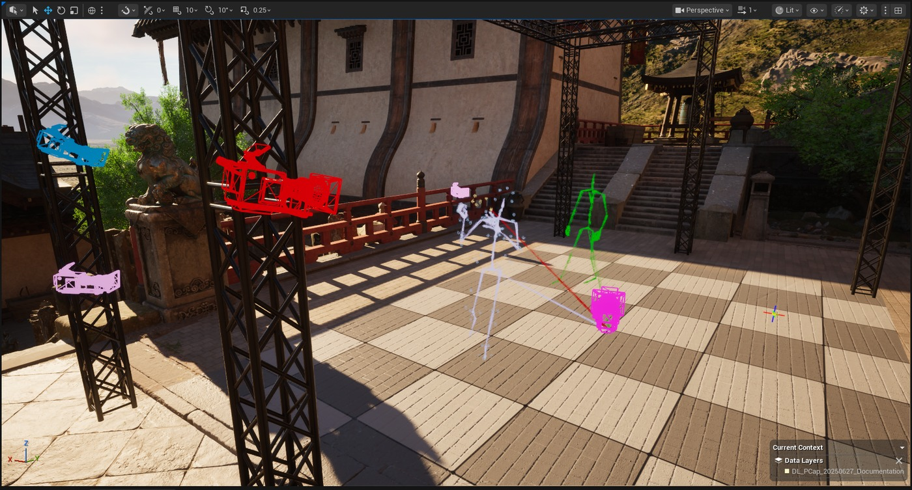
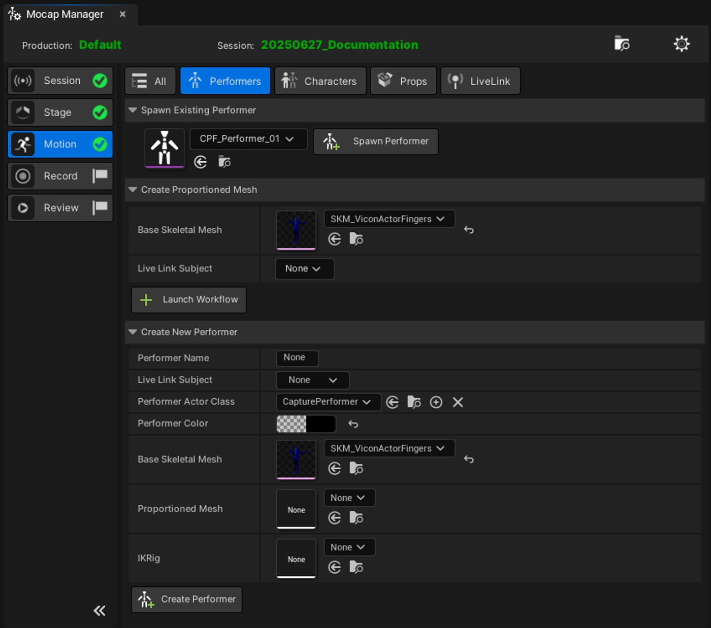

# 动作捕捉管理器教程

## 来源与状态

- 原始 URL：https://dev.epicgames.com/community/learning/tutorials/V1Y6/unreal-engine-mocap-manager-tutorial
- 原始文件：unreal-engine-mocap-manager-tutorial.origin.md
- 分段：第 1/2 段

## 运行时分类

- 类型：图文教程
- 判断：运行时未识别到核心视频信号，可整理正文约 11518 字符。

## 摘要

本指南提供了 Mocap Manager 的演练，Mocap Manager 是性能捕捉工作流程插件的一部分，首次在虚幻引擎 5.6 中发布。

## 中文整理

### 概述

本指南提供了 Mocap Manager 的完整演练，Mocap Manager 是虚幻引擎中性能捕获工作流程插件的一部分。它包括启用插件、设置动作捕捉舞台表现、管理表演者、角色和道具、录制和审查镜头——所有这些都是为了支持虚幻编辑器中的完整表演捕捉管道。

### 变更日志：

5.7：第二次修订，于 2025 年 10 月 24 日发布 表演者创建工作流程更新 添加了有关动态 Prop 组件的部分 添加了有关 Take Recorder 白名单的部分 5.6：第 1 版，发布于 2025 年 6 月 27 日

### 第一次跑步指南

- 转到编辑 > 插件。转到编辑> 插件。 - 搜索并启用性能捕获工作流程插件。搜索并启用性能捕获工作流插件。 - 出现提示时重新启动编辑器。出现提示时重新启动编辑器。 - 导航至窗口 > 虚拟制作 > Mocap Manager。导航到窗口 > 虚拟制作 > Mocap Manager。 - 如果出现提示，请单击“创建缺失的资产”。如果出现提示，请单击“创建缺失的资产”。 - 确认将它们存储在默认文件夹：Content/Pcap。确认将它们存储在默认文件夹：Content/Pcap。或者您可以在内容浏览器中手动创建会话和生产表。在内容浏览器中，转至添加 > 性能捕获 > PCap 数据表，并创建一张包含会话结构的表和一张包含生产结构的表。在项目设置 > 性能捕获中设置对这两个新表的引用。您只需在启用性能捕获工作流程插件的每个项目中执行一次此操作。您可能还想创建自己的会话模板来定义如何创建会话文件夹。您可以通过转至添加 > 性能捕获 > PCap 数据集并选择会话模板类型来执行此操作。或者，您可以复制此资源并根据您的需要进行修改：/Plugins/PerformanceCaptureWorkflow/Core/DefaultSessionTemplate

### 分步指南

动作捕捉管理器被设计为一个集中位置，用于控制动作捕捉拍摄期间所需的内容。 UI 旨在引导您从开始到结束线性地完成整个过程。

### 创建会话

- Enter a session name and any optional notes. Enter a session name and any optional notes. - 单击“+会话” 将创建文件夹结构并激活。单击“+会话” - 将创建文件夹结构并激活。将创建一个文件夹结构并使其处于活动状态。 Mocap Manager 一次只能有一个活动会话。使用 Mocap Manager 中的此按钮随时导航到您的会话文件夹：制作可用于组织更大的工作，例如在一个虚幻项目中单独的游戏或电影交付。它们是可选的，如果您不想使用它们，则可以使用默认的产品。会话代表单独的拍摄会话（例如上午或下午的拍摄）。创建会话时，会创建会话期间使用的文件夹和一些资源。会话模板允许使用动态命名令牌自定义文件夹结构和命名。 Mocap Manager 创建的所有演员都将被分配到会话的数据层或子级别。 Each session gets a new datalayer or sub-level.当您创建会话时，Mocap Manager 将检查您当前打开的关卡是否正在使用世界分区或关卡流。在 [SessionName]/Scenes 文件夹中，将创建一个数据层或子关卡，具体取决于创建上下文，这将是您关卡的编辑上下文。这意味着所有参与者都将被放置在这个上下文中。

### 设置动捕舞台

Performance Capture 工作流插件附带了一个名为 BP_DemoStage 的预制默认值。您可以根据需要复制和编辑此 BP。舞台将在镜头前的有效地板上生成。将其移动并与现实世界的捕捉空间对齐。从动捕管理器面板的舞台部分，您可以切换网格视图和舞台幻影网格，以便更轻松地定位，从而使现实世界的舞台与虚幻关卡相协调。当您生成舞台时，它将被添加到您的关卡的“当前上下文”中

### 动作演员设置

在此阶段，您可以配置 Live Link 主题、创建表演者、分配角色和生成道具。

### 实时链接预览

通过此选项卡，您可以切换传入实时链接主题数据的显示。图标指示数据类型：骨架网格物体、相机、标记。您可以通过单击“显示/隐藏”图标选择显示单个主题或全部主题。

### 创建表演者

此选项卡允许您创建和生成表演者。表演者封装在称为 PCapPerformer 的数据资产中。在“创建比例网格部分”中，设置实时链接主题。注意：只有角色类型为“动画”（骨骼数据）的主体才会列在下拉列表中。启动表演者工作流程 将骨骼与原点对齐（骨盆位于 (0,0)） - 为此，要求表演者移动他们的位置，直到他们对齐。 5.7 - 您可以通过打开高级部分并选择“约束骨盆”来避免要求表演者将自己重新定位在原点上。这会将选定的骨盆骨骼锁定在动作捕捉系统原点上方的适当位置。或者，按暂停键冻结动画，让表演者从将姿势保持在原点上方的状态中放松下来。单击“创建网格和 IK 装备”这将关闭比例网格视口并返回 Mocap 管理器面板。完成所有设置，然后... 单击“创建执行者”以生成 PCapPerformer 数据资产 现在可以从“生成执行者”部分中选择执行者。点击 Spawn，将生成应用了 Live Link 数据的新创建的骨架网格物体，并将其作为 Stage Root actor 的父级。

### 创建道具

单击“启动工作流程”传入变换数据的枢轴由轴网格显示。

您可以选择添加标记数据主题，以查看可用作实时链接主题的任何光学标记。

- 选择静态或骨架网格物体。

选择静态或骨架网格物体。

- 分配实时链接主题。

分配实时链接主题。

- 调整局部空间偏移以进行对齐。

调整局部空间偏移以进行对齐。

- 为道具命名并单击“完成”。

为道具命名并单击“完成”。

这将带您返回道具选项卡。

如果您愿意，请单击“创建道具资产”按钮。

这将创建 PCapPropDataAsset。

您可以通过从选取器中选择它并单击 Spawn Prop，以与 Performer 数据资源相同的方式将其生成到关卡中。

默认情况下，5.7 中的 props 创建为使用“DynamicPropComponent”。

这是一个蓝图定义的 actor 组件，您可以通过覆盖“计算动态偏移”函数来自定义它。

您不需要自定义它，因为已经有逻辑来控制将动态偏移应用于单手道具。

将道具生成到关卡中后，单击“道具偏移”按钮： - 召唤道具调整面板。

在这里，您可以设置您想要处理道具的 CaptureCharacters 以及应该针对手部接触测试哪些骨骼： 最终结果： 提示：为了获得最佳结果，在动作捕捉软件中，将跟踪道具的枢轴设置为尽可能靠近道具的手部接触区域。

默认情况下，超人类蓝图并不适合动作捕捉重定向和录制，因为它们不使用 SkeletalMeshComponent 作为根组件。

说明： - 创建从 CaptureCharacter 派生的蓝图。

创建从 CaptureCharacter 派生的蓝图。

- 将必要的骨架网格物体组件从超人类蓝图中复制到新的 CaptureCharacter 派生 BP 中。

还要复制任何新郎。

确保禁用所有这些组件上的贴花。

将必要的骨架网格物体组件从超人类蓝图中复制到新的 CaptureCharacter 派生 BP 中。

还要复制任何新郎。

确保禁用所有这些组件上的贴花。

- 在除头部之外附加到根的所有骨架网格物体组件上，在构造脚本中添加“跟随领导者姿势”节点，以强制这些组件从根组件获取其姿势。

在除头部之外附加到根的所有骨架网格物体组件上，在构造脚本中添加一个“跟随领导者姿势”节点，以强制这些组件从根组件获取其姿势。

- 在新的 CaptureCharacter BP 的性能捕获部分中，取消选中“强制所有组件跟随领导者”。

在新的 CaptureCharacter BP 的“性能捕获”部分中，取消选中“强制所有组件跟随领导者”。

注意如果您的角色不是超人类或不使用多个网格物体，您可以直接使用 CaptureCharacter 并分配单个骨架网格物体。

### 创建一个角色

填写角色创建表： - 角色名称：输入您选择的名称。角色名称：输入您选择的名称。 - 表演者资产：选择您希望驾驶该角色的表演者。表演者资产：选择您希望驾驶该角色的表演者。 - Actor 类：如果需要，请选择从 CaptureCharacter 类创建的自定义蓝图（例如，使用上面的超人类示例），否则使用默认的 CaptureCharacter 类。 Actor 类：如果需要，请选择从 CaptureCharacter 类创建的自定义蓝图（例如，使用上面的超人类示例），否则使用默认的 CaptureCharacter 类。 - 身体骨架网格物体：指定身体网格物体。这是重新定位所必需的。身体骨架网格物体：指定身体网格物体。这是重新定位所必需的。单击“创建角色资源”。生成角色数据资产，存储对表演者、重新定位资产、IKRig、Mesh 和 CaptureCharacter 类的引用。单击“生成角色”将您的角色生成到场景中。它将附加到 Stage Root actor。

### 调整重定向

使用重定向调整器修改每个骨骼链上的重定向属性。重新目标调整器设计为仅与人形两足动物一起使用，其链专门命名为与自动 IK Rig 脚本创建的链相匹配。

### 动捕录音机

使用带有镜头名称和元数据的板来预定义您的录音名称。这也为在会议期间完成清单提供了便利。板岩存储在数据表中。您可以通过 .csv 导入更新，就像任何其他类型的数据表一样。单击您选择的记录板上的“准备”，以使用该名称进行文本录制。选择要捕获的演员和数据（表演者、道具、实时链接、音频）。单击“录制”即可开始。录制时界面锁定。完成后单击“停止”。性能捕获工作流插件包含一个名为：TakeRecorderAllowList 的蓝图类，可在此处找到：/PerformanceCaptureWorkflow/Record/TakeRecorderAllowList 此蓝图是 AssetUserData 的类，可应用于骨架网格物体资源编辑器的资源详细信息面板中的骨架网格物体，或作为 CaptureCharacter 或 CapturePerformer 蓝图的根骨架网格物体组件上的属性。默认情况下，批准的骨骼名称是为超人类/UE5 骨骼预先配置的。曲线名称预先填充了 Metahuman Animator 控制曲线。您还可以添加将从 Mocap Recorder 录制中排除的组件列表。这些组件的名称应与蓝图的类大纲中的名称相匹配。该对象的预期用途是防止在多骨架网格物体组件角色上记录不需要的组件和属性。
