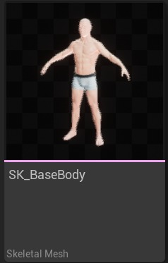
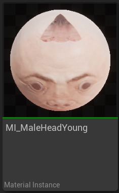
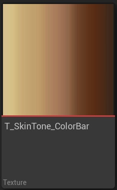
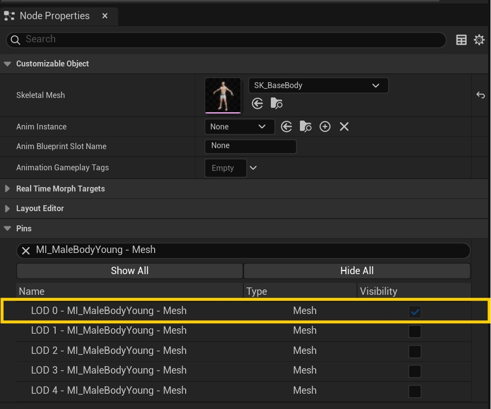
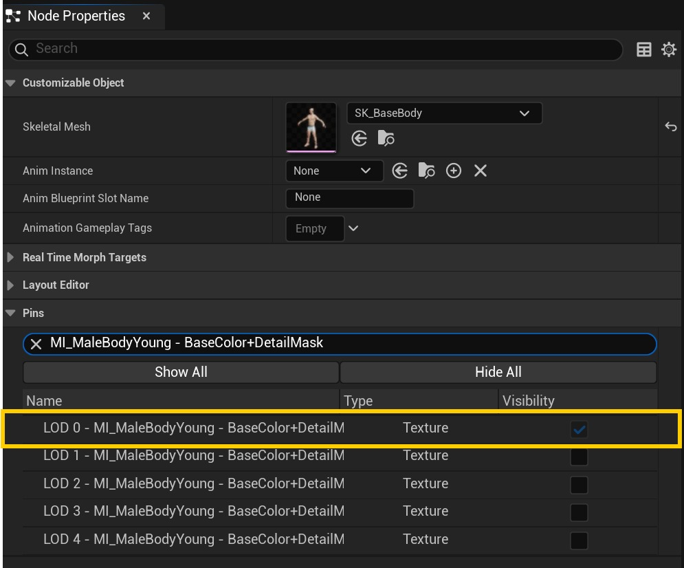
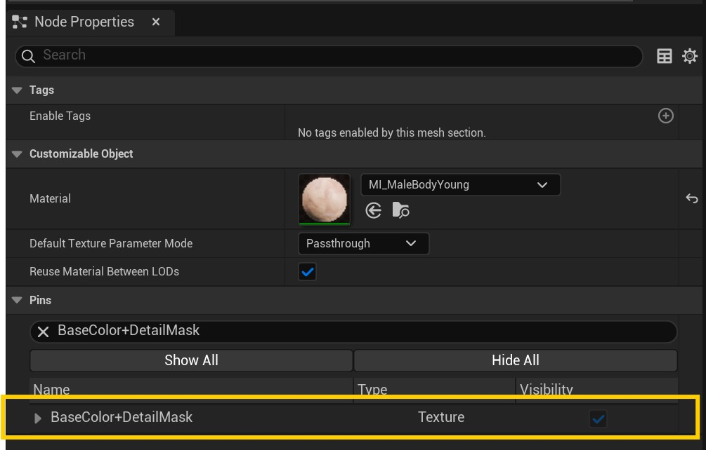
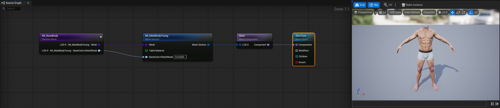
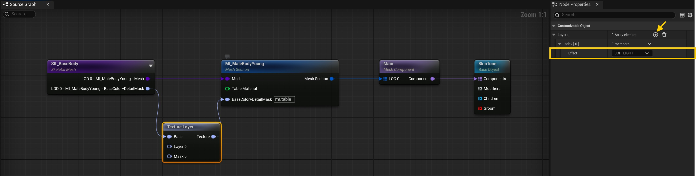
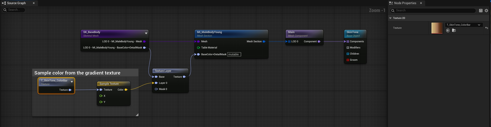
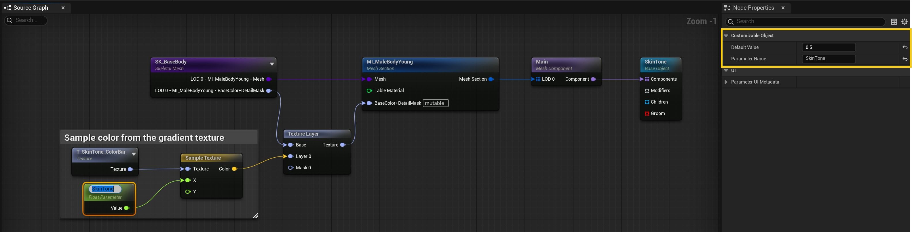

# 可变：改变角色的肤色

## 来源与状态

- 原始 URL：https://dev.epicgames.com/community/learning/tutorials/33v6/unreal-engine-mutable-change-the-skin-tone-of-a-character

## 运行时分类

- 类型：图文教程
- 判断：API 未识别到核心视频信号，可整理正文约 5141 字符。

## 摘要

演示如何更改角色肤色的教程。

## 中文整理

### 概览

返回[可变教程](https://dev.epicgames.com/community/learning/tutorials/yjw9/unreal-engine-mutable-tutorials)

### 概述

本教程介绍如何设置可变图来改变纹理的颜色。我们将逐步展示如何使用渐变肤色条更改角色的肤色。为此，我们将使用纹理混合效果。本教程生成的可自定义对象可以在 Content/Tuotirlas/CO_SkinTone 的 [可变示例](https://www.fab.com/listings/209e82f6-ad40-4253-b565-d2f65b12efe7) 中找到。

### 所需资产

在此示例中，我们将需要一个基础骨架网格体、一个材质和一个颜色渐变纹理。 - 对于基础网格物体，我们将使用 SK_BaseBody 及其默认材质 MI_MaleBodyYoung。

- 作为颜色渐变，我们将使用 T_SkinTone_ColorBar 纹理。

### 步骤

1. 第一步是创建一个初始对象资源，其中包含 **基础对象**、**组件**、**网格体部分** 和 **骨架网格体** 节点。有关详细信息，请参阅[简单可自定义对象](https://dev.epicgames.com/community/learning/tutorials/Y41o/unreal-engine-mutable-simple-customizable-object)教程。 1. 在本例中，我们将使用 SK_BaseBody 骨架网格体和材质 MI_MaleBodyYoung。我们只对 BaseColor+DetailMask 纹理和 LOD 0 - MI_MaleBodyYoung - Mesh 部分感兴趣。为了在视觉上简化图表，我们将仅公开所需的引脚。 - 选择骨架网格物体节点，然后在“节点属性”选项卡的“引脚”部分中，单击“隐藏全部”。 - 在同一选项卡中搜索 LOD 0 - MI_MaleBodyYoung - 网格部分并显示它（可见性* *检查）。

- 在同一选项卡中搜索 LOD 0 - MI_MaleBodyYoung - BaseColor+DetailMask 纹理参数并显示它。

- 选择 **Mesh Section** 节点并显示 BaseColor+DetailMask 纹理。

1. 隐藏所有不必要的引脚后，您应该得到类似于下图所示的图形：

2. 我们的目标是将材质基色纹理与从渐变纹理中选取的颜色混合。我们还想让用户使用滑块编辑颜色。为此，我们首先将纹理层节点添加到图形中： - 添加 **纹理层** 节点并将 *Base* 引脚连接到 **骨架网格体** 节点 LOD 0 - MI_MaleBodyYoung 网格引脚。 - 将纹理层节点 **输出引脚** 连接到网格部分节点 BaseColor+DetailMask 引脚。 - 通过选择节点并在“节点属性”选项卡中单击 + 号，将 **新层** 添加到纹理层节点。 - 在子菜单中选择效果，在本例中我们将使用 **SOFTLIGHT**。 2. 现在纹理层应该有 2 个额外的引脚：层 0 和掩模 0。

3. 接下来我们将创建图层操作数以达到所需的效果。在这种情况下，我们需要根据从渐变纹理采样的颜色创建纹理。 - 将 **Texture 节点** 添加到图表并为其分配 T_SkinTone_ColorBar 纹理。 - 添加**示例纹理节点**并将渐变纹理连接到纹理* p*in。 - 将**示例纹理节点**连接到纹理层节点中的第 0 层引脚。 3. Layer 节点接受颜色作为层操作数。这与连接单色纹理具有相同的结果。 3. 添加新节点后，图形应如下所示：

4. 默认情况下，“采样纹理”节点将对在坐标 X = 0、Y = 0 处连接的纹理进行采样。我们希望能够使用滑块更改采样坐标，以在纹理的不同部分进行采样。由于我们的渐变纹理仅在 X 坐标上发生变化，因此滑块应该仅修改该坐标。 - 添加 **Float Parameter** 节点并将其命名为 *SkinTone*。要命名它，您可以转到节点属性或节点本身。 - 将“浮动参数”节点连接到“样本纹理”节点中的 X 引脚。 - 我们还可以为参数添加默认值，在这种情况下为 0.5。

4. 编译后，名为 *SkinTone * 的滑块应作为 **实例参数** 显示在 *预览实例* 选项卡（*实例参数* 部分）中。该滑块将修改“样本纹理”节点中 X 坐标的输入值，使我们能够控制从渐变纹理中选取的颜色。 4. 移动滑块将相应地更改*预览视口*。例如，如果我们将该值设置为 1.0，我们应该得到以下结果： 5. 最后，请注意该效果应用于整个纹理。这可能不是我们想要的。例如，内衣应该不会受到影响。为了解决这个问题，**纹理层**节点有一个引脚来指定将应用效果的蒙版。 BaseTexture+DetailMask 引脚在 Alpha 通道中有一个遮罩，可用于我们的目的。我们将使用**中断纹理** **节点**来提取通道。 - 添加 **Break Texture** **节点** 并将 BaseTexture+DetailMask 引脚从骨架网格物体节点连接到其输入引脚。 - 将****Break Texture**** 节点中的Alpha Pin 连接到Texture Layer**** 节点Mask 0 Pin。 5. 设置应类似于下图： 5. 编译图形后，肤色效果将仅应用于最终纹理的皮肤部分。最终图表应类似于下图：
