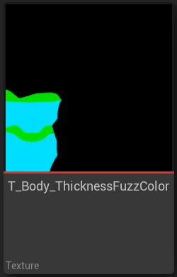
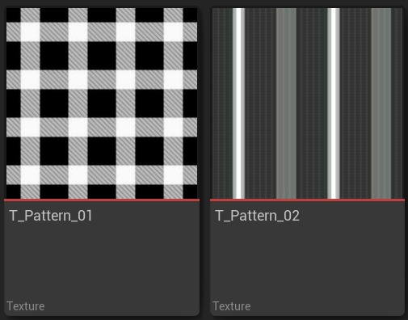
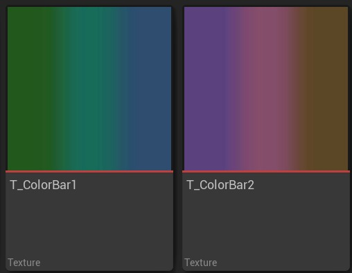
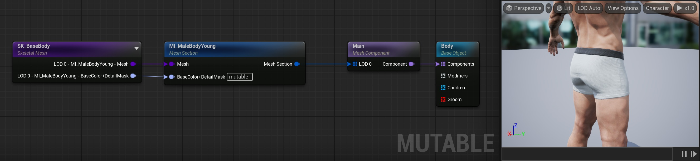
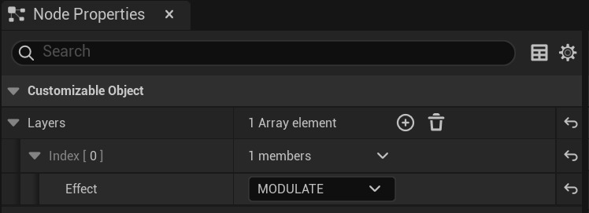
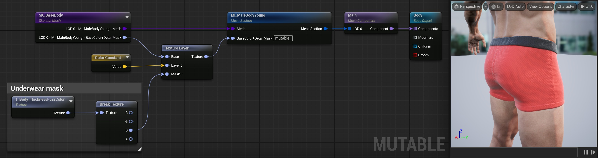
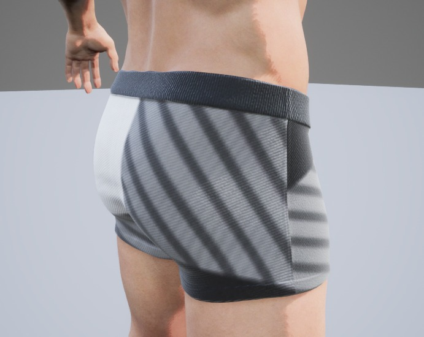
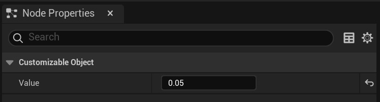
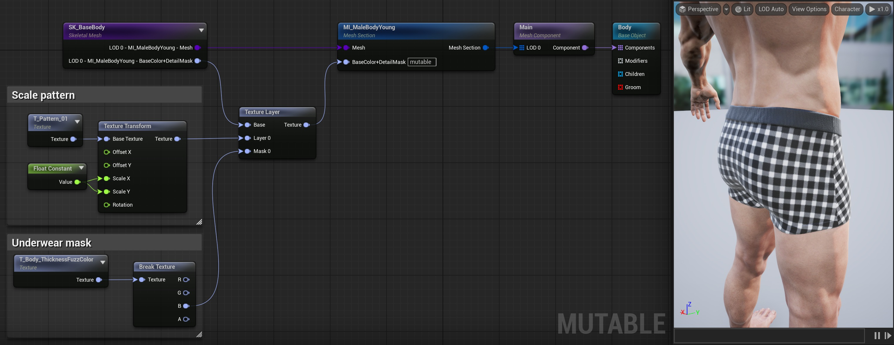

# 可变：创建可定制的颜色图案

## 来源与状态

- 原始 URL：https://dev.epicgames.com/community/learning/tutorials/kym3/unreal-engine-mutable-create-customizable-color-patterns

## 运行时分类

- 类型：图文教程
- 判断：API 未识别到核心视频信号，可整理正文约 6387 字符。

## 摘要

教程展示了如何使用 Mutable 插件为角色创建可自定义的颜色图案。

## 中文整理

### 概览

返回[可变教程](https://dev.epicgames.com/community/learning/tutorials/yjw9/unreal-engine-mutable-tutorials)

### 概述

本教程介绍如何在角色布料的纹理中添加颜色图案。其中，两种颜色的图案被应用到一件内衣上。控制图案及其颜色的选项将在运行时公开。我们建议在开始创建任何可自定义对象之前访问[基本概念](https://github.com/anticto/Mutable-Documentation/wiki/Basic-Concepts)页面。这些示例生成的可自定义对象可以在 Content/Tutorials/ColorPatterns 的 [可变示例](https://www.fab.com/listings/209e82f6-ad40-4253-b565-d2f65b12efe7) 中找到。

### 所需资产

- SM_BaseBody 骨骼网格体，及其默认材质和纹理。

- 用于选择我们将修改的颜色纹理部分的遮罩：它位于纹理 T_Body_ThicknessFuzzColor 的颜色通道中。

- 布料图案的一些遮罩：T_Pattern_01 和 T_Pattern_02。

- 一些带有我们想要从中获取颜色的颜色条的纹理：T_ColorBar1 和 T_ColorBar2。

### 步骤

1. 使用 **基础对象**、**组件**、**网格体部分** 和 **骨架网格体** 节点创建初始对象资源。有关详细信息，请参阅[简单可自定义对象](https://dev.epicgames.com/community/learning/tutorials/Y41o/unreal-engine-mutable-simple-customizable-object)教程。本教程中我们只需要身体网格部分，忽略头部。

1. 在此示例中，我们使用“骨架网格体”和“网格体部分”节点的“节点属性”选项卡中的“Pins*”部分公开了 BaseColor+DetailMask 纹理参数。 2. 使用遮罩确保我们只改变内衣的颜色，其余纹理保持不变。内衣口罩的布料部分在蓝色通道内。 - 添加纹理层节点，并连接基础和输出，如下所示。将图层效果设置为调制。

- 添加一个带有 T_Body_ThicknessFuzzColor 纹理的 **Texture** ******node**。 - 添加“中断纹理”节点以分割该纹理的颜色通道。将蓝色通道 B 连接到纹理层蒙版。 - 现在创建一个 **Constant Color** 节点并将其连接到纹理布局的第 0 层输入。在其中设置您喜欢的任何颜色（我们使用红色）。 2. 重新编译对象，您应该看到如下内容：

2. 遮罩正在工作，我们正在将要修改的对象部分绘制为红色。 3. 添加布料图案： - 删除上一步中的 **Constant Color** 节点。 - 添加一个新的 **Texture ** 节点并为其指定 T_Pattern_01 纹理。作为测试，将其连接到 **Texture Layer** 的 **Layer 0** 引脚并重新编译。在这个比例下，图案看起来还不太好，因为它很大，而且内衣纹理区域相对较小。

- 在图案节点和纹理层之间添加一个**纹理变换**节点。 - 添加 **Float Constant ** 节点并将其设置为 0.05（我们将模式减小到 tis 大小的 5%）。

- 将其连接到变换节点的 Scale X 和 Scale Y 引脚。重新编译以更好的比例查看模式。

- 在这个比例下，图案看起来不错。 4. 允许玩家更改一些颜色： - 在 **纹理变换** 和现有纹理层之间添加新的 **纹理层** 节点。我们将使用它来应用颜色。 - 要控制内衣的主要颜色，请创建一个具有良好默认值的基本颜色参数。添加新的 **Texture From Color** 节点将颜色转换为纹理。将其连接到新的**纹理层**的**底座**引脚。 - 要应用图案颜色，我们将在纹理层中使用调制效果，但请随意尝试其他着色选项。当应用于白色、中灰色和黑色时，它们的表现都不同。 - 将纹理变换（缩放图案）的输出引脚连接到着色纹理层节点的掩模 0。添加一个新的“颜色参数”节点，并将其连接到前一个“纹理层”节点的“层 0”引脚。在*节点属性*中设置一个好的默认值和参数名称。 - 再次重新编译对象。 4. 我们对注释进行了分组并重新组织了图表，随着图表的增长，这非常有用。如您所见，编译对象后，新参数将出现在“预览实例”窗口的“实例参数”下。您现在可以在运行时更改此颜色参数。 5. 增加选择不同图案的选项。 - 在 **纹理变换** 和包含当前图案的 **纹理** 节点之间添加一个 **纹理切换 ** 节点。 - 添加一个连接到前一个节点的 Switch Parameter 的 **Enum Parameter** 节点。您现在可以在节点属性中设置可用选项。 - 您现在可以看到 **Texture Switch** 节点具有每个枚举选项的输入引脚。将原始图案纹理连接到其中之一，并为第二个选项添加一个新的 **Texture ** 节点，选择 T_Pattern_02 资源。 - 重新编译以查看结果，包括预览选项中的新参数。 6. 限制用户可以选择的颜色。 - 删除两个 **颜色参数 ** 节点。我们现在将从预定义的调色板中获取颜色。 - 在其位置添加两个示例纹理节点。我们将使用纹理来提供可用的颜色。 - 添加两个 **Texture ** 节点并为它们分配示例颜色条纹理 T_ColorBar1 和 T_ColorBar2。将它们连接到示例纹理节点。 - 添加一个新的 **Float Parameter** 节点，该节点将同时控制两种颜色。为其命名，并将其连接到来自 **SampleTexture** 节点的两个 **X** 输入。 6. 约束颜色的其他方法可以使用 **Enum Parameter** 来命名预设，就像我们对模式所做的那样，或者使用 **Table** 节点（每种颜色对应一行）。

### 进一步的工作

要继续此示例，可以通过多种方式扩展这些自定义选项： - 添加更多模式选项。 - 还可以自定义腰部橡胶的颜色。 - 通过用多个 **浮点参数** 替换连接到 **纹理变换** 的 **浮点常量**，向用户公开图案旋转和缩放的参数。 - 通过使用更多的 **纹理层** 节点层来重叠多个图案，可以在节点属性中添加这些层。 - 通过组合更简单的纹理而不是使用 2 个预制选项来创建新图案。
