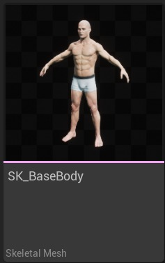
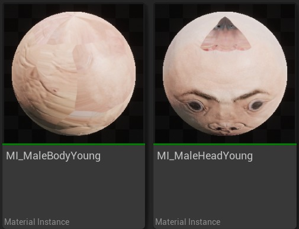
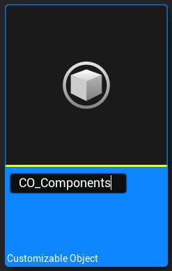
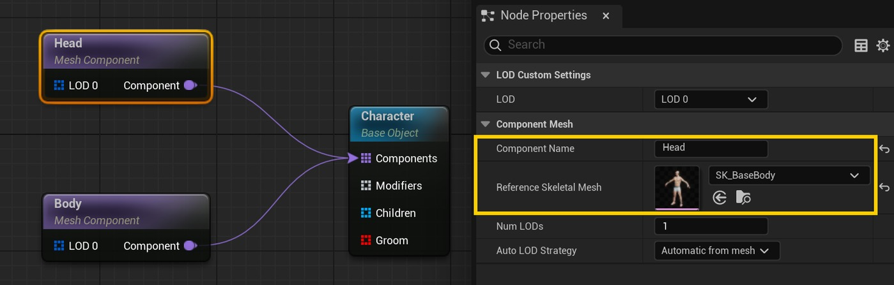
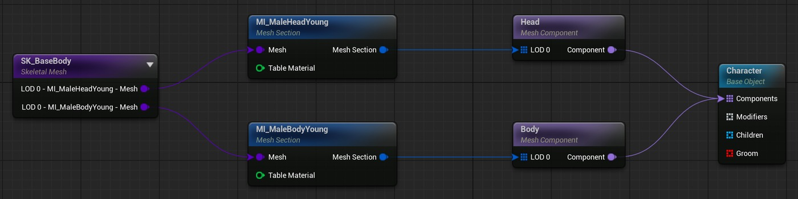
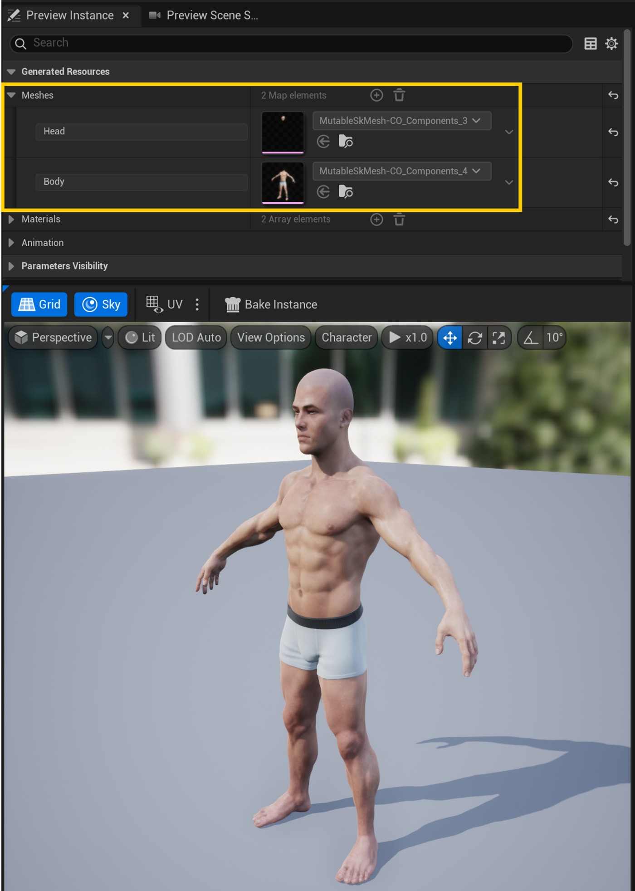
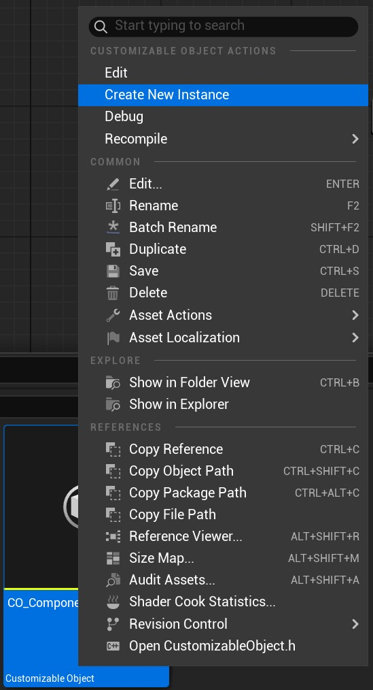
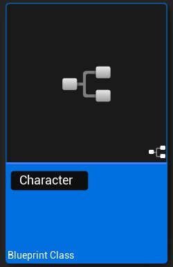
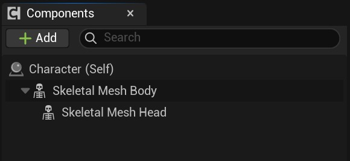
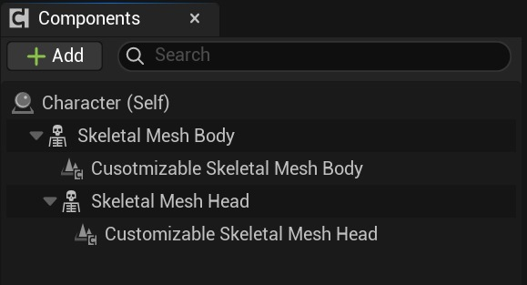

# 可变：创建具有多个组件的对象

## 来源与状态

- 原始 URL：https://dev.epicgames.com/community/learning/tutorials/awzo/unreal-engine-mutable-create-objects-with-multiple-components

## 运行时分类

- 类型：图文教程
- 判断：运行时未识别到核心视频信号，可整理正文约 4346 字符。

## 摘要

教程介绍如何创建具有多个组件的对象。

## 中文整理

### 概览

返回可变教程

### 概述

在本教程中，我们将了解如何使用 Mutable 创建多个骨架网格物体。稍后我们将了解如何将它们添加到游戏中的骨架网格体组件中。我们建议在开始本教程之前阅读向角色添加基于网格的布料教程。这些示例生成的可自定义对象可以在内容/教程/组件的可变示例中找到。

### 所需资产

- SK_BaseBody 骨架网格物体。 SK_BaseBody 骨架网格物体。 - MI_MaleBodyYoung 和 MI_MaleHeadYoung 材质（默认 SK_BaseBody 材质）。 MI_MaleBodyYoung 和 MI_MaleHeadYoung 材质（默认 SK_BaseBody 材质）。

### 创建可定制的对象

- 创建一个新的可自定义对象资产。创建一个新的可自定义对象资源。 - 添加两个新的组件节点。为每个网格命名并添加一个参考网格。添加两个新的组件节点。为每个网格命名并添加一个参考网格。 - 添加一个新的骨架网格体和两个网格体截面节点，每个组件一个。将每个网格体部分连接到其相应的骨架网格体部分（MI_MaleHeadYoung 和 MI_MaleBodyYoung）。添加一个新的骨架网格体和两个网格体截面节点，每个组件一个。将每个网格体部分连接到其相应的骨架网格体部分（MI_MaleHeadYoung 和 MI_MaleBodyYoung）。 - 编译并查看生成的骨架网格物体。与向角色添加基于网格的布料教程相比，您会看到现在我们生成了两个骨架网格物体，而不是一个。在下一节中，我们将了解如何创建使用它们的 Actor。编译并查看生成的骨架网格物体。与向角色添加基于网格的布料教程相比，您会看到现在我们生成了两个骨架网格物体，而不是一个。在下一节中，我们将了解如何创建使用它们的 Actor。

### 创建游戏角色

- 从先前创建的可自定义对象创建新的可自定义对象实例。从先前创建的可自定义对象创建一个新的可自定义对象实例。 - 创建一个新的 Actor 类型的蓝图类并打开它。创建一个新的 Actor 类型的蓝图类并将其打开。 - 在蓝图类中，创建两个新的骨架网格体组件并命名它们。将现有的 DefaultSceneRoot 替换为 Body。在蓝图类中，创建两个新的骨架网格体组件并命名它们。将现有的 DefaultSceneRoot 替换为 Body。 - 通过在每个骨架网格体组件下创建一个可自定义的骨架组件来标记每个骨架网格体组件。通过在每个骨架网格体组件下创建一个可自定义骨架组件来标记每个骨架网格体组件。 - 使用之前创建的可自定义对象实例配置每个新创建的可自定义骨架网格体。为每个组件分配一个不同的组件名称（该名称必须与先前创建的组件节点的名称相匹配）。使用之前创建的可自定义对象实例配置每个新创建的可自定义骨架网格体。为每个组件分配一个不同的组件名称（该名称必须与先前创建的组件节点的名称相匹配）。 - 在视口中，您将看到两个骨架网格物体组件已自动填充有可变生成的骨架网格物体。在视口中，您将看到两个骨架网格体组件已自动填充有可变生成的骨架网格体。

### 可定制的对象实例用法

正如您所看到的，之前创建的 Actor 具有两个虚拟可自定义骨架组件的开销。尽管它们对于标记是必需的，但它们不提供任何其他功能。您可以使用可自定义的对象实例用法，而不是使用可自定义的骨架组件。唯一的缺点是您只能在 Blueprint/C++ 中创建它们。以下是如何创建它们的简单示例： - 删除先前创建的可自定义骨架组件。删除之前创建的可自定义骨骼组件。 - 在构造脚本中创建新的可自定义对象实例用法，将其附加到骨架网格体组件并设置可自定义对象实例和组件名称。在构造脚本中创建新的可自定义对象实例用法，将其附加到骨架网格体组件并设置可自定义对象实例和组件名称。 - 重复上一步，但对于头部组件。重复上一步，但对于 Head 组件。 - 角色 - 组件 - 可变 - 定制

## 相关链接

- [Mutable Sample](https://www.fab.com/listings/209e82f6-ad40-4253-b565-d2f65b12efe7)
- [Overview](https://dev.epicgames.com/community/learning/tutorials/awzo/unreal-engine-mutable-create-objects-with-multiple-components#overview)
- [Required Assets](https://dev.epicgames.com/community/learning/tutorials/awzo/unreal-engine-mutable-create-objects-with-multiple-components#requiredassets)
- [Create a Customizable Object](https://dev.epicgames.com/community/learning/tutorials/awzo/unreal-engine-mutable-create-objects-with-multiple-components#createacustomizableobject)
- [Create a Gameplay Actor](https://dev.epicgames.com/community/learning/tutorials/awzo/unreal-engine-mutable-create-objects-with-multiple-components#createagameplayactor)
- [Customizable Object Instance Usage](https://dev.epicgames.com/community/learning/tutorials/awzo/unreal-engine-mutable-create-objects-with-multiple-components#customizableobjectinstanceusage)
