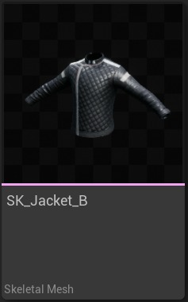
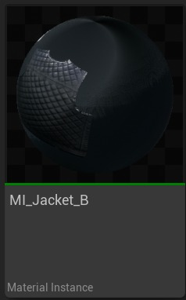
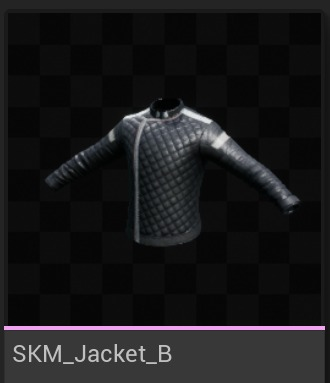
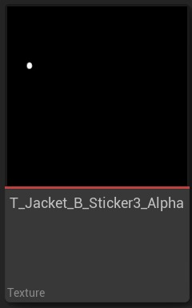
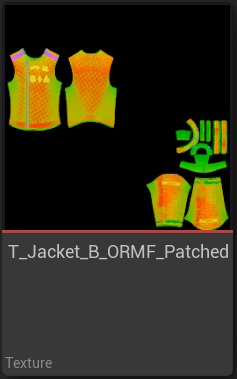
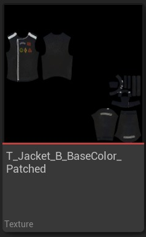
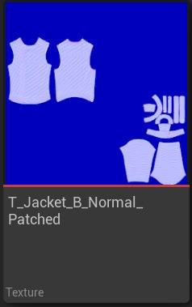
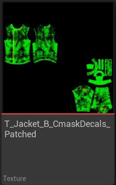
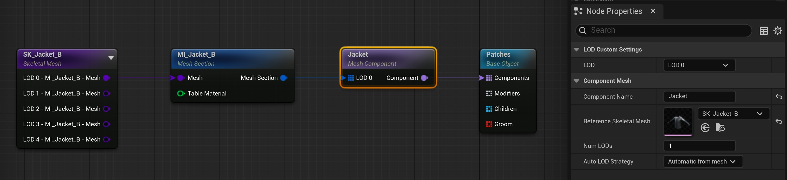
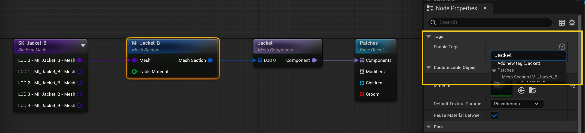

# 可变：带补丁的夹克

## 来源与状态

- 原始 URL：https://dev.epicgames.com/community/learning/tutorials/JPpJ/unreal-engine-mutable-jacket-with-patches

## 运行时分类

- 类型：图文教程
- 判断：API 未识别到核心视频信号，可整理正文约 8062 字符。

## 摘要

本教程旨在向您介绍组和子节点、布局、标签以及可变节节点可以具有的一些输入引脚类型的概念。

## 中文整理

### 概览

返回[可变教程](https://dev.epicgames.com/community/learning/tutorials/yjw9/unreal-engine-mutable-tutorials)

### 概述

本教程介绍如何创建一个可自定义对象，该对象将应用到夹克上的补丁作为参数公开。此示例介绍了组和子对象节点的概念。它还向您介绍了布局、标签的概念以及网格部分节点可以具有的引脚类型。我们建议在创建任何可自定义对象之前访问[基本概念](https://github.com/anticto/Mutable-Documentation/wiki/Basic-Concepts)页面。这些示例生成的可自定义对象可以在 Content/Tutorials/Patches 的 [可变示例](https://www.fab.com/listings/209e82f6-ad40-4253-b565-d2f65b12efe7) 中找到。

### 静态补丁

您可以在 Content/Tutorials/Patches/CO_Patches 中找到已设置的可自定义对象。

### 所需资产

- SK_Jacket_B 骨架网格体及其默认材质 (**MI_Jacket_B**) 和纹理。

补丁纹理： - **alpha** 纹理，用于屏蔽我们在应用补丁时不想更改的基础纹理的所有部分。我们将使用 T_Jacket_B_Sticker3_Alpha 纹理。

- **ORM **纹理（遮挡粗糙度金属度）用于填充目标材质中的这些通道。为此，我们将使用 T_Jacket_B_ORMF_Patched 纹理。

- 补丁夹克的**基色**纹理。我们将使用 T_Jacket_B_BaseColor_Patched** 纹理。

- 修补夹克的 **法线贴图** 纹理。我们将使用 T_Jacket_B_Normal_Patched 纹理。

- 修补夹克的 **CDX 贴图** 纹理。我们将使用 T_Jacket_B_CmaskDecals_Patched 纹理。

### 步骤

1.新建CO如图所示：

1.记得在Mesh Component节点中设置Reference Skeletal Mesh。参考网格用于为可能输入到节点的所有网格部分定义一些共享设置。必须设置一个。 2. 选择“网格截面”节点，然后在“节点属性”选项卡中查找名为“启用标签”的属性。按 + 按钮并写下“Jacket”一词。按 Enter 键或单击“添加新标签（夹克）”文本以添加标签。

2. 现在，该网格部分已被标记，因此其他节点应该能够通过一些设置，通过引用我们刚刚添加的标签来定位网格部分。 3. 从“修补程序网格对象”节点中的“修改器”引脚拖动连接，然后添加“编辑网格部分”节点。 3. 查找 **Required Tags** 属性并在其中添加新标签。标签的名称将与上一步中使用的名称相同（Jacket）。在 **必需标签** 属性中添加标签允许您关联使用相同名称标记的对象。例如，在前面的例子中，我们本质上要做的就是告诉 Mutable，这个 Edit Mesh Section 节点与与前者共享相同标签的 Mesh Section 节点相关。在实践中，特别是对于此节点，意味着带有标记 Jacket 的网格截面节点将由具有相同标记（在本例中为 Jacket）的编辑网格截面节点进行编辑。 4. 设置“编辑网格截面”节点要使用的 **参考材质**。在本例中，我们将使用与名为 MI_Jacket_B 的网格截面节点相同的节点。 5. 查看“编辑网格部分”节点的“节点属性”选项卡中的“**布局 **”部分。将布局的网格大小设置为 8x8。在选择我们希望节点影响的标记网格截面 UV 中的哪些部分时，这将为我们提供更多粒度。 6. 现在我们可以更好地控制我们可以在布局中选择的部分的大小，继续用布局块覆盖左上角的 UV 岛。它最终应该看起来像这样：通过在布局视图中选择岛屿，您实质上所做的就是告诉主机节点它应该在哪里影响它所定位的节点（在本例中使用标签）。这有助于您限制节点的范围。 7. 向下滚动“节点属性”选项卡，直到到达名为“引脚”的部分。一旦打开除贴纸层之外的所有引脚的可见性。 7. 刚刚在“编辑网格部分”节点中暴露的每个纹理引脚都将用于覆盖网格部分的材质所使用的纹理。这使您可以决定哪些纹理应该被覆盖，哪些不应该覆盖。 8. 创建纹理并将其连接到“编辑网格部分”节点，如下图所示： 9. 要使纹理可由 Mutable 编辑，请选择“网格部分”节点并在“节点属性”选项卡中查找“引脚”部分。继续将“编辑网格部分”节点中编辑的纹理引脚从“直通”更改为“可变”。 *默认纹理参数* 节点属性允许您一次更改所有引脚纹理参数模式。默认情况下，所有纹理都处于直通模式。我们要编辑的所有纹理必须处于可变模式。 10. 此时，您的图表应如下所示： 11. 编译可自定义对象并检查 *Viewport* 选项卡的内容。那里应该显示一个自动生成的可定制对象实例。在这种情况下，夹克的正面贴有补丁。正如您可能已经看到的，“编辑网格部分”节点允许您覆盖标记节点的材质纹理。在这个例子中，我们用它来给我们的夹克增添一点味道。

### 可切换补丁

本节将通过添加补丁参数来扩展上一节。玩家将能够从预定义的补丁集合中选择补丁。为了实现这一点，将添加一些新节点： - 对象组节点。 - 子对象节点。您可以在 Content/Tutorials/Patches/CO_Patches_options 中找到已设置的可自定义对象。

### 所需资产

- 与上一节中使用的资产相同的资产。 - 用于限制纹理编辑操作范围的 alpha 纹理 (T_Jacket_B_Sticker2_Alpha)。

### 步骤

1. 我们将使用上一节中创建的 CO 作为起点。查找 *CO_Patches*，因为它将用作我们的起点： 2. 让我们将路径设置为用户可以打开和关闭的参数： 1. 断开“编辑网格部分”节点中的“修改器”，并将其连接到新的“子对象”节点。 2. 将新的子对象节点命名为 Mutable Patch。子对象节点的行为与参数节点类似，但它们的行为取决于父对象组节点。您将在接下来的步骤中了解它们。 3. 创建一个新的对象组节点，并将可变补丁子对象连接到对象组节点的****对象输入** **。 4. 将新对象组节点命名为 Patches 并将其连接到基础对象节点的 Children 输入。 4. 生成的图表应类似于： 3. 编译可自定义对象并选中“预览实例”选项卡。 3. 将出现一个名为 Mutable Patch 的新参数，允许添加或删除补丁。 4. 现在我们将继续添加第二个选项，以便玩家可以进一步定制夹克。 1. 复制并粘贴从补丁对象组分支的所有节点。 2. 更改新子对象节点的名称，将其命名为 Patience Patch。 3. 更改用作编辑网格部分蒙版的纹理，因此我们使用名为 T_Jacket_B_Sticker2_Alpha 的纹理。 4. 将“子对象”节点连接到“补丁对象组”节点。 5. 编译可自定义对象并查看*预览视口*选项卡的内容。您应该在 中看到几个切换按钮，可以让您决定是否启用每个补丁选项。请随意使用“对象组”节点 *类型* 设置。此处定义的设置将确定连接到对象组节点的子节点如何向用户公开。在示例中，我们使用默认选项 (*Toggle*)，将每个子项公开为离散的开/关选项。检查对象 [Group 节点文档](https://github.com/anticto/Mutable-Documentation/wiki/Node-Object-Group) 以了解每种类型的作用。
