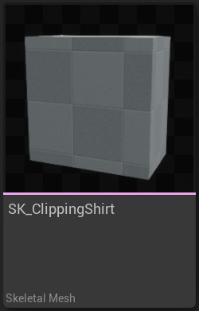
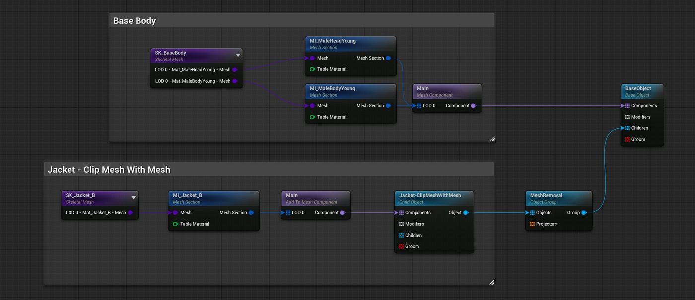
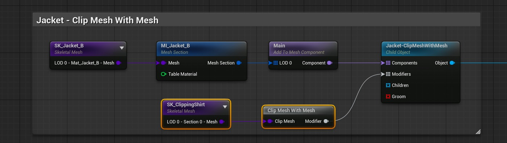
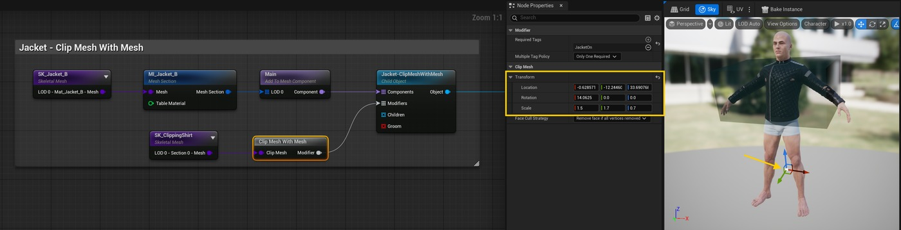
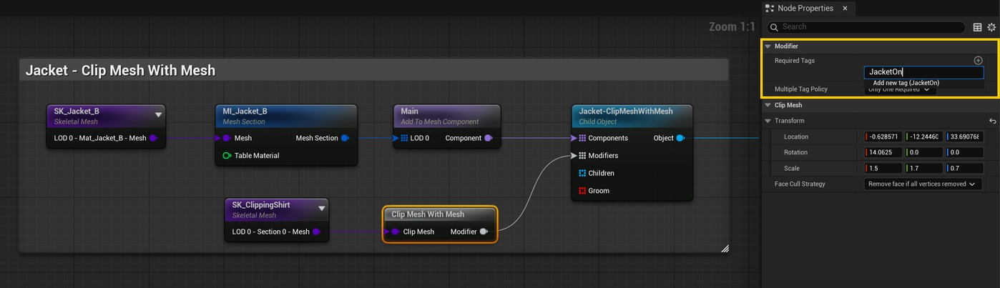
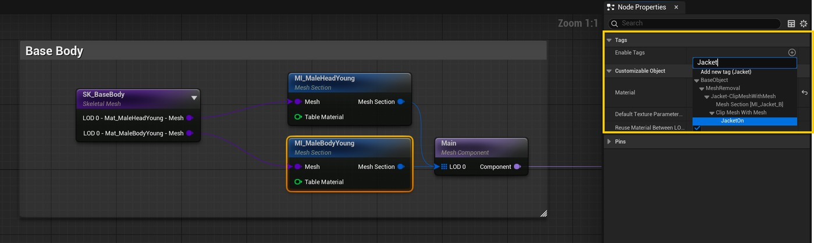
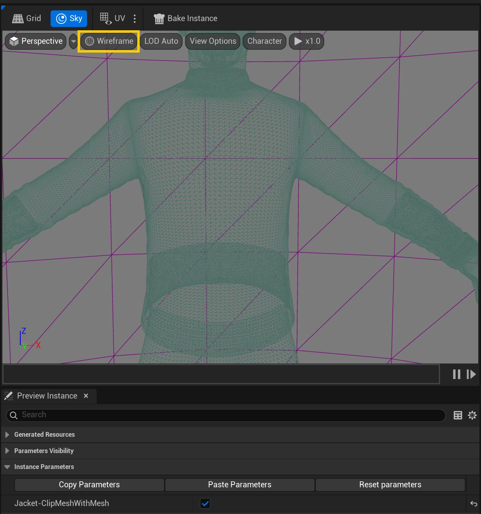
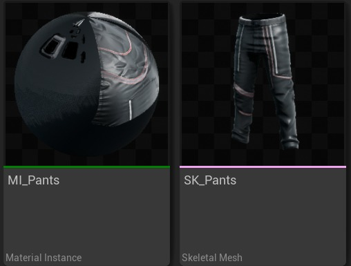
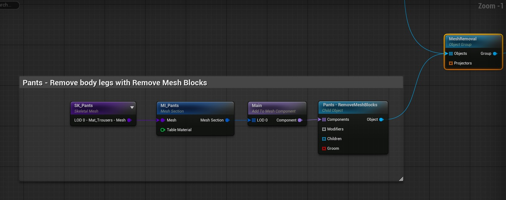
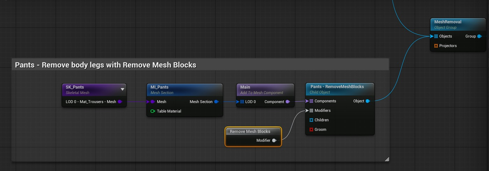

# 可变：删除看不见的网格部分

## 来源与状态

- 原始 URL：https://dev.epicgames.com/community/learning/tutorials/DPO8/unreal-engine-mutable-remove-unseen-mesh-parts
- 原始文件：unreal-engine-mutable-remove-unseen-mesh-parts.origin.md
- 分段：第 1/2 段

## 运行时分类

- 类型：图文教程
- 判断：运行时未识别到核心视频信号，可整理正文约 13610 字符。

## 摘要

本教程展示了如何在使用 Mutable 时删除不可见的网格部分的基础知识。

## 中文整理

### 概览

返回可变教程

### 概述

本教程展示了使用 Mutable 从网格中删除看不见的部分的几种方法。这些操作不仅可用于删除不相关的几何体，而且还可以修复裁剪问题，例如角色上不同服装层之间的裁剪问题。它还简化了资产创作，因为不同的服装不需要完美匹配，尤其是动画。从向角色添加基于网格的布料教程开始，我们将使用 Mutable 提供的工具删除看不见的网格面并修复剪切问题。这些示例生成的可自定义对象可以在 Content/Tutorials/RemoveUnseen 的可变示例中找到。

### 使用剪切体积

在此示例中，我们将展示如何使用带有网格修改器的剪辑网格移除夹克下的身体部分。该方法需要一个网格覆盖我们要删除的身体部分。在这种情况下，我们将使用一个非常简单但有效的网格体。只要它是封闭的网格，体积就可以根据需要详细程度。正如我们稍后将看到的，当我们有兴趣剪切一个区域而不知道落在该区域内的确切网格时，此修改器会很有用。

### 所需资产

在此示例中，除了在将基于网格的布料添加到角色中使用的资源 SK_BaseBody 和 SK_Jacket_B 之外，我们还需要： - SK_ClippingShirt 作为体积网格，用于裁剪夹克下面的身体部分。 SK_ClippingShirt 作为体积网格，用于裁剪夹克下方的身体部分。

### 步骤

- 我们将从将基于网格的布片添加到角色夹克配置开始： 我们将从将基于网格的布片添加到角色夹克配置开始： - 创建一个新的带有网格的剪辑网格节点，并将其连接到夹克子对象节点中的修改器引脚。

使用 SK_ClippingShirt 网格创建一个新的骨架网格体节点，并将其连接到 Clip Mesh With Mesh 节点。

创建一个新的 Clip Mesh With Mesh 节点，并将其连接到 Jacket Child Object 节点中的 Modifiers 引脚。

使用 SK_ClippingShirt 网格创建一个新的骨架网格体节点，并将其连接到 Clip Mesh With Mesh 节点。

- 选择图表中的 Clip Mesh With Mesh 节点，并调整剪切网格变换以剪切夹克下面的身体部分。

这可以在“节点属性”选项卡中或在预览视口中使用变换小控件来完成。

确保启用了 Jacket Toggle 参数以查看需要剪辑的部分。

选择图表中的 Clip Mesh With Mesh 节点，然后调整剪切网格变换以剪切夹克下面的身体部分。

这可以在“节点属性”选项卡中或在预览视口中使用变换小控件来完成。

确保启用了 Jacket Toggle 参数以查看需要剪辑的部分。

- 现在我们需要向修改器指示它应该影响哪些网格截面节点。

这是通过标签系统完成的。

将 JacketOn 标签添加到修改器所需标签列表中。

修改器的必需标签列表指示哪些标签必须启用网格部分才能受此修改器影响。

修改器可以影响图形中具有正确标签的任何网格部分，并将通过子对象启用或禁用。

在我们的示例中，只有在“实例参数”中启用“Jacket”切换时，“Clip Mesh With Mesh”节点才会进行剪辑。

现在我们需要向修改器指示它应该影响哪些网格截面节点。

这是通过标签系统完成的。

将 JacketOn 标签添加到修改器所需标签列表中。

修改器的必需标签列表指示哪些标签必须启用网格部分才能受此修改器影响。

修改器可以影响图形中具有正确标签的任何网格部分，并将通过子对象启用或禁用。

在我们的示例中，只有在“实例参数”中启用“Jacket”切换时，“Clip Mesh With Mesh”节点才会进行剪辑。

- 将 JacketOn 标签添加到 Base Body Mesh Section 节点启用标签列表中。

在此示例中，当 Jacket 子对象处于活动状态时，Clip Mesh With Mesh 修改器将剪辑主体，因为 Body Mesh 部分具有 Enable Tags JacketOn，它也位于修改器的必需标签列表中。

将 JacketOn 标签添加到 Base Body Mesh Section 节点启用标签列表中。

在此示例中，当 Jacket 子对象处于活动状态时，Clip Mesh With Mesh 修改器将剪辑主体，因为 Body Mesh 部分具有 Enable Tags JacketOn，它也位于修改器的必需标签列表中。

- 编译并检查我们之前在 Jacket 和 Body 之间遇到的裁剪问题是否已解决。

预览视口中的线框可视化对于确保正确剪切看不见的部分非常有用。

编译并检查我们之前在 Jacket 和 Body 之间遇到的裁剪问题是否已解决。

预览视口中的线框可视化对于确保正确剪切看不见的部分非常有用。

### 移除网格块

另一种有用的剪切方法是删除网格块。这是一种非常灵活的方法，因为它允许通过选择网格 UV 块来删除网格的部分内容。正如您所想象的，为此操作准备 UV 布局是利用此方法的关键。在此示例中，“删除网格块”节点修改器用于在向角色添加裤子时删除角色的腿。我们将使用 SK_Pants 骨架网格体及其默认的 MI_Pants 材质。

### 步骤

- 我们将从上一个教程的裤子配置开始： 我们将从上一个教程的裤子配置开始： - 创建一个删除网格块节点并将其连接到裤子子对象中的修改器引脚。

创建一个“删除网格块”节点并将其连接到“裤子子对象”中的“修改器”引脚。

- 在修改器中，在“必需标签”列表中添加标签“网格部分[MI_MaleBodyYoung]”。

这里我们使用网格截面节点默认标签。

所有网格部分节点都有一个隐式启用标签，因此，如前面的 JacketOn 示例中所做的那样，无需手动添加标签。

在修改器中，在“必需标签”列表中添加标签“网格部分[MI_MaleBodyYoung]”。

这里我们使用网格截面节点默认标签。

所有网格部分节点都有一个隐式启用标签，因此，如前面的 JacketOn 示例中所做的那样，无需手动添加标签。

- 选择标签后，布局查看器将填充受影响网格的 UV。

将网格大小设置为 32x32，并以与下图相同的配置添加块。

单击“添加块”按钮将块添加到布局中。

然后，在选择块（蓝色）时，从红色角进行抓取并拖动动作，调整块的大小。

要移动它，请从块中的任何其他位置使用相同的动作。

图中选择的块对应于 MI_MaleBodyYoung 网格部分中腿部的 UV。

正如您可以想象的那样，将 UV 置于易于用块覆盖需要移除的部件的布局中可以简化任务。

选择标签后，布局查看器将填充受影响网格的 UV。

将网格大小设置为 32x32，并以与下图相同的配置添加块。

单击“添加块”按钮将块添加到布局中。

然后，在选择块（蓝色）时，从红色角进行抓取并拖动动作，调整块的大小。

要移动它，请从块中的任何其他位置使用相同的动作。

图中选择的块对应于 MI_MaleBodyYoung 网格部分中腿部的 UV。

正如您可以想象的那样，将 UV 置于易于用块覆盖需要移除的部件的布局中可以简化任务。

- 编译并检查当裤子穿上时身体网格腿面是否被移除。

编译并检查当裤子穿上时，身体网格腿面是否被移除。

### 使用平面和变形剪辑网格

接下来我们将修复靴子和裤子之间的剪裁问题。我们将使用 Clip Mesh With Plane And Morph 节点来创建裤子塞进靴子内的效果。

### 所需资产

我们将使用 SK_Boots 骨架网格体及其材质 MI_Boot。

### 步骤

- 和之前一样，我们假设我们已经在上一个教程中配置了 Boots和平底锅子对象。

注意剪切问题：和之前一样，我们假设我们已经在上一个教程中配置了 Boots和平底锅子对象。

请注意剪切问题： - 将带有平面和变形节点的剪切网格添加到 Boots 子对象，并配置其标签以影响裤子，将网格部分 [MI_Pants] 标签添加到修改器所需标签。

将带有平面和变形节点的剪辑网格添加到靴子子对象，并配置其标签以影响裤子，将网格部分 [MI_Pants] 标签添加到修改器所需标签。

- 选择“Clip Mesh With Plane And Morph”节点后，在“Node Properties”选项卡中，将“Reference Skeleton Component”设置为“Main”组件。

设置后，将出现“骨骼名称”属性。

该下拉菜单将包含所选组件中参考骨架网格体骨架中的所有骨骼。

选择 calf_l 骨骼。

修改器效果只会影响骨架层次结构中受所选骨骼及其子骨骼影响的顶点。

选择“Clip Mesh With Plane And Morph”节点后，在“Node Properties”选项卡中，将“Reference Skeleton Component”设置为“Main”组件。

设置后，将出现“骨骼名称”属性。

该下拉菜单将包含所选组件中参考骨架网格体骨架中的所有骨骼。

选择 calf_l 骨骼。

修改器效果只会影响骨架层次结构中受所选骨骼及其子骨骼影响的顶点。

- 将另一个带有平面和变形节点的剪辑网格添加到靴子子对象中，并重复该过程以剪辑另一条腿，在这种情况下使用 calf_r 骨骼。

将另一个带有平面和变形节点的剪辑网格添加到靴子子对象中，然后重复该过程以剪辑另一条腿，在这种情况下使用 calf_r 骨骼。

- 配置剪切平面和椭圆。

将小控件放置在靴子顶部的预览视口中，并修改变形长度属性，使红色椭圆正好位于靴子内部。

将椭圆半径调整为与靴领相似的形状。

变形效果从平面开始，到平面法线方向的变形长度结束，网格将采用椭圆形状。

法线方向更远的任何面都将被剪掉。

此过程可能需要一些迭代才能正确，并且需要在调整之间进行编译才能看到结果。

配置剪切平面和椭圆。

将小控件放置在靴子顶部的预览视口中，并修改变形长度属性，使红色椭圆正好位于靴子内部。

将椭圆半径调整为与靴领相似的形状。

变形效果从平面开始，到平面法线方向的变形长度结束，网格将采用椭圆形状。

法线方向更远的任何面都将被剪掉。

此过程可能需要一些迭代才能正确，并且需要在调整之间进行编译才能看到结果。

### 剩余工作

脚和靴子之间的相互作用仍然需要解决。在这种情况下，除了带有平面和变形的剪辑网格之外，任何提供的剪辑修改器都将是不错的选择。

### 以顶点精度移除

有时需要更精确的去除。对于这种情况，Mutable 提供了“删除网格”节点。该操作将我们要删除面的网格与另一个网格进行比较，并删除重合的面。我们将使用此功能为我们的角色添加机械臂。

### 所需资产

- 机器人左臂网格和相关材料。 SK_RoborArm_L 和 MI_RobotArm_L。机器人左臂网格和相关材料。 SK_RoborArm_L 和 MI_RobotArm_L。 - SK_BaseBody_RemoveArmL 作为仅包含左臂面的基础角色身体网格物体的副本： SK_BaseBody_RemoveArmL 作为仅包含左臂面的基础角色身体网格物体的副本：
