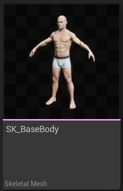
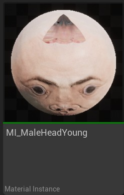
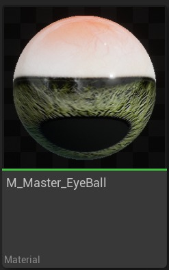
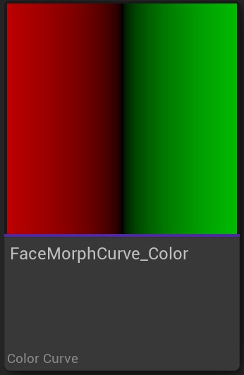
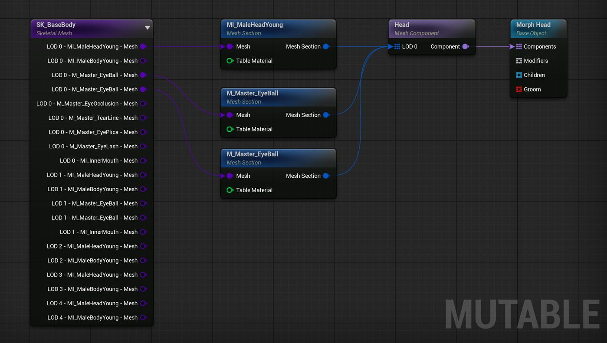
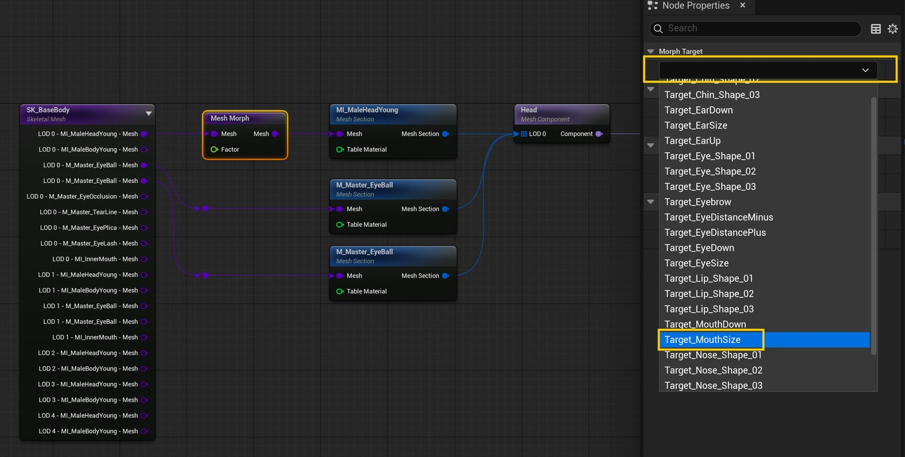
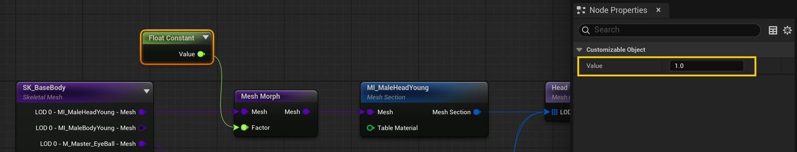
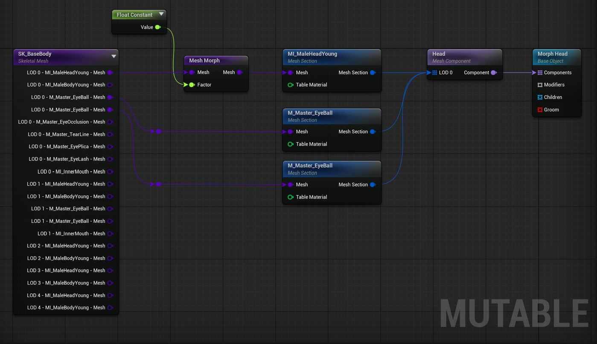
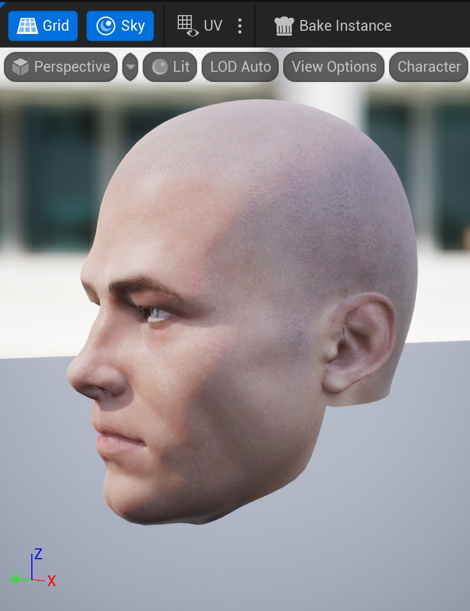
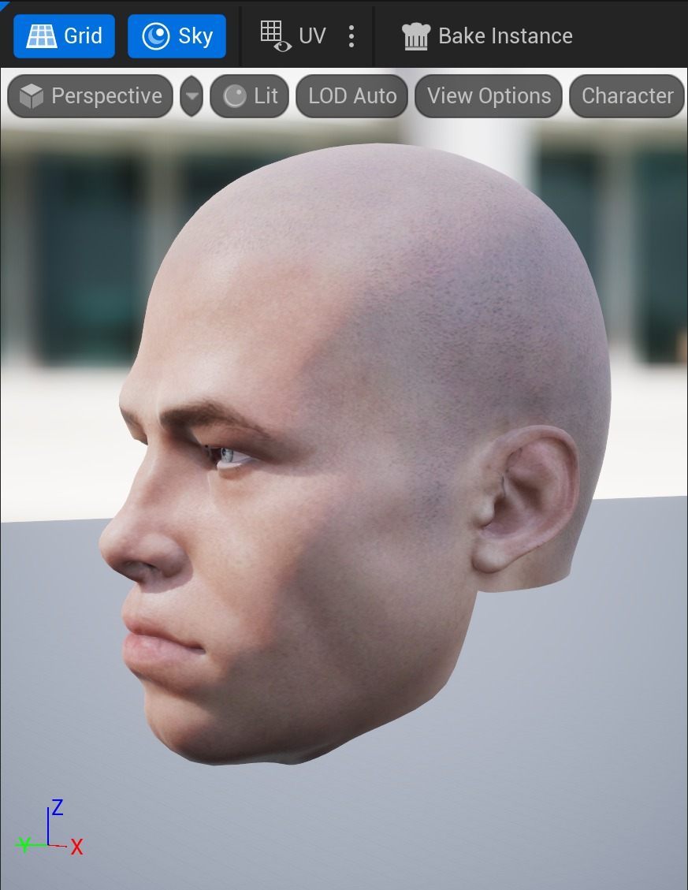

# 可变：形状变化

## 来源与状态

- 原始 URL：https://dev.epicgames.com/community/learning/tutorials/bZOV/unreal-engine-mutable-shape-variations

## 运行时分类

- 类型：图文教程
- 判断：运行时未识别到核心视频信号，可整理正文约 14190 字符。

## 摘要

介绍使用 Mutable 插件变形目标。

## 中文整理

### 概览

返回可变教程

### 概述

本教程将向您展示如何在可变系统中使用变形。它将向您展示如何映射一系列变形目标，以便最终用户可以启用、禁用它们以及设置每个变形目标的权重。我们建议在创建任何可自定义对象之前访问基本概念页面。生成的可自定义对象可以在 Content/Tutorials/Morphs/CO_ShapeVariations 的可变示例中找到。

### 所需资产

- SK_BaseBody 骨架网格物体。 SK_BaseBody 骨架网格物体。 - MI_MaleHeadYoung 材料。 MI_MaleHeadYoung 材质。 - M_Master_EyeBall 材质。 M_Master_EyeBall 材质。 - FaceMorphCurve_颜色曲线。 FaceMorphCurve_颜色曲线。

### 步骤

- 创建一个新的可自定义对象并如下图所示添加： 创建一个新的可自定义对象并如下图所示添加： - 对角色的嘴应用不可修改（恒定）变形：在“骨架网格体”节点和“网格体截面”节点之间创建一个“网格变形”节点。

选择新节点，然后在“节点属性”选项卡中查找“变形目标”部分。

选择 Target_MouthSize 变形目标。

所选的变形目标来自输入网格中定义的变形目标，在本例中为 SK_BaseBody 网格 将 Float Constant 节点连接到 Mesh Morph 节点的 Factor 输入引脚，并为其赋予值 1。

您的图表应如下所示：编译可自定义对象并查看“视口”选项卡。

头部的嘴巴应比 SK_BaseBody 骨架网格体中默认设置的嘴巴更大。

返回 CO 图表，将“浮点常量”值设置为 0，并再次编译可自定义对象，以查看应用和未应用变形的情况下飞蛾如何变化。

变形系数为 0： 变形系数为 1： 将不可修改（恒定）变形应用于角色的嘴部： - 在骨架网格体节点和网格体截面节点之间创建网格变形节点。

在骨架网格体节点和网格体截面节点之间创建一个网格变形节点。

- 选择新节点，然后在“节点属性”选项卡中查找“变形目标”部分。

选择 Target_MouthSize 变形目标。

所选的变形目标来自输入网格中定义的变形目标，在本例中为 SK_BaseBody 网格。选择新节点，然后在“节点属性”选项卡中查找“变形目标”部分。

选择 Target_MouthSize 变形目标。

所选的变形目标来自输入网格中定义的变形目标，在本例中为 SK_BaseBody 网格 - 将 Float Constant 节点连接到 Mesh Morph 节点的 Factor 输入引脚，并将其值设置为 1。

将 Float Constant 节点连接到 Mesh Morph 节点的 Factor 输入引脚，并将其值设置为 1。

- 您的图表应如下所示： 您的图表应如下所示： - 编译可自定义对象并查看“视口”选项卡。

头部的嘴巴应比 SK_BaseBody 骨架网格体中默认设置的嘴巴更大。

返回 CO 图表，将“浮点常量”值设置为 0，并再次编译可自定义对象，以查看应用和未应用变形的情况下飞蛾如何变化。

变形因子为 0： 变形因子为 1：编译可自定义对象并检查“视口”选项卡。

头部的嘴巴应比 SK_BaseBody 骨架网格体中默认设置的嘴巴更大。

返回 CO 图表，将“浮点常量”值设置为 0，并再次编译可自定义对象，以查看应用和未应用变形的情况下飞蛾如何变化。

变形因子为 0： |变形因子为 1： - 添加另一个变形操作，但这一次是用户可以控制的操作：在现有的网格变形节点和 MI_MaleHeadYoung 网格剖面节点之间创建一个网格变形节点。

选择新节点并。

在“节点属性”选项卡中查找“变形目标”部分。

选择 Target_OldBody 变形目标。

将 Float Parameter 节点连接到 Mesh Morph 节点的 Factor 输入引脚。

将其命名为 Old 并将默认值设置为 1。

您的图表应如下所示： 编译可自定义对象并查看“视口”选项卡。

应该会出现相同的头部，但现在外观要老得多。

新参数也应该在名为 Old 的预览实例标记上可见。

该参数本身控制 Target_OldBody 变形目标的权重。

与新参数交互，看看它如何改变角色头部的地形。

旧参数为 0：旧参数为 1：Target_OldBody 变形已禁用。

Target_OldBody 的权重为 100%。

纹理插值也可以与变形一起使用以改善整体结果。

添加另一个变形操作，但这一次是用户可以控制的操作： - 在现有的网格变形节点和 MI_MaleHeadYoung 网格剖面节点之间创建一个网格变形节点。

在现有的网格变形节点和 MI_MaleHeadYoung 网格截面节点之间创建一个网格变形节点。

- 选择新节点。

在“节点属性”选项卡中查找“变形目标”部分。

选择 Target_OldBody 变形目标。

选择新节点并。

在“节点属性”选项卡中查找“变形目标”部分。

选择 Target_OldBody 变形目标。

- 将 Float Parameter 节点连接到 Mesh Morph 节点的 Factor 输入引脚。

将其命名为 Old 并将默认值设置为 1。

将 Float Parameter 节点连接到 Mesh Morph 节点的 Factor 输入引脚。

将其命名为 Old 并将默认值设置为 1。

- 您的图表应如下所示： 您的图表应如下所示： - 编译可自定义对象并查看“视口”选项卡。

应该会出现相同的头部，但现在外观要老得多。

新参数也应该在名为 Old 的预览实例标记上可见。

该参数本身控制 Target_OldBody 变形目标的权重。

与新参数交互，看看它如何改变角色头部的地形。

旧参数为 0：旧参数为 1：Target_OldBody 变形已禁用。

Target_OldBody 的权重为 100%。

纹理插值也可以与变形一起使用以改善整体结果。

应该会出现相同的头部，但现在外观要老得多。

新参数也应该在名为 Old 的预览实例标记上可见。

该参数本身控制 Target_OldBody 变形目标的权重。

与新参数交互，看看它如何改变角色头部的地形。

旧参数为 0：|旧参数为 1：Target_OldBody 变形已禁用。

| Target_OldBody 的权重为 100%。

Target_OldBody 变形已禁用。

Target_OldBody 的权重为 100%。

纹理插值也可以与变形一起使用以改善整体结果。

- 添加可切换的变形操作：使用标签 Head 标记网格部分 MI_MaleHeadYoung 节点。

我们稍后会用到它。

通过在节点的必需标签中设置标签 Head，我们实质上所做的就是告诉我们想要将变形应用到标有所述标签的网格部分。

从“基础对象子项”引脚创建一个“对象组”节点，并将其命名为“变形选项”。

将类型保留为“切换”。

从对象组节点的输入对象引脚创建一个子对象节点。

给它起名叫“大耳朵”。

将新的变形网格部分节点连接到子对象节点的修改器输入引脚。

将 Morph Mesh 部分的所需标签设置为 Head。

选择 Target_EarSize 变形目标作为节点要使用的变形。

将 Float Constant 节点连接到 Mesh Morph Node 的 Factor 输入引脚，并将其值设置为 1。

您的图表应如下所示：编译可自定义对象并签出“视口”选项卡。

现在应该可以使用名为“大耳朵”的新可切换参数来启用或禁用放大角色耳朵的变形。

添加可切换的变形操作： - 使用标签 Head 标记网格部分 MI_MaleHeadYoung 节点。

我们稍后会用到它。

通过在节点的必需标签中设置标签 Head，我们实质上所做的就是告诉我们想要将变形应用到标有所述标签的网格部分。

使用标签 Head 标记网格部分 MI_MaleHeadYoung 节点。

我们稍后会用到它。

通过在节点的必需标签中设置标签 Head，我们实质上所做的就是告诉我们想要将变形应用到标有所述标签的网格部分。

- 从“基础对象子项”引脚创建一个“对象组”节点，并将其命名为“变形选项”。

将类型保留为“切换”。

从“基础对象子项”引脚创建一个“对象组”节点，并将其命名为“变形选项”。

将类型保留为“切换”。

- 从对象组节点的输入对象引脚创建子对象节点。

给它起名叫“大耳朵”。

从对象组节点的输入对象引脚创建一个子对象节点。

给它起名叫“大耳朵”。

- 将新的变形网格部分节点连接到子对象节点的修改器输入引脚。

将新的变形网格部分节点连接到子对象节点的修改器输入引脚。

- 将 Morph Mesh 部分的所需标签设置为 Head。

将 Morph Mesh 部分的所需标签设置为 Head。

- 选择 Target_EarSize 变形目标作为节点要使用的变形。

选择 Target_EarSize 变形目标作为节点要使用的变形。

- 编译可自定义对象并检查“视口”选项卡。

现在应该可以使用名为“大耳朵”的新可切换参数来启用或禁用放大角色耳朵的变形。

编译可自定义对象并检查“视口”选项卡。

现在应该可以使用名为“大耳朵”的新可切换参数来启用或禁用放大角色耳朵的变形。

- 总而言之，让我们添加一种使用曲线通过单个参数控制多个变形的方法：从“对象组”节点的“对象”引脚创建一个“子对象”节点。

将其命名为曲线变形。

将新的变形网格部分节点连接到子对象节点的修改器输入引脚。

使这个新节点使用标签 Head 并修改名为 Target_MouthDown 的变形目标。

连接到另一个新的变形网格部分节点的子对象节点的修改器输入引脚。

添加 Head 作为必需标签并修改名为 Target_NoseSize 的变形目标。

您始终可以通过将鼠标悬停在节点上并单击...来向节点添加注释。

按钮。

创建一个新的 Curve 节点并使其使用 FaceMorphCurve_Color 曲线资源。

将 Curve G 输出引脚连接到第二个 Morph Mesh Section 节点（使 Target_NoseSize 变形目标变形的节点） 将 Curve R 输出引脚连接到第一个 Morph Mesh Section 节点（使 Target_MouthDown 变形目标变形的节点） 将 Float Parameter 节点连接到 Curve 节点的 Input 输入引脚。

将其命名为 Multiple Morphs 并将默认值设置为 0。

曲线节点向 Mutable 公开曲线 UE 资源。

作为节点的输入提供的值用于对所述输入值的曲线的RGBA值进行采样，并将这些值提供给R、G、B和A节点输出引脚。

您可以通过查看相应的节点参考文档页面来了解有关节点如何运行的更多信息。

您的图表应如下所示：编译可自定义对象并查看预览实例视口。

现在应该可以使用名为“曲线变形”的新可切换参数来启用或禁用变形操作。

将参数设置为不同的值，您将看到： 值 0 值 0.5 值 1 当我们从曲线 R 喂食值 1 时，嘴将变形到最低位置。

嘴不会变形，因为我们从曲线 R 中输入 0 值。

变形 Target_NoseSize 将设置为最大值，因为我们从曲线 G 中输入值 1。

嘴部不会应用任何变形，因为它将继续从曲线 R 接收 0 值。

最后，让我们添加一种使用曲线通过单个参数控制多个变形的方法： - 从“对象组”节点的“对象”引脚创建一个“子对象”节点。

将其命名为曲线变形。

从对象组节点的对象引脚创建一个子对象节点。

将其命名为曲线变形。

- 使这个新节点使用标签 Head 并修改名为 Target_MouthDown 的变形目标。

使这个新节点使用标签 Head 并修改名为 Target_MouthDown 的变形目标。

- 连接到另一个新的变形网格部分节点的子对象节点的修改器输入引脚。

连接到另一个新的变形网格部分节点的子对象节点的修改器输入引脚。

- 添加头部作为必需标签并修改名为 Target_NoseSize 的变形目标。

您始终可以通过将鼠标悬停在节点上并单击...来向节点添加注释。

按钮。

添加 Head 作为必需标签并修改名为 Target_NoseSize 的变形目标。

您始终可以通过将鼠标悬停在节点上并单击...来向节点添加注释。

按钮。

- 创建一个新的 Curve 节点并使其使用 FaceMorphCurve_Color 曲线资源。

创建一个新的 Curve 节点并使其使用 FaceMorphCurve_Color 曲线资源。

- 将曲线 G 输出引脚连接到第二个变形网格部分节点（使 Target_NoseSize 变形目标变形的节点） 将曲线 G 输出引脚连接到第二个变形网格部分节点（使 Target_NoseSize 变形目标变形的节点） - 将曲线 R 输出引脚连接到第一个变形网格部分节点（使 Target_MouthDown 变形目标变形的节点） 将曲线 R 输出引脚连接到第一个变形网格部分节点（使 Target_MouthDown 变形目标变形的那个） - 将 Float Parameter 节点连接到 Curve 节点的 Input 输入引脚。

将其命名为 Multiple Morphs 并将默认值设置为 0。

曲线节点向 Mutable 公开曲线 UE 资源。

作为节点的输入提供的值用于对所述输入值的曲线的RGBA值进行采样，并将这些值提供给R、G、B和A节点输出引脚。

您可以通过查看相应的节点参考文档页面来了解有关节点如何运行的更多信息。

将 Float Parameter 节点连接到 Curve 节点的 Input 输入引脚。

将其命名为 Multiple Morphs 并将默认值设置为 0。

曲线节点将曲线 UE 资产公开给 Mutable....

您可以通过检查相应的节点参考文档页面来了解有关节点如何运行的更多信息...

## 相关链接

- [Basic Concepts](https://github.com/anticto/Mutable-Documentation/wiki/Basic-Concepts)
- [Mutable Sample](https://www.fab.com/listings/209e82f6-ad40-4253-b565-d2f65b12efe7)
- [Overview](https://dev.epicgames.com/community/learning/tutorials/bZOV/unreal-engine-mutable-shape-variations#overview)
- [Required Assets](https://dev.epicgames.com/community/learning/tutorials/bZOV/unreal-engine-mutable-shape-variations#requiredassets)
- [Steps](https://dev.epicgames.com/community/learning/tutorials/bZOV/unreal-engine-mutable-shape-variations#steps)
