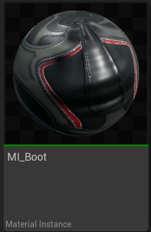
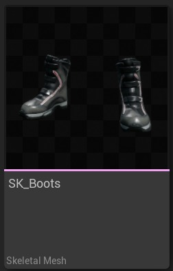
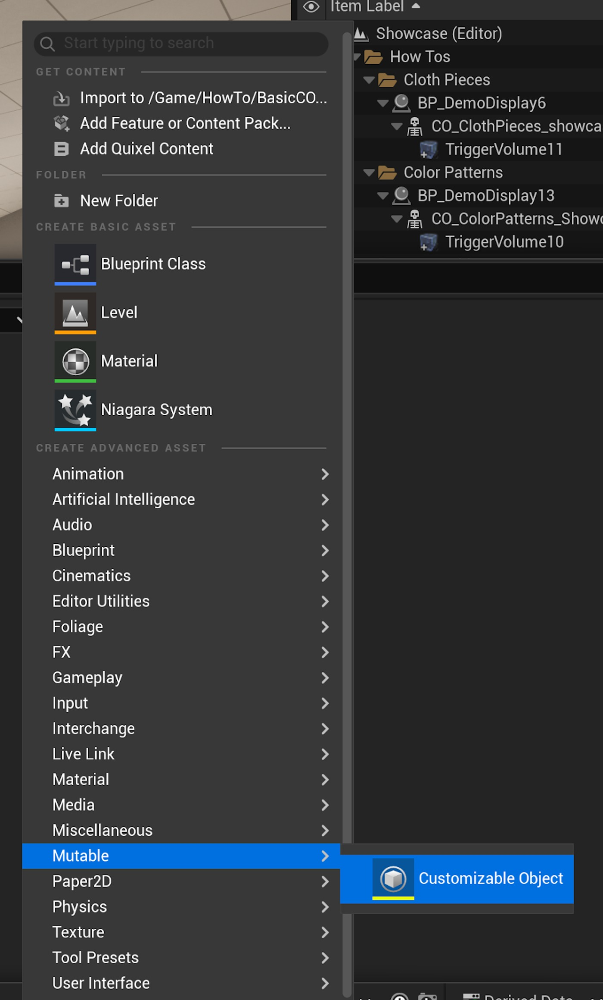
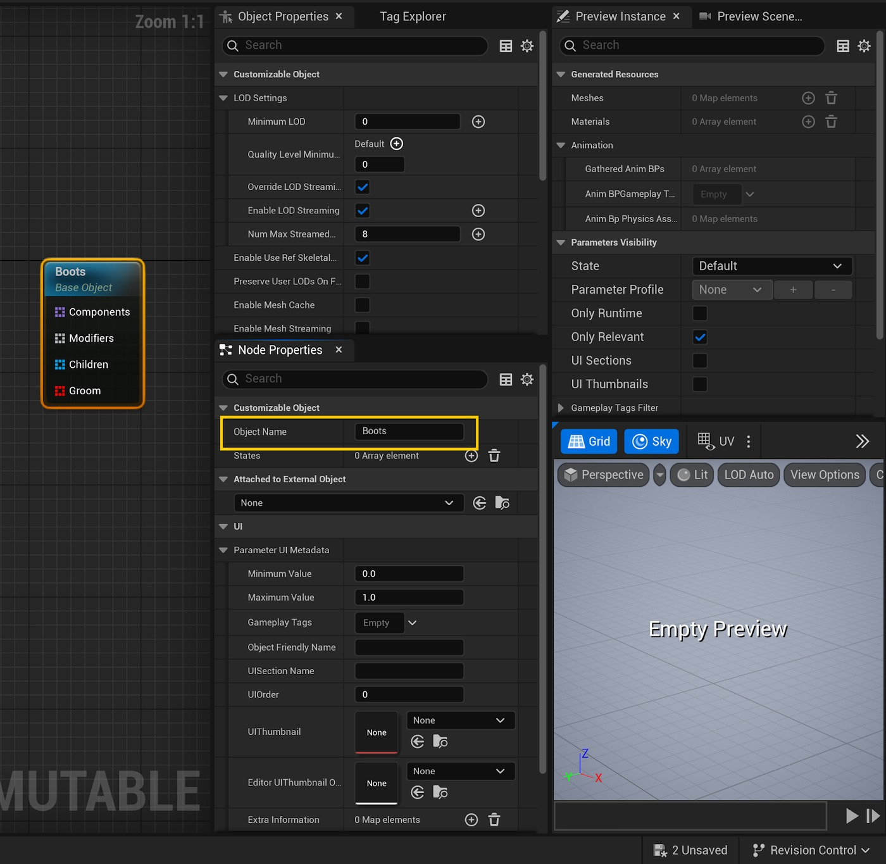
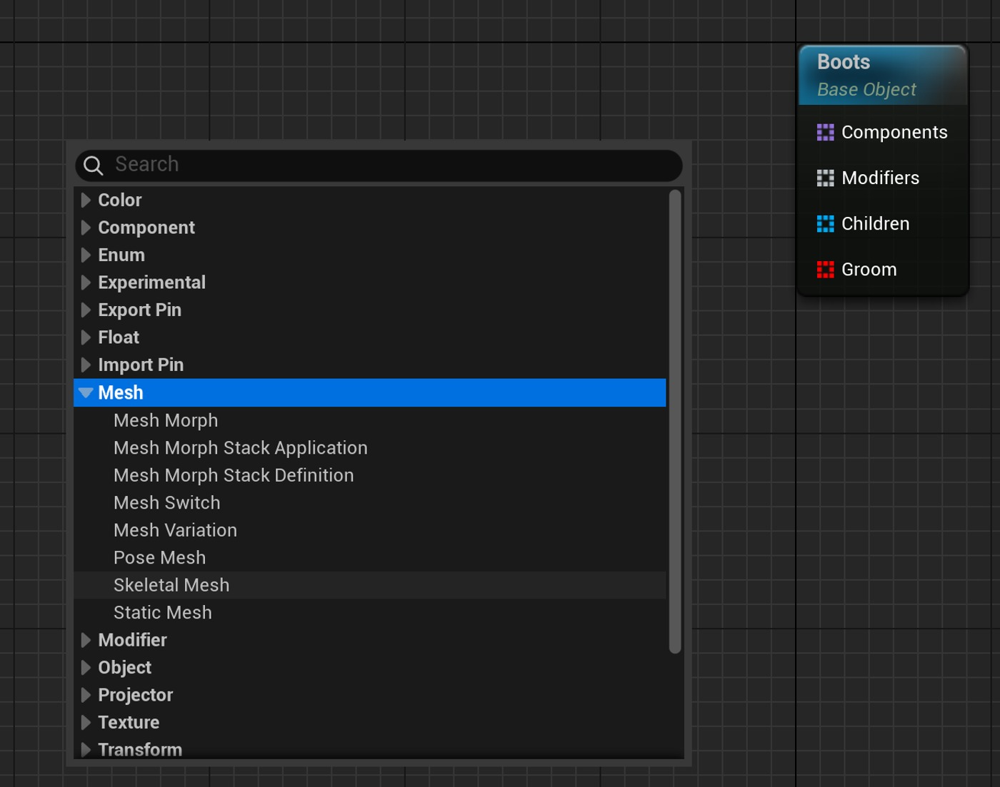
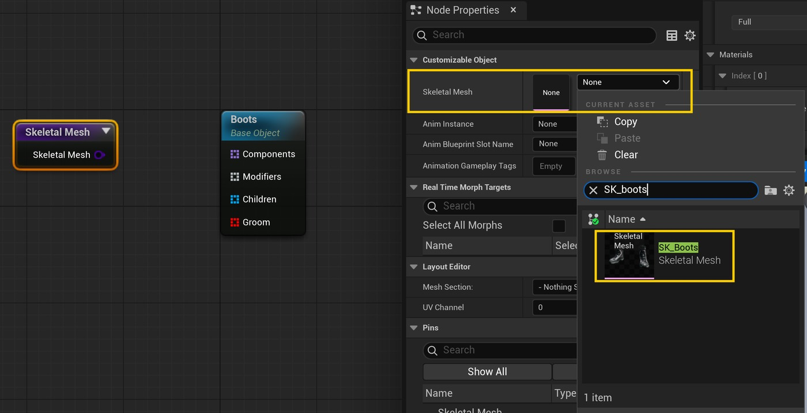
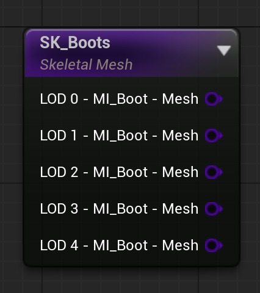
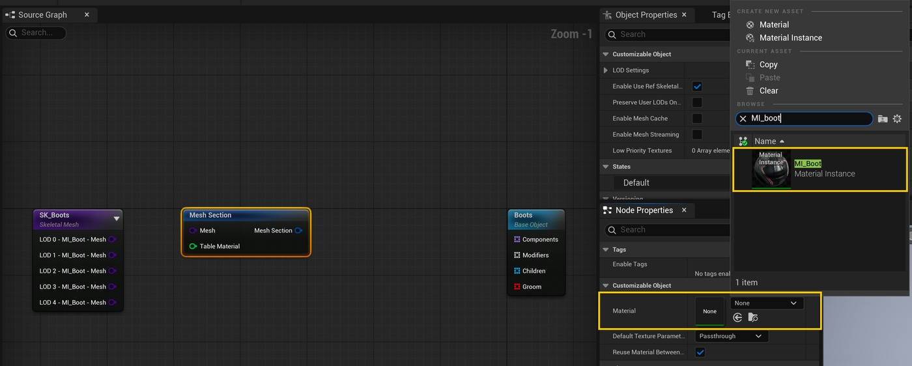
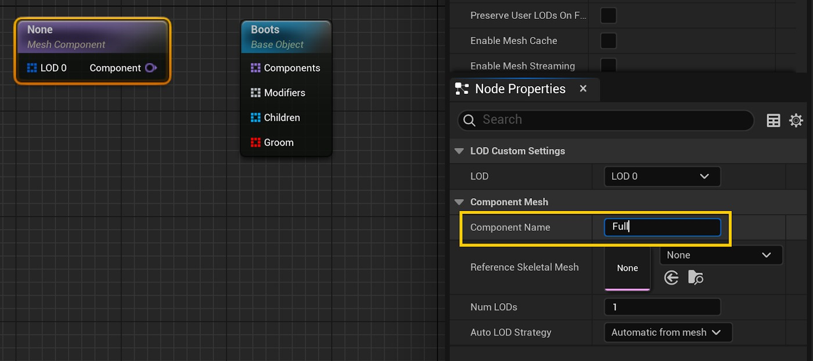
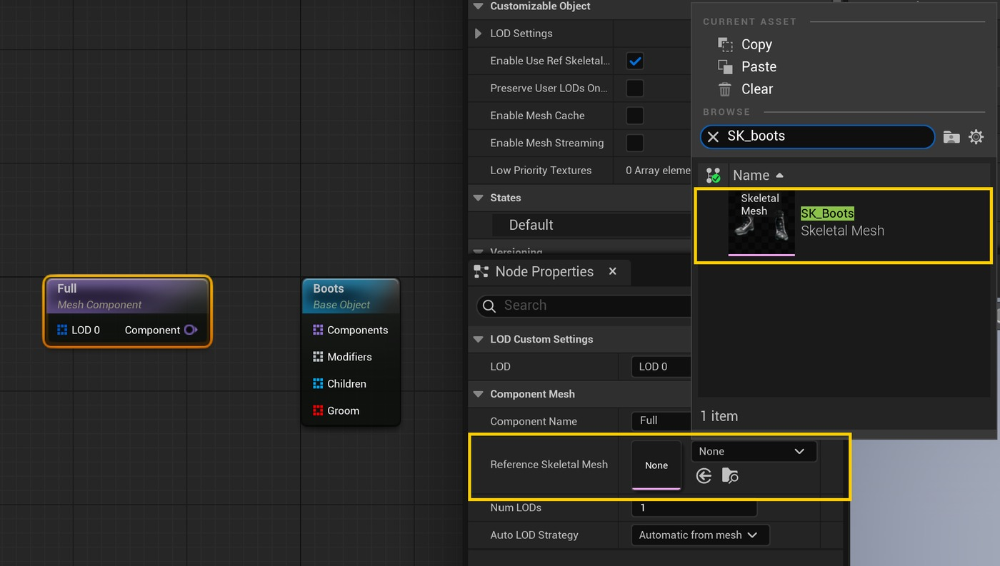

# Mutable：简单的可定制对象

## 来源与状态

- 原始 URL：https://dev.epicgames.com/community/learning/tutorials/Y41o/unreal-engine-mutable-simple-customizable-object

## 运行时分类

- 类型：图文教程
- 判断：运行时未识别到核心视频信号，可整理正文约 13068 字符。

## 摘要

教程展示了如何创建基本的可变可定制对象。

## 中文整理

### 概览

返回可变教程

### 概述

本教程解释了如何创建最基本的可自定义对象，同时向您介绍 Mutable 的一些关键元素，如网格部分、参数、组件等。我们建议在创建任何可自定义对象之前访问基本概念页面。这些示例生成的可自定义对象可以在 Content/Tutorials/BasicCO 的可变示例中找到。

### 基本可定制对象

此示例旨在向您介绍 Mutable，向您展示可定制对象的最基本形式。一种不公开任何定制功能的系统。您可以在 Content/Tutorials/BasicCO/CO_Basic 中找到已设置的可自定义对象。

### 所需资产

- SK_Boots 骨架网格体及其默认材质和纹理。 SK_Boots 骨架网格体及其默认材质和纹理。

### 步骤

- 创建一个新的可定制对象。

创建一个新的可定制对象。

- 选择名为“基础对象”的现有节点，然后查找名为“节点属性”的选项卡。

到达那里后，将对象名称的值更改为 Boots。

选择名为“基础对象”的现有节点，然后查找名为“节点属性”的选项卡。

到达那里后，将对象名称的值更改为 Boots。

- 右键单击​​图形空白区域，打开节点添加菜单。

寻找骨架网格物体选项。

您可以通过在搜索空间中记下名称或导航到网格体/骨架网格体空间来访问它。

Mutable 中可用的所有节点都可以使用右键菜单生成。

右键单击图形空白区域，打开节点添加菜单。

寻找骨架网格物体选项。

您可以通过在搜索空间中记下名称或导航到网格体/骨架网格体空间来访问它。

Mutable 中可用的所有节点都可以使用右键菜单生成。

- 设置骨架网格物体节点，使其使用 SK_Boots 网格物体 现在，您刚刚添加的节点中应该可以看到一系列引脚。

每个连接代表骨架网格体的一个 LOD。

在此示例中，您将仅使用代表 LOD 0 的第一个。

设置骨架网格物体节点，使其使用 SK_Boots 网格物体 现在，您刚刚添加的节点中应该可以看到一系列引脚。

每个连接代表骨架网格体的一个 LOD。

在此示例中，您将仅使用代表 LOD 0 的第一个。

- 使用鼠标右键单击按钮创建网格截面节点。

查找“网格部分”菜单项。

使用鼠标右键单击按钮创建网格截面节点。

查找“网格部分”菜单项。

- 设置网格截面节点。

使其使用 MI_Boot 材质。

然后将名为 LOD 0 - MI_Boot - Mesh 的引脚从骨架网格体节点连接到网格体部分节点中的输入引脚。

您不需要手动创建网格部分。

如果拖动 LOD 0 - MI_Boot - Mesh 引脚然后将其放下，将弹出节点搜索菜单，仅显示可以直接连接到拖动的引脚的节点。

如果您选择“网格截面”节点，它将被放置并使用最初用于生成节点的 LOD 引脚的材质进行设置。

设置网格截面节点。

使其使用 MI_Boot 材质。

然后将名为 LOD 0 - MI_Boot - Mesh 的引脚从骨架网格体节点连接到网格体部分节点中的输入引脚。

您不需要手动创建网格部分。

如果拖动 LOD 0 - MI_Boot - Mesh 引脚然后将其放下，将弹出节点搜索菜单，仅显示可以直接连接到拖动的引脚的节点。

如果您选择“网格截面”节点，它将被放置并使用最初用于生成节点的 LOD 引脚的材质进行设置。

- 创建一个网格组件节点并为其命名。

我们将使用名称 Full。

创建一个网格组件节点并为其命名。

我们将使用名称 Full。

- 设置节点的参考网格，使其使用 SK_Boots 骨架网格体，并将网格体部分输出引脚连接到网格体组件节点中的 LOD 0 输入引脚。

设置节点的参考网格，使其使用 SK_Boots 骨架网格体，并将网格体部分输出引脚连接到网格体组件节点中的 LOD 0 输入引脚。

- 将网格组件节点的输出连接到已存在的基础对象节点。

您的图形应如下所示： 将网格组件节点的输出连接到已存在的基础对象节点。

您的图表应如下所示： - 编译可自定义对象并查看“预览视口”选项卡的内容。

生成的可自定义对象实例应该显示在那里。

在这种情况下，将显示一双靴子。

编译可自定义对象并查看“预览视口”选项卡的内容。

生成的可自定义对象实例应该显示在那里。

在这种情况下，将显示一双靴子。

### 具有定制功能的基本可定制对象

下一个示例旨在向您介绍可变参数的概念。您可以使用参数来公开可在运行时访问的自定义功能。按照此示例来了解如何使用参数的介绍。您可以在 Content/Tutorials/BasicCO/CO_Basic_parameters 中找到已设置的可自定义对象。

### 所需资产

- 与前面的示例一样，SK_Boots 骨架网格体及其默认材质和纹理。与前面的示例一样，SK_Boots 骨架网格体及其默认材质和纹理。

### 步骤

- 我们将使用上一步中创建的可自定义对象作为起点。

查找 CO_Basic，因为它将用作我们的起点。

我们将使用上一步中创建的可自定义对象作为起点。

查找 CO_Basic，因为它将用作我们的起点。

- 选择“网格截面”节点并检查“节点属性”选项卡中显示的其属性。

您应该能够看到名为 Pins 的部分。

在本节中，您将能够公开 UE 材质中设置的参数，以便 Mutable 可以使用它们。

滚动直到找到名为“颜色变化”的材质参数，并使用可见性切换按钮显示它。

可以在网格截面节点中公开的每个引脚都是在节点引用的材质中公开的参数。

因此，查看上图，我们能够显示一个名为“颜色变化”的引脚，因为材质中确实具有该参数。请查看下图，它显示了材质的参数： 现在，“网格截面”节点应该公开了一个新的输入引脚，其名称与“材质”属性使用的引脚名称相同。

选择“网格截面”节点并检查“节点属性”选项卡中显示的其属性。

您应该能够看到名为 Pins 的部分。

在本节中，您将能够公开 UE 材质中设置的参数，以便 Mutable 可以使用它们。

滚动直到找到名为“颜色变化”的材质参数，并使用可见性切换按钮显示它。

可以在网格截面节点中公开的每个引脚都是在节点引用的材质中公开的参数。

因此，查看上图，我们能够显示一个名为“颜色变化”的引脚，因为材质中确实具有该参数。请查看下图，它显示了材质的参数： 现在，“网格截面”节点应该公开了一个新的输入引脚，其名称与“材质”属性使用的引脚名称相同。

- 拖动新添加的图钉并将其放下，以便打开选择菜单。

选择名为“颜色参数”的节点并将其命名为“详细信息颜色”。

该名称将用作公开参数的名称。

通过添加参数节点，我们为用户提供了设置他想要的值的选项。

在本例中，我们允许他更改材质参数的颜色。

您可能还见过一个名为“颜色常量”的节点。

我们不使用它的原因是，顾名思义，常量节点在运行时无法更改。

当您想要限制对象的自定义时，它们特别有用。

拖动新添加的图钉并将其放下，以便打开选择菜单。

选择名为“颜色参数”的节点并将其命名为“详细信息颜色”。

该名称将用作公开参数的名称。

通过添加参数节点，我们为用户提供了设置他想要的值的选项。

在本例中，我们允许他更改材质参数的颜色。

您可能还见过一个名为“颜色常量”的节点。

我们不使用它的原因是，顾名思义，常量节点在运行时无法更改。

当您想要限制对象的自定义时，它们特别有用。

- 更改参数的默认颜色。

为此，请查找名为“节点属性”的选项卡，并通过编辑“默认值”节点属性的颜色值来设置所需的默认颜色。

更改参数的默认颜色。

为此，请查找名为“节点属性”的选项卡，并通过编辑“默认值”节点属性的颜色值来设置所需的默认颜色。

- 此时您的图表应如下所示： 此时您的图表应如下所示： - 编译可自定义对象并检查“预览视口”选项卡的内容。

那里应该显示一个自动生成的可定制对象实例。

在这种情况下，应该展示一双靴子。

此外，“详细信息颜色”参数也应该在“实例属性”下的“预览实例”选项卡中可见。

更改参数应该会更改靴子丝带的颜色。

预览实例选项卡中的实例属性部分可用于测试可自定义对象的可自定义性。

那里公开的定制功能将等同于最终用户可以使用的定制功能。

编译可自定义对象并查看“预览视口”选项卡的内容。

那里应该显示一个自动生成的可定制对象实例。

在这种情况下，应该展示一双靴子。

此外，“详细信息颜色”参数也应该在“实例属性”下的“预览实例”选项卡中可见。

更改参数应该会更改靴子丝带的颜色。

预览实例选项卡中的实例属性部分可用于测试可自定义对象的可自定义性。

那里公开的定制功能将等同于最终用户可以使用的定制功能。

### 具有多个网格部分的基本可定制对象

本节旨在向您介绍多个网格部分的用法。到目前为止，您只需要使用一个骨架网格体，因为骨架网格体只定义了一个，但在下一个示例中，您将使用一个包含多个部分的骨架网格体。您可以在 Content/Tutorials/BasicCO/CO_Basic_sections 中找到已设置的可自定义对象。

### 所需资产

- SK_BaseBody 骨骼网格体及其默认材质和纹理。 SK_BaseBody 骨骼网格体及其默认材质和纹理。

### 步骤

- 创建一个新的可自定义对象并对其进行设置，直到获得与此类似的内容： 创建一个新的可自定义对象并对其进行设置，直到获得与此类似的内容： - 添加一个骨架网格物体节点并使其使用 SK_BaseBody 网格物体。

您现在应该能够看到网格部分节点如何通过添加大量引脚而增长相当多：每个紫色引脚代表一个网格部分。

每个引脚都指示它所属的 LOD 以及它使用的材质。

请注意，将鼠标悬停在图钉上，它将指示它引用的部分索引。

添加骨架网格体节点并使其使用 SK_BaseBody 网格体。

您现在应该能够看到网格部分节点如何通过添加大量引脚而增长相当多：每个紫色引脚代表一个网格部分。

每个引脚都指示它所属的 LOD 以及它使用的材质。

请注意，将鼠标悬停在图钉上，它将指示它引用的部分索引。

- 从名为 LOD 0 - MI_MaleHeadYoung - Mesh 的骨架网格体节点中拖动引脚并将其放下，然后创建一个网格体截面节点。

重复之前的操作，如下图所示：从名为 LOD 0 - MI_MaleHeadYoung - Mesh 的骨架网格体节点中拖动引脚并将其放下，然后创建一个网格体截面节点。

重复之前的操作，如下图所示： - 将所有骨架网格体节点输出引脚连接到网格体组件节点中的 LOD 0 输入。

我们想要在这里完成的是创建一个只有一个 LOD 的角色，该角色由 SK_BaseCharacter 骨架网格体中存在的一些部分组成。

将所有骨架网格体节点输出引脚连接到网格体组件节点中的 LOD 0 输入。

我们想要在这里完成的是创建一个只有一个 LOD 的角色，该角色由 SK_BaseCharacter 骨架网格体中存在的一些部分组成。

- 此时您的图表应如下所示： 此时您的图表应如下所示： - 编译可自定义对象并检查“预览视口”选项卡的内容。

一个角色应该有身体、头部和眼睛。

编译可自定义对象并查看“预览视口”选项卡的内容。

一个角色应该有身体、头部和眼睛。

- 可变 - 角色定制 - 网格部分 - 可定制对象

## 相关链接

- [Basic Concepts](https://github.com/anticto/Mutable-Documentation/wiki/Basic-Concepts)
- [Mutable Sample](https://www.fab.com/listings/209e82f6-ad40-4253-b565-d2f65b12efe7)
- [Overview](https://dev.epicgames.com/community/learning/tutorials/Y41o/unreal-engine-mutable-simple-customizable-object#overview)
- [Basic Customizable Object](https://dev.epicgames.com/community/learning/tutorials/Y41o/unreal-engine-mutable-simple-customizable-object#basiccustomizableobject)
- [Required assets](https://dev.epicgames.com/community/learning/tutorials/Y41o/unreal-engine-mutable-simple-customizable-object#requiredassets)
- [Steps](https://dev.epicgames.com/community/learning/tutorials/Y41o/unreal-engine-mutable-simple-customizable-object#steps)
- [Basic Customizable Object with Customization](https://dev.epicgames.com/community/learning/tutorials/Y41o/unreal-engine-mutable-simple-customizable-object#basiccustomizableobjectwithcustomization)
- [Required Assets](https://dev.epicgames.com/community/learning/tutorials/Y41o/unreal-engine-mutable-simple-customizable-object#requiredassets-2)
- [Steps](https://dev.epicgames.com/community/learning/tutorials/Y41o/unreal-engine-mutable-simple-customizable-object#steps-2)
- [Basic Customizable Object with Multiple Mesh Sections](https://dev.epicgames.com/community/learning/tutorials/Y41o/unreal-engine-mutable-simple-customizable-object#basiccustomizableobjectwithmultiplemeshsections)
- [Required Assets](https://dev.epicgames.com/community/learning/tutorials/Y41o/unreal-engine-mutable-simple-customizable-object#requiredassets-3)
- [Steps](https://dev.epicgames.com/community/learning/tutorials/Y41o/unreal-engine-mutable-simple-customizable-object#steps-3)
