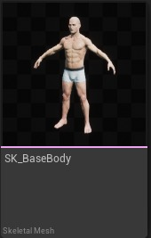
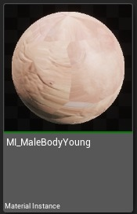
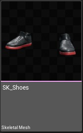
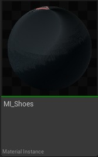
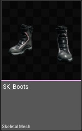
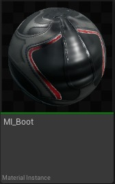
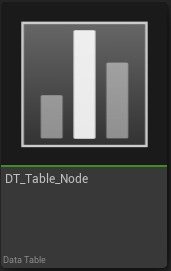
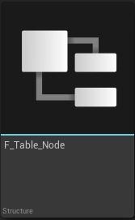
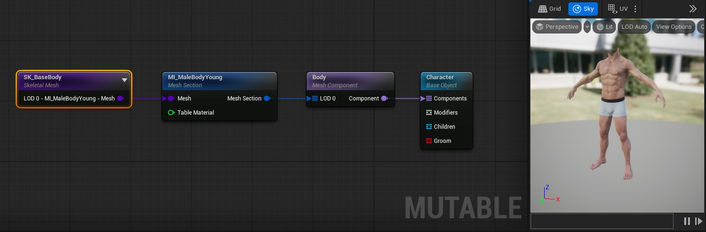
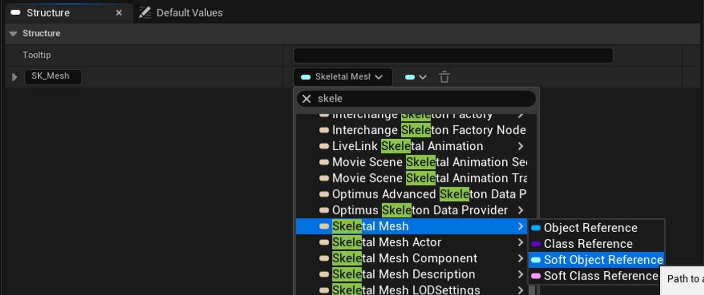

# 可变：表节点教程

## 来源与状态

- 原始 URL：https://dev.epicgames.com/community/learning/tutorials/nzkW/unreal-engine-mutable-table-nodes-tutorial
- 原始文件：unreal-engine-mutable-table-nodes-tutorial.origin.md
- 分段：第 1/2 段

## 运行时分类

- 类型：图文教程
- 判断：运行时未识别到核心视频信号，可整理正文约 14075 字符。

## 摘要

如何在 Mutable 中使用数据表进行多项选择

## 中文整理

### 概览

返回可变教程

### 概述

在本教程中，我们将了解如何创建和使用表节点来创建具有相似特征的多个对象。我们建议在开始本教程之前访问基本概念页面。本教程生成的可自定义对象可以在 Content/Tutorials/TableNode 的可变示例中找到。可变示例中的武器使用表节点，您可以在 Content/Weapon/CO_Weapon.uasset 中找到其可自定义对象

### 所需资产

- SK_BaseBody 骨骼网格体，及其默认材质和纹理。 SK_BaseBody 骨骼网格体及其默认材质和纹理。 - SK_Shoes 骨骼网格体，及其默认材质和纹理。 SK_Shoes 骨骼网格体及其默认材质和纹理。 - SK_Boots 骨架网格体，及其默认材质和纹理。 SK_Boots 骨架网格体及其默认材质和纹理。 - DT_Table_Node 数据表。该资产将存储不同变体的所有资产。每列代表表节点中的一个引脚，每行代表我们对象的一个​​变体。 DT_Table_Node 数据表。该资产将存储不同变体的所有资产。每列代表表节点中的一个引脚，每行代表我们对象的一个​​变体。 - F_Table_Node 结构。该资产将决定我们数据表的结构和默认值。该结构的每个变量都会在我们的数据表中生成一个新列。此外，它还允许选择定义表资源的公共结构的默认资源。 F_Table_Node 结构。该资产将决定我们数据表的结构和默认值。该结构的每个变量都会在我们的数据表中生成一个新列。此外，它还允许选择定义表资源的公共结构的默认资源。

### 网格变化示例

### 步骤

首先在内容抽屉中创建一个新的可自定义对象并将其命名为CO_Table_Node。打开后： - 创建一个骨架网格体节点，然后在“节点属性”面板中选择将 SK_BaseBody 设置为骨架网格体。创建一个骨架网格体节点，然后在“节点属性”面板中选择将 SK_BaseBody 设置为骨架网格体。 - 拖动LOD 0 - MI_MaleBodyYoung - 网格引脚创建一个新的网格部分节点。该材质将自动设置为 MI_MaleBodyYoung 材质实例。拖动 LOD 0 - MI_MaleBodyYoung - Mesh 引脚创建一个新的 Mesh Section 节点。该材质将自动设置为 MI_MaleBodyYoung 材质实例。 - 从网格截面节点的网格截面引脚创建一个新的网格组件节点，我们将其命名为 Body。在本例中我们不会使用头部网格组件。从网格截面节点的网格截面引脚创建一个新的网格组件节点，我们将其命名为 Body。在本例中我们不会使用头部网格组件。 - 最后，将网格组件输出引脚连接到基础对象节点中的组件引脚。将“基本对象”节点重命名为“字符”如果您对此步骤有任何疑问，请参阅简单可自定义对象教程以了解更多详细信息。最后，将网格组件输出引脚连接到基础对象节点中的组件引脚。将“基本对象”节点重命名为“字符”如果您对此步骤有任何疑问，请参阅简单可自定义对象教程以了解更多详细信息。 - 单击编译并检查预览实例： 单击编译并检查预览实例：

### 创建结构

如果我们想首先创建带有节点表的网格变体，首先我们需要创建一个结构和一个数据表。

要创建结构，请右键单击内容浏览器，然后在出现的上下文菜单中键入 struct（上下文菜单 -> 蓝图 -> 结构）。

将其命名为 F_Table_Node。

打开资产，您将看到两个选项卡： - 结构：在此选项卡中，我们将通过按 + 添加变量按钮来定义数据表的结构。

结构：在此选项卡中，我们将通过按 + 添加变量按钮来定义数据表的结构。

- 默认值：在此选项卡中，我们将为结构的每个变量定义默认值。

默认值：在此选项卡中，我们将为结构的每个变量定义默认值。

结构体中的所有 UObject 变量都必须有一个默认值，否则该变量将不会出现在节点中。

由于我们已经创建了一个默认变量，我们将把它用于我们的网格。

为此，请选择指定变量类型的下拉菜单。

我们将搜索骨架网格体并创建软对象参考。

将网格变量命名为 SK_Mesh，变量的名称也将是数据表列的名称和新表节点引脚的名称。

一旦我们有了第一个变量，我们就必须在“默认值”面板中为其选择一个默认值。

考虑到默认变量将是数据表同一列的所有网格的参考网格。

这意味着同一列的所有网格将具有相同的布局，并且它们应该具有相同数量的 LOD 和材质（部分）。

为此示例选择资产 SK_Shoes。

为材质实例添加第二个变量。

将工具提示命名为“材质”。

在本例中，从下拉菜单中选择材质实例 -> 软对象参考。

选择默认材质实例。

从下拉菜单中选择材质默认值中的 MI_Shoes。

### 创建数据表

此时我们已经设置了结构。

现在是时候创建和设置我们的数据表了。

为此，请右键单击内容浏览器并在上下文菜单中键入数据表（上下文菜单 -> 其他 -> 数据表）。

一个新的弹出窗口将要求我们选择该数据表列应基于的结构。

选择F_Table_Node上最近创建的，命名为DT_Table_Node，打开它，看到有三个选项卡： - 数据表：该选项卡显示表的每一行和每一列的信息。

现在有两列，一列用于行名称 Row Name（自动生成），另一列用于我们刚刚在结构 SK_Mesh 和材质中创建的变量。

数据表：该选项卡显示表的每一行和每一列的信息。

现在有两列，一列用于行名称 Row Name（自动生成），另一列用于我们刚刚在结构 SK_Mesh 和材质中创建的变量。

- 数据表详细信息：包含表的一些信息的选项卡。

我们将忽略它。

数据表详细信息：包含表的一些信息的选项卡。

我们将忽略它。

- 行编辑器：用于选择我们要用于每行的资源的选项卡。

行编辑器：用于选择我们要用于每行的资源的选项卡。

现在是时候填充我们的数据表以创建一些网格变体了。

为此，首先我们必须通过单击“+ 添加”来添加新行。

这将创建一个具有默认值的新行。

我们将保留网格的默认值并将行名称更改为 Boots。

该名称将出现在我们用户界面的变体选择器中。

为第一个选择 SK_Boots 骨架网格体。

在材质列中选择 MI_Boot 材质实例。

创建名为 Shoes 的第二行，并为此使用 SK_Shoes 骨骼网格和 MI_Shoes 材质实例。

### 添加表节点

现在我们已经设置了数据表。

现在是时候向基础对象添加一些网格变体了： - 创建一个子对象节点并将其命名为 Shoes 创建一个子对象节点并将其命名为 Shoes - 创建一个网格组件节点并将其连接到子对象的组件引脚。

在网格体组件的参考骨架网格体下拉菜单中，选择 SK_Shoes 作为默认骨架网格体。

创建一个网格组件节点并将其连接到子对象的组件引脚。

在网格体组件的参考骨架网格体下拉菜单中，选择 SK_Shoes 作为默认骨架网格体。

- 创建一个网格截面节点并在节点属性材质下拉菜单中选择 MI_Shoes。

此时您应该有类似这样的内容：创建一个网格截面节点并在节点属性材质下拉菜单中选择 MI_Shoes。

此时您应该有类似这样的内容： - 最后但并非最不重要的一点是，从上下文菜单“对象”>“表”创建一个新的“表”节点。

将其命名为“鞋型”。

这将显示在表节点属性选项卡的参数名称字段中。

从表节点节点属性选项卡中，单击表下拉菜单并选择最近创建的名为 DT_Table_Node 的数据表。

您将看到选择数据表后节点如何自动刷新并且网格引脚出现。

最后但并非最不重要的一点是，从上下文菜单“对象”>“表”创建一个新的“表”节点。

将其命名为“鞋型”。

这将显示在表节点属性选项卡的参数名称字段中。

从表节点节点属性选项卡中，单击表下拉菜单并选择最近创建的名为 DT_Table_Node 的数据表。

您将看到选择数据表后节点如何自动刷新并且网格引脚出现。

- 当此参数被激活时，我们必须选择默认选项。

为此，请在“默认行名称”字段中记下您选择的名称。

在此示例中使用 Boots。

请注意，必须与数据表行名称中的名称完全相同。

当这个参数被激活时，我们必须选择默认选项。

为此，请在“默认行名称”字段中记下您选择的名称。

在此示例中使用 Boots。

请注意，必须与数据表行名称中的名称完全相同。

- 同时向下滚动到 Pins 部分，仅将 SK_Mesh LOD_0 Mat_0 和 Material 标记为活动，如下所示： 同时向下滚动到 Pins 部分，仅将 SK_Mesh LOD_0 Mat_0 和 Material 标记为活动，如下所示： - 现在，将 SK_Mesh LOD_0 Mat_0 和 SK_Material 引脚连接到 Mesh 部分节点 Mesh 和 Table Material 引脚。

现在，将 SK_Mesh LOD_0 Mat_0 和 SK_Material 引脚连接到网格部分节点网格和表材质引脚。

- 最后将“子对象”节点的“鞋子”对象引脚连接到“基础对象”节点的“子对象”引脚。

最后将“子对象”节点的“鞋子”对象引脚连接到“基础对象”节点的“子对象”引脚。

### 结果

编译 CO，ShoeType Instance Parameter 下拉菜单将出现在 Preview Instance 选项卡中，您可以在 Boots 和 Shoes 骨架网格物体之间切换。由于底层的脚网格，您会看到一些剪切问题。使用带有网格的剪辑网格、删除网格块或带有平面和变形节点的剪辑网格来删除脚网格可以轻松解决此问题。在可变：删除看不见的网格部件教程中了解更多相关信息。

### 颜色、纹理和浮动变化

通过表节点，我们还可以创建纹理变化。为此，我们将创建颜色变化以进一步定制我们的鞋子和靴子。为此，我们必须创建一个名为 F_Table_Colors 的新结构和一个线性颜色变量。我们将设置红色为默认颜色。创建一个新的数据表，将其命名为 DT_Table_Colors，并在颜色实例参数下拉菜单中填充尽可能多的可用颜色变化。现在从 MI_Shoes Mesh Section 节点公开 Color Variation Pin，以便能够通过新创建的数据表更改其值。现在创建一个新的 Table 节点并将其命名为 Color。在表属性字段中选择 DT_Table_Colors。您可以选择默认行名称作为起始颜色选择。刷新表节点，将出现颜色图钉。将其连接到“网格截面”节点中的“颜色变化”引脚。

### 结果

编译，现在您可以选择不同的鞋子类型以及鞋子的细节颜色。由于它们都使用相同的父材质并且公开了颜色变化参数，因此您可以使用单个变量来控制颜色细节。以同样的方式，您还可以使用浮点变量来控制材质的某些浮点参数，例如金属参数或纹理（如果材质实例允许的话）。您的数据表中每种类型可以有多个列。
