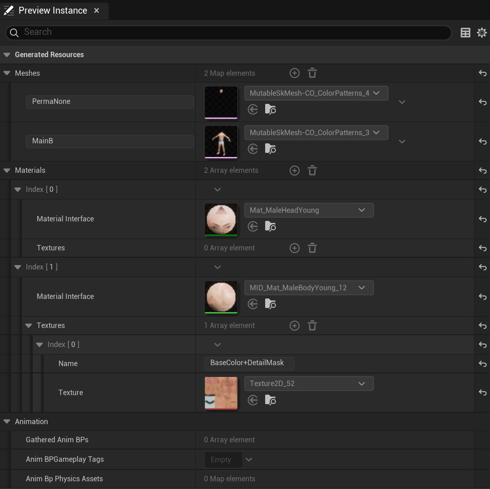
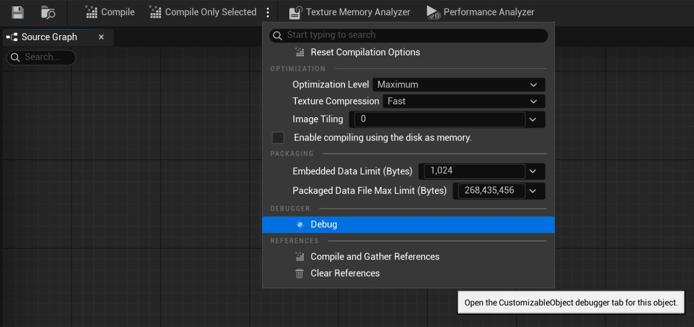
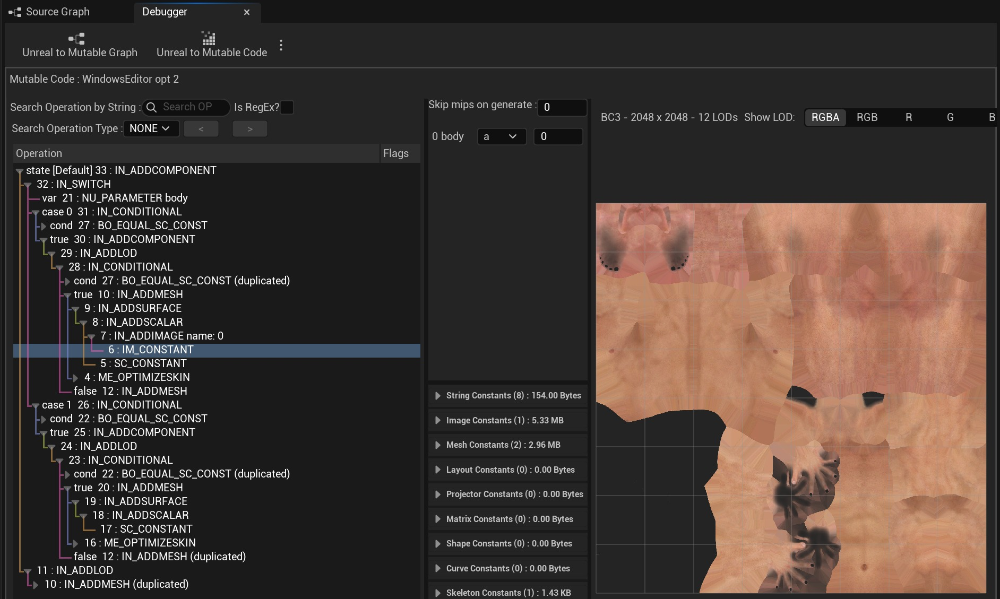

# 可变：故障排除

## 来源与状态

- 原始 URL：https://dev.epicgames.com/community/learning/tutorials/W47B/unreal-engine-mutable-troubleshooting

## 运行时分类

- 类型：图文教程
- 判断：API 未识别到核心视频信号，可整理正文约 3841 字符。

## 摘要

本教程解释了当您在使用 Mutable 时未获得所需结果时该怎么做。

## 中文整理

### 可变故障排除

Mutable 仍处于测试阶段，并且确实包含错误。此外，在不清楚视觉结果的原因是什么的情况下，许多用户体验领域还有改进的空间。最后，在性能方面也还有改进的空间。由于 CustomizedObject 资产基于图形的性质，改进这一切是一个漫长的迭代过程。本指南将帮助您识别问题、自行解决问题或在可能的情况下解决问题。如果您发现 Mutable 存在问题，请立即通过官方渠道报告。看看 https://forums.unrealengine.com/tags/c/general/feedback-requests/50/unreal-engine。我们也欢迎任何改进的功能请求和建议。

### 意想不到的视觉效果

如果自定义对象时虚幻引擎编辑器中生成的资源不是您所期望的，您可以打开它们并在每个特定资源编辑器中检查它们。预览资源是“暂时的”，不会出现在内容浏览器中，但可以通过双击“预览实例”选项卡中生成的资源列表的缩略图来打开它们。这可以帮助您识别哪些网格或纹理不包含您想要的内容。

您还可以在每个资源编辑器中打开相关资源：例如，您可以在骨架网格物体资源编辑器中找到生成的材质实例等。最后，对于高级用户，您可以在 Mutable 调试器中看到 Mutable 执行构建实例的每个步骤的结果。请参阅以下部分。

### 表现

建议查看 Mutable 文档的性能部分，以了解 Mutable 的性能和资源使用情况。如果您的游戏整体性能较差或帧故障，最好的选择是使用 Unreal Insights 进行调查。您可以启用一个特定的“可变”通道，该通道将在可变工作时注册计时。默认情况下它是禁用的。 Mutable 的大部分工作都会发生在工作线程中，所有事件名称也都以“Mutable_”为前缀。要了解 Mutable 对性能的影响，一种好的策略是禁用它。这可以通过将控制台变量 Mutable.Enable 更改为 0 来完成。在这种情况下，Mutable 只会将所有实例设置为使用参考网格，而不生成任何动态资源，因此不会对性能产生影响。这也会禁用编辑器中可变资产的编译。

### 虚幻编辑器崩溃

如果您最终遇到虚幻编辑器崩溃并且它们似乎与 Mutable 有关，您可以使用 Mutable.Enable 上面的相同控制台变量完全禁用 Mutable。如果它发生在编辑器启动时，您可以在“.ini”文件中或直接在代码中设置控制台变量。如果崩溃没有消失，我们建议您清理可变数据缓存。这些是项目中可能包含可变数据的文件夹：

### 可变调试器

Mutable 调试器是一个开发人员工具，我们在内部使用它来调试 CustomizedObject 资产和 Mutable 插件本身的问题。它可以用作故障排除的最后手段，因为它没有记录，并且由于其快速变化，它可能会保持不变。可以从“编译选项”菜单中的“调试”选项访问它：

调试器有几个部分，但最有趣的部分是“可变代码”视图，可以通过选择“虚幻到可变代码”按钮打开该视图。它还在“...”菜单中包含多个编译选项。该工具不是特别用户友好，并且本身可能存在停顿和错误。特别是，当打开 Mutable Code 视图时，编辑器将在游戏线程中重新编译 CustomizedObject，并且它将停止直到完成。

该视图包含 4 个面板：
