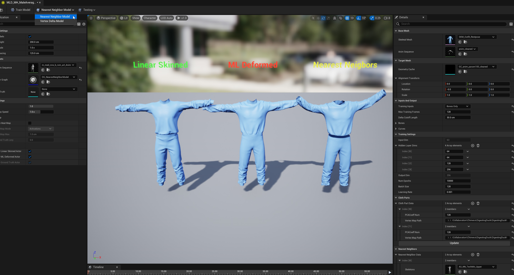
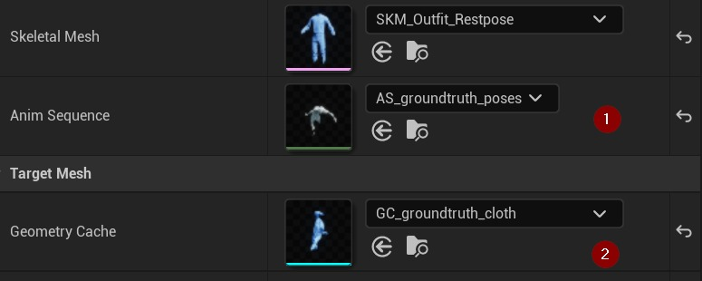
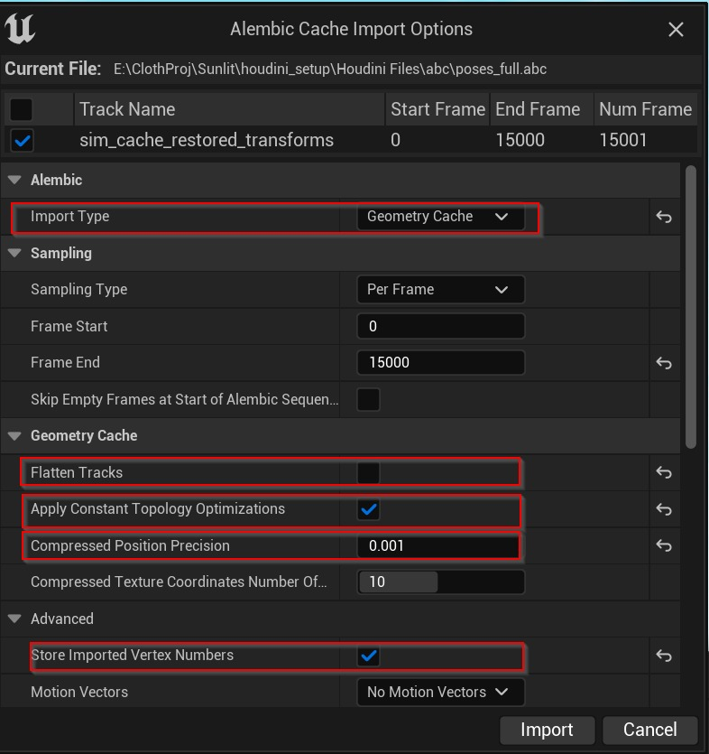
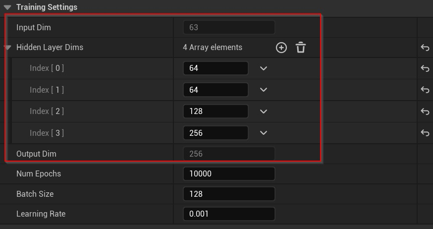
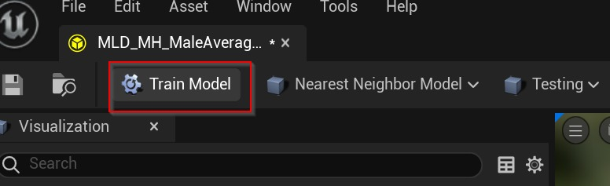
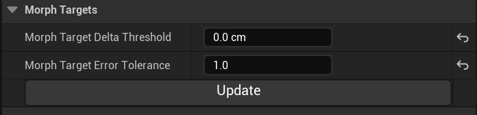
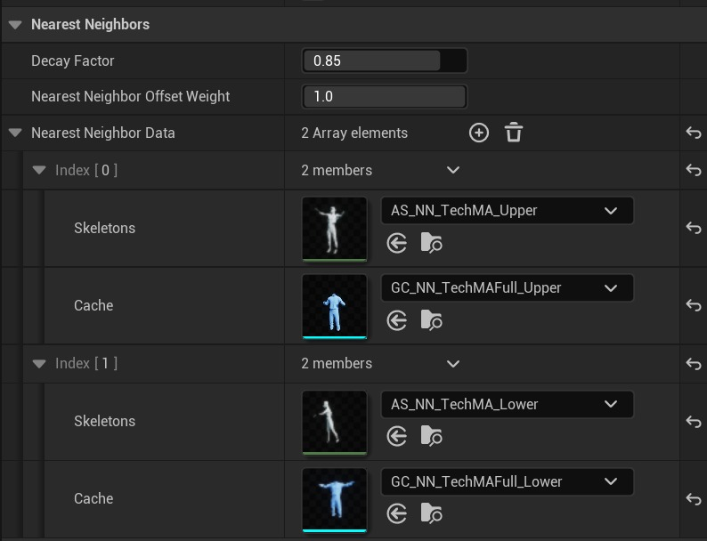
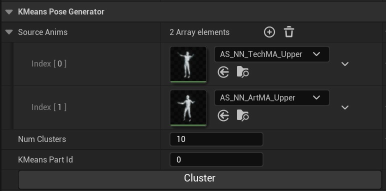

# 最近邻模型 5.3

## 来源与状态

- 原始 URL：https://dev.epicgames.com/community/learning/tutorials/2lJy/unreal-engine-nearest-neighbor-model-5-3

## 运行时分类

- 类型：图文教程
- 判断：API 未识别到核心视频信号，可整理正文约 5694 字符。

## 摘要

遍历最近邻模型

## 中文整理

### 介绍

最近邻模型是机器学习 (ML) Deformer 模型的变体。它特别擅长处理更复杂的形状和图案，例如角色服装，在某些情况下使其成为比神经变形模型更好的选择。这两种模型的不同之处在于它们的网络所产生的结果。神经变形模型直接更改形状上顶点（顶点增量）的位置。但另一方面，最近邻模型会生成一组主成分分析 (PCA) 系数。然后，使用这些 PCA 系数在用户选择的数据集中查找最接近的匹配或“最近邻居”。识别出最近邻后，我们将其复杂的形状特征转移到最终输出中，使其更加详细和准确。更具体地说，最近邻模型中的顶点增量通过以下方式计算：

```cpp
vertex_delta = mean_delta + (pca_coeff * pca_basis) + nearest_neighbor_delta
```

### ⚠️先决条件

本教程是为有经验的虚幻引擎用户设计的。为了充分利用它，您应该在以下领域拥有一些知识和经验： 最近邻模型目前处于开发的早期阶段。我们意识到现有的错误，并正在积极努力解决它们以改进模型的工作流程。目前要测试此模型，您首先需要安装 Unreal Python 的 **protobuf **。输入以下命令导航到您的工作区（对于 Windows 用户，您可以将以下命令粘贴到 powershell 中）：

```
cd {YourWorkSpace}\Engine\Binaries\ThirdParty\Python3\Win64
.\python.exe -m pip install protobuf
```

请注意，如果您切换工作区，则需要在新工作区中重新安装这些软件包。感谢您的理解和耐心，我们将继续开发和完善最近邻模型。

### 视口



在顶部工具栏中标有“模型”的下拉菜单中，确保您已选择 **最近邻模型**。

### 训练集



### 培训资产

### 模拟设置

您可以使用任何模拟解算器生成地面实况网格，例如用于角色服装的 Houdini Vellum。本教程不会介绍如何设置模拟。但无论您使用什么软件，您都应该

### 培训资产要求

### Alembic 导入设置

将 alembic 文件导入引擎时，请确保正确设置以下设置：



### 重新导入资产

目前，对于 5.2，如果您重新导入骨架网格体、动画序列或几何缓存，请按照以下步骤操作以确保更改被识别：这将强制刷新，确保机器学习变形器 (MLD) 检测到您更新的资源。

### 训练设置

### 网络架构



### 杂项设置

这些设置已经过各种资产的尝试和测试，并被证明可以有效工作。如果您不确定它们的用途，最好不要改变它们。

### 布料零件

“布料部分”是为最近邻搜索而识别的独特区域。在运行时，每个布料部件在其特定数据集中搜索最近的邻居并相应地应用细节。在给定的示例中，我们定义了两个布料部分：一个用于上衬衫，另一个用于下裤子。每个布料部分都由顶点索引列表定义。

### 使用双四元数 Delta

此选项使用双四元数蒙皮来计算和反转顶点增量。使用此选项可以改善网络学习的增量，并降低过度拟合的可能性。但是，请记住，这可能会稍微影响运行时的性能。对于熟悉双四元数蒙皮的人来说，以下是用于此过程的数学公式：

```
$\bar{q}=\frac{w_1q_1+w_2q_2\cdots + w_nq_n}{\parallel w_1q_1+w_2q_2\cdots w_nq_n\parallel}, v'=qvq^{-1}$
```

### 训练



在初始时期，模型中的错误应该会显着减少。如果没有发生这种情况，则您的数据可能存在问题。如果您发现错误在大约 50 个时期内根本没有减少，您可以停止训练过程并应用部分训练的模型（提前停止）。

### 结果可视化

训练结束后，我们可以开始可视化结果。此时，我们尚未定义最近邻数据集，但我们可以开始可视化 PCA 增量。由于最近邻数据集尚未设置，因此 PCA 增量将与神经变形模型中的增量非常相似。

### 变形目标

变形目标系统是在运行时在骨架网格物体上使用的混合形状系统。其主要优点是每个变形目标或混合形状都经过量化和压缩，使用的内存比原始混合形状更少。每个 PCA 基础都呈现为变形目标，并且这些目标在运行时进行组合。压缩的默认设置通常会导致最近邻模型出现不必要的视觉故障。该怎么做：



### 变形器图

为了可视化几何细​​节，有必要在网格被变形目标变形后重新计算法线。您可以通过以下两种方式执行此操作：

### 最近邻数据

该术语是指用于改进模型复杂几何细节的数据集。在运行时的每一帧中，系统都会识别该数据集中最接近的匹配，并传输来自该“最近邻居”的详细信息以增强最终结果。您可以通过多种方式生成此数据： 创建此数据集时的说明： 其他设置：



### KMeans 姿势生成器

设置：



### 杂项设置

### 文件缓存

此项应保持关闭状态。

### 可视化

您可以在“可视化”部分中找到以下设置，特别是在左侧面板的“实时设置”下：
