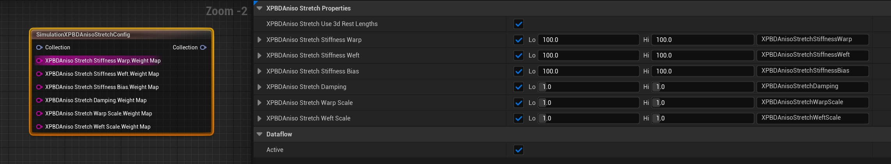
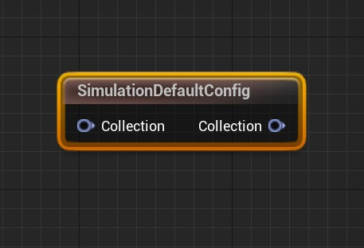
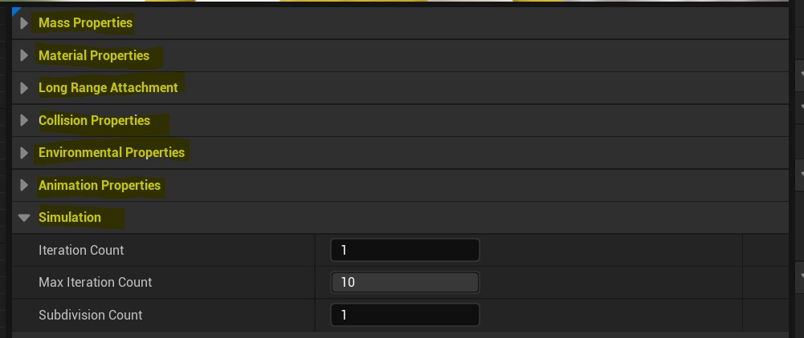
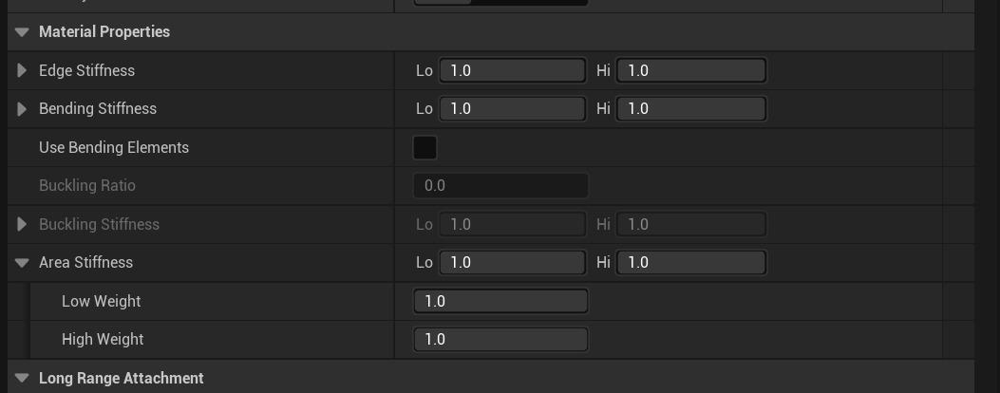
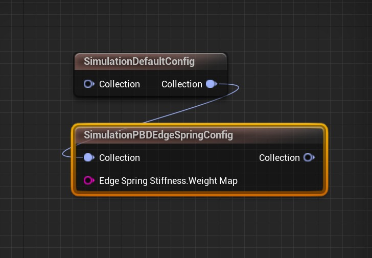
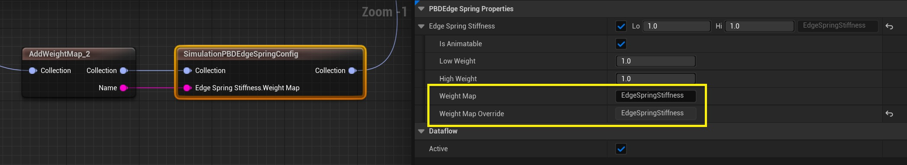
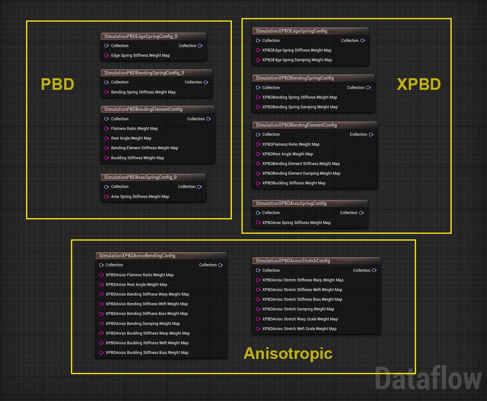
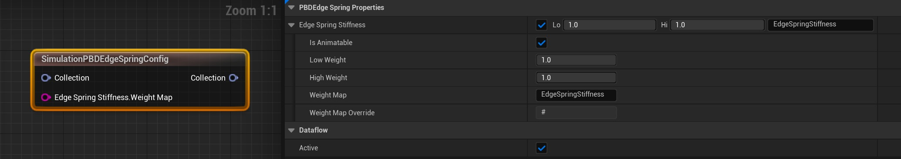
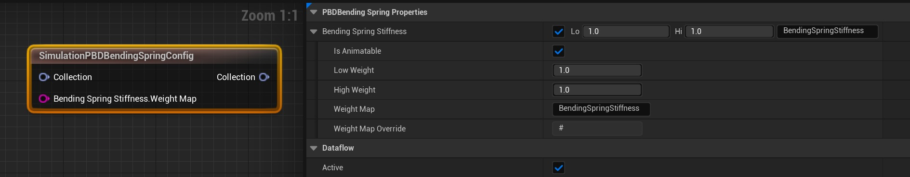

# 面板布料约束节点参考

## 来源与状态

- 原始 URL：https://dev.epicgames.com/community/learning/tutorials/eKwY/unreal-engine-panel-cloth-constraint-node-reference

## 运行时分类

- 类型：图文教程
- 判断：API 未识别到核心视频信号，可整理正文约 4212 字符。

## 摘要

5.3 中的实验性混沌布料面板编辑器支持旧布料编辑器中不可用的额外约束选项。本文档将提供有关如何使用这些节点覆盖现有布料配置以提供更高保真度模拟控制的高级参考，特别是对于 VFX/电影和 ML 应用程序。

## 中文整理

### ⚠️重要

这是一个实验性功能。您需要加载必要的插件（*请参阅混沌面板布料编辑器工作流程和 ML 布料生成概述*）并重建虚幻引擎才能使用本教程。

### 面板布料编辑器 - 约束节点

随着***实验*** 5.3 布料面板编辑器的推出，混沌布料（仅在新的面板编辑器中）现在支持扩展基于位置的动态 (XPBD) 约束以及默认的基于位置的动态 (PBD)。

### 何时使用 PBD 与 XPBD？

我们在 5.3 中添加了 XPBD 支持，以支持更复杂的布料模拟。然而，用户必须意识到这是一种更昂贵的模拟方法，并考虑到他们的工作和潜在的实时影响。 *控制和性能成本从最低 → 最高：* **元件与弹簧（三角形与边缘控制）** - 使用 PBD 弯曲元件（三角形）与弯曲弹簧（边缘）进行屈曲控制 **XPBD 与 PBD** - 例如，当您需要阻尼同时使用更多子步骤时，请使用 XPBD。 **Aniso XPBD 与 XPBD** - 使用各向异性节点进行临界阻尼以及经纱/纬纱偏差控制

### 价值观

基本PBD布料属性值范围在0-1之间。 Aniso（各向异性）XPBD 单位是具有更高范围的刚度值（例如 100-1000+）

### 节点作为“覆盖”

在面板布料教程中，我们提到由于最大距离、与旧编辑器的向后兼容性，使用详细节点而不是 SimDefaultConfig 节点。在本节中，我们只想演示如何使用详细配置节点来充当 SimDefaultConfig 节点的“覆盖”。

SimulationDefaultConfig 节点包含默认混沌布料解算器的所有标准 PBD 参数。

例如，材料属性包含边缘刚度、弯曲刚度、弯曲元素、屈曲（比率和刚度）和面积刚度的参数。

通过在SimulationDefaultConfig节点后添加一个节点，我们可以有效地覆盖相应的Material Properties参数值。

### 材质属性覆盖示例

在此示例中，**PBDEdgeSpringConfig** 将覆盖 DefaultConfig 材料属性的默认“边缘刚度”，因为它放置在 SimulationDefaultConfig 节点之后。

***注意：使用多个节点时，数据流图中的最终节点优先于特定的相应材质属性参数！***

### 重量图

具有模拟网格绘制区域的权重贴图也可以与这些覆盖节点一起使用。

默认权重图名称位于参数右侧。如果您使用具有该名称的 AddWeightMap 节点绘制区域，它将影响参数作为使用 Lo/Hi 值的乘数映射。 *有关地图的信息，请参阅混沌布料工具属性参考（旧版布料编辑器中的蒙版）。* [https://dev.epicgames.com/community/learning/tutorials/jOrv/unreal-engine-chaos-cloth-tool-properties-reference](https://dev.epicgames.com/community/learning/tutorials/jOrv/unreal-engine-chaos-cloth-tool-properties-reference)

### PBD/XPBD 约束节点

下面是面板布料编辑器中可用的 PBD、XPBD 和各向异性节点的图像。接下来的图像和注释分解了各个节点，以便为用户提供参考。

### PBD 节点参考

### PBD 边缘弹簧刚度

### PBD 弯曲弹簧刚度

### PBD 弯曲元件（屈曲刚度）

### PBD 区域泉水

### XPBD 节点参考

### XPBD 边缘弹簧

### XPBD 弯曲弹簧

### XPBD 弯曲单元（屈曲刚度）

### XPBD 地区 春季

### XPBD 各向异性节点参考

### XPBD Aniso 弯曲（弯曲/屈曲刚度）

### XPBD Aniso 拉伸（边缘刚度）

- [面板布料编辑器](https://dev.epicgames.com/community/learning/tutorials/pv7x/unreal-engine-cloth-panel-editor) - [布料工具属性参考](https://dev.epicgames.com/community/learning/tutorials/jOrv/unreal-engine-chaos-cloth-tool-properties-reference)

## 相关链接

- [Panel Cloth Editor](https://dev.epicgames.com/community/learning/tutorials/pv7x/unreal-engine-cloth-panel-editor)
- [Cloth Tool Properties Reference](https://dev.epicgames.com/community/learning/tutorials/jOrv/unreal-engine-chaos-cloth-tool-properties-reference)
