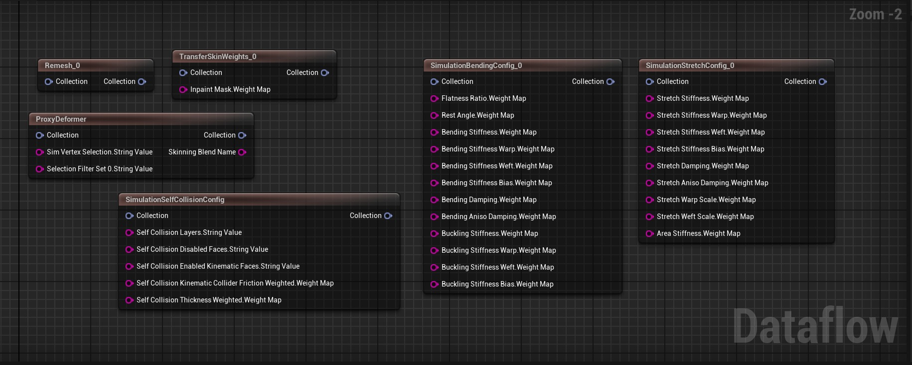
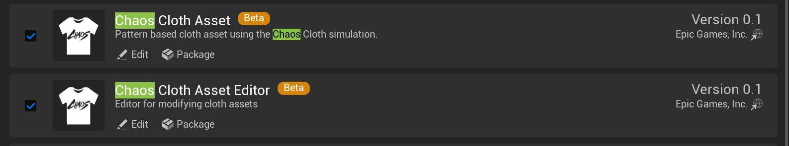
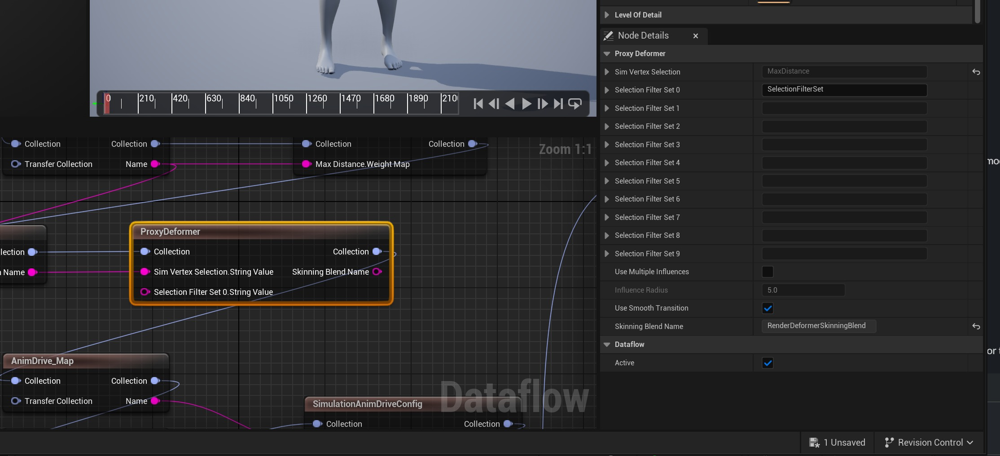
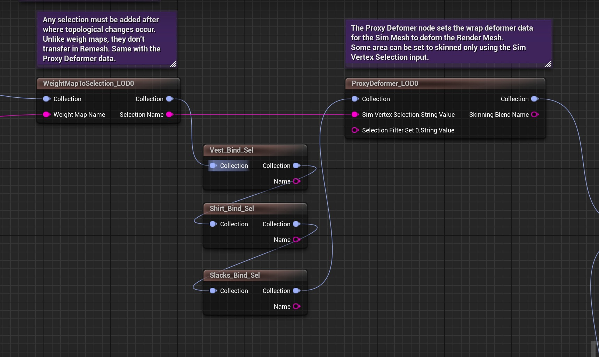
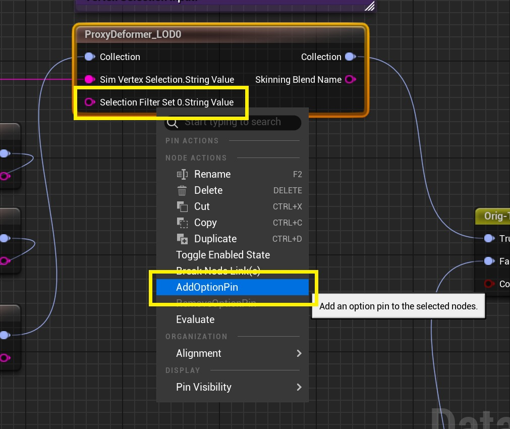
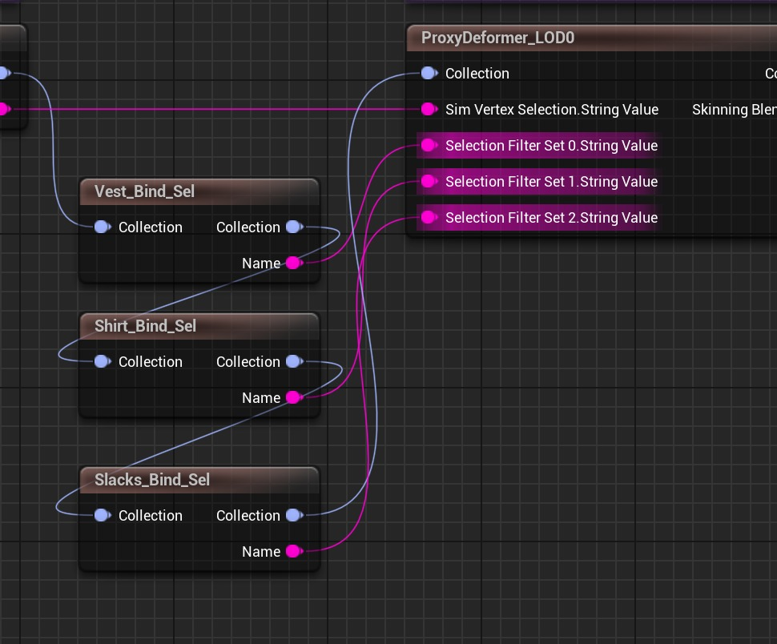
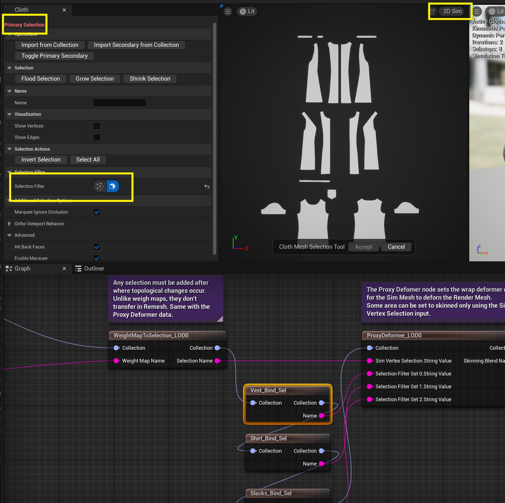
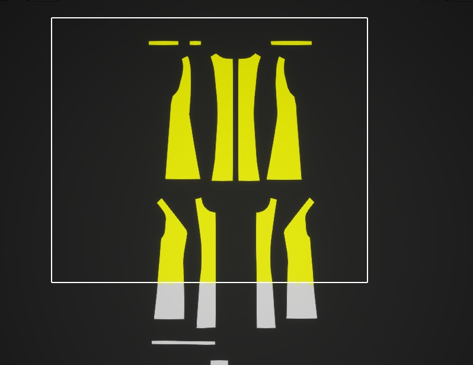
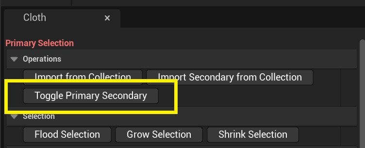

# 面板布 - 数据流和碰撞更新 (5.4)

## 来源与状态

- 原始 URL：https://dev.epicgames.com/community/learning/tutorials/0Ja6/unreal-engine-panel-cloth-dataflow-and-collision-updates-5-4

## 运行时分类

- 类型：图文教程
- 判断：API 未识别到核心视频信号，可整理正文约 11402 字符。

## 摘要

5.4 中的 Beta 混沌布料面板编辑器为您的混沌布料设置添加了新的数据流节点，以及更新的 XPBD 模拟参数和新的碰撞功能。本文档将提供有关如何使用这些节点来增强布料工作流程和模拟结果的参考。

## 中文整理

### 混沌面板布 - 数据流和碰撞更新 (5.4)

### 虚幻引擎 - 加载插件

在虚幻引擎中，首先确保您具有适用于 Chaos Cloth 资源的正确 Beta 插件以及已加载的 Chaos Cloth 资源编辑器。如果出现提示，请重新启动编辑器。

- [混沌面板布 - 编辑器演练和更新 (5.4)](https://dev.epicgames.com/community/learning/tutorials/Mpze/unreal-engine-panel-cloth-editor-update-walkthrough-5-4)

### 5.4 数据流节点更新

以下包括 5.4 中布料数据流的新节点和工作流程。

### 代理变形器节点

正如演练中提到的，代理变形器是一个新节点，用于将渲染网格（驱动）绑定或包装到模拟网格（驱动程序）。 5.4 更新允许更好地控制模拟网格相对于渲染网格的效果。

将渲染网格绑定到模拟网格时，可能会发生不需要的变形。使用代理变形器节点，可以通过将变形隔离到每个模拟和渲染网格的特定部分来清理不需要的绑定区域。

对于从 Marvelous Designer 导入的 3 组面板/网格，我们肯定需要使用代理变形器，以防止变形器在模拟和渲染服装之间找到不需要的连接。

首先，我们将为三组面板创建选择，为它们命名以便组织并连接收集线。

我们将向代理变形器节点添加另外 2 个选项引脚。

**然后将每个名称值连接到选择过滤器值。**

### 新功能 - 主要/次要选择集

现在，每个选择都支持一组可选的辅助选定元素。在该工具中，您可以在主要和次要选择模式之间切换。

当 ClothCollection 通过时，一个选择节点会将主要集和辅助集附加到 ClothCollection。如果辅助集为空，则不会在 ClothCollection 上设置它。

### 初选

确保您处于“主要选择”模式。我们发现 2D Sim 面板最适合此选择，但也可以随意使用 3D SIM 面板。选择您创建的选择节点之一。

然后您会注意到面板视口已准备好供您选择。

为 Sim 面板进行男性选择的最简单方法是选取框选择所需的面板，并将选择过滤器设置为面。

选择后，单击“接受”按钮保存您的主要选择。

### 二次选拔

要切换到辅助选择，请单击“切换主要辅助”按钮。

按下后，“主要选择”将更改为“次要选择”以选择我们相应的渲染几何元素。

将视口模式切换为“渲染”以可视化渲染网格几何体。

选择由裁片制成的服装的一个简单方法是在每个裁片上选择一个顶点。

然后使用“增长选择”工具按钮完成完整选择。

您可能会错过某些部分，尤其是内部渲染表面。确保在选择工具的可视化部分中切换“显示顶点”，以帮助您更好地看到难以到达的地方。

做出选择后，单击“接受”保存设置。

### 选择节点面/索引

您可以通过选择节点来查看主/辅索引。不要忘记为您的选择命名。

### 代理变形器节点位置限制

### 重新网格化节点更新

重新网格节点用于更改模拟网格和/或渲染网格的网格拓扑。 5.4 的新增功能是能够重新网格化模拟和渲染网格几何体。

### 模拟网格过程

### 先接缝重新网格化

输入模拟网格

两块面板之间的接缝特写。

首先重新网格化接缝...

..然后对内部进行重新网格化。

最终输出网格。

### 模拟网格参数

### 渲染网格过程

在对渲染网格进行操作时，我们可以选择两种方法：重新网格化和简化。

### 渲染网格参数

### 重新网格 LOD 接缝改进

渲染网格的重新网格节点中添加了一个新选项。重新网格渲染接缝。这有助于减轻渲染网格蒙皮时接缝拉开的情况。

### 转移皮肤重量的提示和技巧

### 新数据流节点

### 选择节点

包括主要和次要选择组。

### SelectionToIntMap 节点

该节点主要用于指定碰撞的布料层。选定值用于指定每个面的层数。

### 选择权重映射节点

可用于进行选择并转换为权重图。

### 添加针迹

5.4 中添加的节点用于进行选择并合并到单个顶点。

### 权重映射到选择

将权重图转换为整数选择集。

### 删除元素

可用于删除网格中不需要的元素的节点。

连接集合后，“组”选项将作为下拉菜单提供。

### 变换位置节点

用于网格位置的一般变换、旋转和缩放的节点。

### TransformUvs 节点

用于更改 UV 数据的位置、旋转和比例的节点。

### 重力和质量的地图支持

5.4 中添加了质量和重力图支持。

模拟质量配置节点

模拟重力配置节点

### 模拟多分辨率配置节点（实验）

开发一个实验节点来帮助解决织物的弹性问题。

### 模拟拉伸覆盖节点（实验）

### 模拟弯曲覆盖节点（实验）

### 仿真约束节点

**从 5.3 开始，许多模拟约束节点已被弃用。为了希望简化混沌布模拟可用的选项，进行了大量的清理和整合。**

### 模拟拉伸配置节点

以下是SimulationStretchConfig 选项的直观分解。

### 模拟弯曲配置节点

以下是SimulationBendingConfig 选项的直观分解。

### 拉伸使用 3D 静止长度/静止角度

### 求解器类型

有两种求解器类型可用：扩展基于位置的动态 (XPBD) 约束以及默认的基于位置的动态 (PBD)。

有关何时使用 XPBD 与 PBD 的更多信息，请参阅此文档：

- [混沌面板布料约束节点参考](https://dev.epicgames.com/community/learning/tutorials/eKwY/unreal-engine-panel-cloth-constraint-node-reference)

### 分布类型

### 覆盖

用户可以在覆盖低/高值、权重图或两者之间进行选择。

第一个蓝色切换按钮（箭头/框图标）将启用/禁用 Marvelous Designer 低/高值的使用，第二个蓝色切换按钮（衬衫图标）将启用/禁用 Marvelous Designer 权重图。

### 使用多种 Marvelous Designer 面料时的注意事项

### 如何可视化 Marvelous Designer 权重图导出

可以查看从 Marvelous Designer 导出的权重图。例如，假设您想要可视化“弯曲刚度扭曲”参数的权重图。

在SimulationBendingConfig 节点上，搜索您想要可视化的覆盖的弯曲属性。弯曲刚度扭曲参数的权重贴图名称被命名为“BendingStiffnessWarp”（绿色框）

接下来创建一个“AddWeightMap”节点。

在 AddWeightMap 节点的“名称”中，键入或复制/粘贴“SimulationBendingConfig”节点中的“BendingStiffness”。

首先将SimulationBendingConfig 节点的Collection 输出连接到您创建的AddWeightMap 的输入Collection。

然后将另一个输出集合连接到 AddWeightMap 节点的“传输集合输入”。

通过选择 AddWeightMap 节点，您现在应该能够在美元导入过程中可视化从 Marvelous Designer 导入的权重图。

最后，当您将鼠标移到面板上时，您可以查询画笔处的值。虽然此示例非常简单，但如果图案织物更复杂，则较小的画笔尺寸将允许更好的值检测。

### 新的 XPBD Sim 参数

新节点上的等效设置以匹配已弃用节点上的行为：

拉伸配置：

弯曲配置：

### XPBD 刚度、解算器设置

XPBD 刚度是物理刚度（例如，单位看起来更像 kg cm /s^2，而不是 0-1 值）。通过改变幅度进行调整并不是探索参数的好方法。例如，尝试 0.1、1、10、100、1000。

### XPBD AnisoBendingConfig

这是主要的弯曲属性节点。弯曲约束存在于布料边缘并影响沿该边缘的弯曲角度。

### XPBD Aniso 弹簧

该约束控制布料的弹性。它实际上创建了具有共享刚度控制的“边缘”和“区域”弹簧。

边缘弹簧是沿着三角形网格边缘的弹簧。区域弹簧是从一个顶点延伸到另一边的弹簧。

### 碰撞更新

5.4 添加新的碰撞系统、自碰撞和可视化更新

### 运动碰撞器

这是新节点的早期版本，旨在更好地处理发动机中的车身碰撞。

使用闭合静态网格体，并使用 TransferSkinWeights 节点从蒙皮网格体传输蒙皮权重，如演练教程中所述。然后添加一个选择节点来隔离要碰撞的运动区域。

### 性能成本

性能与运动碰撞器上的面数以及布料模拟网格上的面数有关。我们建议尽可能使用最低的三网格。理论上您可以使用 LOD0 网格，但您可能不想这样做！ （作为参考，Project Talisman 使用了进一步优化的 LOD2 Metahuman）

### 模拟自碰撞配置节点

这是一个新节点，旨在处理使用运动碰撞器和布料层的情况。

通常只选择与运动碰撞器碰撞而不选择自碰撞的选项。

### 模拟自碰撞球体节点

这是 Apex 风格自碰撞的直接替代品。我们仍然偶尔会被问到有关 Apex 碰撞的问题，这些碰撞已经有一段时间不支持了，所以它们被添加到这里！

### 布层

布料层利用上面提到的SimulationSelfCollisionConfig 节点。用户需要使用 Selection 和 SelectionToIntMap 节点指定布料层。

它们的工作原理与 Marvelous Designer 相同 - 较低的层数总是会推动较高的数字，并且它基于面上的法线。

### 蒙皮级别集更新

对蒙皮水平集进行了一些优化，但是，运动碰撞器功能比蒙皮水平集更快，因此该功能的开发已暂停。

请参阅此文档了解如何设置碰撞的蒙皮级别集。

- [额外布料碰撞选项](https://dev.epicgames.com/community/learning/tutorials/pvax/unreal-engine-cloth-extra-collision-options)

### 碰撞调试绘制更新

为新的布料层和碰撞添加了一些可视化调试选项。

### 自碰撞

以下仅适用于SimulationSelfCollision配置节点。

### 自碰撞层

### 自碰撞厚度

### 链接

- [混沌布料编辑器演练和更新 5.4](https://dev.epicgames.com/community/learning/tutorials/Mpze/unreal-engine-panel-cloth-editor-update-walkthrough-5-4)

- [混沌面板布料编辑器 5.3](https://dev.epicgames.com/community/learning/tutorials/pv7x/unreal-engine-panel-cloth-editor)

- [转移皮肤权重节点参考](https://dev.epicgames.com/community/learning/tutorials/Dl20/unreal-engine-panel-cloth-transfer-skin-weights-node)

## 相关链接

- [Chaos Panel Cloth - Editor Walkthrough and Updates (5.4)](https://dev.epicgames.com/community/learning/tutorials/Mpze/unreal-engine-panel-cloth-editor-update-walkthrough-5-4)
- [Chaos Panel Cloth Constraint Node Reference](https://dev.epicgames.com/community/learning/tutorials/eKwY/unreal-engine-panel-cloth-constraint-node-reference)
- [Extra Cloth Collision Options](https://dev.epicgames.com/community/learning/tutorials/pvax/unreal-engine-cloth-extra-collision-options)
- [Chaos Cloth Editor Walkthrough and Updates 5.4](https://dev.epicgames.com/community/learning/tutorials/Mpze/unreal-engine-panel-cloth-editor-update-walkthrough-5-4)
- [Chaos Panel Cloth Editor 5.3](https://dev.epicgames.com/community/learning/tutorials/pv7x/unreal-engine-panel-cloth-editor)
- [Transfer Skin Weights Node Reference](https://dev.epicgames.com/community/learning/tutorials/Dl20/unreal-engine-panel-cloth-transfer-skin-weights-node)
