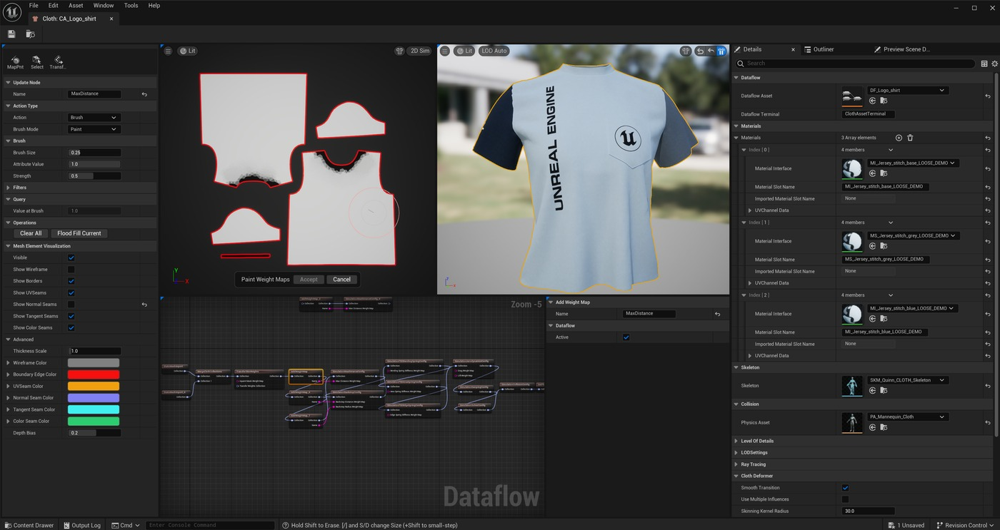
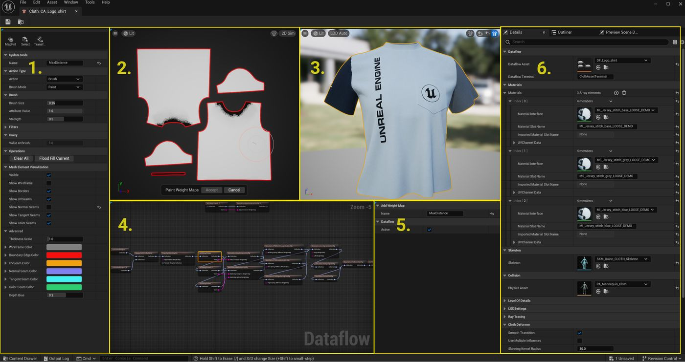
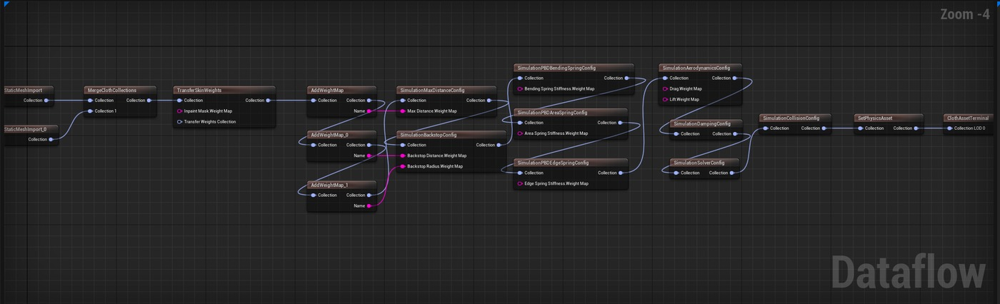
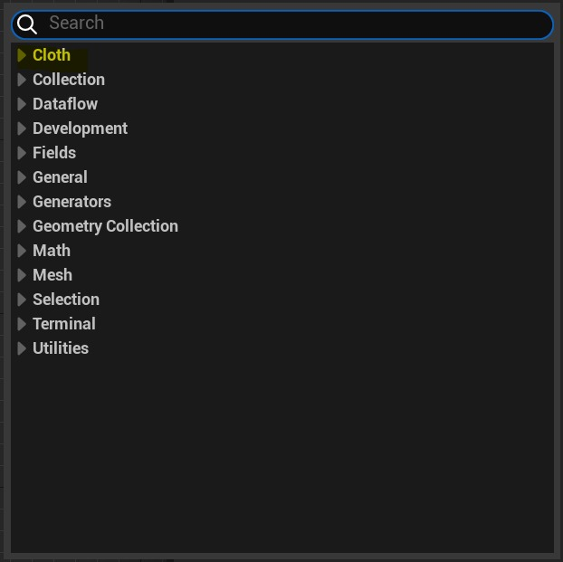
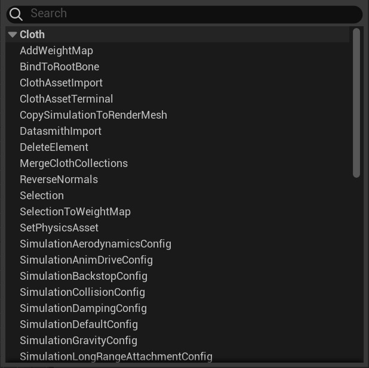
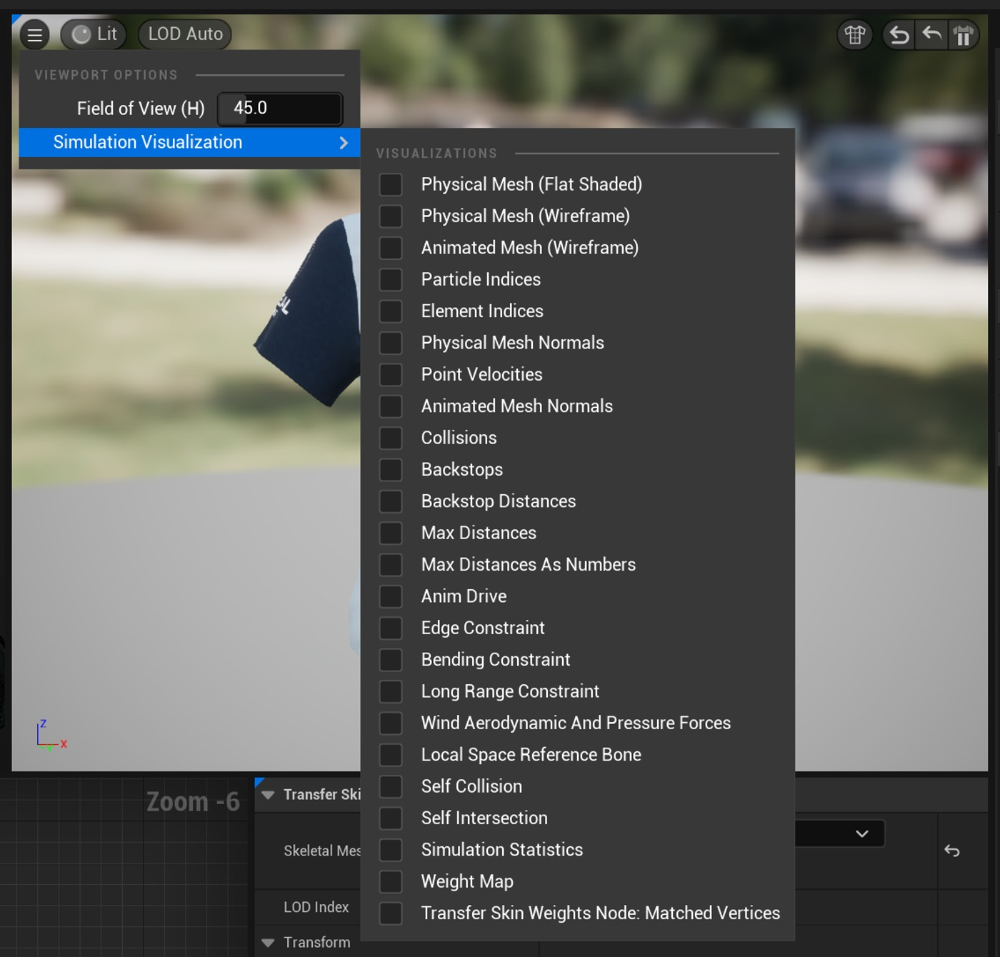
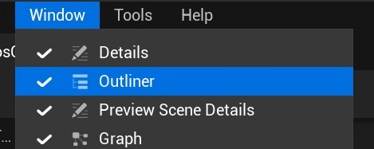
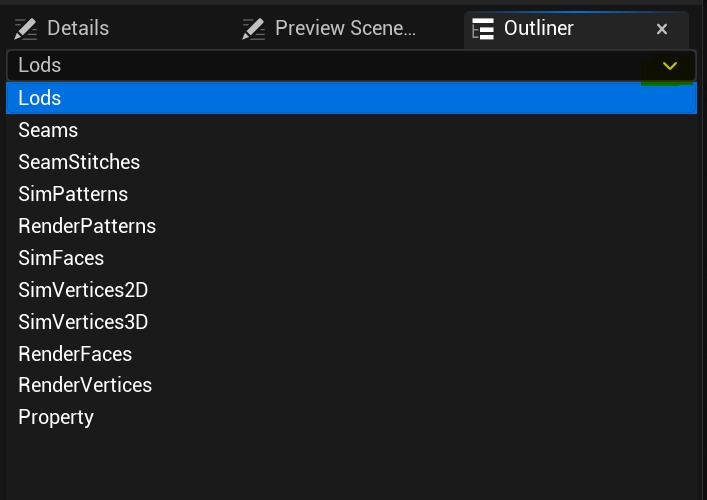
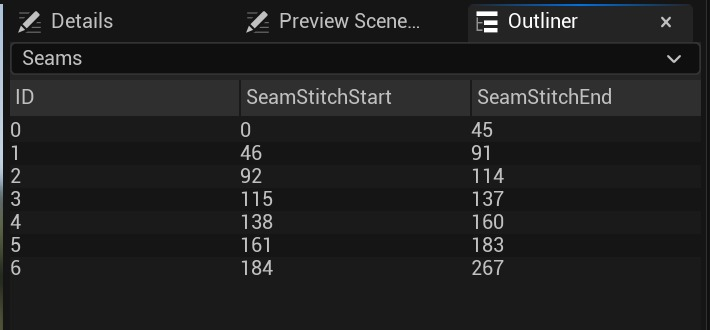
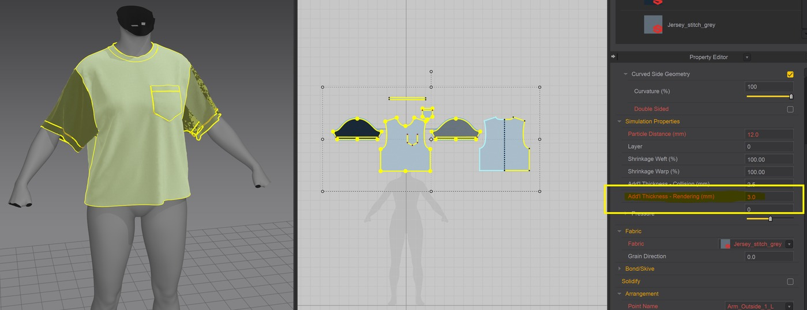

# 面板布料编辑器

## 来源与状态

- 原始 URL：https://dev.epicgames.com/community/learning/tutorials/pv7x/unreal-engine-panel-cloth-editor
- 原始文件：unreal-engine-panel-cloth-editor.origin.md
- 分段：第 1/2 段

## 运行时分类

- 类型：图文教程
- 判断：运行时未识别到核心视频信号，可整理正文约 14110 字符。

## 摘要

在本教程中，我们将概述虚幻引擎中新的、基于实验面板的布料编辑器！我们将展示如何访问和导航...

## 中文整理

### ⚠️重要

这是一个实验性功能。您需要加载必要的插件（见下文）并重建虚幻引擎才能使用本教程。

### 基于实验面板的布料编辑器概述

新编辑器的一些亮点： - 使用数据流的混沌角色物理（布料/肉体）的新基类编辑器 使用数据流的混沌角色物理（布料/肉体）的新基类编辑器 - 从骨架网格物体中提取布料作为单独的布料组件 从骨架网格物体中提取布料作为单独的布料组件 - 基于面板的布料网格导入支持（基于面板的 DCC） 基于面板的布料网格导入支持（基于面板的 DCC） - 基于非破坏性节点的工作流程（数据流节点图） 基于非破坏性节点的工作流程（数据流节点图） - 新 - 蒙皮权重转移工具 新 - 蒙皮权重转移工具 - 新 - 由可重复使用的贴图替换蒙版 新 - 由可重用贴图替换蒙版 - 新 - 由单个 sim 网格支持驱动的多种材质 新 - 由单个 sim 网格支持驱动的多种材质 - 添加了布料约束支持 添加了布料约束支持

### 旧版与新版布料面板编辑器

两种布料编辑器（旧版和新的布料面板编辑器）都使用相同的混沌解算器，但这个新编辑器已进行了扩展，具有更多进化的可选 (XPBD) 约束类型以及其他功能，例如静态网格物体支持和传输蒙皮权重的能力。从长远来看，我们希望从中获得两个应用程序，一个是实时应用程序，另一个是更加面向视觉特效的应用程序（使用缓存）。您设置布料的方式将决定您希望模拟的速度和精确度。由于指标不会在覆盖姿势中烘焙，面板将使模拟看起来更好，因此即使使用旧的约束，您仍然应该获得更好看的模拟。唯一的缺点是我们使用一个新组件来独立于 SkeletalMesh 资源来渲染布料，这意味着对象管理会产生轻微的开销，当然还有一些额外的绘制调用。但作为交换，您将能够为布料渲染网格使用尽可能多的材质。新的布料面板编辑器最终将（长期）取代引擎中现有的（旧版）SkeletalMesh 布料编辑器。没有计划向旧版布料编辑器添加更多功能。

### 工作流程限制/缺少什么

- 未实现运行时蓝图交互器节点支持 未实现运行时蓝图交互器节点支持 - 仍需添加蒙皮权重配置文件 仍需添加蒙皮权重配置文件 - 要添加布料编辑器中的多个服装支持/布局 要添加布料编辑器中的多个服装支持/布局 - 世界碰撞尚不支持新的布料资源 世界碰撞尚不支持新的布料资源 - 尚不支持缓存新布料资源的布料 不支持缓存新布料资源的布料尚未支持 - 第一代绘制工具 第一代绘制工具 - 数据流节点复制/粘贴尚未实现 数据流节点复制/粘贴尚未实现 - 数据流节点封装尚未实现 数据流节点封装尚未实现 - 我们建议此时不要使用多个 LOD 我们建议此时不要使用多个 LOD

### 示例内容文件

我们提供了一些示例文件和资源，供您在使用新的面板布料编辑器时使用或作为参考。请参阅下面的链接了解更多信息。 https://dev.epicgames.com/community/learning/tutorials/r287/unreal-engine-panel-cloth-example-files-5-3

### 面板布料编辑器

### 布料编辑器导航

布料编辑器分为六个面板（正在开发中，可能会发生变化） - 布料模式工具栏和参数 布料模式工具栏和参数 - 2D/3D 布料面板/网格视图 2D/3D 布料面板/网格视图 - 3D 渲染视口 3D 渲染视口 - 数据流图 数据流图 - 布料参数窗口 布料参数窗口 - 详细信息/预览场景/大纲面板 详细信息/预览场景/大纲面板

### 数据流图概述

数据流图是一个基于节点的资产生成工具。每个节点都有输入和输出，输出连接到一个或多个输入。当评估数据流图时，要评估的每个节点都将为其输出设置值，并且这些输出将缓存在用于评估的上下文内的数据存储中。要添加节点，请右键单击“数据流图”，然后从“布料”菜单中选择一项。展开顶部的 Cloth 部分以查看可用节点的列表。

### 仿真可视化

要访问各种布料调试可视化效果，请下拉 3D 渲染视口中最左侧的图标。

### 大纲

有时，布料大纲视图在布料面板编辑器中可能不可见。要在“详细信息/预览场景面板”之外添加“大纲视图”菜单，（请参见上面的 6），请单击编辑器左上角的“窗口”部分，然后选择“大纲视图”。“大纲视图”窗口右上角的下拉菜单显示不同的属性项和每个属性的数据。该编辑器正在进行中。

### DCC 面板布料资产生成

我们将演示如何使用从 Marvelous Designer 导出的两个静态网格物体在虚幻引擎中使用新的面板编辑器。这是该流程的一个稍旧的版本，没有考虑当前示例内容中使用的确切资产，但它仍然相关。如果您使用示例内容中提供的文件，请随时跳至下面的虚幻引擎面板布料设置步骤。

### 在 DCC 中生成静态网格体

对于这种基于面板的布料方法，我们将使用两个静态网格物体，并将其导入到虚幻引擎中。通过专用模拟网格进行代理变形的可渲染网格。有关代理工作流程的更多信息，请参阅下面的导入静态网格体部分。我们不会详细说明如何在 Marvelous Designer 中从头开始创建面板，只是将面板几何体从任何基于面板布料的 DCC 导出到虚幻引擎时需要注意的一些主题。确保您的面板具有 Marvelous Designer 中生成的 UV，并保存在 0-1 空间中（并且可以随意优化您的面板，使其比此示例更好！）在 Marvelous Designer 中使用相同的碰撞资产，并具有与虚幻引擎中使用的相同的静止姿势。可渲染网格 模拟网格 渲染网格面板 模拟网格面板 - 从具有较高粒子距离的 Marvelous Designer 导出（已删除内部线和口袋的细网格） 我们的 Marvelous Designer 导出设置： - 渲染几何体 粒子距离：12 衬衫/5 衣领 渲染几何体 粒子距离：12 衬衫/5 衣领 - 模拟几何体粒子距离 = 18 衬衫/10 衣领 模拟几何体粒子距离 = 18 衬衫/10 衣领 两者都是单个焊接网格，保存为.fbx 文件。目前，这需要从 Marvelous Designer 进行两次手动导出才能创建这些不同的文件。注意：我们计划支持引擎中的模拟网格划分/重新划分网格，以及从基础 LOD0 可渲染网格生成 LOD 网格。

### 虚幻引擎面板布料设置

### 插件

在虚幻引擎中，首先确保您已加载混沌布料资源和混沌布料资源编辑器的正确实验插件。如果出现提示，请重新启动编辑器。

### 导入静态网格物体

导入从 Marvelous Designer 保存的两个文件作为静态网格体。这些（如下）是通过 Marvelous Designer 的简单纹理贴图手动导入的，以创建基本材质。 （基色和正常）。我们在可渲染网格中添加了一些徽标以进行测试。示例中的渲染 (LOD0) 网格 (SM_Quinn_Shirt) 具有三种材质和几何体厚度。由于网格分辨率和厚度较高，直接在引擎中进行模拟并不是最佳选择。模拟网格 (SM_Quinn_shirt_SIM) 是一种材质，并且是薄网格。我们添加了明显的颜色材质，以帮助在视觉上将其与渲染网格分开。由于分辨率较低且没有厚度，该网格更适合模拟。注意：有关代理工作流程及其模拟布料优势的更多信息，请参阅 Echo Cape Dev Hub 示例。 https://dev.epicgames.com/community/learning/tutorials/2YW1/unreal-engine-echo-cape-tutorial 使用我们将在下面设置的代理工作流程，“SM_Quinn_shirt_SIM”将驱动“SM_Quinn_shirt” 注意：此示例还将展示如何使用一个模拟网格对多种材质（在本例中为三种材质）进行变形。这在当前（旧版）布料工作流程中是不可能的，也是我们最需要的功能之一。

### 创建布料资源

让我们创建布料组件。在内容浏览器中选择一个您想要创建布料资源的位置，右键单击并下拉至物理 – 布料资源，将生成一个新的 ChaosClothAsset。双击 ChaosClothAsset，您可以选择“创建/打开现有”或“在没有数据流节点的情况下继续”。按“创建新数据流” - 系统会提示用户保存数据流文件的位置一旦保存，将打开一个新的布料编辑器窗口。用户将有两个文件：ChaosClothAsset 和 ChaosClothAsset_Dataflow。保存两者。这两个文件一起工作。重新打开时，始终双击 ClothAsset 而不是 Dataflow Graph 节点。注意：最终，我们计划为某些数据流节点图设置添加“向导”或预设节点图，但目前这是一个手动过程。

### 静态网格体导入两个节点

我们将创建两个静态网格体节点。在数据流图中右键单击，打开下面的“Cloth”并选择“StaticMeshImport”。对于第一个 StaticMeshImport 节点： - 导入为 Sim Mesh，关闭渲染网格 - 将两个 UVScale 值的 UV Scale 设置为 100。将“SIM”静态网格物体分配给可用插槽。导入为 Sim Mesh，关闭渲染网格 - 将两个 UVScale 值的 UV Scale 设置为 100。将“SIM”静态网格物体分配给可用插槽。 - 对于第二个 StaticMeshImport，关闭“导入为模拟网格体”(Import as Sim Mesh)，保持“导入为渲染网格体”(Import as Render Mesh) 处于打开状态，并将两者的 UVScale 保持为 1.0 值。将可渲染 (LOD0) 网格物体分配给静态网格物体插槽。对于第二个 StaticMeshImport，关闭“导入为模拟网格体”(Import as Sim Mesh)，保持“导入为渲染网格体”(Import as Render Mesh) 处于打开状态，并将两者的 UVScale 保持为 1.0 值。将可渲染 (LOD0) 网格物体分配给静态网格物体插槽。

### 合并布料集合

将“合并布料集合”节点拖放到图表上。右键单击“添加选项图钉”以将第二个集合添加到 MergeClothCollections 节点。然后，连接两个 StaticMeshImport 节点。

### 转移蒙皮权重

新功能由于我们导入了静态网格物体而不是骨架网格物体，因此我们的衬衫没有蒙皮重量信息。我们需要从用于驱动未蒙皮模拟网格物体的骨架网格物体（SKM_Quinn_CLOTH，如果使用示例文件）传输蒙皮权重。目前使用两种蒙皮权重转移算法： - Inpaint Weights（默认） Inpaint Weights（默认） - 表面上的最近点 表面上的最近点 Inpaint Weights 算法可以使用权重图，我们将在稍后解释。此外，可以将更详细的模拟网格通过管道传输到传输权重集合中，以便在骨架网格和模拟网格之间获得更平滑的权重传输。注意：有关 TransferSkinWeights 节点的更多信息，请参阅传输蒙皮权重节点参考教程。 https://dev.epicgames.com/community/learning/tutorials/Dl20/unreal-engine-panel-cloth-transfer-skin-weights 连接 TransferSkinWeights 节点后，您可能会收到此警告。我们接下来会解决这个问题。
