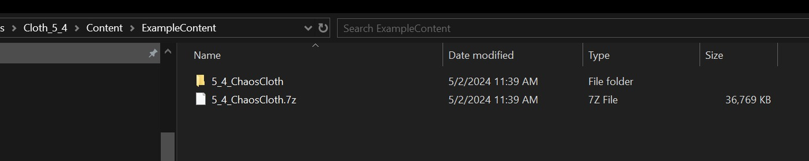
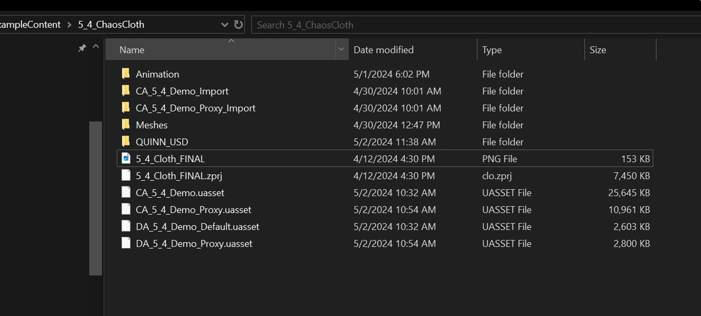
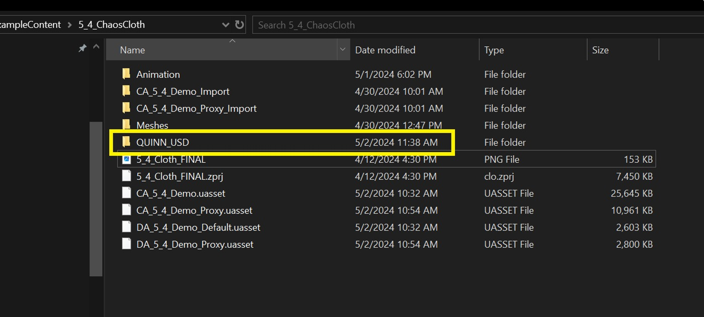
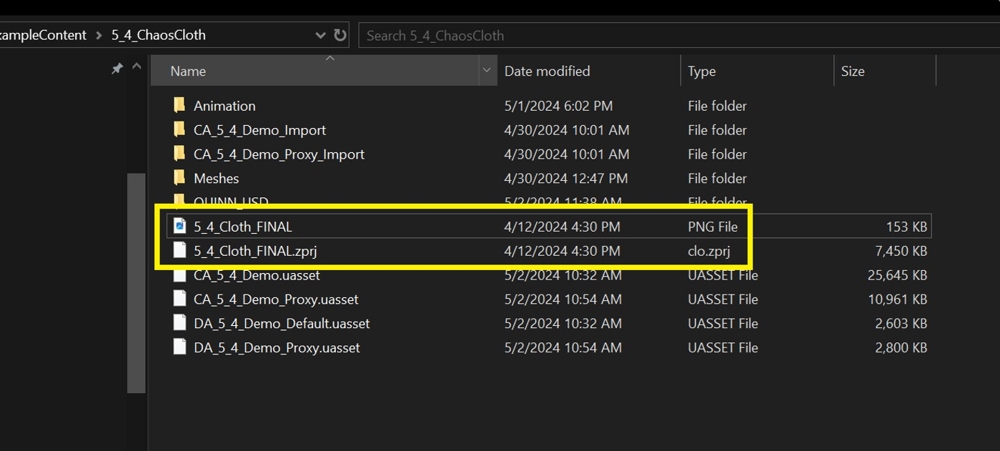
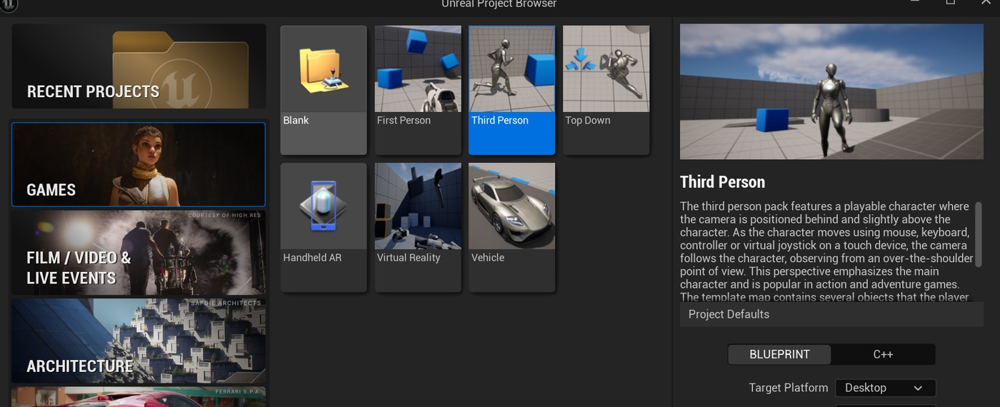
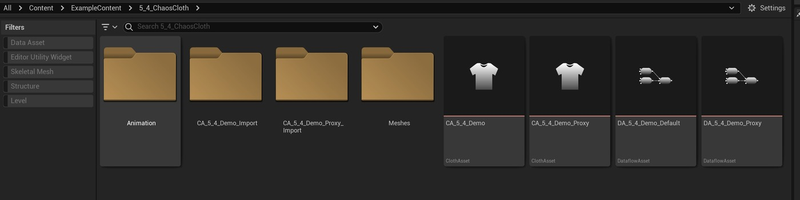
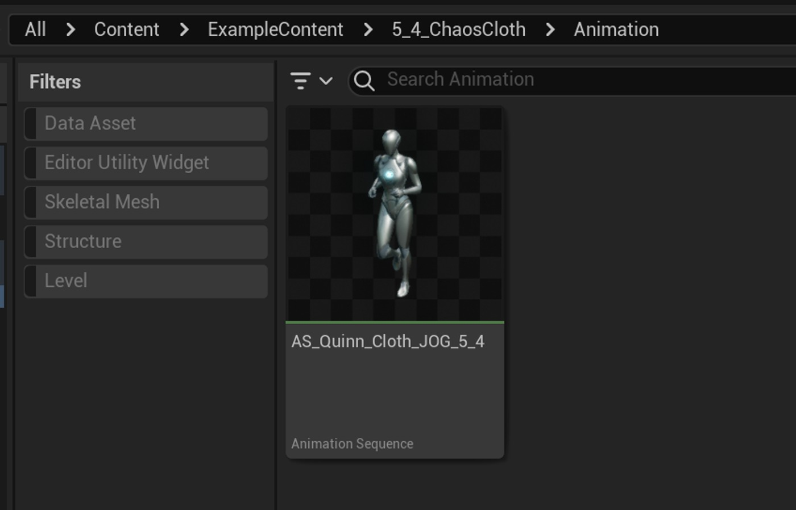
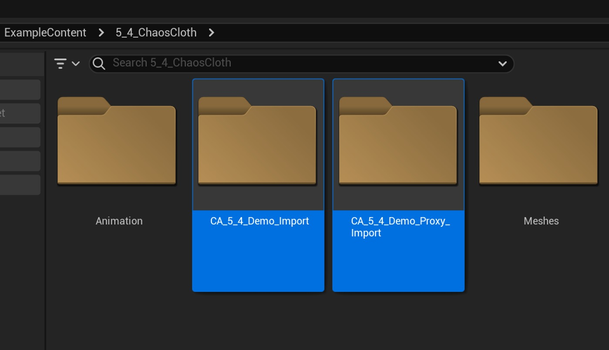
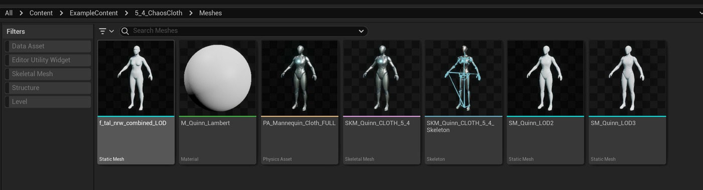
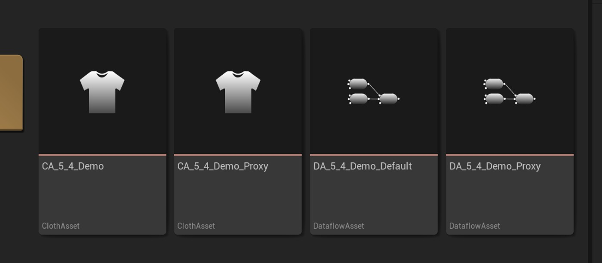

# 面板布料示例文件 (5.4)

## 来源与状态

- 原始 URL：https://dev.epicgames.com/community/learning/tutorials/Ybvo/unreal-engine-panel-cloth-example-files-5-4

## 运行时分类

- 类型：图文教程
- 判断：运行时未识别到核心视频信号，可整理正文约 3725 字符。

## 摘要

该参考文档将显示 .zip 文件的下载位置以及有关为混沌面板布提供的示例文件的一些详细信息...

## 中文整理

### 示例文件参考

当使用 Beta 5.4 Chaos Panel Cloth Editor 时，我们认为提供一些示例文件以及教程将有助于您更好地理解虚幻引擎中新的布料模拟设置工具。以下文档详细说明了示例文件的位置、将它们放置在项目中的位置以及每个文件夹中包含哪些文件的说明。这些文件仅适用于 5.4 面板布料编辑器。

### 压缩文件下载

位置：https://d1iv7db44yhgxn.cloudfront.net/post-static-files/UE-5-4-ChaosCloth.7z

### 示例内容文件夹

由于我们在 5.3 示例中使用了“ExampleContent”文件夹，因此我们将坚持使用该文件位置。将 .zip 文件解压缩到 ExampleContent 目录中。解压缩并找到后，您的文件夹应如下所示：

### 美元文件夹

您可以从此目录中移出一些文件。首先是“QUINN_USD”文件夹。这是导出的 .usda 文件和纹理目录，用于导入到 UE 中。

### 了不起的设计师

Marvelous Designer PNG 文件以及 clo.zprj 文件也可以重新定位到您选择的其他位置。这是用于示例的 Marvelous Designer 项目文件。

### 第三人称项目

使用虚幻引擎 5.4，创建一个新的第三人称项目。这将加载人体模型资产所需的文件。我们将为 Quinn 使用自定义骨架网格物体，但加载默认的人体模型资源将有助于处理纹理等。

### 加载插件 - 重要！

要使用这些资源，您需要首先激活 Beta 5.4 插件（请参阅面板布料编辑器和 ML 布料生成概述教程）在引擎中，您的文件目录应如下所示：（我们已删除了上面提到的“QUINN_USD”文件夹。）

### 动画片

提供了一份动画文件。

### 美元进口目录 (2)

### 网格

我们添加了一些用于运动碰撞器的 Quinn LOD 静态网格物体，以及一个也用于运动碰撞器的“f_tal_nrw”（本例中未使用，但被要求使用）组合网格物体。

### 布料资产

提供了两个具有相应数据流图的布料资产。 “CA_5_4_Demo”文件是美元导入的默认图表。它显示了使用分层布料和通用碰撞（胶囊/球体）时该特定设置的局限性，如 5.4 面板布料演练中所示。 “CA_5_4_Demo_Proxy”资源使用图层和代理变形器来定义布料分层变形。它还使用运动碰撞器。它需要更多的处理器资源，因此请注意图表更新。当您打开“CA_5_4_Demo_Proxy”ClothAsset 时，会出现一个“Condition”设置为 OFF 的 BranchCollection 节点。这是为了使文件的初始加载时间更快。如果您打开“条件”，您将使“分层”、“运动学碰撞器”和“层代理变形图”处于活动状态。我们意识到 Proxy Deformer 速度缓慢，并将研究一种解决方案来限制将来的更新量和更新图表的时间。

### 缓慢 - 解决方法

在调整数据流图时暂时停用代理变形器节点，并在更改完成后重新激活。您可能需要“硬重置”模拟才能刷新显示。

### 结论

使用这些提供的文件作为使用下面教程的参考，或作为使用虚幻引擎中的（Beta 5.4）面板布料编辑器设置您自己的自定义布料资源的示例。这些资产不一定被视为“轻型”性能，并且在您在数据流图中浏览其功能时需要更多耐心。作为用户，您需要权衡模拟网格的复杂性以及您使用的特定碰撞类型，以便从模拟中获得所需的性能。 - 面板布料 - 编辑器演练和更新 (5.4) - 面板布料 - 数据流和碰撞更新 (5.4) - 面板布料编辑器 (5.3) - 面板布料约束节点参考 (5.3) - 面板布料转移蒙皮权重节点 (5.3) - 角色 - 物理

## 相关链接

- [https://d1iv7db44yhgxn.cloudfront.net/post-static-files/UE-5-4-ChaosCloth.7z](https://d1iv7db44yhgxn.cloudfront.net/post-static-files/UE-5-4-ChaosCloth.7z)
- [Example Files Reference](https://dev.epicgames.com/community/learning/tutorials/Ybvo/unreal-engine-panel-cloth-example-files-5-4#examplefilesreference)
- [Zip File Download](https://dev.epicgames.com/community/learning/tutorials/Ybvo/unreal-engine-panel-cloth-example-files-5-4#zipfiledownload)
- [Example Content Folder](https://dev.epicgames.com/community/learning/tutorials/Ybvo/unreal-engine-panel-cloth-example-files-5-4#examplecontentfolder)
- [USD Folder](https://dev.epicgames.com/community/learning/tutorials/Ybvo/unreal-engine-panel-cloth-example-files-5-4#usdfolder)
- [Marvelous Designer](https://dev.epicgames.com/community/learning/tutorials/Ybvo/unreal-engine-panel-cloth-example-files-5-4#marvelousdesigner)
- [Third Person Project](https://dev.epicgames.com/community/learning/tutorials/Ybvo/unreal-engine-panel-cloth-example-files-5-4#thirdpersonproject)
- [Load Plugins - Important!](https://dev.epicgames.com/community/learning/tutorials/Ybvo/unreal-engine-panel-cloth-example-files-5-4#loadplugins-important!)
- [Animation](https://dev.epicgames.com/community/learning/tutorials/Ybvo/unreal-engine-panel-cloth-example-files-5-4#animation)
- [USD Import Directories (2)](https://dev.epicgames.com/community/learning/tutorials/Ybvo/unreal-engine-panel-cloth-example-files-5-4#usdimportdirectories(2))
- [Meshes](https://dev.epicgames.com/community/learning/tutorials/Ybvo/unreal-engine-panel-cloth-example-files-5-4#meshes)
- [ClothAssets](https://dev.epicgames.com/community/learning/tutorials/Ybvo/unreal-engine-panel-cloth-example-files-5-4#clothassets)
- [Slowness - Workaround](https://dev.epicgames.com/community/learning/tutorials/Ybvo/unreal-engine-panel-cloth-example-files-5-4#slowness-workaround)
- [Conclusion](https://dev.epicgames.com/community/learning/tutorials/Ybvo/unreal-engine-panel-cloth-example-files-5-4#conclusion)
- [文档与教程](https://dev.epicgames.com/community/learning/tutorials/Ybvo/unreal-engine-panel-cloth-example-files-5-4#%E6%96%87%E6%A1%A3%E4%B8%8E%E6%95%99%E7%A8%8B)
