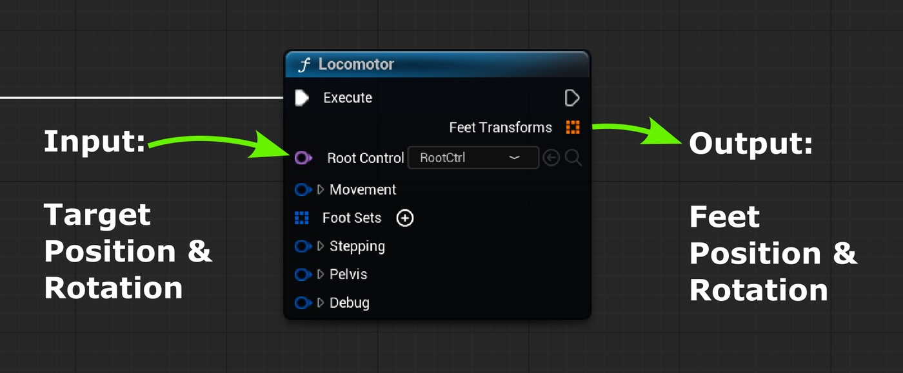
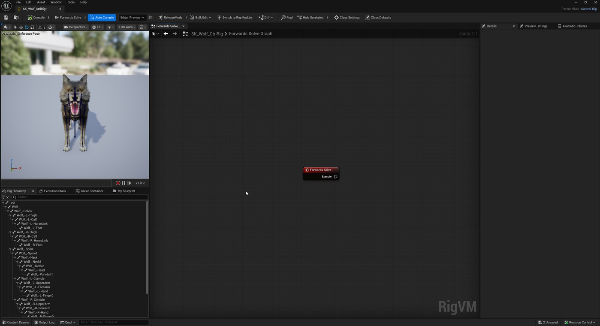
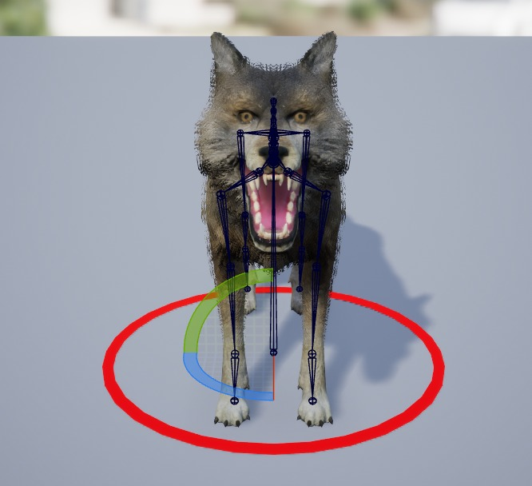
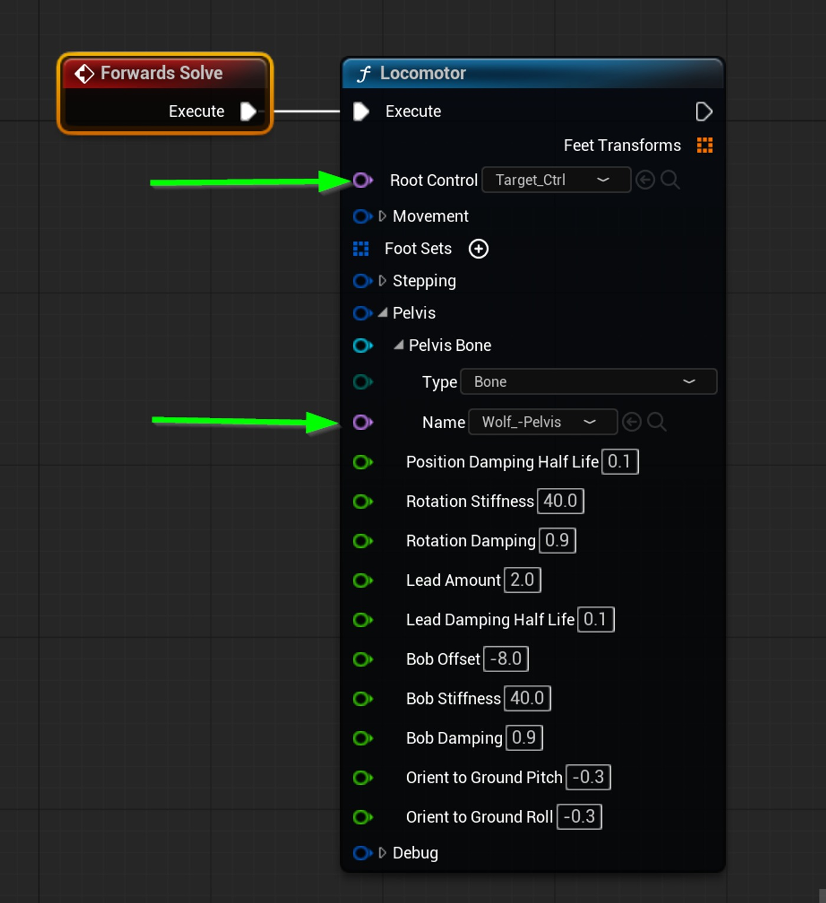
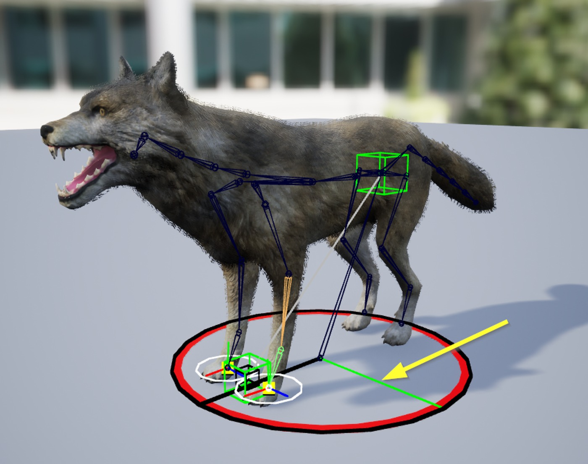
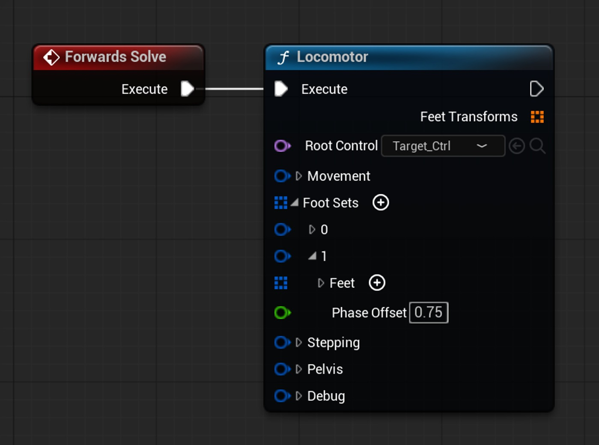
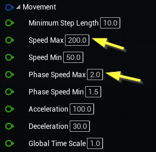
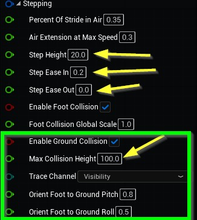
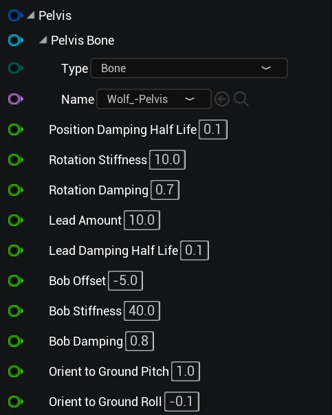

# 带有运动机的程序动画

## 来源与状态

- 原始 URL：https://dev.epicgames.com/community/learning/tutorials/EkxO/unreal-engine-procedural-animation-with-a-locomotor

## 运行时分类

- 类型：图文教程
- 判断：运行时未识别到核心视频信号，可整理正文约 14106 字符。

## 摘要

了解如何在 Control Rig 中设置 Locomotor 节点以在虚幻引擎中生成程序运动。

## 中文整理

### 概述

本教程将指导您完成在 Control Rig 中设置 Locomotor 节点的过程，以按程序制作狼的运动动画。仅假设您对 Unreal 和 Control Rig 有基本的了解，并且本教程中使用的资源可在 Fab Marketplace 上免费获得。

### 程序动画简介

程序动画是由程序生成的任何运动，而不是通过播放预先录制的关键帧动画。程序动画的示例包括布娃娃（全身或部分）、动态头发、观察系统、二次变形和约束机械系统（如活塞和齿轮）。动画师经常混合使用多种技术，包括程序驱动和数据驱动的技术，以实现所需的性能。没有任何一种方法能够产生制作令人信服的动画角色所需的所有微妙的运动。每个角色和情况都需要不同的技术组合。因此，值得考虑哪种解决方案组合适合您的特定生产挑战。虚幻引擎中的运动机旨在解决一个非常具体的问题：运动。运动定义为：生物体从一个地方移动到另一个地方的行为或能力，通常是通过步行或跑步。运动机可以通过命令动画角色向目标位置和方向迈出一步来帮助您实现程序生成的运动。

### 机车如何工作？

在我们深入了解细节之前，先对 Locomotor 的工作原理有一个深入的了解是有帮助的。

运动马达最好被认为是一个黑匣子，它将目标位置和方向作为输入，并输出一系列随着时间的推移向目标迈进的脚变换。

为了将整个角色移向目标位置，它还会生成应用于角色骨盆的完整变换。

就其本身而言，运动机实际上并不影响角色的脚；它会影响角色的双脚。因此它必须与某种 IK 结合才能实际产生步进姿势。

在内部，Locomotor 使用循环“相位”函数，随着时间的推移从 0 变化到 1。

理解这个相位函数很重要，因为它决定了脚相对于彼此的动画方式。

脚（在下面的动画中表示为绿点）都以相同的速率循环，但彼此偏移。

如果两只脚彼此完全异相，就像双足运动的情况一样，它们将在相位函数中分开 0.5 的值（或者当可视化为圆圈时为 180 度）。

该阶段函数的运行方式类似于电机（因此称为 Loco-motor），驱动脚步朝目标位置移动。

该函数循环的速度决定了步进频率（步/秒）。

与步长相结合，这决定了角色的整体速度。

“运动”部分详细介绍了步频和运动速度。

步进参数也是根据该相位函数定义的。

机车公开了“空气中步幅百分比”参数，该参数控制步幅在空气中的比例。

高值可以创建轻快的“跳跃”型步态，而低值可以创建较重的步幅。

运动节点实际上并不构成你的角色。

它仅生成两件事： - 骨盆运动 骨盆运动 - 脚部运动 脚部运动 骨盆运动直接应用于角色。

但脚部变换是节点的输出，必须使用 IK 来解决，才能为腿部生成正确的姿势。

### 先决条件

在使用 Locomotor 之前，您必须首先启用 Locomotor 插件并重新启动编辑器。 - 选择“编辑”>“插件” 选择“编辑”>“插件” - 搜索“Locomotor” 搜索“Locomotor” - 选中其旁边的框，然后重新启动项目。选中它旁边的框，然后重新启动您的项目。如果您想跟随，我们将使用 Fab 市场上的免费动物品种包中的狼骨骼网格：https://www.fab.com/listings/2dd7964c-a601-4264-a53d-465dcae1644c 请随意跟随您自己的四足动物。本教程中没有任何内容专门针对 Wolf。无论何处注明特定骨骼，只需在您自己的角色上使用等效骨骼即可。

### 入门

将狼骨架网格物体导入/下载到您的项目中。 - 在 /Wolf/Meshes 中找到骨架网格物体资源（称为“SK_Wolf”） 在 /Wolf/Meshes 中找到骨架网格物体资源（称为“SK_Wolf”） - 右键单击骨架网格物体并选择“创建”>“控制装备” 右键单击骨架网格物体并选择“创建”>“控制装备” - 双击“控制装备”以打开“控制装备编辑器” 双击“控制装备”以打开打开控制装备编辑器 您现在应该有一个空的控制装备，并将骨架网格物体导入其中。

### 初始设置

首先，我们需要一个“目标”控件来定义我们希望角色走向的空间位置和方向。

- 在“装备层次结构”选项卡中，右键单击“根”骨骼并选择“新建元素”>“新建控件”。

在“装备层次结构”选项卡中，右键单击“根”骨骼并选择“新建元素”>“新建控件”。

- 将新创建的控件重命名为“Target_Ctrl”。

将新创建的控件重命名为“Target_Ctrl”。

- 选择 Target_Ctrl，然后在“详细信息”选项卡中打开“形状属性”部分。

选择 Circle_Thick 形状类型。

选择 Target_Ctrl，然后在“详细信息”选项卡中打开“形状属性”部分。

选择 Circle_Thick 形状类型。

- 在“形状变换”部分下，将“缩放 X”、“Y”、“Z”值设置为 10.0。

在“形状变换”部分下，将“缩放 X”、“Y”、“Z”值设置为 10.0。

此时，您应该在 Wolf 的底部看到一个红色圆圈。

您可以选择此控件并将其在场景中移动。

一旦连接到运动机，这将定义狼将走向的位置。

现在让我们创建一个 Locomotor 节点并将我们的目标控件插入其中。

- 点击“编译”，以便 Rig Graph 知道我们创建的新控件。

点击“编译”，以便 Rig Graph 知道我们创建的新控件。

- 在空的 Rig Graph 视图中右键单击并搜索 Locomotor，然后按 Enter 创建一个新的 Locomotor 节点。

在空的 Rig Graph 视图中右键单击并搜索 Locomotor，然后按 Enter 创建一个新的 Locomotor 节点。

- 单击 Locomotor 节点中的 Root Control，然后在下拉菜单中选择我们刚刚创建的 Target_Ctrl。

单击 Locomotor 节点中的 Root Control，然后在下拉菜单中选择我们刚刚创建的 Target_Ctrl。

- 将 Forwards Solve 节点的执行引脚拖动到 Locomotor 的执行引脚 将 Forwards Solve 节点的执行引脚拖动到 Locomotor 的执行引脚 - 在 Locomotor 节点中打开 Pelvis > Pelvis Bone 并将其设置为 Wolf_-Pelvis 在 Locomotor 节点中打开 Pelvis > Pelvis Bone 并将其设置为 Wolf_-Pelvis - 点击 Compile 并验证一切设置是否如下图所示。

点击编译并验证所有设置是否如下图所示。

现在让我们让 Locomotor 识别 Wolf 的脚： - 在 Locomotor 节点中，折叠所有部分，然后单击 Foot Sets 旁边的 + 图标 在 Locomotor 节点中，折叠所有部分，然后单击 Foot Sets 旁边的 + 图标 - 单击“+”图标两次，将两只脚添加到第一个 Foot Set 中。

单击“+”图标两次，将两只脚添加到第一个脚组中。

- 在第一只脚中，将踝骨类型设置为骨骼，并将其设置为 Wolf_-L-Finger0 骨骼（左前爪）。

在第一只脚中，将踝骨类型设置为骨骼，并将其设置为 Wolf_-L-Finger0 骨骼（左前爪）。

- 将第二个踝骨设置为 Wolf_-R-Finger0（右前爪） 将第二个踝骨设置为 Wolf_-R-Finger0（右前爪） - 编译装备。

编译装备。

此时您应该在骨盆上看到一个绿色的立方体。

这有助于可视化由运动机产生的骨盆运动。

每个前爪都应该有一个白色圆圈。

这些圆圈的半径定义了每只脚使用的碰撞体积的大小。

Locomotor 利用这一点来防止多只脚占据同一位置。

它还确定用于地面对齐的球体铸件的大小。

在 Target_Ctrl 的中心，您应该看到一条延伸到控件边缘的绿线。

该线指示运动机的当前相位。

每一步它将围绕基圆旋转一次。

这可以帮助您可视化步进频率和当前相位。

Locomotor 现在已经可以使用了。

尝试在视口中拖动 Target_Ctrl 并观察 Wolf 严格地向其移动，白色圆圈应采取动画步骤，绿色相位指示器应每步旋转一次。

让我们添加后腿并调整运动： - 单击脚组旁边的 + 图标添加另一个脚组。

单击脚组旁边的 + 图标添加另一个脚组。

- 单击 + 图标两次，将两只脚添加到新脚组中。

单击 + 图标两次，将两只脚添加到新脚组中。

- 将第一个踝骨设置为 Wolf_-L-Foot 将第一个踝骨设置为 Wolf_-L-Foot - 将第二个踝骨设置为 Wolf_-R-Foot 将第二个踝骨设置为 Wolf_-R-Foot - 点击编译 点击编译 每个脚组都以相同的顺序添加脚，这一点很重要。

左/右/左/右等等...

此时，您应该看到所有四只脚上都有白色圆圈。

如果您拖动 Target_Ctrl，狼的身体应该平滑地移向目标，同时白色圆圈会做出步进动作。

当您拖动 Target_Ctrl 来测试角色时，重置整个模拟会很有帮助。

点击 Control Rig 工具栏中的“Compile”会将 Target_Ctrl 重置回原点并将 Locomotor 重置回其初始状态。

### 相位偏移

此时，您可能会注意到前腿和后腿完全同步。这不是真正的四足动物行走的方式。 - 打开第二个脚组 打开第二个脚组 - 将相位偏移设置为 0.75 将相位偏移设置为 0.75 现在，后脚与前脚稍微异相，从而创建更自然的四足步态。脚组中的每只脚都会自动相位偏移 0.5 或 180 度。这样，只需分别添加三组或四组脚即可轻松创建六足动物或蜘蛛动物。您可以尝试不同的相位偏移来创建不同的步态风格，例如步行、跳跃或小跑。

### 动作调整

运动机的运动部分控制角色向目标位置移动的速度。狼使用默认的运动参数，但针对该角色调整的黄色箭头指示的值除外。可以调整以下参数，以在不同大小和比例的角色上创建各种运动： 最小步长 (cm)：确定角色返回其正常参考姿势所需的最小步长。较大的值可能会导致角色以尴尬的姿势停止。值太小可能会导致角色采取微小的步骤来“适应”其空闲姿势。最小/最大速度（厘米/秒）：如果目标位置距离角色当前位置较远，则机车将开始加速至最大速度。最小速度是它移动的最慢速度。最小/最大相速度（步/秒）：这决定了角色处于最大速度（最大相速度）或最小速度（最小相速度）时每秒所走的步数。较低的最大相速度不会导致角色移动速度变慢，而是会迫使其采取更大的步数来达到最大速度。加速度/减速度 (cm/s2)：加速度决定角色达到最大速度的速度。当角色接近目标位置时，其速度会与减速度成正比。全局时间刻度（乘数）：缩放运动机的内部时钟，这可以使角色看起来像是慢动作（对于小于 1 的值）或快进（对于大于 1 的值）。

### 步进调音

步进参数控制角色脚步的特征，以及它们对与地面碰撞的反应（地面对齐）。

Wolf 使用默认步进参数，黄色箭头指示的参数除外。

绿色框中的参数用于调整地面对齐。

以下步参数可让您更好地控制 Locomotor 生成的运动类型： 空中步幅百分比 (0.1-0.9)：步的动态不仅会因速度和长度而变化，还会因脚在空中与在地面上花费的时间而变化。

对于轻量、边界型运动，请使用非常低的值，例如 0.2。

对于较重的口吃步，请使用较高的值。

最大速度时的空中延伸 (0-1)：该值会添加到空中步幅百分比中，以延长最大速度下的空中时间。

例如，如果“空中步幅百分比”为 0.5，并且“空中伸展”为 0.4，则足部将在步幅周期的 90% 中处于空中。

随着速度在最小速度和最大速度之间加速，该值逐渐混合。

总的“Stride In Air”在内部被限制在 95%。

台阶高度（cm）：台阶最高处脚离地的最大高度。

步骤缓入/缓出 (0-1)：确定脚从踩地状态加速到空中的速度以及返回地面的速度。

值为 0 时会导致瞬时运动，值为 1 时会导致逐渐运动。

启用脚部碰撞：启用后，可防止脚部在步伐中相互碰撞。

这可以防止脚相互穿过或踩在同一位置。

Foot Collision Global Scale：影响每只脚周围圆圈的大小，用于防止脚发生自碰撞。

如果使用地面碰撞，这也会影响球体投射的大小。

### 地面对准

启用地面碰撞：选中“启用脚部碰撞”后，系统会将球体投射发送到世界中，以调整脚步位置以落在地面上，并防止与世界几何体发生剪切。最大碰撞高度（厘米）：将脚放在碰撞处的最大高度（厘米）...

### 骨盆运动

### 添加脚 I

### 与动画结合

### 最后的想法

## 相关链接

- [Overview](https://dev.epicgames.com/community/learning/tutorials/EkxO/unreal-engine-procedural-animation-with-a-locomotor#overview)
- [Intro to Procedural Animation](https://dev.epicgames.com/community/learning/tutorials/EkxO/unreal-engine-procedural-animation-with-a-locomotor#introtoproceduralanimation)
- [How does the Locomotor work?](https://dev.epicgames.com/community/learning/tutorials/EkxO/unreal-engine-procedural-animation-with-a-locomotor#howdoesthelocomotorwork?)
- [Prerequisites](https://dev.epicgames.com/community/learning/tutorials/EkxO/unreal-engine-procedural-animation-with-a-locomotor#prerequisites)
- [Getting Started](https://dev.epicgames.com/community/learning/tutorials/EkxO/unreal-engine-procedural-animation-with-a-locomotor#gettingstarted)
- [Initial Setup](https://dev.epicgames.com/community/learning/tutorials/EkxO/unreal-engine-procedural-animation-with-a-locomotor#initialsetup)
- [Phase Offset](https://dev.epicgames.com/community/learning/tutorials/EkxO/unreal-engine-procedural-animation-with-a-locomotor#phaseoffset)
- [Movement Tuning](https://dev.epicgames.com/community/learning/tutorials/EkxO/unreal-engine-procedural-animation-with-a-locomotor#movementtuning)
- [Stepping Tuning](https://dev.epicgames.com/community/learning/tutorials/EkxO/unreal-engine-procedural-animation-with-a-locomotor#steppingtuning)
- [Ground Alignment](https://dev.epicgames.com/community/learning/tutorials/EkxO/unreal-engine-procedural-animation-with-a-locomotor#groundalignment)
- [Pelvis Motion](https://dev.epicgames.com/community/learning/tutorials/EkxO/unreal-engine-procedural-animation-with-a-locomotor#pelvismotion)
- [Adding Foot IK](https://dev.epicgames.com/community/learning/tutorials/EkxO/unreal-engine-procedural-animation-with-a-locomotor#addingfootik)
- [Combine With Animation](https://dev.epicgames.com/community/learning/tutorials/EkxO/unreal-engine-procedural-animation-with-a-locomotor#combinewithanimation)
- [Final Thoughts](https://dev.epicgames.com/community/learning/tutorials/EkxO/unreal-engine-procedural-animation-with-a-locomotor#finalthoughts)
