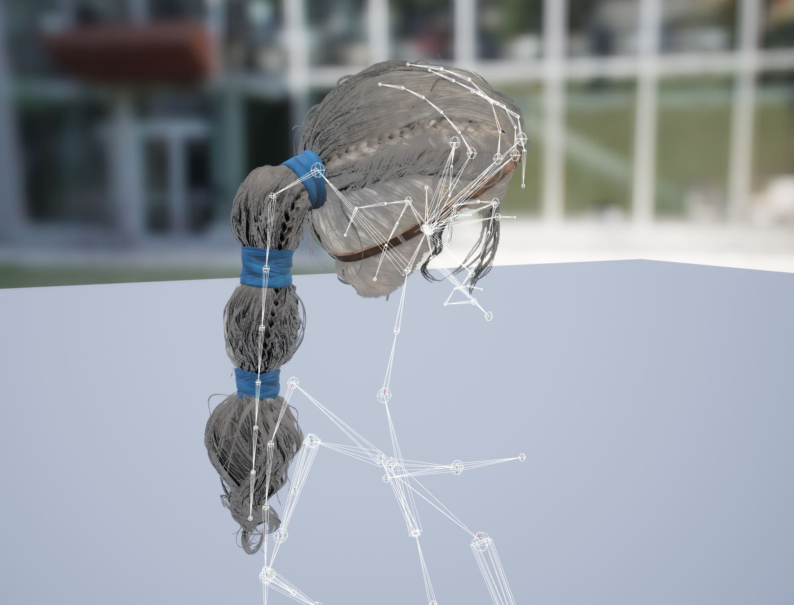
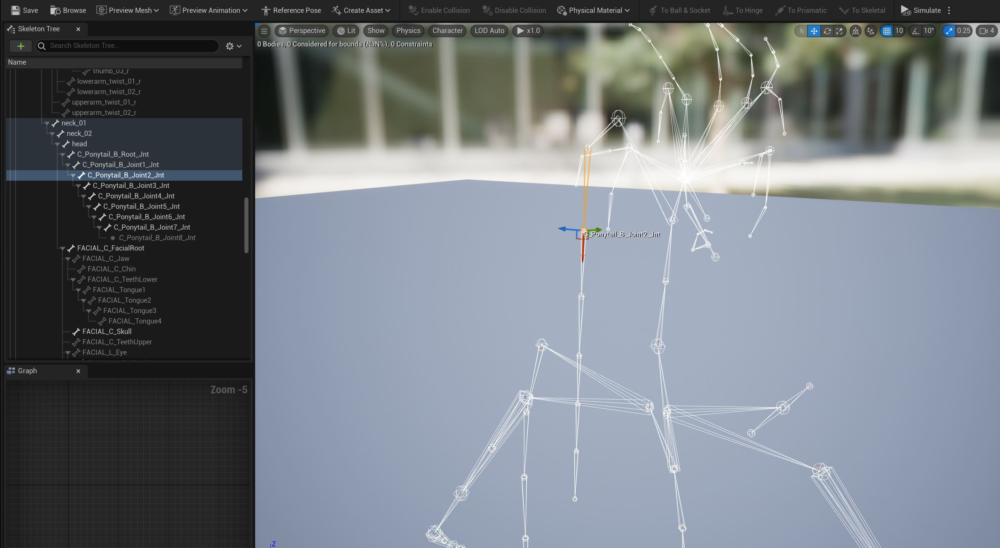
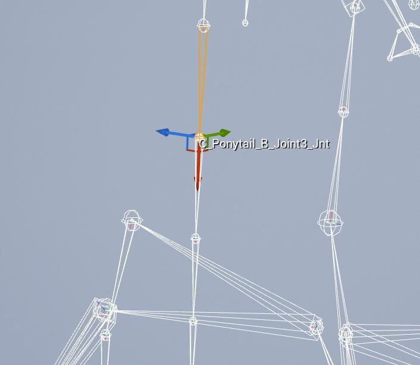
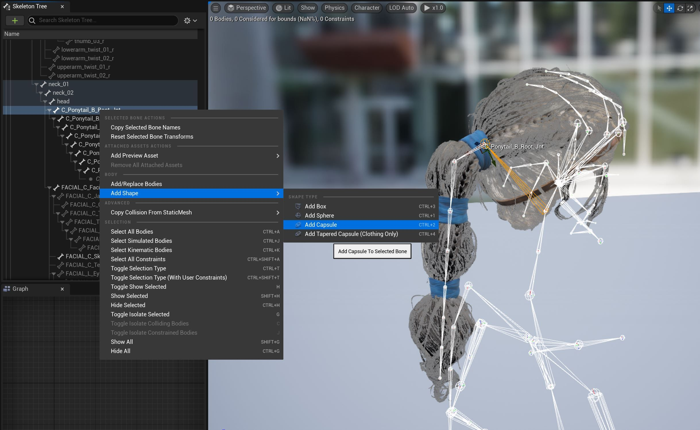
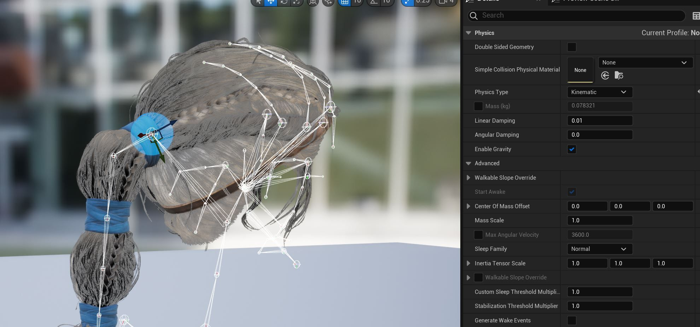
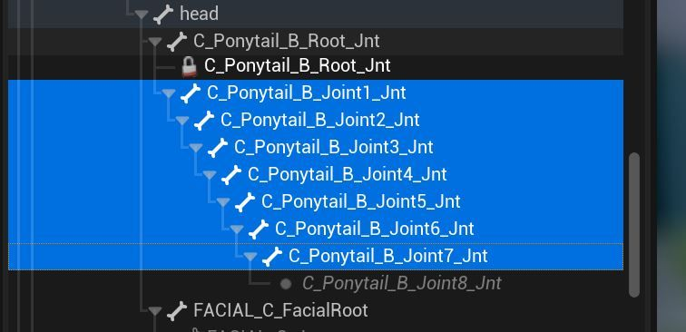
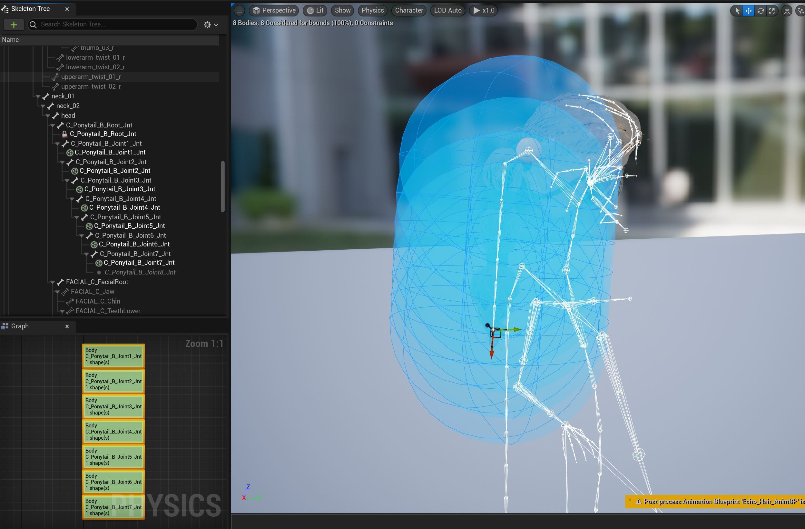
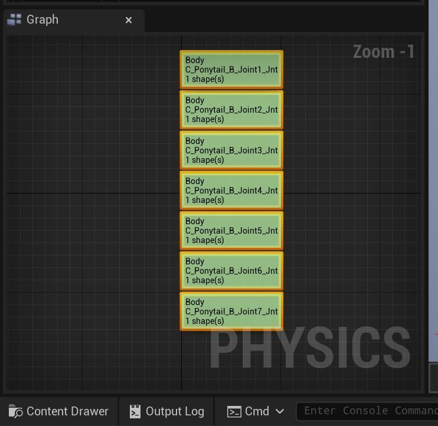
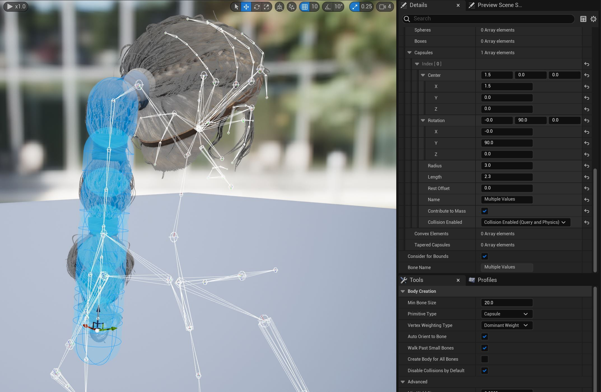
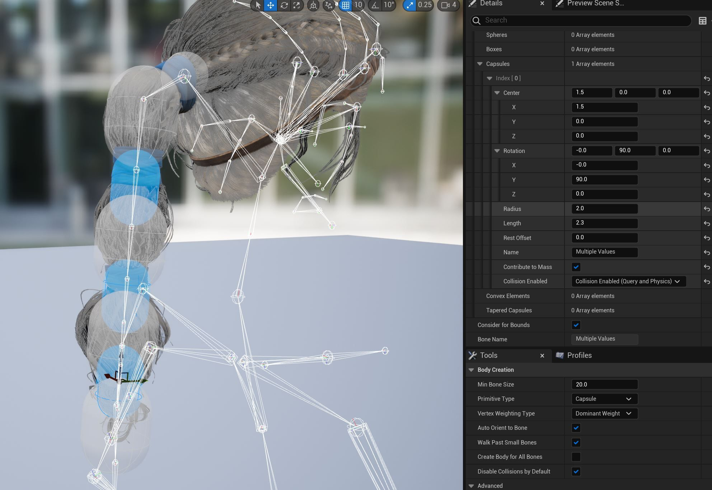

# RBAN Echo 马尾辫教程

## 来源与状态

- 原始 URL：https://dev.epicgames.com/community/learning/tutorials/dLxx/unreal-engine-rban-echo-ponytail-tutorial

## 运行时分类

- 类型：图文教程
- 判断：API 未识别到核心视频信号，可整理正文约 6793 字符。

## 摘要

在本教程中，我们将探索 Echo 马尾辫的 RBAN（刚体动画节点）以及处理长链时要考虑的特定刚性模拟设置。

## 中文整理

### 长链考虑因素

当使用较长的刚体链时，质量是一个重要的考虑因素！这就是为什么我们总是将父体设置为比子体重以稳定链条。示例：链中某个物体下方的所有模拟物体的总和***不应超过父物体的质量。*** 链中物体的质量减少量应减少，但为了最好地防止抖动，所有子物体的总和应始终小于父物体 - *链中的任何位置*。对于马尾辫教程，我们将使用此信息作为设置的基础。

### 回声资产结构

与 Echo Chaos Cloth Cape 设置类似，马尾辫将由使用主姿势组件的蓝图设置驱动。请参阅有关要考虑的骨骼注意事项的教程。 Echo 字符位于内容示例中。

### 物理资产

第一步是为头发 RBAN 创建物理资产。我们将使用 RBAN 铰链教程中讨论的有关分解物理资产以供特定用途的理论。右键单击 Echo-Hair SkeletalMesh 资源。进入PhysicsAsset后，我们将删除并自动生成胶囊并从头开始构建。在PhysicsAsset编辑器中显示骨骼。

**重要提示：** 创建骨骼装备链（尤其是长骨骼装备链）时，请确保装备方向一致。在 Epic，我们确保 X 值指向链的下方，Z 旋转是垂直的，Y 是链中所有关节的向上向量。

首先，我们将创建胶囊，它将作为模拟链其余部分的运动驱动器。在骨架树中**右键单击** C_Ponytail_B_Root_Jnt，在下拉菜单中选择**添加形状 – 添加胶囊**。

如 **RBAN Echo Canister 铰链教程** 所示，使用 SkeltonMesh 编辑器或详细信息面板中的交互式工具将胶囊缩放/定向或调整到此尺寸附近的尺寸。还要在详细信息面板中将胶囊设置为 **Kinematic**。

现在，在“骨架”选项卡中选择“C_Ponytail_B_Joint 1-7jnt”组。

右键单击所选内容打开下拉菜单，然后选择“**添加形状 – 添加胶囊**”

对于下一步，我们可以使用编辑器左下角的物理图来使我们的选择更容易选择。

选择全部选框并输入“半径 3”、“长度 2.3”。所有胶囊都应该调整到新的比例。

现在使用操纵器或编辑器选择每个备用胶囊和比例。确切的值并不一定重要，我们只需要捕获马尾辫的体积，在这种情况下，每个骨骼都有一个交替的比例。

另一种方法是使用**复制/粘贴属性**。由于我们自始至终都使用胶囊，因此我们还可以在调整顶部两个不同比例胶囊的大小并将属性粘贴到每个其他偏移胶囊后复制/粘贴。选择一个胶囊，**右键单击**并下拉至**复制属性**。然后选择一个新的胶囊**右键单击**并下拉至**粘贴属性**。在最后一个胶囊上，只需使用您想要捕捉马尾辫体积的最后一点的缩放方法即可。您应该有一系列看起来像这样的胶囊。根据需要滑动胶囊，使用键盘上的交互式 W-E-R 键或通过调整详细信息面板中的值来更新碰撞中心和位置。将所有这些模拟胶囊设置为“**模拟。**”关于长刚性链的重要信息：确保质量沿链逐渐**减少**。这是我们将使用的值。 100-50-20-10-5-2-1 选择所有模拟胶囊并将 **Angular Damping** 设置为值 32。

### 碰撞

我们将向以下关节添加更多运动碰撞胶囊：spine_04、clavicle_l、clavicle_r、neck_01 和 head。虽然我们仍然可以看到骨骼，但向这些关节添加**胶囊**。确保所有这些主体都设置为 **Kinematic**。使用“详细信息”面板或右键单击“物理材质 - 运动学”。像我们在前面的步骤中所做的那样，调整这些碰撞体的大小。正如本练习开头提到的有关资产结构的内容，如果您要从主 SkeletalMesh 中分解资产，那么捕获 Echo 的可渲染身体形态可能会出现问题。这不是最佳工作流程，但您可以创建一个临时骨架网格体，其中包含回声体和马尾辫资源，用于碰撞体设置，然后在完成碰撞形式后重新导入原始头发 skelMesh 资源。这是我们希望在未来解决的工作流程，并且很清楚当前的限制。无论您希望完成此步骤的碰撞，您都应该有与此类似的内容。让我们将骨骼隐藏在骨架树中，以便于阅读。

### 约束条件

在物理对象之间设置约束有两种主要方法。主要区别在于选择顺序以及哪个关节是父关节还是子关节。如果您在仅选择一个对象的物理体上使用右键单击，则选择顺序为：**父级 *然后* 子级** 如果您选择两个物理体然后右键单击，则选择顺序为 **子级 *然后* 父级**。任何一种方法都会产生我们需要的约束。只需选择您喜欢的方式并使用它即可。另外，请确保在第一个模拟主体和我们一开始创建的运动主体之间创建约束。选择所有约束并将其角度限制设置为“**Limited**”。其他一些需要调整的约束值包括角度电机和 SLERP。就像 RBAN Echo Canister 铰链教程中一样，我们可以调整关节角度的方向，以更好地对齐其效果角度。与 Echo Canister RBAN 教程中一样，使用 **ALT** 键在视口中旋转操纵器。在“详细信息”面板中，还调整**惯性张量比例**，为角旋转添加一些阻力。选择所有动态（模拟）头发刚体并更改值最后一次调整是**质量中心偏移**。在发布的示例中，第 1 个、第 3 个和第 4 个约束在 X 中的偏移量为 1.0。

### 常见问题和要点

最终设置应该如下所示。

### 刚体节点

就像在 Echo RBAN 罐教程中一样，我们需要添加一个 **RigidBody** 节点并连接到输出姿势。 Rigid Body 节点中的一些值可以调整。

### 最后的注释

**组件线性加速/速度比例**和**应用线性加速钳**是处理真正快速移动的角色时要使用的关键数字。如果您查看了 Echo Chaos Cloth Cape 教程并希望马尾辫避免碰撞，则需要为马尾辫设置添加更多碰撞对象。由于 RBANS 和布料碰撞默认情况下不耦合，因此可能需要进行一些实验。
