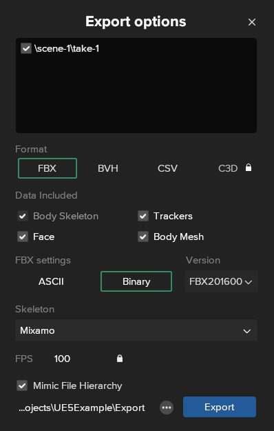
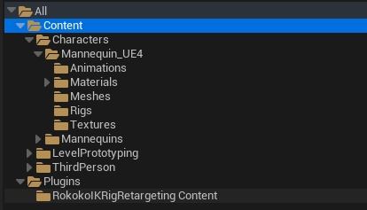
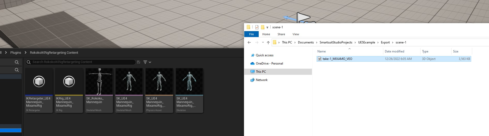
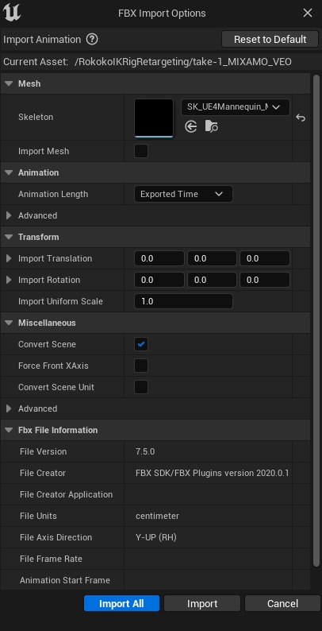
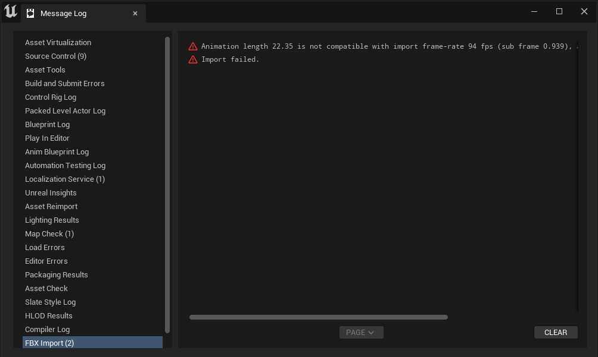
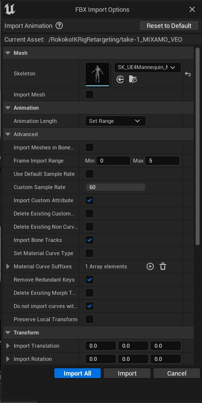
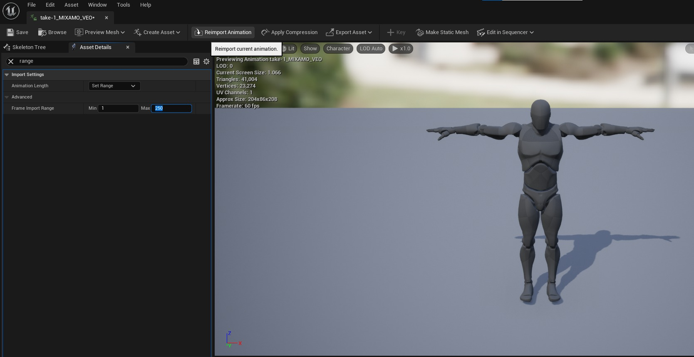
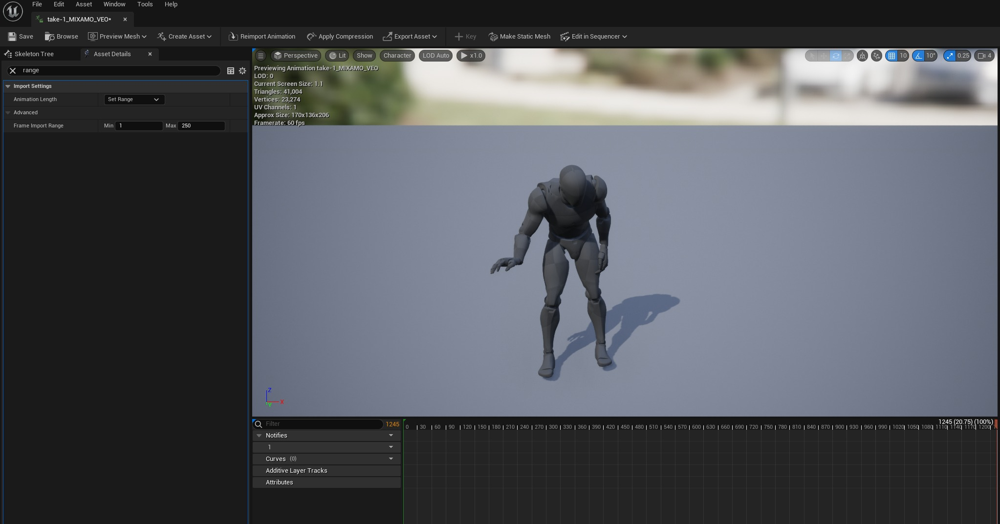
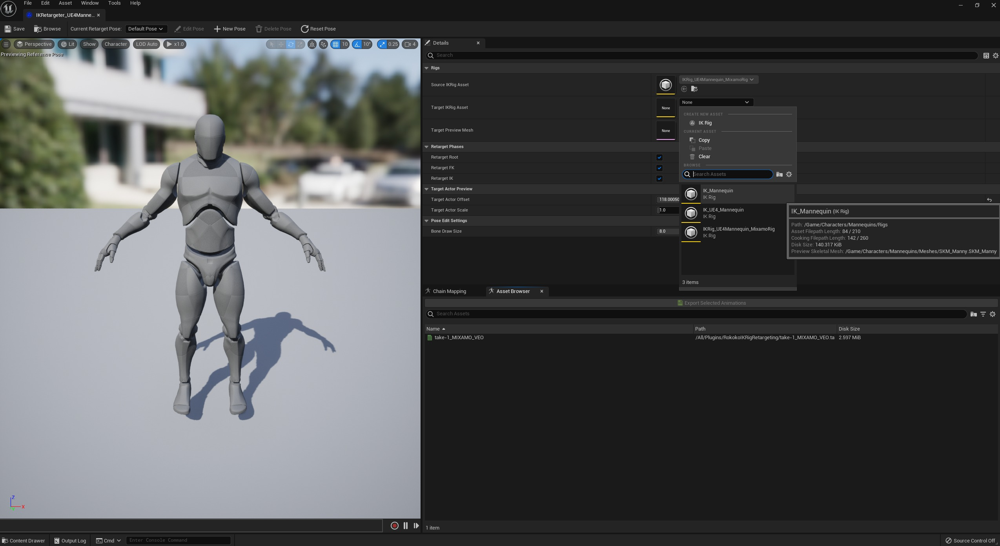
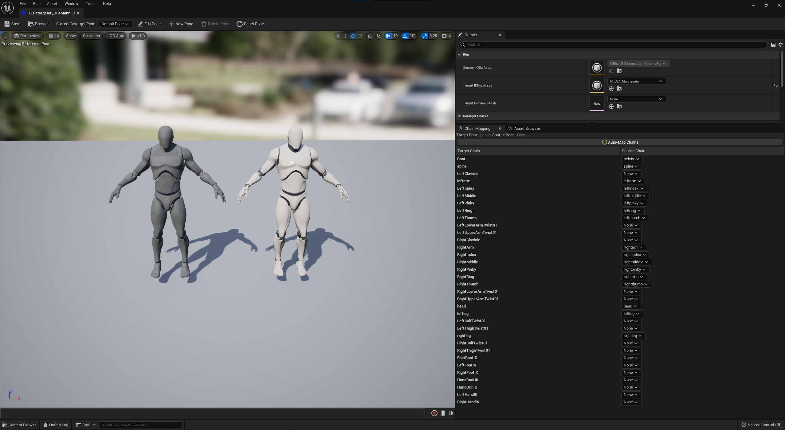

# Rokoko Studio（旧版）到 UE5

## 来源与状态

- 原始 URL：https://dev.epicgames.com/community/learning/tutorials/8On6/unreal-engine-rokoko-studio-legacy-to-ue5

## 运行时分类

- 类型：图文教程
- 判断：API 未识别到核心视频信号，可整理正文约 2193 字符。

## 摘要

将 Rokoko Studio（旧版）动画引入 UE5 的快速有效的流程。这些工具将帮助您加快重新定位的过程，提供我迄今为止能够实现的最佳结果之一。这个概念非常简单：我只是用 Mixamo 骨架装备了 UE4 人体模型。使用此骨架网格物体应该可以通过新的 UE5 的 IKRetargeting 系统提供最大的精度。我创建了这个插件作为 Rokoko Studio 和 UE5 之间的“桥梁”，但相同的过程也可以应用于 Mixamo 的动画。

## 中文整理

### 从 Rokoko Studio Legacy 导出

导出的重要设置： - **格式：** FBX - **FBX设置：** 二进制 - **版本：**FBX201600 - **骨架：**Mixamo

### 虚幻引擎5.0

### 热身...

确保： - 将 [插件](https://github.com/Klian326/RokokoIKRigRetargeting) 复制或克隆到 */yourproject/Plugins/* - 检查插件是否已启用 - 导航到插件文件夹以找到您需要的所有资源

### 导入动画

您可以将文件拖放到任何文件夹中，但请确保选择“*SK_UE4Mannequin_MixamoRig_Skeleton*”作为目标骨架。

使用虚幻引擎 5.0 可能会出现[有关动画导入的问题](https://forums.unrealengine.com/t/fbx-animation-import-error/606154)。

我的解决方法： - **动画长度：** 设置范围 - **帧导入范围：** 0 - 5（必须很小） - **自定义采样率：** 选择您的目标导入后，打开动画资源并修改导入范围以满足您的需要，然后粉碎“*重新导入动画*”。就我而言，我发现从输入帧最小值：1 和最大值：250（100fps 的 22.35 秒动画）开始删除前几帧很有用

### IK重定位器

该插件包含一个名为“*IKRetargeter_UE4Mannequin_MixamoRig*”的资产，打开它。

如果您的项目以“第三人称模板”开始，则您应该已经有一个名为“*IK_UE4_Mannequin*”的 IKRig 资源，请在 IKRetargeter 资源中将其选择为“*目标 IKRig 资源*”。你快完成了！检查“*Chain Mapping*”窗口并确保所有“*Twist*”骨骼均设置为“*None*”。如果您不注意这一点，您的网格将会扭曲。

现在，是时候选择您的动画并重新定位它了！

### 享受！

- [下载资源插件](https://github.com/Klian326/RokokoIKRigRetargeting)

## 相关链接

- [Download Assets Plugin](https://github.com/Klian326/RokokoIKRigRetargeting)
