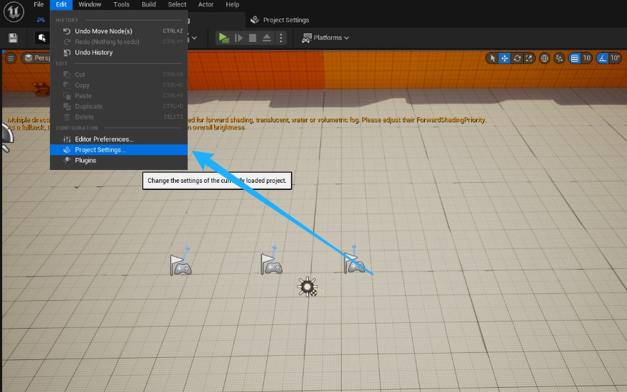
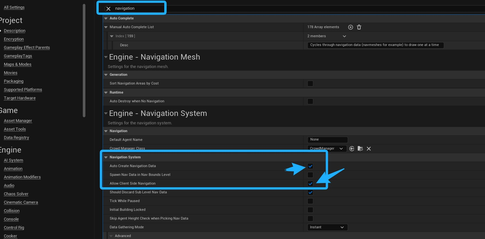

# 为多人游戏设置自上而下的模板

## 来源与状态

- 原始 URL：https://dev.epicgames.com/community/learning/tutorials/pv56/unreal-engine-setting-up-the-top-down-template-for-multiplayer

## 运行时分类

- 类型：图文教程
- 判断：API 未识别到核心视频信号，可整理正文约 564 字符。

## 摘要

这个简短的指南将向您展示如何正确设置您的项目，以便您可以在客户端和服务器上按预期使用自上而下的模板！

## 中文整理

### 概览

干杯!在本快速指南中，我们将设置客户端导航，以便自上而下模板中的“简单移动到”节点适用于使用虚幻引擎 5+ 的多人游戏中的连接客户端！ 1. 导航至项目的项目设置。 2. 在搜索栏中输入“导航”以查找您的导航设置。确保选中“自动创建导航数据”框，并选中“允许客户端导航”框。

