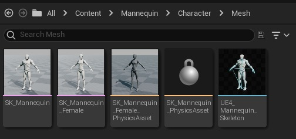
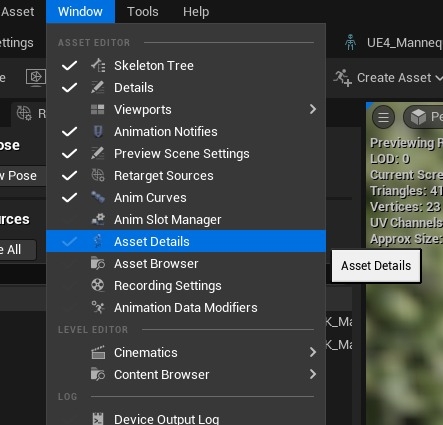
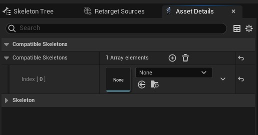

# 在骨骼之间共享动画

## 来源与状态

- 原始 URL：https://dev.epicgames.com/community/learning/tutorials/8kO6/unreal-engine-share-animations-between-skeletons

## 运行时分类

- 类型：图文教程
- 判断：API 未识别到核心视频信号，可整理正文约 796 字符。

## 摘要

使用新功能“兼容骨骼”在不同骨骼之间共享动画。

## 中文整理

### 概览

在虚幻引擎 5.0 中，我们获得了一个新功能，可以在不同的骨架之间共享动画，而不必复制动画并将其设置为特定的骨架。第一步是找到您希望接收新动画的骨架。

选择并打开骨架，**UE4_Mannequin_Skeleton **在此示例中**。**骨架屏幕可见后，找到**资产详细信息**选项卡**。 ** **注意：** 如果不可见，请转到*菜单栏 > Windows > 资产详细信息*

在 **Compatible Skeletons** 部分中，向数组添加一个元素。搜索具有所需动画的骨架并选择它。完成后，所有动画都应可用于您的新骨架。
