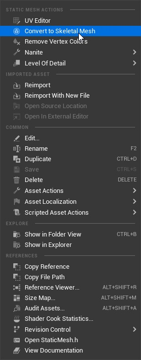
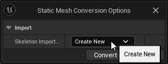
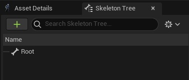
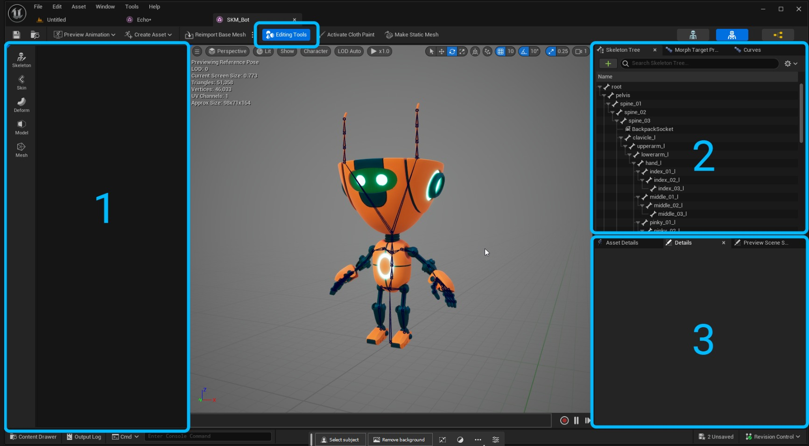
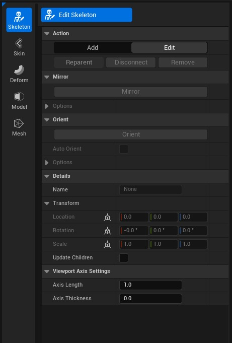
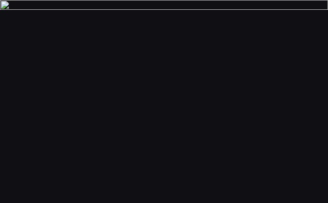
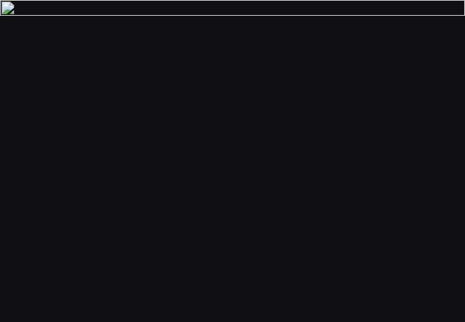

# 骨骼编辑器使用指南

## 来源与状态

- 原始 URL：https://dev.epicgames.com/community/learning/tutorials/0lpO/unreal-engine-skeletal-editor-usage-guide
- 原始文件：unreal-engine-skeletal-editor-usage-guide.origin.md
- 分段：第 1/2 段

## 运行时分类

- 类型：图文教程
- 判断：运行时未识别到核心视频信号，可整理正文约 14110 字符。

## 摘要

骨架编辑器是随虚幻引擎 5.3 一起发布的一组新工具，可让您创建和修改骨架网格体。有了这些工具你...

## 中文整理

### 入门

加载骨骼编辑器插件。 ⚠️ 请注意，骨架编辑器目前处于实验阶段。

### 创建骨架网格体

现在可以直接在 Unreal 中创建骨架网格物体，无需导入 FBX。右键单击任何静态网格体并使用“转换为骨架网格体”。将使用单个根骨骼创建一个新的骨架网格体。

### 用户界面概述

可以使用“编辑工具”按钮激活骨架编辑器。工具部分 (1) 将排列在编辑器的左侧。骷髅树 (2) 可以在右上角查看。可以在右下角查看详细信息/资产详细信息/预览 (3)。

### 创建和编辑骨骼

要开始构建骨骼，请单击“骨架”模式。使用“编辑骨架”工具可以让您将骨骼放置在视口中的网格内。放置骨骼后，工具将获取前两个交叉点的重心坐标。可以在工具设置中更改此设置，以将骨骼放置在相对于相机平面的网格表面上。选择添加[热键N]操作来构建新骨骼。第一个选定的骨骼将充当新放置的骨骼的父骨骼。点击“接受”将完成骨骼放置。使用轴长度和轴厚度来可视化新骨骼指向的方向。编辑时，“更新子项”选项将移动所选骨骼下的任何骨骼。这对于调整整个链条很有用。

### 养育之骨

通过将骨骼拖放到新的父级，可以在骨架树中重新设置骨骼的父级。使用“Reparent”按钮 B 热键以交互方式更改视口中骨骼的父级，并使用 Shift-P 热键取消父级。

### 重命名骨骼

可以通过右键单击骨骼并选择重命名骨骼来重命名骨骼 [热键 F2]。此外，如果您选择了多个骨骼，则可以使用主题标签 (#) 运算符来重命名骨骼。选择多个骨骼，然后使用主题标签运算符后跟数字来重命名层次结构中的第一个骨骼。例如：tail_##1 将解析为 tail_001 tail_002 tail_003 等等。

### 编辑模式

切换到定向骨骼和镜像骨骼工具的编辑模式。

### 东方骨头

骨骼需要指向正确的方向，以便它们以所需的方式旋转。这称为骨骼方向（简称Orient）。所有骨骼都必须定向，我们提供工具来简化此过程。要定向骨骼，请选择要定向的链并展开“定向”部分。本节包含一些选项，可帮助您轻松定位骨骼。 - 主要 - 骨骼面向的方向（通常为 x） 主要 - 骨骼面向的方向（通常为 x） - 次要 - 骨骼的向上方向轴 次要 - 骨骼的向上方向轴 - 使用平面作为次要 - 这将通过骨骼构建一个平面来帮助您定向。使用平面作为辅助 - 这将通过骨骼构建一个平面来帮助您定向。 - 次要目标 - 用于次轴的位置 次要目标 - 用于次轴的位置 - 定向子项 - 将定向所选骨骼下方的所有子项。定向子项 - 将定向所选骨骼下方的所有子项。您可以通过选择骨骼并使用旋转小控件（热键 R）或在变换中显式指定值来手动定向骨骼。

### 镜子骨头

无需两次构建左右侧骨骼链，骨骼编辑器提供了一套工具来帮助您镜像骨骼。要镜像骨骼链，请选择要镜像的链或骨骼，然后使用编辑模式中的镜像按钮。镜像选项： - Mirrox Axis - 要镜像的平面。 Mirrox Axis - the plane to mirror across. - 镜像旋转 - 反转平面上的旋转，这对于动画通常是必需的。镜像旋转 - 反转平面上的旋转，这对于动画通常是必需的。 - 左侧字符串 - 要在左侧搜索的命名 左侧字符串 - 要在左侧搜索的命名 - 右侧字符串 - 要在右侧搜索的命名 右侧字符串 - 要在右侧搜索的命名 - 镜像子项 - 将镜像所选骨骼链的所有子项。镜像子项 - 将镜像所选骨骼链的所有子项。

### 编辑蒙皮权重

如果您向骨架网格体添加新骨骼，绑定蒙皮工具将帮助您添加这些骨骼的权重。

### Unreal 中的蒙皮权重是多少？

蒙皮权重将骨架网格物体上的顶点连接到骨骼，以便当骨骼移动时，它会使网格物体变形。每个顶点都可能受到骨架中多个骨骼的影响。作为用户，您需要为每个顶点分配权重，以告诉它应该附加到哪些骨骼。对于每个骨骼，每个顶点都包含一个从 0.0 到 1.0 的值，其中值 0 表示顶点完全不受骨骼影响，值 1 表示顶点完全附着到骨骼。 0 到 1 之间的值允许顶点部分受骨骼影响。单独设置每个顶点权重是不切实际的，因此绘制蒙皮权重贴图提供了更好的解决方案，可以在整个角色上创建优雅的变形。

### 了解标准化

每个顶点的总权重必须等于 1。这确保当骨架作为一个整体平移时，网格中的顶点随之移动。如果顶点上的总权重小于 1，则该顶点将“落后”于骨架之后。相反，如果总值大于 1，则顶点的移动量将大于骨架的移动量。因此，Unreal 通过称为标准化的过程强制将总值设置为 1。例如，如果肘部的某个顶点在前臂骨骼上的值为 0.7，则必须将剩余的 0.3 权重分配给一个或多个其他骨骼。在这种情况下，它可能属于上臂。当您编辑顶点权重时，Unreal 会自动标准化其他权重，以确保总值始终等于 1。一开始这可能会令人困惑，因为 Unreal 似乎会更改您之前分配的权重值。

### 明确

如果顶点仅具有 1 个影响（仅 1 个骨骼的权重大于零），则无法有意义地修改该骨骼的权重。将权重设置为 1 以外的任何值都会触发标准化过程，该过程会将值设置回 1（无论您将其设置为什么）。但是，一旦顶点为多个骨骼分配了非零权重，标准化过程就会根据需要将额外的权重转储到其他影响上，以实现用户设置的权重。考虑前面的示例，其中前臂上的权重为 0.7，上臂上的权重为 0.3 的顶点。如果用户尝试去除前臂上的重量，也许将其设置为较低的值 0.6，则标准化过程将自动将上臂值从 0.3 更改为 0.4，以保持总值 1。记住这一点，最佳实践是仅显式添加顶点权重，允许标准化过程根据需要去除重量以实现所需值。如果您希望减少特定骨骼对顶点的影响，最好将权重添加到不同的骨骼。这使您可以明确影响力所属的位置，而不是依靠标准化将其平均分配给其他影响力。

### 绑定皮肤权重

该工具旨在帮助您创建绘画权重的起点。 - 绑定类型 - 用于绑定的方法。直接距离 - 使用骨骼和顶点之间的直线距离将顶点绑定到最近的骨骼。测地线体素 - 使用体素化带符号距离场内的距离将顶点绑定到骨骼。绑定类型 - 用于绑定的方法。 - 直接距离 - 使用骨骼和顶点之间的直线距离将顶点绑定到最近的骨骼。直接距离 - 使用骨骼和顶点之间的直线距离将顶点绑定到最近的骨骼。 - 测地线体素 - 使用体素化有符号距离场内的距离将顶点绑定到骨骼。测地线体素 - 使用体素化带符号距离场内的距离将顶点绑定到骨骼。 - 刚度 - 装订的刚度。较低的值允许更远的骨骼参与绑定。刚度 - 绑定的刚度。较低的值允许更远的骨骼参与绑定。 - 最大影响 - 影响每个顶点的最大骨骼数量。最大影响 - 影响每个顶点的最大骨骼数量。 - 体素分辨率 -（仅限测地线体素）体素化网格的分辨率。高值会影响性能，但可能有助于解决更精细的细节。体素分辨率 -（仅限测地线体素）体素化网格的分辨率。高值会影响性能，但可能有助于解决更精细的细节。

### 油漆重量

一旦您有了一组基本权重，就需要对其进行细化，以便在骨骼动画时您的资源看起来不错。要开始绘制权重，请单击蒙皮模式中的编辑权重。有两种权重编辑模式。 - 画笔 - 使用画笔工具在整个网格上绘制权重。该模式主要用于毛重绘制。画笔 - 使用画笔工具在整个网格上绘制权重。该模式主要用于毛重绘制。 - 顶点 - 选择网格上的特定顶点来编辑权重。该模式主要用于详细的加权操作和掩蔽。顶点 - 选择网格上的特定顶点来编辑权重。该模式主要用于详细的加权操作和掩蔽。

### 刷机模式

要开始绘制权重，请在骨架树中选择您的骨骼。

然后，这将显示分配给网格上该骨骼的权重。

画笔模式包含一组画笔操作来帮助您编辑权重： - 添加 - 默认画笔，会将权重添加到当前值，一直到 1.0。

添加 - 默认画笔，会将权重添加到当前值，一直到 1.0。

- 替换 - 替换当前重量减去强度值。

替换 - 替换当前重量减去强度值。

- 乘 - 将当前权重乘以强度值。

乘 - 将当前权重乘以强度值。

- 放松 - 将连接（按边）顶点权重的平均值应用于当前权重。

这也可以被认为是平滑。

Relax - 将连接（按边）顶点权重的平均值应用于当前权重。

这也可以被认为是平滑。

有两种类型的画笔可供选择： - 表面 - 基于表面的画笔影响与沿网格表面的距离（所谓的测地距离）成比例的顶点。

这在绘制具有高曲率的狭窄点（如嘴唇）时非常有用。

绘制底部时，表面模式不会影响上唇，反之亦然。

表面 - 基于表面的画笔影响与沿网格表面的距离（所谓的测地距离）成比例的顶点。

这在绘制具有高曲率的狭窄点（如嘴唇）时非常有用。

绘制底部时，表面模式不会影响上唇，反之亦然。

- 体积 - 体积画笔影响的顶点与从画笔中心到顶点的直线距离成比例。

无论沿网格的连通性或距离如何。

体积 - 体积画笔影响与画笔中心到顶点的直线距离成比例的顶点。

无论沿网格的连通性或距离如何。

每个画笔都可以通过设置进行修改： - 半径 - 确定画笔的大小。

半径 - 确定画笔的大小。

- 强度 - 设置画笔操作的画笔强度。

强度 - 设置画笔操作的画笔强度。

- 衰减 - 指定画笔的指数衰减。

衰减 - 指定画笔的指数衰减。

B 热键可用于直观地编辑画笔大小和画笔强度。

按住 B 并左右拖动以编辑画笔的半径。

按住 B 并上下拖动以编辑画笔的强度。

完成权重编辑后，点击“接受”以完成新权重并退出该工具。

如果您对结果不满意，即使在使用 ctrl+z 接受权重后也可以轻松撤消修改。

### 顶点模式

在“顶点”模式下，您可以使用选框选择工具选择要编辑权重的顶点。顶点模式包括操作： - 镜像 - 根据镜像平面方向将当前选定的骨骼和顶点权重镜像到另一侧。镜像 - 根据镜像平面方向将当前选定的骨骼和顶点权重镜像到另一侧。 - 填充权重 - 使用画笔操作填充选定的权重（见上文）。淹没权重 - 使用画笔操作淹没选定的权重（见上文）。 - 修剪权重 - 低于给定阈值的权重将被删除。这对于提高性能特别有用。修剪权重 - 低于给定阈值的权重将被删除。这对于提高性能特别有用。通过选择顶点和骨骼并使用“添加”操作来分配权重。如果骨骼上的权重被淹没到 0.0（无权重），则该骨骼的权重将被发送回层次结构的根骨骼。要平滑权重贴图的硬周边，请选择顶点、骨骼，然后使用“松弛”操作。

### 镜子重量

无需绘制对称网格两次，因此通过在所选角色的一侧进行绘制，您可以将权重镜像到角色的另一侧。在顶点模式下，如果未选择任何顶点，则操作将在受所选骨骼影响的所有顶点上运行。这对于将角色整个左侧的权重镜像到右侧非常有用

### 绘制属性图

属性图是每顶点权重图，可以将其绘制为作为数据发送到虚幻中的其他位置，例如变形器图。要创建新的属性图以开始绘制，请导航至“编辑属性”工具，为您的图指定新名称，然后执行“添加权重图图层”。这个新贴图现在将显示在属性检查器下的顶点属性部分中。进入“绘制贴图”模式以绘制顶点贴图。在“选定属性”下选择要绘制的地图。

### 热键

### 权重编辑

### 骨骼编辑

### Python API

我们正在为骨架编辑器提供一组 Python 库...

### 访问骨骼和权重

### 加载修改器库

### 添加新骨骼

### 养育骨骼

### 提交更改
