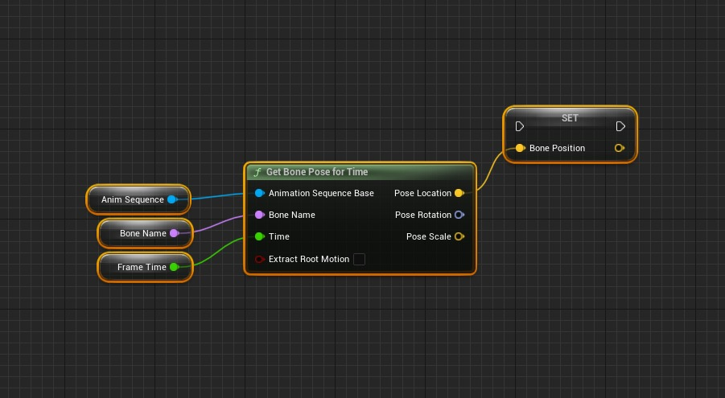
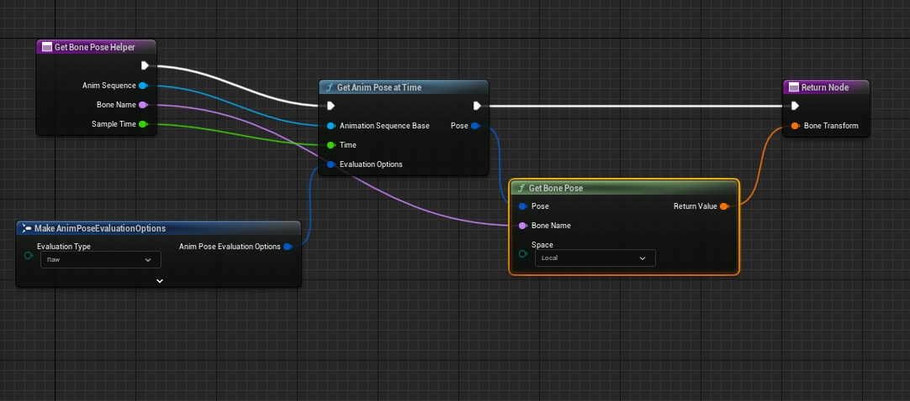
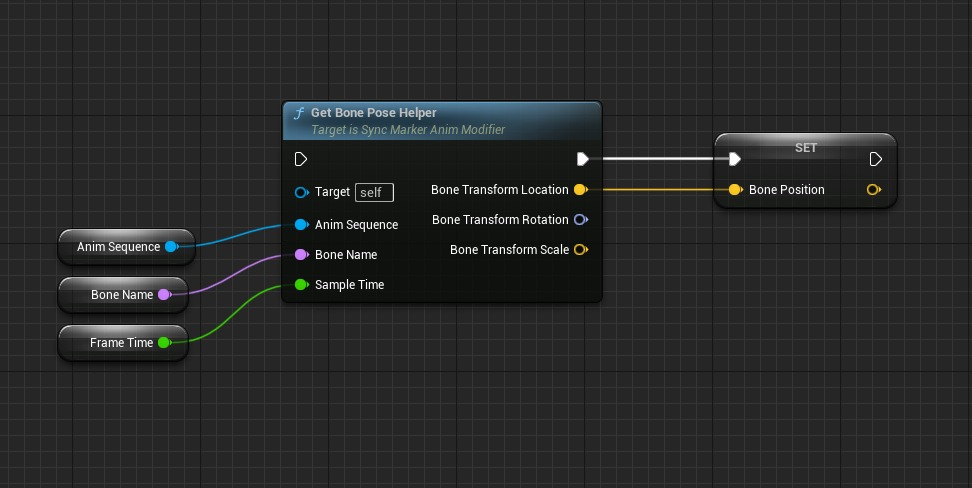
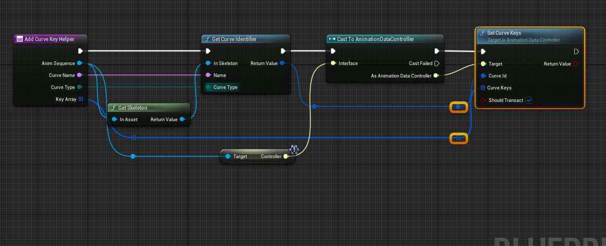
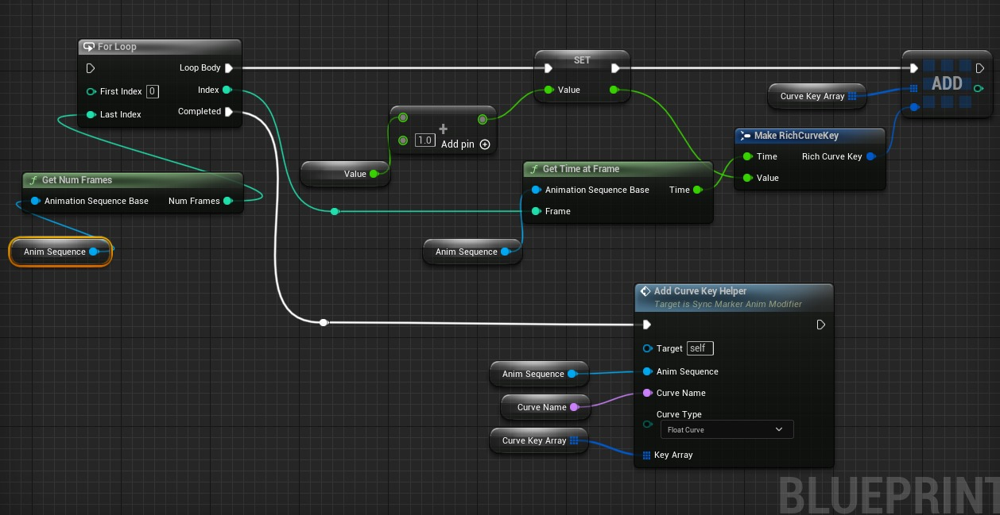
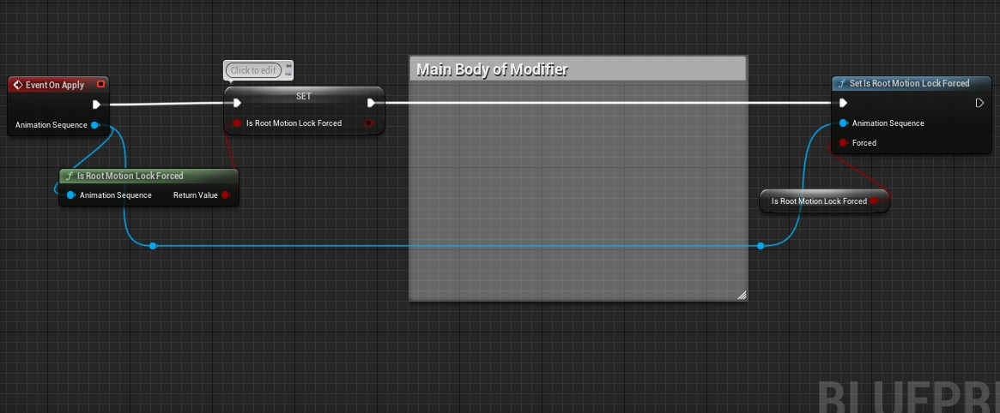

# 技术说明：5.2 中动画蓝图库和动画修改器的问题

## 来源与状态

- 原始 URL：https://dev.epicgames.com/community/learning/knowledge-base/WjzR/unreal-engine-tech-note-issues-with-animation-blueprint-library-animation-modifiers-in-5-2

## 运行时分类

- 类型：图文教程
- 判断：API 未识别到核心视频信号，可整理正文约 4710 字符。

## 摘要

描述：5.2 中进行了更改，以统一编辑器中动画采样和存储的各种代码路径。这引入了许多问题以及升级动画 Mo 需要采取的一些步骤......

## 中文整理

### 概览

**说明：** 5.2 中进行了更改，以统一编辑器中动画采样和存储的各种代码路径。这引入了许多问题以及升级动画修改器以使用新 API 需要采取的一些步骤。虽然此 API 的主要用例是修饰符，但这些更改也适用于依赖 AnimationBlueprintLibrary 的其他蓝图或 python 脚本。我们计划在未来进行进一步的更改以简化新 API 的使用。 **潜在影响：** **[中等]：** 用于采样骨骼姿势或添加曲线关键点的动画修改器或脚本在升级后可能无法按预期运行。运行某些修改器可能会使编辑器崩溃。 **解决方案：** 根据您遇到的具体问题，有多种解决方案。 **GetBonePoseForTime/Frame(s) 已被弃用** 这些方法在 5.2 中已被弃用并删除，因为可以通过 AnimPoseExtensions::GetAnimPoseAtTime 等复制功能。为了确保使用此 API 的修改器的向后兼容性，它们将在 5.2.1 中暂时恢复。但是，我们仍然建议您迁移到 AnimPoseExtensions，如下所示：5.1 [https://dev.epicgames.com/community/snippets/yrra/unreal-engine-5-1-getboneposefortime](https://dev.epicgames.com/community/snippets/yrra/unreal-engine-5-1-getboneposefortime)



5.2 [https://dev.epicgames.com/community/snippets/zbbV/unreal-engine-5-2-getboneposehelper](https://dev.epicgames.com/community/snippets/zbbV/unreal-engine-5-2-getboneposehelper)



[https://dev.epicgames.com/community/snippets/zbbV/unreal-engine-5-2-getboneposehelper](https://dev.epicgames.com/community/snippets/zbbV/unreal-engine-5-2-getboneposehelper)



**通过 AddFloatCurveKey/AddVectorCurveKey 等添加的曲线键未进行帧对齐：** 此问题是由负责添加键的代码中的浮点精度问题引起的。我们的目标是在 5.3 中解决此问题，但与此同时，可以通过缓存所需的键并通过 UAnimSequencerController::SetCurveKeys 将它们添加到一次调用中来解决此问题，因为此方法会强制帧对齐。 [https://dev.epicgames.com/community/snippets/1WWo/unreal-engine-addcurvekeyhelper](https://dev.epicgames.com/community/snippets/1WWo/unreal-engine-addcurvekeyhelper)



[https://dev.epicgames.com/community/snippets/1WWo/unreal-engine-addcurvekeyhelper](https://dev.epicgames.com/community/snippets/1WWo/unreal-engine-addcurvekeyhelper)



**采样根运动的动画修改器不再生成数据：** 采样根运动时，用户现在应确保动画序列资源上的 IsRootMotionLockForced 标志设置为 False。如果没有这个，根运动变换可以作为恒等式返回。更改此标志时，我们建议用户缓存原始值，以便可以在修改器末尾重新应用它。 [https://dev.epicgames.com/community/snippets/LNN9/unreal-engine-set-isrootmotionlockforced](https://dev.epicgames.com/community/snippets/LNN9/unreal-engine-set-isrootmotionlockforced)



**在与 AddCurve 相同的帧上调用 GetAnimPoseAtFrame/Time 的编辑器崩溃：** 这可能会导致以下调用堆栈崩溃

```cpp
UFKControlRig::Execute_Internal'::`11'::<lambda_2>::operator()(FRigCurveElement *) FKControlRig.cpp:164
UE::Core::Private::Function::TFunctionRefCaller<`UFKControlRig::Execute_Internal'::`11'::<lambda_2>,bool __cdecl(FRigCurveElement *)>::Call(void *,FRigCurveElement *&) Function.h:469
UE::Core::Private::Function::TFunctionRefBase<UE::Core::Private::Function::TFunctionStorage<0>,bool __cdecl(FRigCurveElement *)>::operator()(FRigCurveElement *) Function.h:628
URigHierarchy::ForEach<FRigCurveElement>(TFunction<bool __cdecl(FRigCurveElement *)>) RigHierarchy.h:249
UFKControlRig::Execute_Internal(const FName &) FKControlRig.cpp:158
UControlRig::Execute(const FName &) ControlRig.cpp:793
URigVMHost::Evaluate_AnyThread() RigVMHost.cpp:269
UAnimationSequencerDataModel::GeneratePoseData(UControlRig *,FAnimationPoseData &,const UE::Anim::DataModel::FEvaluationContext &) AnimSequencerDataModel.cpp:1132
UAnimationSequencerDataModel::Evaluate(FAnimationPoseData &,const UE::Anim::DataModel::FEvaluationContext &) AnimSequencerDataModel.cpp:725
UAnimSequence::GetBonePose(FAnimationPoseData &,const FAnimExtractContext &,bool) AnimSequence.cpp:1651
```

导致此崩溃的最常见用例将在 5.2.1 版本中得到解决。在 5.2 中，唯一的解决方法是在添加曲线后查询框架的骨骼姿势。
