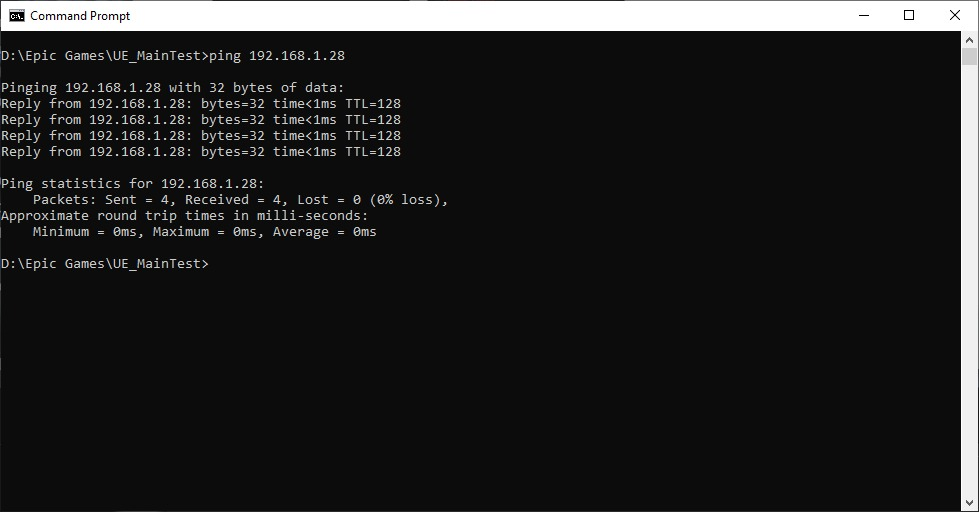
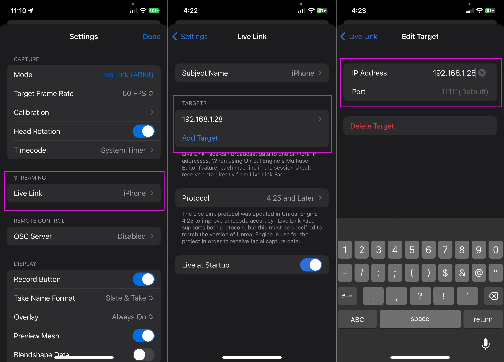
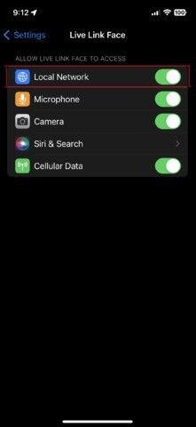
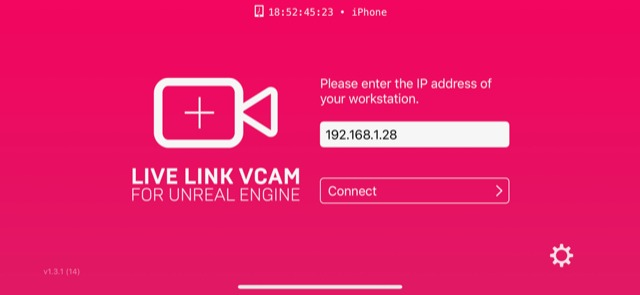
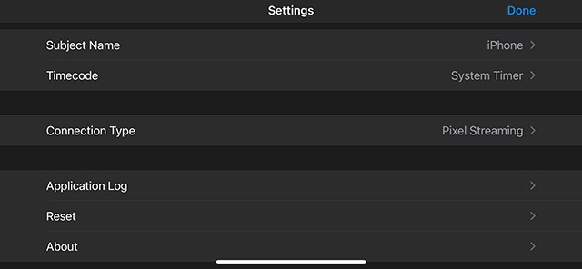
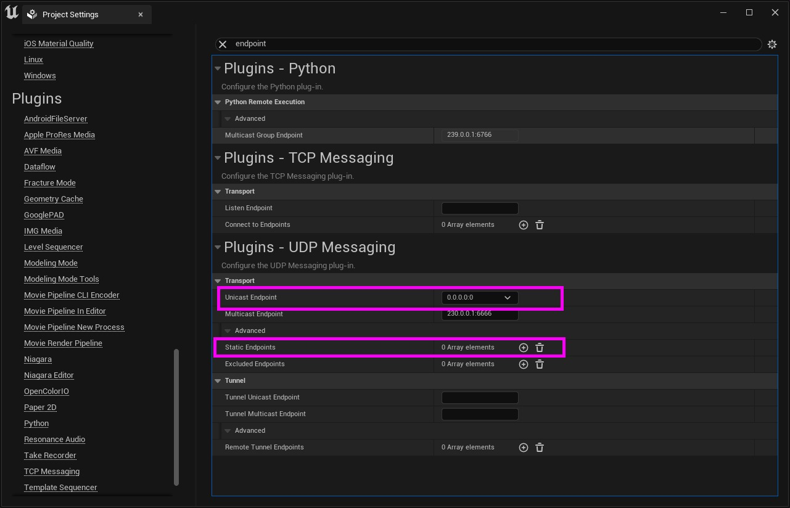
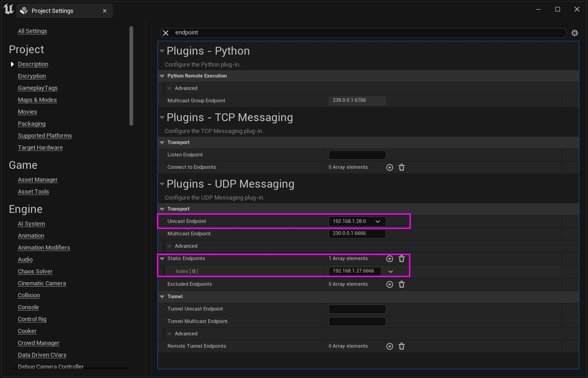
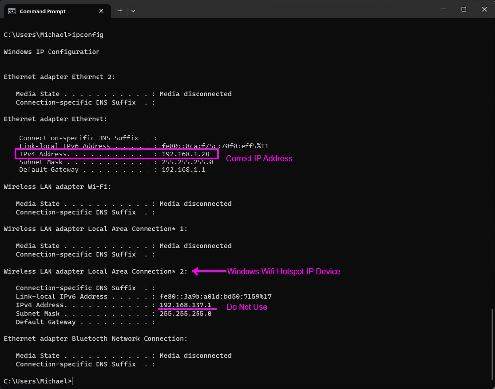
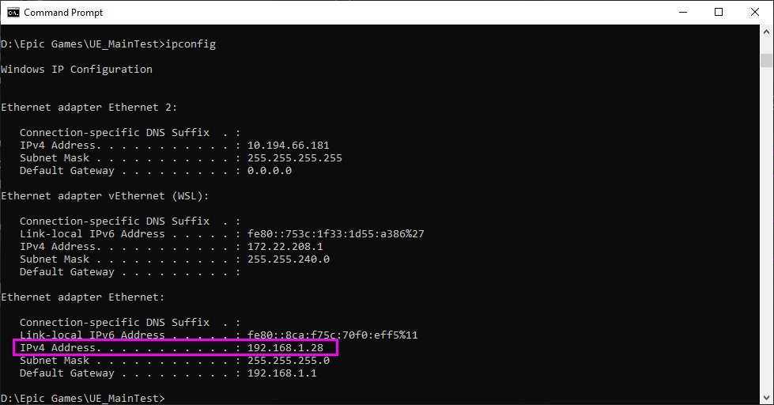
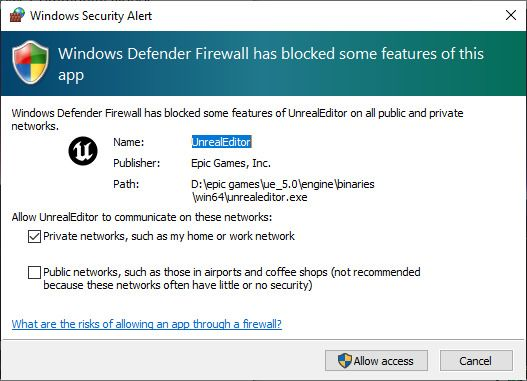

# 实时链接故障排除

## 来源与状态

- 原始 URL：https://dev.epicgames.com/community/learning/tutorials/Wp0B/unreal-engine-troubleshooting-live-link

## 运行时分类

- 类型：图文教程
- 判断：API 未识别到核心视频信号，可整理正文约 7038 字符。

## 摘要

您在使用虚幻引擎在 Live Link 中查看 Live Link Face 或 Live Link VCam 移动设备时遇到问题吗？本教程将介绍如何调试和修复虚幻引擎中一些最常见的 Live Link 连接问题。

## 中文整理

### 实时链接故障排除

为了确保 Live Link 可以连接到虚幻引擎，必须满足一些条件才能让 UE 识别 Live Link 连接。

### 实时链接设置

### 实时链接脸

首先，仔细检查您是否正确遵循了以下教程中的步骤： - [使用 Live Link 制作动画（Live Link Face）](https://dev.epicgames.com/documentation/en-us/metahuman/animating-meta humans-with-livelink-in-unreal-engine)

### 实时链接 VCam

- [使用像素流的 VCam Actor 快速入门](https://dev.epicgames.com/community/learning/tutorials/aEeW/unreal-engine-vcam-actor-quick-start-using-pixel-streaming) - [虚拟摄像机 Actor 快速入门](https://docs.unrealengine.com/using-virtual-cameras-in-unreal-engine) - [虚拟摄像机组件快速入门]开始](https://docs.unrealengine.com/virtual-camera-component-in-unreal-engine) - [虚拟相机](https://docs.unrealengine.com/virtual-cameras-in-unreal-engine)

### Ping 设备

您可以检查的第一件事是确保移动设备可以 ping 通它尝试在专用本地网络上通信的工作站的 IP 地址，并且工作站可以 ping 通移动设备的 IP 地址。在 Windows 命令 shell（或 Mac 或 Linux 终端）中，您可以键入“ping”。如果 ping 成功，您应该会看到一些回复以及发送和接收的匹配数量的数据包（见下文）：

### 从 iOS 设备执行 Ping 操作

不幸的是，iOS 没有内置应用程序可以让您进行 ping 测试。相反，您必须安装专门用于测试网络连接的应用程序。一些最受欢迎的此类应用程序是“**Ping – 网络实用程序**”、“**Pingify**”和“**Network Ping Lite**”。使用相同的过程，从 iPhone 或 iPad 对托管 UE Live Link 会话的工作站的 IP 地址执行 ping 操作。如果您偶然无法正确连接，则需要验证您的网络或是否使用正确的 IP 地址来建立连接。

### Live Link Face 应用程序 - iOS 移动设备故障排除

如果正确遵循本教程中的所有步骤后，您仍然遇到问题，则还需要检查其他一些事项：

### 仔细检查Live Link Face的流IP地址

在“Live Link 设置”的“流媒体”子类别下 - 仔细检查您的工作站是否有正确的 IP 地址（和端口）以供 Live Link Face 连接。

### 实时链接面 - 本地网络标志

在 iOS 设备上，检查 Live Link Face 应用程序设置中是否启用了“本地网络”通信。这可以在 Apple iPhone 上的主 iOS 设置 -> Live Link Face 下找到。

### 实时链接 VCam

Live Link VCam 的检查相当简单。仔细检查 IP 地址与其尝试连接的工作站的 IP 地址是否匹配。移动设备和工作站应位于同一网络/子网中。

Live Link VCam - 设置 仔细检查 Live Link VCam 设置。对于大多数用例 (UE 5.x +)，连接类型应设置为“**像素流**”。如果仍然遇到问题，请尝试使用“重置”选项 - 将所有设置重置回默认值。

### 在项目设置中重置 UDP 消息传递（简单用例）

如果您使用基本设置，则无需修改 UDP 消息传递即可使 Live Link Face 正常工作。如果设备都位于同一 LAN 或子网上，您可以尝试将单播端点重置为 0.0.0.0:0，并在项目的项目设置中删除任何静态端点。这将修复局域网上的大多数设置。

但是，如果您使用特殊的多用户或远程设置 - 重置将不起作用。在这些更复杂的情况下，UDP 消息传递确实可以简化更复杂的设置。如果是这种情况，请参阅下面有关正确设置的部分。

### UDP 消息传递设置（更复杂的场景）

如果您可以完成简单的 Live Link Face 设置，则不需要 UDP 消息传递，但是如果您的设置比较复杂，具有多个子网和设备，则 UDP 消息传递可以帮助所有这些设备之间的通信。如果遇到问题，您可能仍想尝试自定义 UDP 消息传递设置。要设置正确的 UDP 消息传递，您可以执行以下操作。

### Windows 热点

如果您使用 Windows WiFi 热点将 Live Link Face 设备连接到工作站，**请勿使用**托管单播端点热点的适配器中的 WiFi IP 地址或 LIve Link Face 应用程序中的 IP 地址。热点就像路由器一样，将流量路由到工作站所连接的主网络。在这种情况下，请使用从工作站本身连接的以太网或 WiFi 适配器分配给工作站的本地 IP 地址。

您可以通过在命令提示符窗口中键入“ipconfig”来获取工作站的 IP 地址。请务必使用移动设备连接到的网络的 IP 地址。

### 重新启动

接下来尝试重新启动您的系统，包括您的移动设备。这通常可以解决许多 UDP 消息传递问题。

### Windows 故障排除

### Windows Defender 防火墙通信设置

首次启动各个版本的引擎时，您可能会在 Windows 上遇到以下弹出窗口。这将为 Unreal 等特定应用程序设置 Windows Defender 防火墙通信选项。不幸的是，此弹出窗口仅显示一次 - 当您第一次使用该应用程序时。当您看到此内容时，您需要确保启用“专用网络，例如我的家庭或工作网络”选项。这确保编辑器可以与本地专用网络上的其他设备或工作站进行通信。 “公共网络”选项一般不启用，但根据您的需要是可选的。

幸运的是，您可以通过转到任务栏中的 Windows 搜索并启动“具有高级安全性的 Windows Defender 防火墙”应用程序来检查和修改入站规则的 Windows Defender 防火墙设置。当您第一次启动它时，它应该类似于下面的面板。如果单击面板左侧的“入站规则”，您可以向下滚动到 Unreal 条目（您需要通过单击名称列按名称排序）。每个版本的编辑器、多用户 Slate 服务器、unrealtraceserver 甚至构建的游戏都会列出。至少，您需要确保为您正在使用的引擎版本的 TCP 和 UDP 协议启用“专用”配置文件。如果没有，您可以通过手动编辑条目来修复它，也可以删除它们。如果删除它们，您可以重新启动编辑器，原始的“Windows 安全警报”弹出窗口将再次显示 - 允许您从弹出窗口重新启用“专用网络”选项。上图有系统上 5.2 版本 UnrealEditor 的两个突出显示的条目。正如您所看到的，我为 TCP 和 UDP 协议启用了“私有”配置文件。

## 相关链接

- [Animating with Live Link (Live Link Face)](https://dev.epicgames.com/documentation/en-us/metahuman/animating-metahumans-with-livelink-in-unreal-engine)
- [VCam Actor Quick Start using Pixel Streaming](https://dev.epicgames.com/community/learning/tutorials/aEeW/unreal-engine-vcam-actor-quick-start-using-pixel-streaming)
- [Virtual Camera Actor Quick Start](https://docs.unrealengine.com/using-virtual-cameras-in-unreal-engine)
- [Virtual Camera Component Quick Start](https://docs.unrealengine.com/virtual-camera-component-in-unreal-engine)
- [Virtual Cameras](https://docs.unrealengine.com/virtual-cameras-in-unreal-engine)
