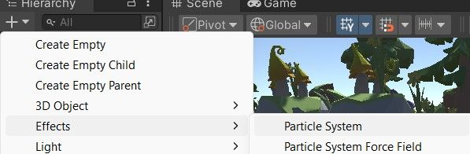
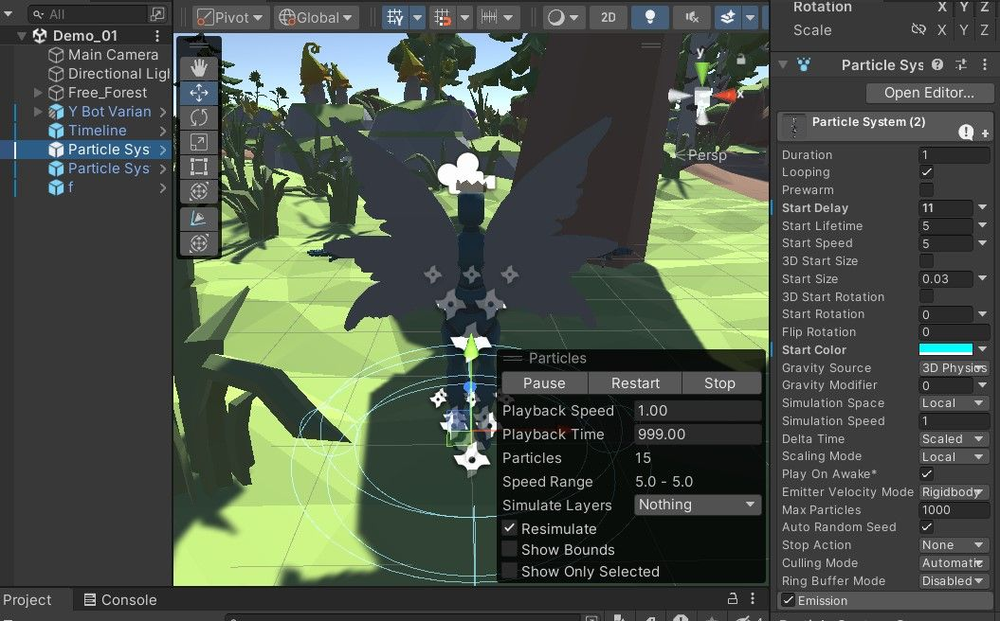
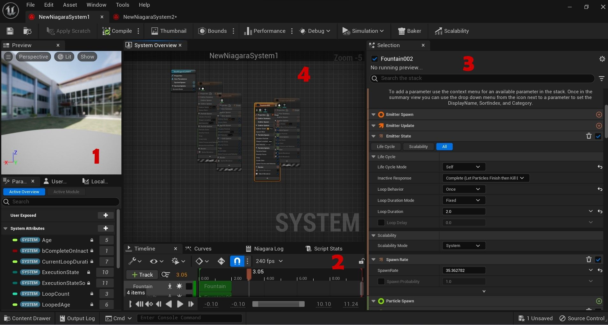
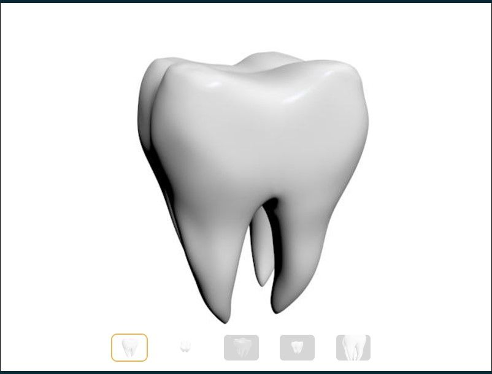
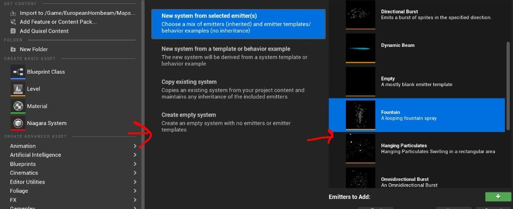
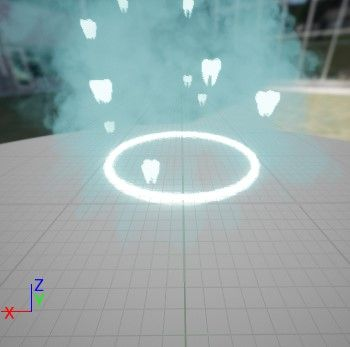
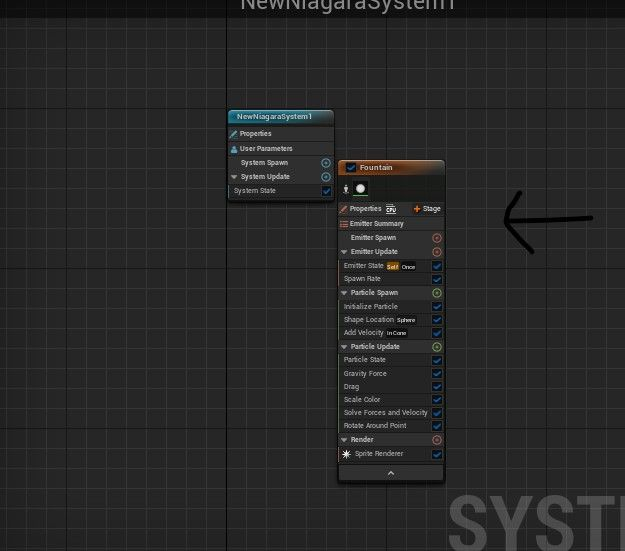
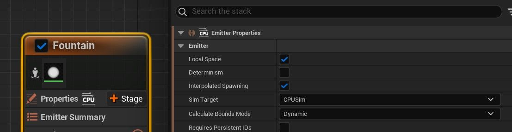
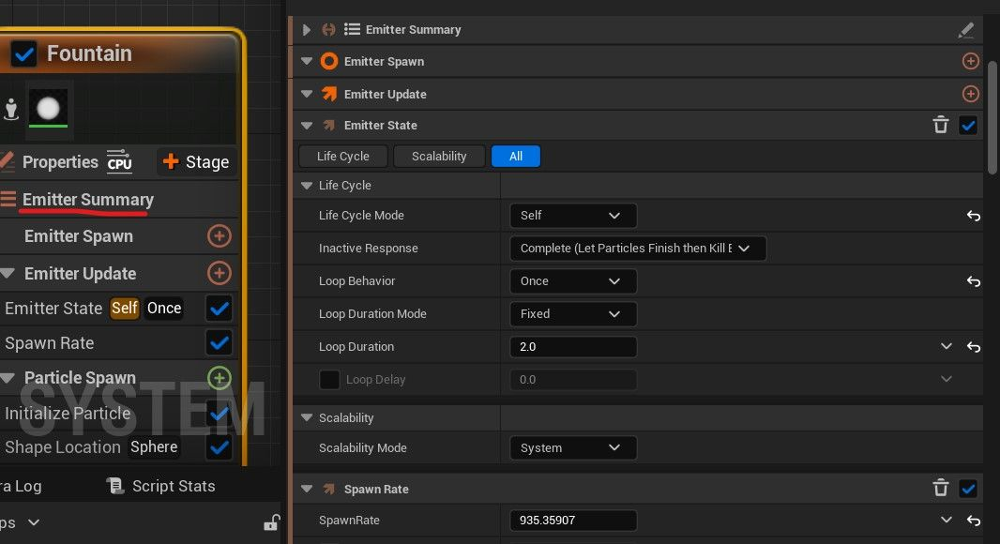

# Unity 与 Unreal：创建牙仙子粒子系统

## 来源与状态

- 原始 URL：https://dev.epicgames.com/community/learning/tutorials/73Zn/unreal-engine-unity-vs-unreal-creating-a-tooth-fairy-particle-system

## 运行时分类

- 类型：图文教程
- 判断：API 未识别到核心视频信号，可整理正文约 7385 字符。

## 摘要

Unity 与 Unity 的比较虚幻的粒子系统和如何制作歌唱牙仙粒子系统的教程

## 中文整理

### Unity 与 Unreal

Unity 和 Unreal 都是强大的游戏引擎选择，以其粒子系统而闻名。许多功能之间有相似之处，但在布局、具体功能等方面存在很大差异。本教程探讨了两个引擎之间的比较，以及如何将 Unity 中的技能转移到 Unreal 中来制作摇滚的牙仙 VFX 表演。

### 创建粒子系统

在 **Unity 中，**创建** **粒子系统就像按层次结构中的 **+ ** 图标一样简单，然后按效果 > 粒子系统

由于通过 Niagara 系统的 Niagara 发射器可堆叠层提供了多种模板，因此在 **Unreal** 中创建粒子系统要广泛一些。要在默认虚幻菜单中创建 Niagara 系统，请转到 **内容浏览器** 的左上角，然后按添加 > Niagara 系统。在那里，您将可以选择从四个选项中创建一个系统。

然后，新的 Niagara 系统将在内容浏览器中创建，并将其带入场景就像将新的 Niagara 系统从内容浏览器拖动到右侧的**大纲**中一样简单，所有场景的对象都位于其中。

### 编辑粒子系统

### 界面

**Unity** 通过单击“层次结构”窗口中的粒子系统并编辑右侧“检查器”窗口中的值，将 Unity 的粒子界面放置在场景中。 **Unreal** Unreal 与 Unity 不同，它有一个针对 Niagara 系统的单独编辑器，可以通过在内容浏览器中双击所需的系统图标来访问该编辑器。 Niagara 编辑器窗口由 4 个主要区域组成： 输入数据 Unity 和 Unreal 都有各自的编辑菜单、**检查器** 和 **选择** 窗口以及简单的类型输入值。在这两种编辑器中，实时预览都显示在场景 (Unity) 或小预览窗口 (Unreal) 中，允许实时进行编辑以进行精确编辑。

### 粒子系统的可编辑参数

Unity 和 Unreal 都有大量参数，可以进行自定义并使微小细节变得完美。两个引擎还在这些参数中共享许多相同的功能，这使得切换时非常容易理解。有了这些种类繁多的可编辑功能，我将重点介绍我们在本教程中使用最多的 Unreal 中的一些参数，并将其 Unity 等效项以斜体显示。由于**Fountain **发射器（稍后会详细介绍）在教程中使用最多，因此我将指出该发射器的参数。 **属性项** 发射器属性 **发射器更新项** 生命周期生成速率 **粒子生成项** 初始化粒子形状位置 添加速度

### 在虚幻中创建一个会唱歌的牙仙

### 获取资产

在虚幻中创建新项目后，第一步是导入您的资源。本教程所需的主要模型是某种类型的牙仙演员和牙齿模型。就我个人而言，我使用了这些模型：https://www.turbosquid.com/3d-models/free-tooth-roots-3d-model/763377 特别是对于牙齿，只要有粒子的网格模型，它就应该可以正常工作。

### 创建“着陆”粒子事件

我制作的牙仙“表演”的第一个动画之一是他飞翔后的着陆序列。由于牙仙是传说中的神奇生物，我觉得着陆时他周围有某种类型的魔法环效果很合适。我们首先在内容浏览器中创建一个新的 Niagara 系统。在创建器菜单中，选择“来自选定发射器的新系统”并选择**喷泉发射器**，这将允许环中的粒子连续流。稍后我们将在 Niagara 编辑器中添加更多发射器来分层效果。按“完成”并双击内容浏览器中新创建的系统以打开 Niagara 编辑器。

### 创建戒指

在 Niagara 编辑器窗口中，我们将通过单击系统概述面板中的“喷泉”节点并向右查看选择面板来打开单一发射器的设置，这再次类似于 Unity 粒子系统的检查器窗口。从这里，我们可以从默认的“喷泉”发射器中获取每个参数并更改它以制作这个环。

粒子生成项 **粒子更新项** 这是向发射器节点添加模块的用途派上用场的地方。要获得此环形形状，需要“围绕点旋转”模块，可以通过按“粒子更新”项旁边的 + 图标来访问该模块。搜索“绕点旋转”并单击添加。旋转量设置测试环，看看它是否以圆形方式移动，如下所示：

### 创建烟雾着陆

着陆时的烟幕为牙仙子的表演增添了额外的维度。这是我们实现在一个系统中堆叠发射器的能力的地方。我们首先右键单击“系统概述”面板上的任何空白区域。然后，我们按**添加发射器**并再次找到**喷泉**发射器。该发射器的变化比环发射器的变化要小，因为烟雾以喷泉般的方式喷出。我们还将完成更改这些设置的步骤。发射器更新项目重力 **渲染** 对于烟雾，我们将在 Sprite 渲染器上使用类似于 Unity 中的纹理表渲染器的特殊功能。通过此功能，我们可以通过动画每个粒子像烟雾一样消散来给烟雾带来更真实的感觉。要访问此功能，我们可以转到“渲染”>“精灵渲染器”>“材质”下的默认烟雾精灵片材质。我们通过双击材质屏幕并找到 M_smoke_sub_UV 材质来分配此材质。尽管我们已将材质分配给粒子系统（现在显示所有 64 帧左右的帧），但动画仍然无法播放。解决此问题的设置在于“Sub UV”参数，该参数允许用户设置每个精灵表上的帧数（子图像大小），在本例中为 8x8。子 UV 混合也可以很好地打开以在每帧之间创建平滑过渡。

### 创建牙齿粒子

最后，为了在平台上添加牙仙子的标志性外观，我还添加了从环中射出的发光牙齿。该系统中牙齿的行为与烟雾非常相似，我们不必从头开始创建一个全新的发射器，而是可以通过在系统概述中单击它并按 **CTRL + D** 来复制烟雾发射器，以便在该系统中创建第三个发射器。牙齿发射器与烟雾发射器几乎共享所有内容，除了：我们将使用之前导入的牙齿模型，并且我们将通过按 + 图标并搜索牙齿模型的名称将其添加到网格设置中。其对应的网格应该能够被选择。我们还可以覆盖导入网格的常用材质，并通过按“覆盖材质”中的 + 导入更适合粒子系统的材质，并通过与网格相同的过程找到新材质。所有其他设置可以保持不变。这是最终产品！
